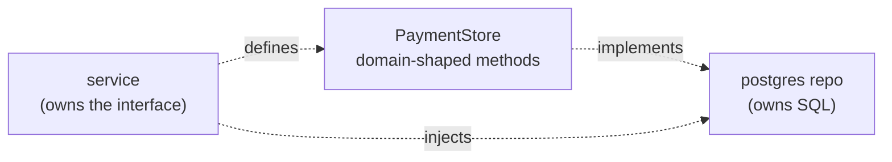

# Repositories, ORMs & testing

## Why Does This Matter?

The repository pattern is Go's most borrowed idea and its most
misapplied: Java taught a generation to wrap every query in a generic
`Repository<T>` with a deep interface hierarchy, and Go's version is
deliberately thinner. Done right, the repository is a consumer-defined
interface over your SQL with a two-tier test strategy (pure Go in CI,
real database on demand). Done wrong, it is a second API to maintain
that hides the database's actual power. This chapter also settles the
ORM question honestly: what you gain, what you pay, and what sqlc
changes about the answer.

## Mental Model

Define the interface where it is consumed, make it look like the
domain:



Two design rules produce all of the value:

1. **Consumer-side interfaces**
   ([04 §3](../04-functions-methods-interfaces/03-interfaces-philosophy.md)):
   the service declares the methods it wishes existed; the database
   package satisfies them. Mocking frameworks become unnecessary.
2. **Domain-shaped methods, not table-shaped ones.** `Store.Charge(ctx,
   id, amount)` not `Store.Update(columns map[string]any)`: the
   second is a reimplementation of SQL with worse syntax.

## Syntax / API: the pattern in full

```go
// PaymentStore is what payments.Service needs. It lives beside the
// service, in the service's package, stated in domain language.
type PaymentStore interface {
	Charge(ctx context.Context, p Payment) error
	ByCustomer(ctx context.Context, customerID string, limit int) ([]Payment, error)
	OutstandingTotal(ctx context.Context, customerID string) (int64, error)
}

// postgres.PaymentStore implements it with real SQL.
type PaymentStore struct{ db *sql.DB }

func (s *PaymentStore) Charge(ctx context.Context, p Payment) error {
	return withinTx(ctx, s.db, func(tx *sql.Tx) error {
		res, err := tx.ExecContext(ctx,
			`UPDATE accounts SET balance = balance - $1
			 WHERE id = $2 AND balance >= $1`, p.AmountMinor, p.CustomerID)
		if err != nil {
			return fmt.Errorf("debit account: %w", err)
		}
		if n, _ := res.RowsAffected(); n == 0 {
			return ErrInsufficientFunds // the DB checked; Go translated
		}
		_, err = tx.ExecContext(ctx,
			`INSERT INTO payments (customer_id, amount_minor, currency, status)
			 VALUES ($1, $2, $3, 'charged')`, p.CustomerID, p.AmountMinor, p.Currency)
		return err
	})
}
```

Note what the boundary achieves: `balance >= $1` in SQL means the
invariant holds under concurrency with zero application-side
check-then-act races (the optimistic pattern from ch. 2), and Go
translates the empty update into a domain error. The database does
the atomic part; Go does the translation part; neither duplicates the
other.

## How It Works: ORMs, honestly

| Aspect | What an ORM gives you | What it costs |
|---|---|---|
| CRUD speed | rows to structs without writing SQL | the first 80% is fast; the last 20% (window functions, CTEs, upserts, locking clauses) means escaping to raw SQL anyway |
| Type safety | compile-checked column references if the schema is code-generated | a schema DSL to learn and keep in sync |
| Portability | engine-agnostic queries | every engine's real strengths (upserts, index hints, returning clauses) sit behind dialect flags |
| Change propagation | migrations generated from model diffs | generated migrations need review exactly like handwritten ones |
| Performance | lazy loading looks convenient | it is N+1 queries wearing a friendlier name; the fix is eager loading configuration, which is SQL thinking with extra steps |

Go's ecosystem mostly skipped ActiveRecord-style ORMs for a reason:
`database/sql`'s explicitness and Go's preference for visible control
flow make the hidden-query-magic style feel like a liability. The
options that did fit Go's taste:

- **sqlc**: write real SQL, generate typed Go functions from it. The
  SQL stays reviewable and optimizable; the scan boilerplate and
  column-name typos disappear. This is the modern default for teams
  who know SQL.
- **ent / GORM-style**: graph- and model-first; defensible for
  admin tools and CRUD-heavy products where the data model *is* the
  product. The tax is paid every time a query needs to be exactly
  right under concurrency.
- **Plain `database/sql`** (this handbook's examples): zero
  dependencies, everything visible. Cost: scan boilerplate, which
  sqlc exists to remove.

The decision test: if your team writes SQL comfortably, sqlc keeps
that skill and removes the boilerplate. If queries are "whatever the
ORM generates," the team is one difficult bug away from learning SQL
under incident pressure; better to learn it now.

## Basic Example: the pure-Go fake

Because the interface is consumer-defined, the test fake is ten
lines and needs no framework
([10 §2](../10-testing/02-doubles-and-httptest.md) mechanics):

```go
type fakeStore struct {
	payments  []Payment
	failCharge error
}

func (f *fakeStore) Charge(_ context.Context, p Payment) error {
	if f.failCharge != nil {
		return f.failCharge
	}
	f.payments = append(f.payments, p)
	return nil
}

func (f *fakeStore) ByCustomer(_ context.Context, id string, limit int) ([]Payment, error) {
	var out []Payment
	for _, p := range f.payments {
		if p.CustomerID == id && len(out) < limit {
			out = append(out, p)
		}
	}
	return out, nil
}

func (f *fakeStore) OutstandingTotal(context.Context, string) (int64, error) { return 0, nil }
```

The service test then injects `&fakeStore{}`: no database, no docker,
milliseconds. What the fake *cannot* prove is whether the SQL is
correct: that is the second tier's job.

## Real-World Example: the two-tier test strategy

| Tier | What runs | Proves | When |
|---|---|---|---|
| Unit (pure Go) | service + fakes | business logic, error paths, retry behavior | every commit, in CI, seconds |
| Integration (real Postgres, build tag `db`) | repo + migrations + real SQL | SQL correctness, constraints, transactions, isolation | CI with a service container; locally on demand |

The integration tier runs the same interface against real Postgres in
a throwaway schema: migrations run, tests assert semantics the fake
cannot express (does `Charge` actually reject the overdraft? does the
transaction roll back on the second statement's failure?). CI runs
both tiers; the unit tier is the gate, the integration tier is the
net.

## Production Example: the runnable example

`examples/bank/` implements exactly this chapter:

- `store.go`: the `PaymentStore` interface (consumer-side, domain-shaped)
- `postgres.go`: the `database/sql` implementation, including the
  SQL-checked overdraft and a `WithinTx` helper
- `fake.go`: the pure-Go fake used by service tests
- `service_test.go`: the unit tier (runs always)
- `postgres_test.go`: the integration tier (build tag `db`, skipped
  without `TEST_DATABASE_URL`, following the Kafka section's
  skip-if-no-broker precedent from
  [18-kafka-with-go](../18-kafka-with-go/))

```bash
go test ./13-databases/...                     # unit tier, always green
TEST_DATABASE_URL=postgres://... go test ./13-databases/... -tags=db
```

## Common Mistakes

- **Generic repositories** (`Repository[T]` with `Get`/`Save`/`Delete`):
  the interface stops saying anything (what does `Save` mean for a
  ledger entry?) and callers leak query intent into method arguments.
- **The service knowing about `*sql.Rows` or `*sql.Tx`**: the boundary
  exists to keep SQL concerns in one package; a `Tx` parameter in a
  service signature is the boundary dissolving.
- **Testing SQL with mocks**: a mock that asserts `query == "SELECT
  ..."` breaks on formatting and proves nothing about behavior. Mocks
  mock the *interface*; only a real database validates SQL.
- **One interface, one implementation, forever**: an interface with
  exactly one consumer and one implementation used nowhere else is a
  bet you will need the seam; keep it only where tests (or a second
  implementation: Postgres and in-memory) actually use it
  ([04 §3](../04-functions-methods-interfaces/03-interfaces-philosophy.md)'s
  rule).
- **Domain logic drifting into repos**: a repository that decides
  whether a payment is allowed is a service wearing a repo costume.
  Repos translate; services decide.

## Idiomatic Go

- Interface next to the consumer, implementation in the driver package.
- Errors translated at the repo boundary: driver errors in, domain
  sentinels out ([05 §2](../05-errors/02-error-design.md)).
- `NewPostgresStore(dsn)` constructors; `var _ PaymentStore =
  (*PostgresStore)(nil)` compile-time satisfaction checks.

## Performance Considerations

- Repos are the natural place to encode query discipline: limits on
  every list method (no unbounded `SELECT`), keyset pagination for
  deep lists, `FOR UPDATE` scopes stated in one place.
- The N+1 pattern hides behind domain-shaped methods too: a
  `ByCustomer` called in a loop is N+1 with extra steps; batch
  variants (`ByCustomers(ctx, ids)`) earn their place the moment a
  loop appears
  ([19 §1](../19-performance/01-measure-first.md) to confirm).

## Concurrency Considerations

- The repo owns transaction scope; services never compose two repo
  calls and call it atomic. Two repo calls = two transactions. One
  atomic unit = one repo method (or an explicit
  `WithinTx` on the repo, kept inside the database package).
- Fakes must be safe if the service calls them concurrently: the
  same mutex discipline as the real store
  ([08 §4](../08-concurrency/04-sync-primitives.md)).

## Security Considerations

- The repo is the last line for parameterization: every method takes
  parameters, never concatenation. A repo method accepting a raw SQL
  fragment is an injection surface with good manners
  ([21-security](../21-security/)).
- Tenant scoping belongs *in the query* (`WHERE tenant_id = $1` from
  verified context), not in a caller's good intentions: an
  interface that forces the tenant argument makes cross-tenant bugs
  compile-time-visible.

## Testing Strategy

- Unit tier: service logic against fakes; table-driven over the fake's
  injected failures ([10 §1](../10-testing/01-fundamentals.md)).
- Integration tier: real database, migrations applied, one schema per
  test, cleanup via `t.Cleanup`. Assert semantics: constraint
  violations, transactional rollback, isolation behavior from ch. 2.
- Contract parity: the same table-driven cases run against fake and
  Postgres tiers where behavior should match, documenting the seams
  where it cannot (generated IDs, timestamps).

## Interview Questions

1. Where do you define a repository interface, and why there?
2. When does an ORM pay off, and what is the long-term cost curve?
3. What does sqlc change about the ORM tradeoff?
4. How do you test that an overdraft is impossible, at each tier?
5. Two repo calls in one service method: is that atomic? What do you
   do about it?

## Practice Exercises

1. Define a `PaymentStore` for a service you have written, move the
   SQL behind it, and count what breaks: the diff is your coupling.
2. Write the overdraft test at both tiers: fake (returns
   `ErrInsufficientFunds`) and Postgres (asserts the constraint
   actually fires).
3. Introduce sqlc on one repo method; compare the generated code with
   your handwritten version and write down what each makes easier.

## Further Reading

- [sqlc](https://docs.sqlc.dev/)
- [Consumer-side interfaces in this handbook](../04-functions-methods-interfaces/03-interfaces-philosophy.md)
- [Testing tiers](../10-testing/03-integration-and-e2e.md)
