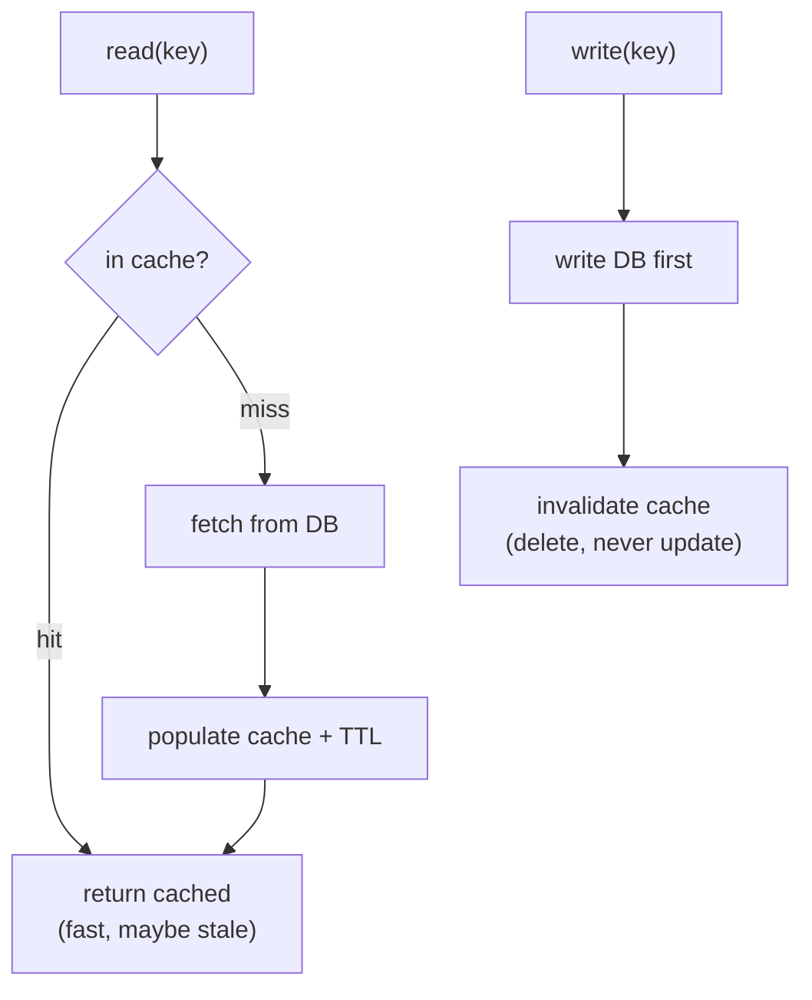

# Caching with Redis

## Why Does This Matter?

A cache is the only component that makes the system faster by making
it less consistent, so every caching decision is a bet on which
staleness your domain tolerates. The mechanics are simple; the
judgment is not. This chapter covers the cache-aside pattern with
Redis in Go, the invalidation rules that keep the bet honest, and the
stampede control that keeps a cold cache from becoming an outage.
The concurrency toolkit underneath (singleflight, semaphores) comes
from [08 Section 4-5](../08-concurrency/04-sync-primitives.md).

## Mental Model

Cache-aside: the application owns the cache; the database stays the
source of truth.



Three decisions define your cache: **what** (keys whose cost exceeds
their staleness cost), **how long** (TTL as the staleness budget), and
**what happens on write** (invalidate, which pushes staleness to zero
on the write path; update, which races with concurrent writers and is
rarely right).

## Basic Example: cache-aside in Go

```go
type Cache struct {
	rdb *redis.Client
	ttl time.Duration
}

func NewCache(rdb *redis.Client, ttl time.Duration) *Cache {
	return &Cache{rdb: rdb, ttl: ttl}
}

func (c *Cache) Payment(ctx context.Context, id string) (*Payment, error) {
	data, err := c.rdb.Get(ctx, "payment:"+id).Bytes()
	switch {
	case err == nil:
		var p Payment
		if err := json.Unmarshal(data, &p); err != nil {
			// Corrupt entry: treat as a miss and let the DB heal it.
			slog.Warn("cache unmarshal", "err", err, "key", "payment:"+id)
		} else {
			return &p, nil
		}
	case errors.Is(err, redis.Nil):
		// miss: fall through to the source
	default:
		return nil, fmt.Errorf("cache get: %w", err)
	}

	p, err := loadPaymentFromDB(ctx, id) // the slow path
	if err != nil {
		return nil, err
	}
	if b, err := json.Marshal(p); err == nil {
		if err := c.rdb.Set(ctx, "payment:"+id, b, c.ttl).Err(); err != nil {
			slog.Warn("cache set", "err", err) // set failing is not the caller's failure
		}
	}
	return p, nil
}

func (c *Cache) Invalidate(ctx context.Context, id string) error {
	return c.rdb.Del(ctx, "payment:"+id).Err()
}
```

The error-handling hierarchy is the production content of this
snippet: **a cache error is not a request error**. Redis down should
degrade reads to the database, not 500 every request that would have
been cached. Log, fall through, keep serving.

## TTLs: the staleness budget

| Data | Sensible TTL | Why |
|---|---|---|
| Session/profile | minutes | changes are self-authored; staleness is visible but harmless |
| Product/catalog | minutes to hours | changes batch; slight staleness invisible |
| Rates/prices | seconds, or event-driven invalidation | staleness is direct money ([25 Section 1](../25-fintech-with-go/01-money-and-payments.md)) |
| Authz decisions | seconds at most | staleness is a security event ([21-security](../21-security/)) |

TTL exists for the moment invalidation fails or was never wired. The
honest design statement: *"after a write, the cache is stale for at
most TTL."* Invalidation makes it usually zero; TTL bounds the
damage to the staleness budget the domain already accepted.

## Real-World Example: invalidation that works

| Write pattern | Strategy |
|---|---|
| Single object updated | delete its key on the write path (same request, after DB commit) |
| Derived view (list, aggregate) | delete on the underlying writes; accept list staleness ≤ TTL |
| Cross-service object | delete on publish via event (the outbox from [25 Section 3](../25-fintech-with-go/03-integrity-and-exactly-once.md) delivering "invalidate key X") |
| Almost never changing | longer TTL, no invalidation wiring |

The one rule with no exceptions: **delete after the database commit,
never before.** Invalidate-before-commit leaves the classic window:
another reader re-populates the cache with pre-commit data, the
commit lands, the cache now serves stale values *beyond* TTL (until
the next write). Delete-after-commit shrinks the window to the
in-flight miss race, which TTL bounds.

## Production Example: stampede control

One hot key expires; a thousand concurrent requests miss together;
all thousand hit the database. That is a cache stampede, and at scale
it is an outage pattern: the cache is most valuable exactly when
traffic spikes, and it amplifies spikes instead. Two stdlib-adjacent
tools fix it:

```go
// singleflight: N identical requests share one flight
type Group struct { g singleflight.Group }

func (c *Cache) Payment(ctx context.Context, id string) (*Payment, error) {
	v, err, _ := c.g.Do("payment:"+id, func() (any, error) {
		return c.paymentMiss(ctx, id) // exactly one DB load per key
	})
	if err != nil {
		return nil, err
	}
	return v.(*Payment), nil
}
```

`golang.org/x/singleflight` collapses concurrent identical calls into
one: the thousand misses become one DB load and a thousand cache
hits. Pair it with jittered TTLs (`ttl + rand(up to 10%)`) so keys
for the same logical dataset do not expire in the same instant.

For pre-warming and refresh (serving slightly stale data while one
goroutine refreshes in the background), the same section's semaphore
and context patterns bound the refresh fan-out; a job that refreshes
top-K keys on a schedule converts most misses into hits, trading a
bounded staleness for a flat database load.

## Beyond a single Redis: cluster topology and distributed locks

Everything above assumes one Redis. Two extensions matter when you outgrow it, and both change client behavior:

**Redis Cluster** shards keys across nodes by hash slot (16384 slots; each key maps by `CRC16(key) mod 16384`, and `{user1234}:cart` style hash tags pin a key group to one slot). The consequences for the code above:

- Multi-key operations (`MGET`, transactions, Lua) only touch keys in the same slot. Either design keys with hash tags or accept cross-slot work in client code.
- `redis.ClusterClient` routes per key and follows `MOVED`/`ASK` redirects. Timeouts and pool settings apply per node, not per cluster, so capacity math changes.
- Failover is automatic but not free: replicas promote, in-flight commands fail, and the cache-cold wave afterward is exactly the stampede this chapter controls.

**Distributed locks** (`SET key value NX PX 30000`) look like a primitive and behave like a lease: the holder crashes, the lock outlives it, and someone else waits out your 30 seconds. Rules that keep them safe:

- Every lock has a TTL and every holder has a fencing token (an atomic counter the storage checks); compare with the lease and fencing discipline in [16 Section 3](../16-distributed-systems/03-leader-election-leases-fencing.md), which applies verbatim to Redis.
- Locks coordinate *cooperation*, never *correctness*: do not build a lock-based check-then-act around money movement; put that in a transaction ([13 Section 2](../13-databases/02-transactions-and-isolation.md)) or a ledger ([25 Section 2](../25-fintech-with-go/02-double-entry-ledger.md)).
- Redlock-style multi-node locking trades failure modes rather than removing them; for correctness-critical work, prefer a single-node lock with fencing or consensus (etcd/ZooKeeper), not more Redis nodes.

## Common Mistakes

- **Caching errors.** A failed DB lookup cached for the TTL turns a
  blip into a fixed outage window. Only successes populate.
- **Update-the-cache-on-write.** Two concurrent writers race, cache
  ends with the older value *and* looks fresh. Delete; let the next
  read populate.
- **Cache errors surfacing as 500s.** Redis down takes the service
  down: invert the dependency, degrade to the source.
- **Unbounded keys.** `GET /items?q=<user input>` cached verbatim
  becomes an attacker-driven memory exhaustion vector; whitelist
  cacheable parameter combinations and size limits.
- **Serializing Go structs with `encoding/gob` or raw binary into a
  shared cache**: the cache outlives struct definitions; schema
  evolution breaks readers. JSON (or protobuf at scale) with a
  version prefix when shapes change.
- **Forgetting connection limits**: `redis.Client` pools too; the
  same fleet-budget math as ch. 3 applies to Redis `maxclients`.

## Idiomatic Go

- One cache type per domain object, constructor-injected, interface-
  shaped like any other dependency (chapter 4): the service sees
  `PaymentStore`; whether it caches is a composition decision in
  `main`.
- Context flows into every Redis call: a canceled request cancels its
  cache round-trip.
- `redis.Nil` handled explicitly, not via string-matching error text.

## Performance Considerations

- Pipelining (`rdb.Pipelined`) turns N round-trips into one: batch
  reads for list views the same way you batch SQL.
- Values are limited by memory: multi-MB blobs in Redis starve other
  keys; big payloads belong in object storage with the cache holding
  a pointer.
- Measure the hit rate before and after every caching change: the
  metric is the only honest referee
  ([19 Section 1](../19-performance/01-measure-first.md)), and
  singleflight+TTL-jitter beats lock-free micro-optimizations.

## Concurrency Considerations

- Redis clients are concurrency-safe; per-command contexts cancel
  correctly; pipelines are not safe to share mid-flight.
- `singleflight` groups are per-process: a fleet of 10 instances
  still sends 10 loads per key. That residual is what TTL jitter and
  refresh jobs mop up; distributed locks for cache fill are almost
  never worth their failure modes ([16-distributed-systems](../16-distributed-systems/)
  will cover why).

## Security Considerations

- Cache keys can leak: a key containing a raw email or token exposes
  PII to anyone with cache access and CLI visibility; hash or use
  stable IDs.
- Tenant scoping in keys (`tenant:X:payment:Y`): a shared cache
  without tenant-scoped keys is a cross-tenant read waiting for a
  collision ([21-security](../21-security/)).
- Redis AUTH/TLS in production; the same least-privilege instinct as
  the database: the cache holds user data and deserves the same
  perimeter.

## Testing Strategy

- The cache is a `PaymentStore` decorator (chapter 4's shape): tests
  inject a fake underlying store and a `miniredis` server (pure Go)
  to exercise hit, miss, invalidation, and degrade-on-error paths
  deterministically in CI.
- The stampede test: 100 concurrent gets on a cold key against a fake
  that counts loads; assert loads == 1 with singleflight, > 1 without.
- Staleness contracts are testable: write, assert read-through
  returns new value immediately (delete-after-commit), with TTL as
  the documented backstop.

## Interview Questions

1. Walk through cache-aside on both read and write paths, including
   where invalidation happens and why.
2. Why delete on write instead of update?
3. A cache stampede takes down your database at midnight. What
   pattern was missing, and what fixes it?
4. Your service 500s when Redis dies. What went wrong structurally?
5. When is caching the wrong answer entirely?

## Practice Exercises

1. Wrap the bank example's `PaymentStore` in a caching decorator with
   miniredis tests for hit/miss/invalidate/degrade paths.
2. Add singleflight and prove the load-count test: 1 vs N.
3. Introduce TTL jitter and write the test that catches synchronized
   expiry (two keys, same TTL, both miss in one batch without jitter).

## Further Reading

- [go-redis documentation](https://redis.io/docs/latest/develop/clients/go/)
- [singleflight](https://pkg.go.dev/golang.org/x/sync/singleflight)
- [Cache stampede and coherence patterns](../08-concurrency/05-patterns.md)
