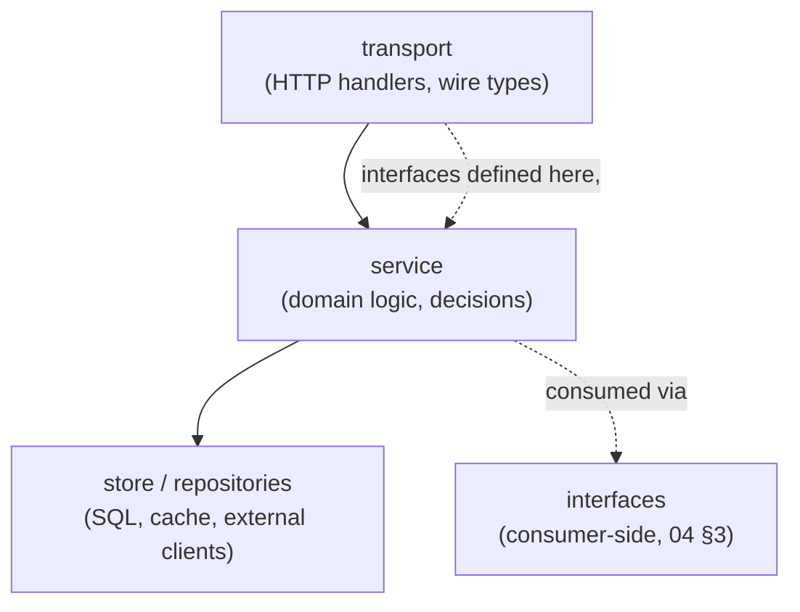
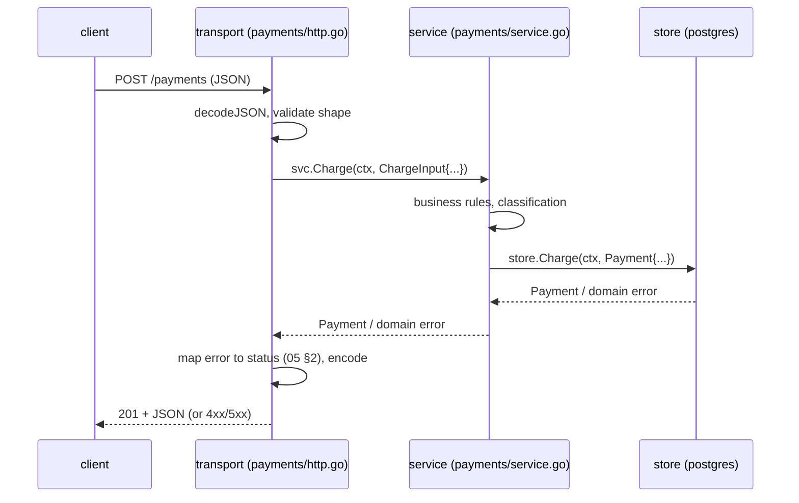

# Service layout & layering

## Why Does This Matter?

The question every backend team answers badly at least once: *where
does this code go?* Framework ecosystems answer with folders named
after their framework (controllers, models, views); Go answers with
packages named after the domain (payments, accounts, sessions). The
difference is structural: layer-named codebases route every feature
through every layer, while domain-named codebases let a feature change
one package. This chapter fixes the layout, the dependency direction,
and the boundaries, then every later chapter fills a piece of it.

## Mental Model

Three layers, one dependency direction:



Rules that keep the arrows one-way:

1. **Transport knows service; service knows store; nobody knows
   transport.** The domain never imports `net/http`. If a function
   signature mentions `http.Request`, it lives in transport.
2. **Interfaces point at consumers.** The service defines what it
   needs (`PaymentStore`); the store package implements it (the
   pattern from [13 §4](../13-databases/04-repositories-and-testing.md)).
3. **Wire types live in transport.** Domain structs carry domain
   fields; JSON tags on a domain struct couple your schema to your
   API docs forever ([12 §3](../12-http-networking/03-json-and-rest-apis.md)).

## Package layout: the production shape

```
service/                        # module root
├── cmd/
│   └── apiserver/
│       └── main.go             # wiring ONLY: config, constructors, run
├── internal/
│   ├── payments/               # a domain, not a layer
│   │   ├── service.go          # business logic; owns PaymentStore iface
│   │   ├── payment.go          # domain types + invariants
│   │   ├── store.go            # (if SQL lives beside the domain)
│   │   ├── http.go             # transport for this domain
│   │   └── service_test.go     # unit tier: fakes, table-driven
│   ├── accounts/               # sibling domain; imports payments' API
│   ├── platform/               # small, sharp, reusable pieces
│   │   ├── httpjson/           # writeJSON/decodeJSON from 12 §3
│   │   ├── httpmw/             # middleware chain from 12 §2
│   │   └── sqldb/              # OpenDB, migrations from 13 §3
│   └── config/
│       └── config.go           # chapter 2's env-first loader
├── migrations/                 # versioned SQL (13 §3)
├── go.mod
└── go.mod's tests everywhere
```

Judgment calls embedded in this shape:

- **`internal/` everywhere**: the compiler enforces that nothing
  outside the module imports your packages ([06 §1](../06-packages-modules/01-package-design.md)).
- **Domains, not layers, at the top of `internal/`**: `payments`,
  `accounts`. A `models/` or `services/` folder is the layer-antipattern
  wearing Go clothing.
- **`platform/` is small or it is wrong**: pieces with no domain
  knowledge (JSON helpers, middleware, DB open). When a platform
  package starts importing a domain, it belongs in that domain.
- **`main.go` is the thinnest file in the repo**: parse config, call
  constructors, wire, run, shut down. Logic in `main` cannot be
  imported, therefore cannot be tested.

## How It Works: a request's path through the layers



Each hop has a contract: transport decodes and maps, service decides,
store persists. Errors flow up translated one layer at a time
([05 §2](../05-errors/02-error-design.md)'s pipeline); context flows
down unchanged.

## Basic Example: the seams in code

```go
// internal/payments/service.go: the domain core.
type PaymentStore interface { // consumer-side (04 §3)
	Charge(ctx context.Context, p Payment) (Payment, error)
	ByCustomer(ctx context.Context, id string, limit int) ([]Payment, error)
}

type Service struct {
	store  PaymentStore
	now    func() time.Time // injected clock: tests control time
	logger *slog.Logger
}

func NewService(store PaymentStore, logger *slog.Logger) *Service {
	return &Service{store: store, now: time.Now, logger: logger}
}

func (s *Service) Charge(ctx context.Context, in ChargeInput) (Payment, error) {
	if err := in.Validate(); err != nil { // domain validation, pure
		return Payment{}, err
	}
	p, err := s.store.Charge(ctx, Payment{
		CustomerID: in.CustomerID, AmountMinor: in.AmountMinor, Currency: in.Currency,
	})
	if err != nil {
		return Payment{}, err // classification happened at the store
	}
	s.logger.InfoContext(ctx, "payment charged", "id", p.ID)
	return p, nil
}
```

```go
// internal/payments/http.go: transport, dumb on purpose.
func (h Handler) create(w http.ResponseWriter, r *http.Request) {
	in, err := httpjson.Decode[createRequest](w, r)
	if err != nil {
		http.Error(w, "invalid request body", http.StatusBadRequest)
		return
	}
	p, err := h.svc.Charge(r.Context(), in.toDomain())
	if err != nil {
		httpjson.WriteError(w, err) // the single mapping point
		return
	}
	w.Header().Set("Location", "/payments/"+p.ID)
	httpjson.Write(w, http.StatusCreated, p)
}
```

The service test needs no HTTP and no database: a fake store, a fake
clock, table-driven cases
([10 §1](../10-testing/01-fundamentals.md)). The transport test needs
no service logic: a stub service behind the same method shape. The
seams make every tier cheap.

## Real-World Example: where teams deviate, and what it costs

| Deviation | Immediate feel | Long-term cost |
|---|---|---|
| Domain types with JSON tags everywhere | faster start | API changes force domain migrations; two concerns, one struct |
| Service methods taking `*http.Request` | less mapping code | service unusable from Kafka jobs, CLI, gRPC |
| Store in `main` via globals | no wiring | parallel tests impossible; init-order bugs |
| `platform/` grows domain helpers | "reuse!" | package cycles; the domain split dissolves |
| One package per layer (`handlers/`, `services/`) | familiar | every feature touches every package; PRs sprawl |

Each deviation saves minutes at the start of the project and charges
interest for its lifetime. The layout above is not ceremony; it is
the accumulation of these bills being paid once.

## Production Example: this section's service

`examples/service/` (completed through chapters 2-5) is the layout in
miniature: `main.go` (wiring), `config/` (env-first), `payments/`
(domain: service + transport + store interface), `platform/`
(json, middleware, db). Its tests exercise the domain with fakes and
the transport with `httptest`, and the whole thing composes the API
skeleton of [12](../12-http-networking/) with the store discipline of
[13](../13-databases/). It is the skeleton the capstone projects in
[28-projects](../28-projects/) scale up.

## Common Mistakes

- **`main.go` with if-statements**: business decisions in wiring are
  untestable by construction. `main` calls; it does not decide.
- **The domain importing `net/http`**: kills reuse from non-HTTP
  callers (the Kafka consumer, the batch job) and couples error
  mapping into logic. Transport maps; service decides.
- **Interfaces "for later"** with exactly one implementation and no
  test consumer: speculation tax. Add the seam when the second
  implementation or the test needs it
  ([04 §3](../04-functions-methods-interfaces/03-interfaces-philosophy.md)).
- **`platform/` accretion**: `strings.SortLines` does not belong next
  to `OpenDB`. Platform is for cross-domain plumbing, and its bar for
  entry is "used by two domains, knows neither."
- **Sharing domain structs across domains**: `payments.Payment`
  leaking into `accounts` couples their schemas. Domains expose
  their own small types; copying a struct at the boundary is cheaper
  than sharing fate.
- **God constructor**: `NewApp` that builds the entire object graph
  hides the real dependencies. Compose in `main`, visibly, top to
  bottom (chapter 3's wiring).

## Idiomatic Go

- Package names are the domain (`payments`), identifiers drop the
  stutter (`payments.Service`, not `payments.PaymentsService`)
  ([06 §1](../06-packages-modules/01-package-design.md)).
- Files split by role inside a domain: `service.go`, `store.go`,
  `http.go`, `payment.go`. Ten small files beat one 2,000-line file.
- `var _ PaymentStore = (*PostgresStore)(nil)` compile-time checks at
  every interface boundary.

## Performance Considerations

- Layer indirection costs nanoseconds; the real wins and losses are
  structural: bounded list queries (13 §4) and handler-level
  allocation discipline (12 §3) live in specific layers, and knowing
  which layer owns a performance problem halves diagnosis time
  ([19 §1](../19-performance/01-measure-first.md)).
- `http.Server` tuning (timeouts, MaxHeaderBytes) happens once, in
  `main`, next to the listener: not scattered in handlers.

## Concurrency Considerations

- Services are stateless by default: every field is a dependency
  (store, logger, clock), never mutable request state. Statelessness
  is what makes horizontal scaling a config change.
- Anything a handler starts must be bounded and owned: the goroutine
  rules from [08 §7](../08-concurrency/07-pitfalls.md) apply per
  layer.

## Security Considerations

- Authorization decisions live in one layer (middleware composes the
  identity; the service re-checks domain-specific rules it cannot
  delegate: "can this user charge *this* account").
- The transport layer is the only layer that touches raw input:
  everything downstream receives validated, typed values
  ([21-security](../21-security/) when it ships).

## Testing Strategy

- Domain tier: service + fakes, table-driven, milliseconds; the
  majority of tests live here.
- Transport tier: `httptest.NewRequest`/`NewRecorder` against a stub
  service; assert status codes, headers, JSON shapes.
- Composition tier: `main`'s wiring is proven by a build-tagged
  integration test (13 §4's two-tier pattern) or by the runnable
  example's full-chain tests.

## Interview Questions

1. Walk through your last service's package layout and defend the
   dependency direction.
2. Why must the domain never import the transport? What breaks first?
3. Where do you define store interfaces, and where do implementations
   live? Why?
4. A PR adds `internal/platform/email.go` importing `payments`. Your
   review?
5. How would you expose the same domain over gRPC alongside HTTP?
   What changes, what does not?

## Practice Exercises

1. Take a small service of yours and cut it into the layout above;
   list every import that had to flip direction. Those are your
   couplings.
2. Write the `Service.Charge` test with a fake store and fake clock;
   then the transport test with a stub service. Count the lines: the
   seams are why it is short.
3. Add a second transport (a batch job reading payments) without
   touching `service.go`. If you had to, the layering leaked.

## Further Reading

- [Package design in this handbook](../06-packages-modules/01-package-design.md)
- [Consumer-side interfaces](../04-functions-methods-interfaces/03-interfaces-philosophy.md)
- [Program structure basics](../01-go-fundamentals/03-program-structure.md)
