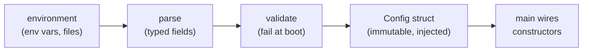

# Configuration & secrets

## Why Does This Matter?

Configuration is where "works on my machine" is manufactured: a
service that boots with wrong-but-plausible defaults, logs its
database password, or accepts a config typo as a zero value will run
for months before the bill arrives. The stdlib gives you everything
you need (env parsing, `time.Duration`, a tiny loader); the discipline
is in failing fast at boot, keeping secrets out of logs and pflags,
and never letting a zero value masquerade as a real setting.

## Mental Model

Configuration is an immutable value constructed once, validated once,
and injected everywhere:



Three properties to defend:

1. **Typed at the edge.** Parsing happens once in the config package;
   the rest of the service sees `time.Duration` and `int`, never
   strings.
2. **Invalid means down.** A config that cannot be validated aborts
   startup with a precise message. A service running on guessed config
   is an incident on a timer.
3. **Immutable after boot.** Nobody mutates config at runtime; feature
   flags (chapter 5) are the dynamic values, deliberately separated.

## Syntax / API: the loader

No framework needed; the whole loader is one function per source plus
validation:

```go
// internal/config/config.go
package config

type Config struct {
	Addr            string
	DatabaseURL     string // secret: never logged
	ShutdownGrace   time.Duration
	RequestTimeout  time.Duration
	PoolMaxOpen     int32
}

func Load(environ func(string) string) (Config, error) {
	var c Config
	var errs []error

	c.Addr = env(environ, "ADDR", ":8080")
	c.DatabaseURL = environ("DATABASE_URL")
	if c.DatabaseURL == "" {
		errs = append(errs, errors.New("DATABASE_URL is required"))
	}
	c.ShutdownGrace = mustDuration(environ, "SHUTDOWN_GRACE", 25*time.Second, &errs)
	c.RequestTimeout = mustDuration(environ, "REQUEST_TIMEOUT", 10*time.Second, &errs)
	c.PoolMaxOpen = mustInt32(environ, "POOL_MAX_OPEN", 25, &errs)

	if err := errors.Join(errs...); err != nil {
		return Config{}, fmt.Errorf("invalid configuration: %w", err)
	}
	return c, nil
}

func env(get func(string) string, key, def string) string {
	if v := get(key); v != "" {
		return v
	}
	return def
}

func mustDuration(get func(string) string, key string, def time.Duration, errs *[]error) time.Duration {
	raw := get(key)
	if raw == "" {
		return def
	}
	d, err := time.ParseDuration(raw)
	if err != nil {
		*errs = append(*errs, fmt.Errorf("%s: %q is not a duration (try \"25s\")", key, raw))
		return def
	}
	return d
}
```

The `environ func(string) string` parameter is the testability seam:
tests pass a map instead of mutating process state, and every rule
becomes table-testable ([10 §1](../10-testing/01-fundamentals.md)).

Validation errors **batch** (`errors.Join`, the pattern from
[05 §2](../05-errors/02-error-design.md)): the operator fixes all
five typos in one deploy, not five.

## Basic Example: boot-time wiring

```go
func main() {
	cfg, err := config.Load(os.Getenv)
	if err != nil {
		slog.Error("configuration invalid", "err", err)
		os.Exit(1) // fail before any listener opens
	}
	// cfg is immutable from here; constructors receive what they need.
}
```

## Real-World Example: precedence without a framework

Real environments layer sources: flags (dev), env (containers), files
(cluster secrets). The rule that keeps it debuggable: **one
precedence order, documented, evaluated in one place.**

```text
1. defaults in the struct literal        (safe for local dev)
2. config file, if the path was provided (staging fixtures)
3. environment variables                 (production reality)
```

What heavy libraries (Viper et al.) add: remote sources, watch/reload,
and format handling. What they cost: reflection-driven config whose
errors arrive at request time instead of boot, and a dependency that
reads your whole environment. The stdlib shape above covers the
overwhelming majority of real services ([12](../12-http-networking/)'s
rule: write the config surface first; reach for a library when a real
need survives contact).

## Production Example: secrets boundaries

Secrets (database URLs, API keys, signing keys) have three rules that
are non-negotiable regardless of platform:

| Rule | Mechanism |
|---|---|
| Never in source or flags | source control and `ps` are public-adjacent; env or mounted files only |
| Never in logs or errors | the config package marks secret fields; `LogValue` suppresses them (below) |
| Rotatable without recompiling | values come from the environment/platform, the service reads them only at boot (or via a reloader) |

The log-suppression seam, using stdlib machinery:

```go
type Secret string

func (s Secret) String() string   { return "[REDACTED]" } // fmt-safe
func (s Secret) LogValue() slog.Value { return slog.StringValue("[REDACTED]") }
```

```go
type Config struct {
	DB DSN `json:"-"` // DSN's String/LogValue redact the password part
}
```

Platform secret managers (Kubernetes Secrets, Vault, cloud KMS) are
*delivery mechanisms* for rule 1 and 3: they get the bytes to the
process. They do not change rules for logging, and they do not excuse
a `fmt.Printf("%v", cfg)` anywhere in the codebase.

## Common Mistakes

- **Defaults that look valid but are wrong for production** (listening
  on `:0`, timeouts of zero meaning "infinite"). Zero must either be a
  real choice or a boot error; "zero means default" hides in the
  struct's zero value ([01 §5](../01-go-fundamentals/05-zero-values.md)).
- **Reading env vars at point of use.** `os.Getenv` sprinkled through
  handlers makes behavior untestable and precedence undefined. One
  package loads; everything else is injected.
- **`time.Duration` as int seconds** (`TimeoutSeconds int`): the unit
  is now ambient folklore. `time.Duration` in config, always; the
  string form (`"25s"`) is self-documenting.
- **Logging the whole config** "to help debugging": with one secret
  field, that is the leak. Log the *non-secret summary* the config
  package explicitly builds.
- **Mutating config at runtime** (hot timeouts, swapped URLs): this
  races every reader ([08 §4](../08-concurrency/04-sync-primitives.md)).
  Dynamic behavior belongs to flags/feature flags (chapter 5), built
  for concurrent reads.
- **Boolean env parsing** (`ENABLE_X=true` vs `1` vs `yes` accepted
  differently per call site): one `mustBool` next to `mustDuration`.

## Idiomatic Go

- `config.Load(os.Getenv)` in `main`; `config.Load(mapLookup)` in
  tests: the seam is a function, not an interface.
- Field names match env names mechanically (`SHUTDOWN_GRACE` →
  `ShutdownGrace`); no mapping tables to drift.
- One `String()` on Config that reports the safe summary; logs use it.

## Performance Considerations

- Config is read once: zero per-request cost. A "config service"
  lookup per request adds a network dependency to your hot path;
  that is a feature-flag decision (chapter 5), not configuration.
- `errors.Join` batching costs nothing and saves deploys.

## Concurrency Considerations

- The `Config` value is read-only after boot; document it as a
  contract. If a future need demands hot reload, deliver a new
  immutable value via `atomic.Pointer[Config]`, never field mutation.
- `os.Getenv` itself is safe, but its results are the race: capture
  them once in `Load`.

## Security Considerations

- Fail closed: a missing required secret is a crash at boot, never a
  fallback to a development default in production.
- The redaction seam (`LogValue`) is defense in depth, not permission:
  code that logs `cfg.DatabaseURL` despite it is still a review bug
  ([21-security](../21-security/) when it ships).
- Config files on disk: `0600`, mounted read-only, excluded from
  build artifacts and `.gitignore` from day one.

## Testing Strategy

- Table-driven config tests: inputs map → expected struct or expected
  joined errors; every rule in the loader gets a row.
- A "no secrets in logs" test: render the summary through `slog` and
  assert the secret values never appear in the output.
- The boot-failure path is testable: `Load` returning an error must
  be the *only* branch that produces exit-before-listen.

## Interview Questions

1. Walk through your config precedence and where it is evaluated.
2. Why batch validation errors instead of failing on the first?
3. How do you keep a database DSN out of logs structurally, not by
   discipline?
4. When do you reach for a config library, and what does it cost you?
5. Config vs feature flags: what belongs to each, and why is the line
   worth defending?

## Practice Exercises

1. Add `mustBool` and a `LOG_LEVEL` field with an allowlisted set of
   values; write the table tests including the error rows.
2. Write the redaction test: log a config with a fake DSN, assert the
   password never appears in any output.
3. Deliberately set `REQUEST_TIMEOUT=10` (no unit) and watch the boot
   error; improve the message until an operator could fix it without
   reading the code.

## Further Reading

- [os environment functions](https://pkg.go.dev/os#Getenv)
- [slog and LogValuer](https://pkg.go.dev/log/slog#LogValuer)
- [errors.Join](https://pkg.go.dev/errors#Join)
