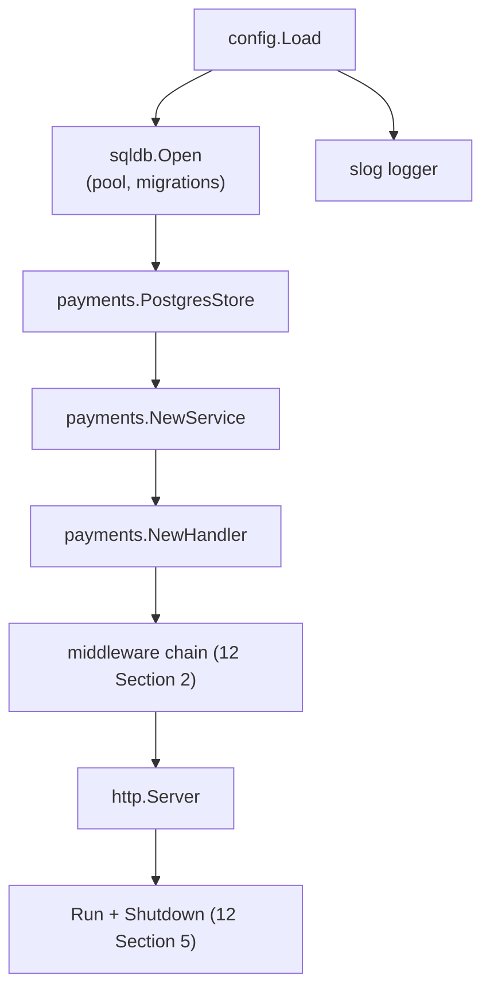

# Wiring & dependency injection

## Why Does This Matter?

Go's answer to dependency injection is uncomfortable for people from
Spring or .NET: you write the graph yourself, in `main`, in plain
constructor calls. That is not a limitation; it is the feature. The
graph is visible, refactorable by tools, debuggable by reading, and
testable by construction. Frameworks hide the graph behind reflection
and annotations; this chapter shows what the explicit graph looks
like and the two honest hard parts: wiring once cleanly, and
configuring constructors without booleans.

## Mental Model

`main` builds a tree from the leaves up:



Rules:

1. **Dependencies are constructor arguments**, never globals, never
   `init()` side effects. A type that needs nothing to exist needs no
   constructor.
2. **`main` owns the order.** Leaves first (logger, config, pool),
   then stores, then services, then transports. The file reads as the
   system's actual dependency graph.
3. **Nothing wires itself.** A constructor receives its dependencies;
   it does not reach out and fetch them.

## Syntax / API: what main looks like

```go
func main() {
	cfg, err := config.Load(os.Getenv)
	if err != nil {
		slog.Error("configuration invalid", "err", err)
		os.Exit(1)
	}

	logger := newLogger(cfg.LogLevel)

	ctx, stop := signal.NotifyContext(context.Background(),
		os.Interrupt, syscall.SIGTERM)
	defer stop()

	db, err := sqldb.Open(ctx, cfg.DatabaseURL, cfg.PoolMaxOpen)
	if err != nil {
		logger.Error("database open failed", "err", err)
		os.Exit(1)
	}
	defer db.Close()

	store := payments.NewPostgresStore(db)
	svc := payments.NewService(store, logger)
	handler := payments.NewHandler(svc)

	srv := &http.Server{
		Addr:              cfg.Addr,
		Handler:           platform.Chain(handler.Routes(), /* mw... */),
		ReadHeaderTimeout: 5 * time.Second,
	}

	run.Serve(ctx, srv, cfg.ShutdownGrace) // the 12 Section 5 lifecycle, extracted
}
```

Fifteen lines, and every runtime dependency of the service is visible
in one screen. When someone asks "where does the request timeout
come from?", the answer is a file, not a search.

**`run.Serve`** is the shutdown lifecycle of
[12 Section 5](../12-http-networking/05-graceful-shutdown.md) extracted into
a testable function: signal select, readiness flip, `Shutdown` with
grace, forced `Close`, and a list of additional closers supplied by
the caller (in reverse order). Extracting it is what makes shutdown
testable without starting a process.

## Basic Example: constructors that scale

Three shapes cover every real need:

```go
// 1. Plain constructor: the default for services and stores.
func NewService(store PaymentStore, logger *slog.Logger) *Service {
	return &Service{store: store, logger: logger, now: time.Now}
}

// 2. Required parameters in the signature; optional behavior via
//    functional options. ONLY when a second option truly exists.
func NewClient(baseURL string, opts ...Option) *Client {
	c := &Client{
		base:   baseURL,
		client: &http.Client{Timeout: 10 * time.Second},
	}
	for _, o := range opts {
		o(c)
	}
	return c
}

func WithTimeout(d time.Duration) Option {
	return func(c *Client) { c.client.Timeout = d }
}

// 3. A Config struct when options stop being "a few": the rule of
//    thumb is ~4+ tunables or a settings object callers build anyway.
func NewPool(cfg PoolConfig) (*Pool, error)
```

The escalation path is one-way: **signature → options → Config
struct**. Jumping straight to options for one parameter is ceremony;
staying at options past five is noise. The tell is the call sites:
when reviewers squint at `NewX(nil, nil, true, false, 30)`, the
constructor is asking for the next shape.

## Real-World Example: test doubles via the same graph

Wiring pays off the moment tests replace a leaf:

```go
func TestService_Charge(t *testing.T) {
	store := payments.NewFakeStore(map[string]int64{"cus_1": 10_000}, "USD")
	svc := payments.NewService(store, testLogger(t))
	svc.Now(func() time.Time { return fakeTime }) // test-only hook

	// exercise svc.Charge...
}
```

The production `main` wires `PostgresStore`; the test wires
`FakeStore`; neither knows about the other, and no framework
participates ([13 Section 4](../13-databases/04-repositories-and-testing.md)'s
two tiers). This is the entire argument for explicit wiring: the
graph is data, and tests are just a second graph.

Clock injection deserves its own note: a `now func() time.Time` field
(or a small `Clock` interface) is the difference between testing
"TTL expired" logic and flaking on `time.Sleep`. Inject the clock in
every service that makes a time-based decision
([25 Section 2](../25-fintech-with-go/02-double-entry-ledger.md)'s ledger
tests depend on exactly this).

## Production Example: init() and the package-level global cleanup

Two stdlib-legitimated patterns deserve demotion in services:

```go
// The logger global, and why it is a service-level liability:
var log = slog.Default() // every package calls log.Info(...)
```

Globals are wiring in disguise: the dependency exists but cannot be
seen, faked, or scoped. The refactor is mechanical and worth doing
early: accept `*slog.Logger` in constructors (`slog.Default()` at the
top of `main` is the one legitimate call site), and log with context
(`slog.InfoContext(ctx, ...)`) so request-scoped values (request IDs,
tenant) travel without globals. `init()` shares the disease: a
constructor named `init` that opens files or registers drivers makes
import order load-bearing. The blank driver import
([13 Section 1](../13-databases/01-database-sql.md)) is the sanctioned
exception; anything beyond registration belongs in `main`.

## Common Mistakes

- **Service locator disguised as DI**: a `context.Value` holding a
  service registry that handlers fish dependencies out of. Typo-safe
  globals with worse stack traces; the constructor graph is the
  honest form.
- **Options that are really required**: `WithStore(...)` on a service
  that cannot exist without a store is a required parameter hiding
  behind variadic syntax. Required things go in the signature.
- **`init()` doing work**: connections opened at import time cannot
  be configured from config, cannot be closed cleanly, and turn
  `go test ./...` into a dependency on whatever `init` touched.
- **Wiring in `main` that branches on environment** (`if prod { ... }`):
  the graph becomes untestable and unreviewable. Environments differ
  by *config values*, not by code paths; where a real behavioral
  switch exists, it is a feature flag (chapter 5) with tests on both
  sides.
- **The god constructor**: one `NewApp` building 14 objects with 14
  config fields. Compose stepwise in `main`; the intermediate
  variables are documentation.
- **Cyclic wiring "solved" with setters**: `svc.SetHandler(h)` after
  both exist is a mutation bug generator. A cycle in the graph is a
  design message: extract the shared part into a third package.

## Idiomatic Go

- Constructors named `NewX`; return concrete types (interfaces at the
  consumer, per [04 Section 3](../04-functions-methods-interfaces/03-interfaces-philosophy.md)).
- Wiring errors fail loudly at boot: a nil dependency passed to a
  constructor should be validated (`if store == nil { return nil,
  errors.New("store is required") }`) when nil is plausible, and
  impossible otherwise.
- One `main.go` per binary under `cmd/`; shared wiring helpers live
  in `internal/`, not in duplicated `main` files.

## Performance Considerations

- Explicit construction happens once; there is no runtime resolution
  cost, which is one of the quiet performance advantages of manual
  wiring over reflection-based DI.
- Pool/client construction in `main` means one warm set of
  connections shared by everything; constructors that open their own
  connections per instance fragment the pool (13 Section 3's fleet math).

## Concurrency Considerations

- The graph is built before the server starts, on one goroutine: no
  locks needed, ever, during wiring. Anything that must be created
  lazily under load (a client built on first use) needs the
  `sync.Once` discipline ([08 Section 4](../08-concurrency/04-sync-primitives.md))
  and a comment explaining why it cannot be eager.
- Readiness flipping and shutdown ordering (12 Section 5) are wiring-level
  responsibilities: `run.Serve` receives the closers in dependency
  order.

## Security Considerations

- Wiring is where secrets meet objects: pass the parsed, redactable
  value (chapter 2's `Secret` type), and the wiring file becomes the
  auditable single place credentials flow through.
- Constructor validation is a security control at the boundary:
  `NewPool` refusing an `sslmode=disable` DSN in a "production" build
  is one line that eliminates a class of misconfiguration
  ([21-security](../21-security/) when it ships).

## Testing Strategy

- The wiring function itself gets one test: build the graph against
  fakes/`httptest` servers, assert it runs and shuts down cleanly.
  This catches nil-dep and ordering bugs the compiler cannot.
- Constructors with options: table-driven over option combinations
  ([10 Section 1](../10-testing/01-fundamentals.md)), asserting the derived
  fields (`client.Timeout`) not internals.
- `run.Serve` extracted: the 12 Section 5 in-process shutdown test runs
  against it directly, no process needed.

## Interview Questions

1. Why does Go not need a DI framework? What does the explicit graph
   buy at 3 a.m.?
2. When do functional options earn their complexity, and when is a
   Config struct the honest choice?
3. Walk through your shutdown order. Who closes what, and where is
   that list built?
4. A teammate proposes registering services via `init()` to "reduce
   wiring". Your counter-argument, and the one exception you accept?
5. How do you inject a clock, and what class of tests does it enable?

## Practice Exercises

1. Extract the `run.Serve(ctx, srv, grace, closers...)` lifecycle from
   a main you own and port the 12 Section 5 shutdown test onto it.
2. Take a constructor with five boolean parameters and evolve it to
   the right shape (options or Config struct), migrating call sites;
   count what the call sites now communicate.
3. Find every `os.Getenv` and `slog.Default()` call outside `main` in
   a service, and re-wire them through constructors. The diff is your
   hidden dependency list.

## Further Reading

- [Consumer-side interfaces](../04-functions-methods-interfaces/03-interfaces-philosophy.md)
- [Functional options](../04-functions-methods-interfaces/05-dependency-inversion.md)
- [Graceful shutdown lifecycle](../12-http-networking/05-graceful-shutdown.md)
