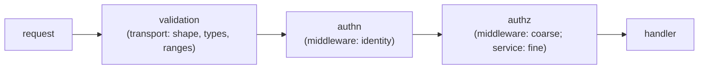

# Validation, authn & authz

## Why Does This Matter?

Three words that decide whether a service is trustworthy, and three
different jobs that teams routinely merge into one middleware blob:
validation (is this input well-formed and sane?), authentication (who
is calling?), and authorization (may *this* caller do *this* thing?).
Separating them is what makes each testable and each correct. The
mechanics of tokens and TLS live in [21-security](../21-security/)
when it ships; this chapter is the service-architecture side: where
each job lives in the layering from chapter 1, and the contracts
between them.

## Mental Model

A request passes three gates in order:



| Gate | Layer | Answers | Failure |
|---|---|---|---|
| Validation | transport (handler input) | is the request well-formed? | 400/422 |
| Authentication | middleware | who is calling? | 401 |
| Authorization, coarse | middleware | is this caller kind allowed on this route? | 403 |
| Authorization, fine | service | may this caller act on *this* object? | domain error → 403/404 |

The two authz rows are the senior insight: middleware can decide
"admins only" (route-level policy), but "may user 7 close account 12"
requires the object, which middleware does not have. Fine-grained
authz is a service responsibility, by structure.

## Syntax / API: identity through context

The authn middleware's contract with handlers is a typed identity in
the request context (the pattern from
[12 §2](../12-http-networking/02-middleware.md)):

```go
type ctxKey int

const identityKey ctxKey = 0

// Identity is the authenticated caller. Zero Identity is never valid:
// middleware rejects before handlers run.
type Identity struct {
	Subject  string   // stable caller ID ("user:7", "svc:reports")
	Kind     Kind     // User, Service
	Scopes   []string // coarse capabilities, verified by the issuer
}

// FromContext returns the identity. The ok flag makes misuse loud.
func FromContext(ctx context.Context) (Identity, bool) {
	id, ok := ctx.Value(identityKey).(Identity)
	return id, ok
}

func Authenticate(verify Verifier, logger *slog.Logger) func(http.Handler) http.Handler {
	return func(next http.Handler) http.Handler {
		return http.HandlerFunc(func(w http.ResponseWriter, r *http.Request) {
			id, err := verify(r) // token mechanics: 21-security
			if err != nil {
				logger.WarnContext(r.Context(), "authn failed", "err", err)
				w.Header().Set("WWW-Authenticate", `Bearer realm="api"`)
				http.Error(w, "unauthorized", http.StatusUnauthorized)
				return
			}
			ctx := context.WithValue(r.Context(), identityKey, id)
			next.ServeHTTP(w, r.WithContext(ctx))
		})
	}
}
```

`Verifier` is a consumer-side interface ([04 §3](../04-functions-methods-interfaces/03-interfaces-philosophy.md)):
the transport defines what it needs ("give me an Identity for this
request"), and the token-verification implementation (JWT/OAuth2/
mTLS) lives behind it. Service tests inject a fake verifier; token
details never touch domain code.

## Basic Example: coarse authz as route policy

```go
func (h Handler) Routes() http.Handler {
	mux := http.NewServeMux()
	mux.HandleFunc("POST /payments", h.create)          // any authenticated caller
	mux.HandleFunc("DELETE /payments/{id}", h.cancel)   // admins only

	adminOnly := RequireKind(KindAdmin)
	return platform.Chain(mux,
		Authenticate(h.verifier, h.logger),
		adminOnly, // checks Identity.Kind from context; 403 otherwise
	)
}
```

Wait: `adminOnly` as written wraps *every* route. Route-scoped
policies need per-route wrapping, which the mux composes cleanly:

```go
mux.Handle("DELETE /payments/{id}", RequireKind(KindAdmin)(http.HandlerFunc(h.cancel)))
mux.Handle("POST /payments", http.HandlerFunc(h.create))
```

Policy-per-route reads like a table: one line per protected route,
its policy visible beside its handler. Whole-router middleware stays
for the gates that apply to everything (authn, request ID).

## Real-World Example: fine-grained authz in the service

```go
func (s *Service) Cancel(ctx context.Context, actor Identity, paymentID string) error {
	p, err := s.store.ByID(ctx, paymentID)
	if err != nil {
		return err // 404 path
	}
	// Domain rule the middleware cannot know: the caller must own the
	// payment, unless they are an admin (which the coarse gate already
	// guaranteed by not reaching here otherwise).
	if p.CustomerID != actor.OwnedCustomer() {
		return ErrForbidden // maps to 404 or 403, by product decision
	}
	if p.Status != StatusCharged {
		return fmt.Errorf("%w: status %q", ErrNotCancellable, p.Status)
	}
	return s.store.Transition(ctx, paymentID, StatusCancelled)
}
```

Two decisions worth naming:

- **404 vs 403 for "exists but not yours"**: 403 confirms existence to
  an attacker; 404 hides it. Financial and multi-tenant systems
  usually choose 404, and the choice is a *product* decision the
  service layer implements consistently ([25 §4](../25-fintech-with-go/04-risk-and-compliance.md)).
- **The service re-checks ownership even under a coarse gate**: the
  middleware and service can disagree after any refactor; the object-
  level check is the one that cannot silently disappear.

## Validation at the boundary

Validation is pure and lives with the wire types
([12 §3](../12-http-networking/03-json-and-rest-apis.md)); the service
re-validates *invariants*, not shape:

```go
// transport: shape
type createRequest struct {
	CustomerID  string `json:"customer_id"`
	AmountMinor int64  `json:"amount_minor"`
	Currency    string `json:"currency"`
}

func (r createRequest) Validate() error {
	var errs []error
	if r.CustomerID == "" {
		errs = append(errs, errors.New("customer_id is required"))
	}
	if r.AmountMinor <= 0 {
		errs = append(errs, errors.New("amount_minor must be positive"))
	}
	if !validCurrency(r.Currency) {
		errs = append(errs, fmt.Errorf("currency %q is not supported", r.Currency))
	}
	return errors.Join(errs...) // batched: one round trip fixes all
}

// service: invariants the transport cannot know
func (in ChargeInput) invariants(ctx context.Context, s *Service) error {
	if !s.currencies.Supported(in.Currency) { // config-driven, runtime
		return fmt.Errorf("%w: %s", ErrUnsupportedCurrency, in.Currency)
	}
	return nil
}
```

Shape validation needs no I/O and belongs in transport; invariants
that depend on config, time, or state belong in the service. Duplicating
*all* validation in both layers is the merge trap; splitting it by
*this rule needs I/O or not* is the durable rule.

## Production Example: the runnable service's chain

The `examples/service/` for this section composes the full gate
order, with each gate tested independently:

1. `RequestID` and `Logging` (12 §2): outermost, non-security.
2. `Authenticate(fake)`: identity from a test verifier.
3. `RequireKind` route policies.
4. Handler: `decodeJSON` + `Validate()` (batched, 422).
5. Service: ownership and state invariants (domain errors).
6. `WriteError` ([05 §2](../05-errors/02-error-design.md)): the single
   mapping to status codes.

Its test suite asserts each gate: bad body → 400, missing identity →
401, wrong kind → 403, invalid fields → 422 with every violation
listed, someone else's payment → 404, valid flow → 201.

## Common Mistakes

- **Authn inside authz**: checking `Identity.Kind` in a handler that
  also parses the token. Gates are layers; one job each.
- **403 for everything unknown**: an unauthenticated call is 401;
  only a *known* caller lacking rights gets 403. Clients (and your
  own retry logic) read these differently.
- **Trust the ID in the URL**: `DELETE /payments/{id}` authorized by
  middleware kind but never checked against the object's owner. The
  IDOR classic; the service-level ownership check is the fix.
- **Validation that mutates**: a `Validate()` that also trims, upper-
  cases, or defaults hides decisions. Validate reports; a separate
  normalize step changes, visibly.
- **Scopes as strings scattered in handlers**: `if !hasScope(r,
  "payments:write")` copies policy everywhere. Capabilities are data
  on the Identity; policy code references constants.
- **Skipping validation on "internal" endpoints**: internal is a
  network position, not a trust level ([21-security](../21-security/)).

## Idiomatic Go

- `FromContext(ctx) (Identity, bool)`: the two-value form makes
  missing-identity misuse loud instead of silently zero.
- Policies as small combinators (`RequireKind`, `RequireScope`)
  wrapping handlers: composable, testable, table-readable.
- Sentinel domain errors (`ErrForbidden`, `ErrNotCancellable`) mapped
  once in transport ([05 §2](../05-errors/02-error-design.md)).

## Performance Considerations

- Authn on every request is a crypto operation: cache verification
  results only with care (revocation windows are a security tradeoff,
  not a performance one). Profile before caching
  ([19 §1](../19-performance/01-measure-first.md)).
- Validation is cheap; the expensive failure is *late* validation:
  reject before touching stores or queues, at the boundary, always.

## Concurrency Considerations

- The Verifier may be called concurrently: implementations must be
  safe for shared use (key caches behind mutexes, per
  [08 §4](../08-concurrency/04-sync-primitives.md)).
- Identity values are immutable after creation; handlers pass them
  by value through context.

## Security Considerations

- The gate order is a security property: validation before authn is
  information leak (probing schema without credentials); authn before
  validation burns crypto on garbage. The mermaid order is the fix,
  not a suggestion.
- Error messages from authn (`"token expired"` vs `"bad signature"`)
  are attacker reconnaissance: log the detail, return the generic 401
  ([21-security](../21-security/) when it ships).
- Coarse gates must be mounted so no route can bypass them (12 §2's
  outermost-security rule); the per-route policy table is the review
  artifact that proves coverage.

## Testing Strategy

- Middleware tier: `Authenticate` with a fake Verifier (identity
  attached; failure → 401 + header); `RequireKind` with both kinds.
- Service tier: ownership matrix tests (mine/theirs/admin ×
  states), table-driven.
- Contract test: a table of (identity, route, object owner, expected
  status) exercising the *whole* chain through the handler; the
  status-code contract (401 vs 403 vs 404) is a cross-layer property
  only the chain proves.

## Interview Questions

1. Separate validation, authn, and authz: where does each live, and
   what breaks when they merge?
2. Coarse vs fine-grained authz: what can middleware know, and what
   structurally requires the service?
3. 403 vs 404 for forbidden objects: the tradeoff and who decides?
4. Walk through a full chain test that pins the status-code contract.
5. Where do scopes/capabilities live, and how do handlers consume
   them without stringly-typed sprawl?

## Practice Exercises

1. Add `RequireScope("payments:write")` and test it against identities
   with and without the scope, at the middleware tier.
2. Implement the ownership matrix test for `Cancel` (mine/theirs/admin
   over charged/pending/cancelled states).
3. Write the chain contract test (identity × route × owner → status)
   and then deliberately break the gate order; watch which assertions
   catch it.

## Further Reading

- [Middleware ordering](../12-http-networking/02-middleware.md)
- [Error mapping](../05-errors/02-error-design.md)
- [OWASP authorization cheat sheet](https://cheatsheetseries.owasp.org/cheatsheets/Authorization_Cheat_Sheet.html)
