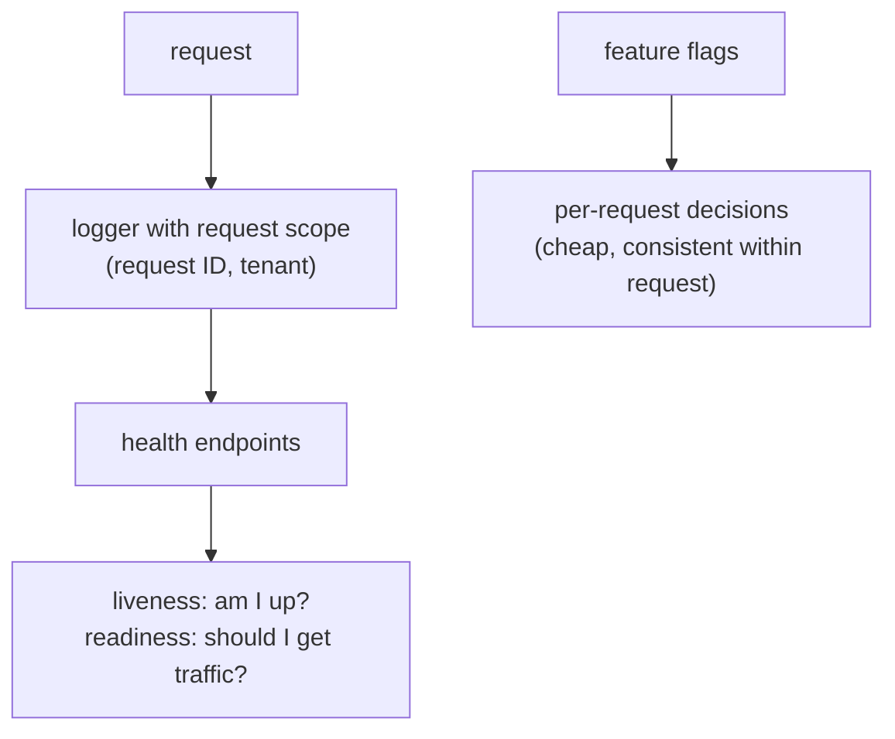

# Logging, health & feature flags

## Why Does This Matter?

A production service answers three questions continuously: *what is
it doing?* (logs), *is it working?* (health), and *what behavior is
on right now?* (flags). Full metrics and tracing are
[20-observability](../20-observability/)'s subject; this chapter is
the service-architecture layer: the plumbing every backend needs on
day one (structured logs with request scoping, honest health
endpoints, flags that do not require redeploys), built with the
stdlib and the layering from chapters 1-4.

## Mental Model



The unifying rule: **logs, health, and flags are all part of the
request contract**, consumed by machines (log aggregators, load
balancers, deployment tooling) more than by humans. Design them as
interfaces with contracts, not as printf culture.

## Logging: one logger, scoped by request

```go
// The handler's only logging line; scope established by middleware.
func (h Handler) create(w http.ResponseWriter, r *http.Request) {
	logger := log.FromContext(r.Context()) // request ID and tenant attached
	logger.InfoContext(r.Context(), "charging", "customer", in.CustomerID)
	...
}
```

The plumbing behind `log.FromContext` is twenty lines: middleware
attaches a `*slog.Logger` (`.With("request_id", id)`) to the context;
handlers and services pull it from there. Services receive their
base logger via constructor (chapter 3) and derive scoped children
with `logger.With(...)`; nobody constructs a logger at point of use.

Log discipline the layering enforces:

| Rule | Mechanism |
|---|---|
| One line per request, at the end | the logging middleware from [12 §2](../12-http-networking/02-middleware.md), not handlers |
| Errors logged once, at the boundary | [05 §2](../05-errors/02-error-design.md)'s rule; lower layers wrap, never log-and-return |
| Secrets never in fields | chapter 2's `LogValue` redaction seam |
| Levels have meanings | Debug: developer eyes. Info: business events. Warn: degraded but serving. Error: needs attention |

## Health: two endpoints, two questions

The most over-engineered 40 lines in backend development, done wrong.
The honest version:

```go
// Liveness: is the process alive? NEVER checks dependencies.
// Answering "no" restarts the pod; a dead database is not a reason
// to restart a healthy server.
func (s *Server) handleLiveness(w http.ResponseWriter, _ *http.Request) {
	w.WriteHeader(http.StatusOK)
	fmt.Fprintln(w, "ok")
}

// Readiness: should the LB send me traffic right now? Local state
// first; dependency checks only those that gate *this instance's*
// ability to serve (chapter 3's pool, not the database's mood).
func (s *Server) handleReadiness(w http.ResponseWriter, _ *http.Request) {
	if !s.ready.Load() { // flipped on shutdown: 12 §5
		http.Error(w, "draining", http.StatusServiceUnavailable)
		return
	}
	if err := s.probes(ctxWithTimeout(300 * time.Millisecond)); err != nil {
		http.Error(w, "dependency unavailable", http.StatusServiceUnavailable)
		return
	}
	w.WriteHeader(http.StatusOK)
	fmt.Fprintln(w, "ok")
}
```

The two mistakes that cost real incidents:

- **Liveness checking dependencies.** A database blip restarts every
  pod simultaneously, turning a degradation into an outage. Liveness
  means "process responsive," full stop.
- **Readiness with long timeouts.** The LB polls every few seconds;
  a 5-second probe timeout serializes your pods' recovery. Probes
  fail fast (hundreds of milliseconds) or they are liveness in a
  costume.

The readiness/dependency relationship, ranked:

| Dependency state | Liveness | Readiness |
|---|---|---|
| Database unreachable | 200 (process fine) | 503 (cannot serve real traffic) |
| Cache (optional) unreachable | 200 | **200**, degraded mode ([13 §5](../13-databases/05-caching-with-redis.md)'s rule) |
| Shutting down | 200 | 503 (the drain signal) |

## Feature flags: the boundary between config and behavior

Chapter 2 drew the line: config is boot-time, immutable, injected.
Flags are runtime decisions, read per request, served cheaply. The
stdlib shape:

```go
type Flags struct {
	values atomic.Pointer[map[string]bool]
}

func NewFlags(initial map[string]bool) *Flags {
	f := &Flags{}
	v := initial
	f.values.Store(&v)
	return f
}

// Enabled is safe for concurrent use and cheap per call.
func (f *Flags) Enabled(name string) bool {
	m := f.values.Load()
	return m != nil && (*m)[name]
}

// Reload swaps the whole map atomically (called by a poller or admin
// endpoint; never per-key mutation, which races).
func (f *Flags) Reload(next map[string]bool) {
	f.values.Store(&next)
}
```

Judgment the example encodes:

- **Flags are injected like any dependency** (chapter 3); services
  take `*Flags` or a narrower interface (`PaymentFlows`), and tests
  construct both sides explicitly.
- **A request sees one consistent view**: read the flag once at the
  top of the operation, pass the decision down. A flag flipping
  mid-request producing half-old-half-new behavior is the classic
  distributed bug ([16-distributed-systems](../16-distributed-systems/)
  generalizes this to consistency windows).
- **Flags expire**: every flag gets a removal ticket at creation;
  the map is small or the mechanism is rotting.

## Production Example: the runnable service

`examples/service/` assembles everything from chapters 1-5 plus this
one: config (2), wiring (3), the authn/authz gates (4), scoped
logging, both health endpoints with tiered dependency probes, and a
flag gating a new payments flow, reloaded by a test. Its test suite
(~15 cases) asserts the contracts: one log line per request with the
request ID, liveness 200 during dependency outages, readiness 503
only for gating dependencies, flag flips visible on the next request
without a restart.

## Common Mistakes

- **Handlers logging at Info per step**: at scale, that is the log
  volume; the middleware's one structured line per request plus
  business-event logs covers the need.
- **`slog.Default()` called in package code**: unscoped, untestable,
  unconfigurable. Constructors receive loggers (chapter 3).
- **A `/health` endpoint that does everything**: merging liveness and
  readiness (and dependency detail) into one endpoint gives the
  orchestrator the wrong lever at the worst moment. Two endpoints,
  two answers.
- **Probes returning dependency stack traces**: health responses are
  world-readable; "ok"/"draining" plus a status code is the entire
  surface (details belong in metrics and logs,
  [20-observability](../20-observability/)).
- **Flags read per field**: `if flags.Enabled("a") { if flags.Enabled("b") {`
  evaluates different views at different depths. One read, one
  decision struct per operation.
- **Config values smuggled into flags** (or vice versa): a "flag"
  that only changes on deploy is config; a "config" reloaded at
  runtime is a flag with the wrong safety machinery.

## Idiomatic Go

- `slog` JSON handler in production, text handler in dev, chosen in
  `main` from config (chapter 2).
- Health handlers as methods on the server struct; probes as
  injectable functions, so tests fake them.
- Flags behind a narrow interface per consuming service, so tests do
  not need the real map.

## Performance Considerations

- Structured logging costs allocations per field; at high RPS, log
  business events at boundaries and sample debug output
  ([19 §1](../19-performance/01-measure-first.md)). The middleware's
  per-request line is the floor, not the ceiling.
- `atomic.Pointer` flag reads are nanoseconds; a flag service with
  network reads per request is a self-inflicted latency floor.
- Readiness probes hit every few seconds per instance: keep the
  handler allocation-free and the probe timeout short.

## Concurrency Considerations

- The readiness flag is `atomic.Bool` (12 §5's rule): written by the
  shutdown path, read by pollers.
- The flags map is swapped atomically and never mutated in place;
  readers hold a consistent snapshot.
- Loggers are safe for concurrent use (slog guarantees it); scoped
  children (`With`) are values, shareable.

## Security Considerations

- Health endpoints are unauthenticated by necessity (the LB cannot
  log in) and must therefore leak nothing: no versions, no dependency
  names, no internal hosts.
- Logs are a data store: PII in log fields is a compliance event
  ([25 §4](../25-fintech-with-go/04-risk-and-compliance.md)); log
  customer IDs, not customer content.
- Flag names and values are not secrets, but flag-gated *endpoints*
  still enforce full authn/authz: a flag hides a feature from users,
  never from attackers ([21-security](../21-security/) when it ships).

## Testing Strategy

- Logging: capture via a `slog` test handler; assert one line per
  request, the request ID present, and secrets absent.
- Health: table over dependency states (up/degraded/down) → expected
  codes for both endpoints; the liveness-never-fails row is a pinned
  test.
- Flags: flip and reload in-process; assert the next request sees the
  new behavior and the previous request's decisions stayed consistent
  (the one-view-per-operation rule).

## Interview Questions

1. Liveness vs readiness: what does each answer, and what happens
   when they are merged?
2. Which dependencies gate readiness, and which merely degrade?
   Walk through your last outage's probe behavior.
3. How do request IDs travel from middleware to a store-layer log
   line without globals?
4. Flags vs config: the boundary, and the failure mode of blurring it.
5. Your logs cost more than your database. What changed, and what is
   the fix hierarchy?

## Practice Exercises

1. Add request-scoped logging to a service: middleware attaches the
   logger, a handler and the store both log with it; assert the
   request ID appears in both lines in a test.
2. Implement the two health endpoints with tiered probes and write
   the dependency-state table test, including the
   liveness-stays-200 row.
3. Gate an existing endpoint behind a flag with reload; write the
   consistency test proving one request sees one view.

## Further Reading

- [log/slog](https://pkg.go.dev/log/slog)
- [Kubernetes probes](https://kubernetes.io/docs/tasks/configure-pod-container/configure-liveness-readiness-startup-probes/)
- [Graceful shutdown](../12-http-networking/05-graceful-shutdown.md)
