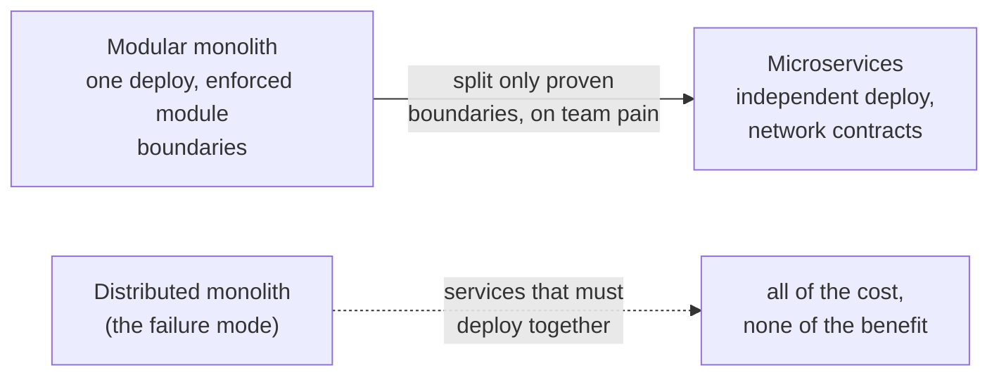

# Monolith to microservices: the honest progression

## Why Does This Matter?

"Microservices" arrives in engineering conversations as an
architecture and leaves as an org chart. Teams adopt the deployment
topology without the team topology that justifies it, pay the full
distributed-systems tax, and get none of the benefit. This chapter is
the decision framework: what each step of the progression actually
buys, what it costs, and how to tell which one your situation needs.
The honest answer for most teams, most of the time, is the middle
step, and this handbook's own example services are structured to make
the later step available without being taken.

## Mental Model

Three architectures, one axis: **how much coordination a change
requires.**



| | Modular monolith | Microservices |
|---|---|---|
| Deploy | one unit | per service |
| Failure isolation | none (one process) | real, per service |
| Transactions | local, easy | sagas and outboxes (ch. 4) |
| Observability | one log, one trace | distributed tracing required |
| Team scaling | one codebase, package ownership | service ownership per team |
| The way to fail | packages dissolve into layers | distributed monolith |

The progression is one-directional for a reason: boundaries proven
*inside* a modular monolith (with compile-time enforcement and
in-process tests) survive extraction; boundaries invented at the
network edge usually do not.

## How It Works: what actually changes at the split

When a modular monolith's `payments` package becomes a payments
service, three things change category:

1. **Calls become contracts.** An in-process function signature is
   checked by the compiler at every build. A network call is checked
   by nothing; it is enforced by contract tests and discipline
   (chapter 2). This is the single largest regression of the split,
   and teams that skip contract testing discover it per-incident.
2. **Transactions become sagas.** The local transaction that kept
   `payments` and `accounts` consistent must become the saga/outbox
   machinery of chapter 4, or data drifts.
3. **Failure becomes latency-shaped.** In-process calls fail loudly
   (panic, error). Network calls fail *slowly*, and a service that
   does not bound them (timeouts, breakers: chapter 3) converts one
   dependency's stall into its own outage.

The [14](../14-backend-development/01-service-layout.md) layout is
deliberately split-ready: domain packages that never import transport
or infrastructure can be lifted into a service by adding a `main`
and swapping in-process store implementations for network clients.
The payments domain's `PaymentStore` interface has two ready
implementations (memory, Postgres); a gRPC client becomes the third
without touching the service.

## Basic Example: the modular monolith that is ready

The test of readiness is compile-enforced boundaries:

```go
// internal/payments may import platform and its own types ONLY.
// One file per package enforces it mechanically:
package payments

import (
	// allowed: platform (no domain knowledge), stdlib
	// forbidden: internal/accounts, internal/sessions
)
```

A dependency-direction test (import-loop checks, or `go list` +
allowlist in CI) turns the architecture into a build failure:

```go
// TestNoCrossDomainImports fails the build when domains import each
// other directly; the wiring package (main) is the only composer.
func TestNoCrossDomainImports(t *testing.T) {
	forbidden := map[string]bool{
		"internal/accounts": true,
		"internal/sessions": true,
	}
	pkgs, err := exec.Command("go", "list", "-deps", "./internal/payments/...").Output()
	// ...assert none of the forbidden packages appear
}
```

When `payments` needs `accounts` data, the dependency flows through
an interface the payments package defines ([04 Section 3](../04-functions-methods-interfaces/03-interfaces-philosophy.md)),
satisfied in `main` by either the in-process package (monolith) or a
client (microservice). **That swap is the whole extraction**, and it
is reviewable as one PR.

## Real-World Example: the signals that actually justify the split

Splitting is justified by *organizational* pain, expressed
technically:

| Signal | Evidence | What it justifies |
|---|---|---|
| Deploy convoy | every team's change waits on one release train | independent deploys |
| Ownership disputes | two teams, one package, constant PR ping-pong | service ownership boundaries |
| Divergent scaling | the report generator needs 50x the memory of the API | independent resource pools |
| Divergent risk | the public API must deploy on every security patch; the ledger must not | independent change cadence |
| Divergent availability | checkout at 99.99%; internal analytics fine at 99% | failure isolation |

Notice what is absent: "the codebase feels big." Size is handled by
packages ([06 Section 1](../06-packages-modules/01-package-design.md)); a
well-factored 100k-line monolith deploys faster than fifteen
microservices that share a release train. Also absent: "we want to
rewrite in microservices" as a plan; rewrites and splits compound
risk and usually stall halfway.

## Production Example: the split, step by step

The extraction of one domain, in the order that keeps risk bounded:

1. **Prove the boundary in-process**: dependency-direction test, no
   cross-domain imports, the interface seam reviewed.
2. **Define the contract** (chapter 2): proto or OpenAPI written
   *first*, with versioning policy and compatibility rules agreed
   before any traffic moves.
3. **Dual-run**: the new service runs in shadow (same inputs, outputs
   compared, no traffic served). Contract tests run both against the
   in-process implementation and the network client.
4. **Cut over one caller at a time**, behind a flag (chapter 5 of
   [14](../14-backend-development/05-observability-health-flags.md)),
   with the in-process path kept as instant rollback.
5. **Move the data last**, with the expand/contract discipline from
   [13 Section 3](../13-databases/03-pooling-drivers-migrations.md): the new
   service owns its schema; the old tables become read-only views
   until confidence is total.

Each step is reversible. The irreversible act (dropping the
in-process path) happens when the metrics say the service has been
quietly correct for a release cycle.

## Common Mistakes

- **Splitting by technical layer** (a "database service", an
  "auth service" that every request must call): chatty, latency-
  bound, and it recentralizes exactly what the split decentralizes.
  Split by business capability ([14 Section 1](../14-backend-development/01-service-layout.md)'s
  domains).
- **A shared database across services**: two services, one schema is
  one service with worse latency. Data ownership is the boundary
  (chapter 2's rule) or there is no boundary.
- **Microservices for a two-pizza team**: the deployment topology
  exists to match team communication; a small team gains overhead
  and loses the compiler as its contract enforcer.
- **Skipping the modular monolith step**: unproven boundaries at the
  network layer produce the distributed monolith; every deploy needs
  three services, every outage needs four teams.
- **Distributed monolith signals ignored** (services version-locked,
  cross-service sagas for reads, one team owning "the mesh"):
  consolidation is a valid refactor, and pretending otherwise
  compounds the cost quarterly.

## Idiomatic Go

- Go's build system rewards the modular monolith: one module, fast
  builds, `go test ./...` covers everything, refactoring is
  mechanical ([06 Section 3](../06-packages-modules/03-multi-module-repositories.md)
  covers the multi-module step when teams genuinely diverge).
- Extraction keeps the domain packages *identical*: same package
  path, same interfaces, new `main`. The diff is infrastructure, not
  logic.

## Performance Considerations

- An in-process call is nanoseconds; a network call is milliseconds
  plus serialization. Feature-by-feature, splitting costs latency
  budget that must be paid from somewhere: the N+1 pattern across
  services (a UI composing five calls) is the classic regression.
  Compose server-side or denormalize ([19 Section 1](../19-performance/01-measure-first.md)
  to see it).
- Per-service pools and caches stop being shared: the fleet math of
  [13 Section 3](../13-databases/03-pooling-drivers-migrations.md) applies
  per service, and total connection counts multiply.

## Concurrency Considerations

- The monolith's shared goroutine pool becomes N services' pools: the
  bulkhead is structural now (chapter 3), not a semaphore in-process.
- Backpressure at the service boundary: a caller that retries on a
  saturated dependency multiplies the saturation (chapter 3's
  retry-storm math).

## Security Considerations

- Service-to-service authn replaces process trust: mTLS or tokens per
  hop ([21-security](../21-security/) when it ships). The monolith's
  "trusted internal network" assumption does not survive the split.
- Each service's secret surface is smaller and owned: rotate per
  service, not per cluster ([14 Section 2](../14-backend-development/02-configuration-and-secrets.md)).

## Testing Strategy

- In the monolith: package tests + the dependency-direction test.
- At the boundary: contract tests both directions (chapter 2).
- After the split: the same domain tests run inside the new service
  unchanged; that reuse is the payoff of the split-ready layout.

## Interview Questions

1. When is a modular monolith the right final architecture? Defend
   it against "microservices are modern."
2. Name the three category changes when an in-process boundary
   becomes a network boundary.
3. What signals justify a split, and which are red herrings?
4. Walk through a zero-downtime extraction of one domain, step by
   step.
5. Your company has 12 microservices, 2 teams, and a shared release
   train. Diagnose and prescribe.

## Practice Exercises

1. Write the dependency-direction test for a modular monolith and
   break it deliberately; watch the CI failure describe the
   architecture.
2. Take the handbook's payments domain and design (on paper) the
   contract for extracting it: what moves, what stays, what the
   versioning policy is.
3. Find or simulate a shared-table between two domains; design the
   data-ownership split with expand/contract steps.

## Further Reading

- [Monoliths are the future (Kelsey Hightower)](https://www.youtube.com/watch?v=y34yUwifUXo)
- [Package-oriented design in this handbook](../06-packages-modules/01-package-design.md)
- [The layering this section splits](../14-backend-development/01-service-layout.md)
