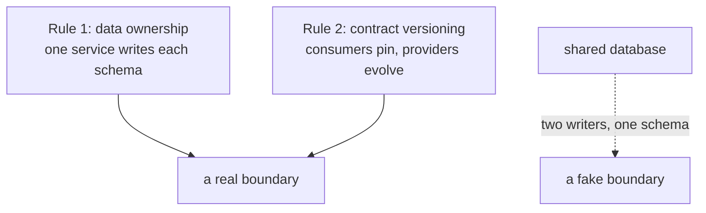

# Boundaries & contracts

## Why Does This Matter?

A microservice boundary is only as real as its contract. Inside the
boundary: one team owns the data model and can refactor freely.
Across the boundary: every consumer's assumptions are frozen into
your API, and "just a small rename" is a coordinated outage. This
chapter defines where boundaries sit (data ownership), what crosses
them (versioned contracts, not structs), and the REST/gRPC decision
as an engineering tradeoff instead of a religious war.

## Mental Model

Two rules create real boundaries:



**Data ownership**: each service's database is private. Another
service that reads your tables (or worse, writes them) couples your
schema to their deploy. Integration happens through the owner's API,
which is why the API exists at all. Read-only replicas for analytics
are the sanctioned exception, explicitly decoupled from the
operational schema.

**Contract versioning**: the producer publishes a contract (OpenAPI
document, `.proto` file) as the API's definition of record. Consumers
code against the contract, never against observed behavior. The
producer's rule: **additive changes are free; breaking changes
require a version.**

## How It Works: REST vs gRPC, honestly

| Dimension | REST + JSON | gRPC |
|---|---|---|
| Contract form | OpenAPI doc, often stale | `.proto` is the build input; types are generated |
| Streaming | SSE/WebSocket, separate story | first-class: client, server, bidirectional |
| Browser reachability | native | needs a proxy layer (grpc-web) |
| Payload efficiency | JSON text, verbose | HTTP/2 + protobuf binary: smaller, faster |
| Human debuggability | curl, any browser | grpcurl + reflection: good but specialized |
| Cross-language clients | any HTTP client | codegen per language, excellent |
| Error model | status codes + body conventions | status codes + structured details |
| Deadline propagation | manual (headers) | built into the protocol |

The working defaults:

- **Public/browser-facing APIs**: REST. Reachability and debuggability
  win, and JSON contracts are universal.
- **Internal service-to-service at volume**: gRPC. Generated types,
  deadlines that propagate by default, streaming when needed.
- **Either way**: the contract artifact is in version control, and CI
  fails on incompatible changes (below).

## Syntax / API: compatibility discipline

The additive-changes checklist that keeps a REST contract compatible:

| Change | Compatible? | Why |
|---|---|---|
| Add a request field with a default | yes | old clients omit it |
| Add a response field | yes | old clients ignore it |
| Remove a response field | no | clients may read it |
| Rename any field | no | it is remove + add |
| Narrow a field's domain (add a validation rule) | no | previously-valid input now fails |
| Change a field's type or unit | no | silent corruption |
| Add a new endpoint | yes | nobody calls it yet |

For gRPC the rules are mechanical and the tooling enforces them:
`protoc` plus the [buf](https://buf.build/) breaking-change detector in
CI fails the PR that deletes a field or renumbers a tag. In Go:

```proto
syntax = "proto3";
package payments.v1;

option go_package = "example.com/payments/gen/payments/v1;paymentsv1";

service Payments {
  rpc Charge(ChargeRequest) returns (ChargeResponse);
}

message ChargeRequest {
  string customer_id = 1;    // tags are eternal: never renumber
  int64  amount_minor = 2;   // units in the field NAME: amount_minor
  string currency = 3;
  // Adding field 4 later is compatible for every consumer forever.
}
```

Generated Go (`paymentsv1.ChargeRequest`) becomes the wire type at
the transport boundary of chapter 2 in
[14](../14-backend-development/01-service-layout.md); the domain
stays proto-free. The conversion at the boundary is the whole
coupling surface, and it is one file.

## Basic Example: versioning in practice

URL-versioned REST (the pragmatic default):

```
POST /v1/payments        # frozen: bug fixes only, additive fields
POST /v2/payments        # the breaking changes live here
```

The producer runs both handlers over the same domain service; v1 is
a translation layer that is allowed to *shrink* only by deprecation
process (below). Header versioning and content negotiation exist and
are fine; URL versioning wins on debuggability (the version is in
every log line and access log).

For gRPC, the package path carries the version (`payments.v1`,
`payments.v2`): two services can serve both packages during the
transition window, and routing per version is a mux decision.

## Real-World Example: the deprecation process

Breaking changes are a process, not a deploy:

1. **Announce** in the contract repo: what breaks, when, migration
   path, owner contact.
2. **Dual-serve** both versions; expose usage metrics per consumer
   (a header or client ID in access logs makes each consumer's v1
   traffic countable).
3. **Migrate consumers** with the compatibility table above; the
   producer offers a migration PR review, not just a deadline.
4. **Sunset**: v1 returns `Deprecation` and `Sunset` headers (RFC
   8594) for a grace window, then 410 Gone with a JSON body pointing
   at v2.

The same machinery inverts for the consumer side: pin your
dependencies (13 §2's module discipline), wrap the client behind an
interface ([04 §3](../04-functions-methods-interfaces/03-interfaces-philosophy.md)),
and the producer's v2 becomes one implementation behind your seam,
not a refactor of your domain.

## Production Example: contract testing, both directions

The two tiers from [13 §4](../13-databases/04-repositories-and-testing.md),
adapted to network seams:

- **Producer side**: the contract is generated from code (OpenAPI
  from handlers, or the `.proto` itself) and *diffed in CI* against
  the published version; an incompatible diff fails without a human
  release note. The example service's `Routes()` is table-testable
  exactly because the policy and paths are declarative.
- **Consumer side**: tests run against a fake that implements the
  contract's *shape* (the interface seam), plus one integration test
  against the real thing (build-tagged, the 18 §13 pattern) that
  catches drift the fake cannot.

This is why chapter 1 insisted on consumer-side interfaces: the
contract seam and the test seam are the same seam.

## Common Mistakes

- **Sharing generated structs across services** (importing another
  service's Go package for its types): the import graph replaces the
  contract, and refactors ripple across deploys. Exchange contracts,
  not packages.
- **"Internal" fields leaking into the contract** (`internal_note`,
  debug flags): the contract is a public commitment; accidental
  fields become permanent API.
- **Versioning by convention** (`v1_` prefixes inside one package):
  versions are namespaces with separate lifecycles, not naming
  habits.
- **Breaking changes shipped as "compatible"** because the tests
  passed: the tests ran against a consumer that did not exist. The
  compatibility table, enforced by CI, is the arbiter.
- **Deadline-free internal RPC**: without propagated deadlines, one
  slow dependency stalls every caller up the chain ([12 §4](../12-http-networking/04-clients-and-timeouts.md)'s
  knob map applies per hop; gRPC propagates them for free, which is
  a real argument for it internally).

## Idiomatic Go

- Generated code lives under `gen/` (or `pb/`) with a `DO NOT EDIT`
  header and its own tidy rules; handwritten code never edits it.
- One `convert.go` per direction at the boundary (`toProto`,
  `fromProto`); conversions are boring on purpose.
- `buf` or `protoc` compatibility checks in CI next to `go vet`.

## Performance Considerations

- Protobuf + HTTP/2 typically halves payload size and connection
  churn versus JSON/1.1 at internal-call volume, but the bigger win
  is connection reuse and multiplexing, not encoding. Measure your
  shapes ([19 §1](../19-performance/01-measure-first.md)).
- JSON is not slow by default: `encoding/json` at realistic volumes
  is rarely the bottleneck (12 §3); switching to protobuf for
  performance alone is usually premature.

## Concurrency Considerations

- gRPC streams are long-lived connections: they interact with the
  graceful-shutdown lifecycle (12 §5); track and close them
  explicitly on drain.
- Contract-guaranteed concurrent safety: generated clients are
  goroutine-safe; hand-rolled HTTP clients follow 12 §4's pool
  discipline.

## Security Considerations

- Contracts are security surfaces: a field added for the web app is
  readable by every consumer. Sensitive data gets its own endpoints,
  not optional fields.
- gRPC services need the same authn middleware as HTTP (per-method
  interceptors mirror chapter 4's gates) ([21-security](../21-security/)
  when it ships).

## Testing Strategy

- Producer: contract-diff CI check; route table tests.
- Consumer: interface fakes for logic, one build-tagged real-service
  test for drift.
- Both: a version-compatibility test matrix (v1 client against v2
  server for the transition window) run in CI, not in production.

## Interview Questions

1. What makes a service boundary real? What are the two rules, and
   what fails when either is skipped?
2. REST vs gRPC: give the decision, then the three dimensions that
   drove it.
3. Which of these is breaking: adding a field, removing a field,
   narrowing a validation rule, adding an endpoint? Why?
4. Walk through your deprecation process end to end.
5. Why does deadline propagation change the internal-RPC calculus?

## Practice Exercises

1. Write the compatibility checker's table as tests: seven rows,
   each a diff that must pass or fail CI.
2. Add `payments.v2` alongside v1 in a scratch proto, dual-serve in
   the example service's Routes, and route by version.
3. Wrap a third-party client behind a consumer-side interface and
   write the fake; then simulate the provider's breaking change and
   count the files you had to touch.

## Further Reading

- [gRPC Go documentation](https://grpc.io/docs/languages/go/)
- [buf breaking-change detection](https://buf.build/docs/breaking/rules/)
- [RFC 8594: The Sunset HTTP Header](https://datatracker.ietf.org/doc/html/rfc8594)
