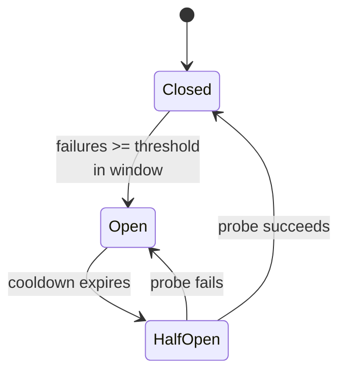

# The resilience quartet

## Why Does This Matter?

In a monolith, a dependency failing looks like an error. Across
services, a dependency failing looks like *slowness*, and slowness
propagates: each caller's threads/goroutines queue, each caller's
callers queue behind them, and one stalled pod becomes a fleet-wide
outage through perfectly reasonable code. The resilience quartet
(timeouts, retries, circuit breakers, bulkheads) is the set of
patterns that stop this propagation, and each has a Go implementation
small enough to own. The rules for *when* to retry come from
[05 §2](../05-errors/02-error-design.md)'s decision table; this
chapter is the machinery and its interactions.

## Mental Model

Each pattern bounds a different failure dimension:


| Pattern | Bounds | Fails with |
|---|---|---|
| Timeout | how long one attempt can take | error after the budget |
| Retry | transient failures (with backoff + jitter) | error after N attempts |
| Circuit breaker | repeated failure of one dependency | fast-fails until probe succeeds |
| Bulkhead | resources any one dependency can consume | rejects when its pool is full |

**Order matters and is not optional**: retry without timeout retries
hangs (each attempt unbounded); retry without a breaker multiplies
load against a dying dependency (the retry storm); breaker without
bulkhead lets the fast-failed calls still exhaust your connection
pool. They compose; they do not substitute.

## Timeout: the budget hierarchy

Every hop declares a budget smaller than its caller's remaining
budget:

```text
client total: 800ms
  └─ svc-A handler: 750ms
       ├─ db query: 200ms
       └─ svc-B call: 300ms   ← must be < remaining, with margin
```

The Go mechanics are [12 §4](../12-http-networking/04-clients-and-timeouts.md)'s
knob map and [08 §3](../08-concurrency/03-context.md)'s context
trees; the microservice-specific rule is **propagation**:

```go
// The incoming request's deadline is the parent; the outgoing call
// gets a *subset*, never a fresh budget.
func (h Handler) create(w http.ResponseWriter, r *http.Request) {
	ctx := r.Context() // deadline from the client, if any

	callCtx, cancel := context.WithTimeout(ctx, 300*time.Millisecond)
	defer cancel()
	resp, err := h.downstream.Fetch(callCtx, req)
	...
}
```

`context.DeadlineExceeded` arriving from downstream means *your*
budget (or your caller's) is spent: log which, do not blindly retry
(the 05 §2 table's "decide why" row).

## Retry: backoff with teeth

```go
// Retry calls op until success, budget, or attempt cap. Backoff is
// exponential with jitter: without jitter, synchronized retries from
// many callers arrive as a square wave the dependency cannot absorb.
func Retry(ctx context.Context, op func(context.Context) error) error {
	const base, max = 50 * time.Millisecond, 5
	deadline, _ := ctx.Deadline() // budget awareness from the start

	var lastErr error
	for attempt := 0; attempt < max; attempt++ {
		if err := op(ctx); err == nil {
			return nil
		} else {
			lastErr = err
		}
		if !errorslib.Retryable(lastErr) { // 05 §2's classification
			return lastErr // 400s do not improve with retries
		}
		backoff := base << attempt // 50, 100, 200, 400, 800ms
		if d := time.Until(deadline) - backoff; d <= 0 {
			return fmt.Errorf("retry budget spent: %w", lastErr)
		}
		jitter := time.Duration(rand.Int64N(int64(backoff) / 2))
		select {
		case <-time.After(backoff + jitter):
		case <-ctx.Done():
			return ctx.Err() // budget died mid-backoff
		}
	}
	return fmt.Errorf("after %d attempts: %w", max, lastErr)
}
```

The three properties that make this safe: **classification before
retrying** (`Retryable`), **budget awareness** (never sleep past the
caller's deadline), **jitter** (never retry in lockstep). And the
precondition from 12 §4 stands: only idempotent operations, or
idempotency keys (chapter 4), make retries honest.

## Circuit breaker: failing fast as a feature

A breaker tracks recent outcomes and trips to "open" after a
threshold, failing fast without touching the dependency, then probes
periodically to close:



```go
// Breaker is the educational minimal version; the example package's
// implementation adds the state machine above with tests.
type Breaker struct {
	mu        sync.Mutex
	failures  int
	threshold int
	openUntil time.Time
}

func (b *Breaker) Allow() bool {
	b.mu.Lock()
	defer b.mu.Unlock()
	return time.Now().After(b.openUntil) // open trips fast-fail
}

func (b *Breaker) Record(ok bool) {
	b.mu.Lock()
	defer b.mu.Unlock()
	if ok {
		b.failures = 0
		return
	}
	b.failures++
	if b.failures >= b.threshold {
		b.openUntil = time.Now().Add(b.cooldown)
	}
}
```

Two policy decisions hide in those ten lines, and both are load-bearing:

- **What counts as failure**: only *systemic* signals (5xx, timeouts,
  connection errors) trip the breaker. 4xx is the dependency working
  correctly; counting it trips breakers on your clients' bugs.
- **Half-open probing**: one probe request, not a thundering herd
  (the example's implementation admits exactly one probe; the rest
  fast-fail during the probe).

What the breaker *is not*: it is not a substitute for fixing the
dependency, and its state is a metric to alert on ([20-observability](../20-observability/)
when it ships): an open breaker is an incident signal, not normal
operation.

## Bulkhead: per-dependency resource ceilings

The bulkhead bounds what any one dependency can take from you:
semaphore-per-dependency (the pattern from
[08 §5](../08-concurrency/05-patterns.md)):

```go
type Bulkhead struct{ sem chan struct{} }

func NewBulkhead(maxInFlight int) *Bulkhead {
	return &Bulkhead{sem: make(chan struct{}, maxInFlight)}
}

func (b *Bulkhead) Do(ctx context.Context, fn func(context.Context) error) error {
	select {
	case b.sem <- struct{}{}: // take a slot
		defer func() { <-b.sem }()
		return fn(ctx)
	case <-ctx.Done():
		return ctx.Err() // or reject immediately: policy
	}
}
```

With a bulkhead, the payment service's stall consumes its 10 slots
and nothing else; inventory keeps its own 10. Without one, the
fleet-wide pool fills with payment waits and inventory dies too: the
propagation the quartet exists to stop. HTTP client pools
(`MaxIdleConnsPerHost`, 12 §4) are a bulkhead of sorts; explicit
semaphores make the policy visible and testable.

## Real-World Example: the quartet composed

```go
func (c *Client) Fetch(ctx context.Context, id string) (*Resp, error) {
	if !c.breaker.Allow() {
		return nil, ErrCircuitOpen // fast-fail, no queueing
	}
	err := c.bulkhead.Do(ctx, func(ctx context.Context) error {
		return retry.Retry(ctx, func(ctx context.Context) error {
			cctx, cancel := context.WithTimeout(ctx, 300*time.Millisecond)
			defer cancel()
			resp, err := c.httpDo(cctx, id)
			c.breaker.Record(err == nil) // systemic failures only
			if err != nil {
				return err
			}
			*result = resp
			return nil
		})
	})
	return result, err
}
```

Each layer answers a different question, and the error you get out
tells you which layer saved you: `ErrCircuitOpen` (breaker),
bulkhead rejection, retry exhaustion with the last error, or the
attempt's own timeout. Structured error taxonomy like this is what
makes the 3 a.m. page diagnosable.

## Production Example: the runnable example

`examples/resilience/` implements the quartet with deterministic
tests: a fake downstream that fails N times then succeeds, time
controlled by an injected clock, and assertions on exact behavior
(3 attempts with jittered backoff bounded by the deadline; breaker
opens at threshold, admits one probe, closes on success; bulkhead
rejects the (max+1)th concurrent call while the first 10 are
parked). The retry-storm test is the centerpiece: 50 goroutines
calling through the composed stack against a failing dependency
produce exactly `breaker.limit` downstream hits per window, not
`50 × retries`: the arithmetic difference between an incident and a
non-event.

## Common Mistakes

- **Retrying 4xx**: deterministic failures double in cost per retry
  (05 §2's table). Only transient classes retry.
- **Retries without jitter**: synchronized retries arrive as a
  periodic spike; the dependency sees a denial-of-service shaped
  exactly like your traffic pattern.
- **Breaker counting 4xx as failures**: trips on client bugs, hides
  the real problem behind "circuit open."
- **Timeout larger than the caller's remaining budget**: the retry
  inside is dead on arrival; propagate budgets down, never reset
  them.
- **Bulkhead sizing from peak**: sized-to-peak bulkheads reject the
  burst they were built for; size to the dependency's honest
  capacity with headroom, and let the breaker handle the rest.
- **Silent fallbacks**: catching `ErrCircuitOpen` and returning a
  default "works" for money paths is a data-integrity bug wearing a
  resilience costume ([25 §1](../25-fintech-with-go/01-money-and-payments.md));
  fallbacks fit reads, never writes.

## Idiomatic Go

- Compose small structs (breaker, bulkhead, retry func) over one
  "resilience framework"; each is testable alone, and the composition
  is one function.
- `ErrCircuitOpen`-style sentinels per layer, mapped once in
  transport ([05 §2](../05-errors/02-error-design.md)).
- The clock is injected (`now func() time.Time`): breaker cooldowns
  and backoffs become deterministic tests (chapter 3 of
  [14](../14-backend-development/03-wiring-and-dependency-injection.md)).

## Performance Considerations

- The quartet trades availability for latency: an open breaker is the
  fastest response in the system by design. Alert on breaker state
  transitions, not on their absence.
- `time.After` in retry loops allocates a timer per attempt; for
  hot loops, reuse timers ([19 §2](../19-performance/02-memory-and-allocations.md)).
  At normal call volumes, the readability wins.

## Concurrency Considerations

- Breaker and bulkhead state are shared across goroutines: mutexes
  or atomics, and the race detector in CI ([08 §4](../08-concurrency/04-sync-primitives.md)).
- The half-open probe must admit *one* concurrent prober, or the
  cooldown ends with a thundering herd (the example pins this).

## Security Considerations

- Fast-fail paths are response surfaces: `ErrCircuitOpen` bodies must
  not name the failed dependency's topology to external clients.
- Retry amplification is a DoS vector against your own dependencies:
  cap attempts *and* honor `Retry-After` from 429/503
  ([12 §4](../12-http-networking/04-clients-and-timeouts.md)).

## Testing Strategy

- Deterministic by construction: injected clock, scripted fake
  downstream, goroutine-counted storms.
- The state machines get exhaustive small tests (closed→open→
  half-open→closed, and every shortcut).
- The composed stack gets the storm test: the only test that proves
  the quartet's *arithmetic* rather than its parts.

## Interview Questions

1. Why does a dependency failure manifest as slowness, and how does
   each quartet member stop one propagation path?
2. Design the retry policy for a non-idempotent payment call. What
   changes?
3. Your breaker keeps opening but the dependency's dashboards look
   healthy. What are your first three hypotheses?
4. Where do bulkheads exist in a pure-Go service, concretely?
5. Compose the quartet in code on the whiteboard and name what each
   layer contributes to the error taxonomy.

## Practice Exercises

1. Implement `Retry` with budget awareness and jitter; write the test
   proving no attempt starts when the remaining budget cannot fit
   the backoff.
2. Build the breaker state machine with the injected clock; pin the
   single-probe half-open behavior with two racing goroutines.
3. Run the storm test: 50 goroutines, failing dependency, assert
   downstream hit counts with and without the breaker; write the
   ratio in a comment.

## Further Reading

- [Release It! (Nygard): stability patterns](https://pragprog.com/titles/mnee2/release-it-second-edition/)
- [The retry decision table](../05-errors/02-error-design.md)
- [singleflight for stampedes](../13-databases/05-caching-with-redis.md)
