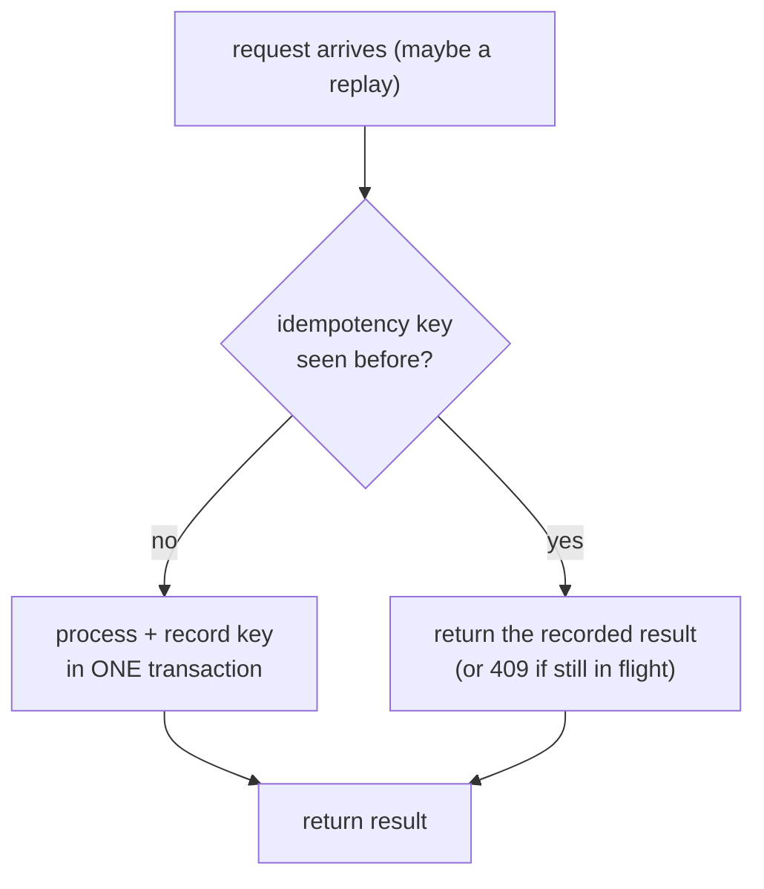
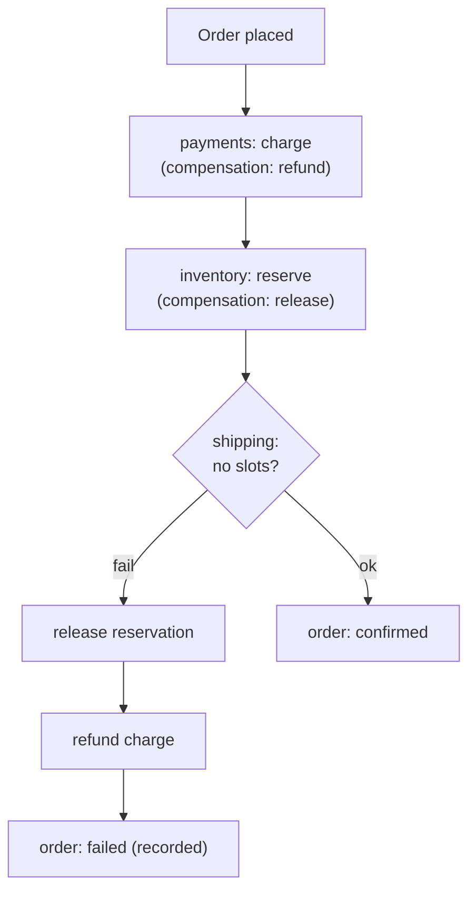

# Idempotency, sagas & the outbox

## Why Does This Matter?

Networks retry and processes crash; therefore every multi-service
flow runs more than once until proven otherwise. The three patterns
here (idempotency keys, sagas, outboxes) are how multi-service
systems stay correct despite that, and they are the reason the
monolith/microservices decision in chapter 1 is expensive: the
monolith had local transactions; the fleet has these. The financial
versions of these patterns (with money on the line) are developed in
full in [25 Section 1-3](../25-fintech-with-go/03-integrity-and-exactly-once.md);
this chapter generalizes them to any service boundary.

## Mental Model

At-least-once delivery is the physical reality; idempotent effects
are the engineering response:

```text
at-least-once delivery + idempotent effects = effectively-once
```



An idempotency key turns "did this happen?" from a guess into a
lookup. Everything else in this chapter is bookkeeping around that
lookup staying true under concurrency.

## Idempotency keys: the full contract

The client generates a key (UUID or a natural key like
`order-48123-attempt`); the server makes three promises:

1. **First request with key K**: process normally, persist the result
   *with* the key, in one transaction.
2. **Replay with key K, completed**: return the recorded result with
   the original status code, byte-for-byte where feasible.
3. **Replay with key K, still in flight**: return `409 Conflict`
   (or 425/428 per house style): "your first attempt is still
   running"; never double-execute.

```sql
-- The claim table: uniqueness is the whole mechanism (25 Section 1's pattern)
CREATE TABLE idempotency_keys (
	key          text PRIMARY KEY,
	request_hash text NOT NULL,   -- detect key reuse with a different body
	status       text NOT NULL,   -- in_flight | completed
	response     jsonb,           -- the recorded result for replay
	created_at   timestamptz NOT NULL
);
```

The insert-claim-then-work flow, atomic by primary key:

```go
func (s *Service) ChargeIdempotent(ctx context.Context, key string, in ChargeInput) (Payment, error) {
	var out Payment
	err := withinTx(ctx, s.db, func(tx *sql.Tx) error {
		var recorded json.RawMessage
		err := tx.QueryRowContext(ctx,
			`INSERT INTO idempotency_keys (key, request_hash, status)
			 VALUES ($1, $2, 'in_flight')
			 ON CONFLICT (key) DO NOTHING
			 RETURNING response`, key, hash(in)).Scan(&recorded)
		switch {
		case err == nil:
			// we own the claim; do the work and record the response
			// in this same transaction...
		case errors.Is(err, sql.ErrNoRows):
			// claim existed: replay path (409 or recorded result)
		default:
			return err
		}
		return nil
	})
	return out, err
}
```

The `request_hash` column catches the footgun where a client reuses
a key with a *different* body: that is a client bug, and returning
the first request's response would be a lie. Different hash with the
same key → `422` with "idempotency key reused".

**Scope the keys**: a key namespace per operation type (`charge:`,
`cancel:`) so a `cancel` replay cannot resolve against a stored
`charge` response. The key is data, not magic.

## Sagas: multi-service flows without distributed transactions

A saga is a sequence of local transactions, each with a compensating
action; a failure mid-sequence runs the compensations of completed
steps in reverse:



Two coordination styles, and the honest tradeoff:

| | Orchestration (a coordinator calls steps) | Choreography (steps react to events) |
|---|---|---|
| Flow visibility | one place to read the state machine | spread across consumers |
| Coupling | coordinator knows all steps | steps know only events |
| Failure handling | explicit, in one file | per-consumer, harder to audit |
| Change impact | coordinator deploy | any step deploy |

Pragmatic default: **orchestrate money and order flows** (auditability
is the requirement; [25 Section 3](../25-fintech-with-go/03-integrity-and-exactly-once.md)
builds the payment saga in full), **choreograph notifications and
analytics** (no invariant to protect). Every compensation must be
idempotent *and* safe to run after partial progress: the refund that
runs twice is the bug the keys above prevent.

What a saga is not: it is not ACID. Mid-saga states are visible
(charge held, inventory not yet reserved), and product flows must
tolerate that. If a business rule genuinely cannot tolerate
intermediate states, that is an argument for keeping those steps in
one service: a real input to chapter 1's boundary decision.

## The outbox: atomic state-change-plus-event

The dual-write problem: a service commits to its database, crashes
before publishing the event (lost), or publishes then rolls back
(phantom). The outbox solves it by making the event a row in the
same transaction:

The full relay mechanics (`FOR UPDATE SKIP LOCKED`, at-least-once
publish, idempotent consumers) are built and tested in
[25 Section 3](../25-fintech-with-go/03-integrity-and-exactly-once.md); the
microservices-specific rules on top:

1. **The outbox row carries the consumer's idempotency key**: the
   same namespace discipline from HTTP to broker to consumer, which
   is what makes the whole chain debuggable with one ID.
2. **Ordering per aggregate**: the relay preserves per-key order
   (order-48123's events never invert); global order is neither
   promised nor needed ([18 Section 1](../18-kafka-with-go/01-kafka-concepts.md)'s
   partition semantics align naturally: key by aggregate ID).
3. **Relay lag is a metric**: the outbox is a queue in your database;
   its depth is the truth about event-driven health
   ([20-observability](../20-observability/) when it ships).

## Basic Example: composing the three

```text
POST /orders (Idempotency-Key: abc123)
  1. claim key abc123 (in_flight) ──┐
  2. INSERT order (local tx)        │ one transaction:
  3. INSERT outbox(order.created,   │ the order and the event
       key=order:48123:created)     │ are atomic
  4. COMMIT ────────────────────────┘
  5. saga orchestrator picks up order.created:
       charge payment   (key: saga:48123:charge)
       reserve stock    (key: saga:48123:reserve)
       ... with compensations on failure, each keyed
```

Every arrow carries a key. When support asks "did order 48123 get
charged twice?", the answer is three queries, not an archaeology
project.

## Production Example: the patterns in the handbook's own code

- The ledger's claim table ([25 Section 1](../25-fintech-with-go/01-money-and-payments.md)):
  idempotency keys as primary keys, the uniqueness constraint doing
  the work.
- The relay ([25 Section 3](../25-fintech-with-go/03-integrity-and-exactly-once.md)):
  the outbox poller with `SKIP LOCKED` and at-least-once publishing.
- The Kafka consumer's dedup ([18 Section 3](../18-kafka-with-go/03-producer-consumer.md)):
  the consumer-side half of the same discipline.
- This section's example (`examples/resilience/`) adds the
  retry/breaker layer under the *outbound* half of these flows.

## Common Mistakes

- **Recording the key after the work**: crash between work and
  record = un-claimed execution that a replay will double-run. Key
  and work in one transaction, always.
- **Returning 200 on replays of in-flight requests**: the client now
  believes two attempts succeeded and the second response's data
  contradicts the first's. 409 exists for this.
- **Compensations that assume success**: a refund compensation that
  fails because the charge already settled needs its own saga, not a
  hope. Compensations are real logic with their own retries.
- **Sagas for reads**: composing a read across three services does
  not need a saga; it needs one API composition or a denormalized
  view. Sagas are for multi-service *writes with invariants*.
- **Outbox without consumer idempotency**: the relay is
  at-least-once by design; skipping the consumer's dedup converts a
  crash window into duplicates in production.
- **Choreographed money flows**: when the audit question is "who
  decided to refund?", "the event bus" is not an answer. Orchestrate
  what must be auditable.

## Idiomatic Go

- Claim tables and outbox tables live beside the domain schema,
  migrated together ([13 Section 3](../13-databases/03-pooling-drivers-migrations.md)).
- The saga coordinator is a plain service with a state machine
  struct: `type Saga struct{ step int; ... }` and a `step()` method
  per state; no workflow framework needed to start.
- Keys formatted as `operation:aggregate:intent` (`saga:48123:charge`)
  and logged as a single field: greppability is a feature.

## Performance Considerations

- Claim-table lookups are one extra primary-key touch per write:
  negligible. The real cost is the outbox relay's polling cadence vs
  event freshness; tune batch size and interval with the 13 Section 3 pool
  math in view.
- Saga state persistence per step adds a write per hop: for hot
  flows, batch step-claims ([19 Section 1](../19-performance/01-measure-first.md)
  before optimizing).

## Concurrency Considerations

- Two concurrent first-requests with the same key: the primary key
  makes one insert win; the loser sees the conflict path. This is
  the entire concurrency story, enforced by the database ([08 Section 4](../08-concurrency/04-sync-primitives.md)'s
  "let the single writer win" principle at the storage layer).
- Orchestration concurrency: one worker per saga instance (keyed
  sharding), never two coordinators racing the same saga.

## Security Considerations

- Idempotency keys are client-supplied and stored: validate length/
  charset, namespace per customer, and never log full request bodies
  beside them ([14 Section 2](../14-backend-development/02-configuration-and-secrets.md)'s
  redaction discipline).
- The replay path returns recorded responses: ensure the recorded
  payload carries no secrets that outlive the session
  ([21-security](../21-security/) when it ships).

## Testing Strategy

- Key semantics: table over (first, replay-completed, replay-in-
  flight, key-reuse-different-body) → expected outcomes.
- Saga: the coordinator's state machine tested stepwise with fake
  step clients, including the compensation path and a compensation
  failure.
- The whole chain: one test that replays the same keyed request
  twice against the composed example and asserts the store saw one
  effect. This single test is the chapter in miniature.

## Interview Questions

1. Walk through the idempotency-key contract: the three promises and
   the transaction that upholds them.
2. Where do keys come from, who scopes them, and what breaks the
   `request_hash` check catches?
3. Orchestration vs choreography: the decision rule you actually
   apply, with an example of each.
4. Why does the outbox need consumer idempotency? Trace the crash
   window.
5. Design the saga for order → charge → reserve; what are the
   compensations, and what is visible mid-saga?

## Practice Exercises

1. Add the claim table and the three-promise handler to a service;
   write the four-row key-semantics test.
2. Build a three-step saga coordinator with fakes; force a step-2
   failure and assert both compensations ran, then make a
   compensation fail and decide (in code) what the saga records.
3. Wire the outbox + relay from 25 Section 3 and add the replay test: same
   event delivered twice, one effect.

## Further Reading

- [Saga pattern (microservices.io)](https://microservices.io/patterns/data/saga.html)
- [Transactional outbox](https://microservices.io/patterns/data/transactional-outbox.html)
- [The ledger claims table](../25-fintech-with-go/01-money-and-payments.md)
