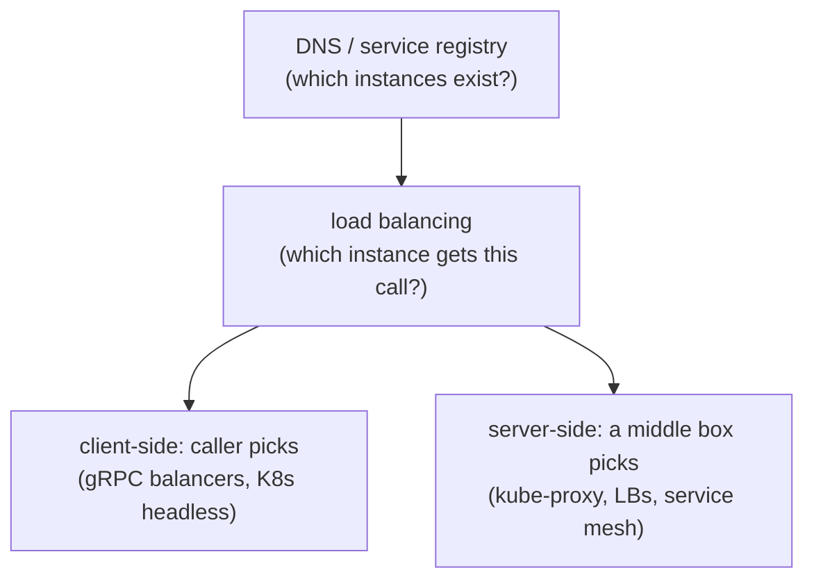

# Discovery, events & when NOT to

## Why Does This Matter?

Three questions close the microservices arc: how do services find
each other (discovery and load balancing), when should communication
be an event instead of a call (the coupling decision), and when
should the whole architecture be refused (the anti-chapter). The
last is treated with equal depth deliberately: the strongest signal
of seniority in this domain is a well-argued "no".

## Discovery & load balancing: how calls find a target

Two layers decide where a request goes:

| Mechanism | How it works | When it is enough |
|---|---|---|
| Kubernetes Services + kube-proxy | ClusterIP: a virtual IP, conntrack balances | the default for most fleets; zero client code |
| Headless services + client-side balancing | DNS returns all pod IPs; the client's balancer picks | gRPC (long-lived HTTP/2 conns make VIP balancing lopsided) |
| Service mesh (Linkerd/Istio) | sidecar proxies own routing, mTLS, retries | when policy must be centralized; real operational cost |
| Registry + client library (etcd/Consul) | watch instances, balance in-process | non-Kubernetes deployments |

The Go-specific knowledge: **gRPC breaks naive VIP balancing.** One
HTTP/2 connection per client-server pair means kube-proxy sends the
*first* packet's connection to one pod and every subsequent RPC rides
it: one hot pod, N cold ones. The fixes, in order of preference:
headless service + `grpc-go`'s built-in `dns:///` resolver with
round-robin (client-side balancing, three lines of dial options), or
a mesh sidecar that balances per-request. The handbook's client
construction ([12 §4](../12-http-networking/04-clients-and-timeouts.md))
is where this lives: transport and balancer options belong in one
constructor, reviewed once.

Load-balancing policy itself is usually boring: round-robin for
stateless services, least-request for skewed latencies, and
consistency by key (hash the aggregate ID) when a request sequence
must hit the same instance ([13 §5](../13-databases/05-caching-with-redis.md)'s
session-affinity caveat applies: prefer stateless and let any
instance serve).

## Events vs calls: the coupling decision

The deepest architectural choice in a fleet is per-interaction:

| | Call (request/response) | Event (publish/subscribe) |
|---|---|---|
| Coupling | caller knows callee | publisher knows nothing |
| Temporal coupling | both must be up | consumer can be down; events wait |
| Flow comprehension | read the caller | reconstruct from consumers |
| Error handling | synchronous, in-band | retries + DLQ ([18 §3](../18-kafka-with-go/03-producer-consumer.md)) |
| Backpressure | natural (the call blocks) | explicit design required (16) |

The decision rule: **does the caller need the answer to proceed?**
If yes, call. If the caller only needs the fact recorded (payment
succeeded → send email, update analytics, refresh cache), emit an
event: the caller's latency and availability stop depending on every
consumer's.

The anti-patterns sit at the edges:

- **Events for queries** (`GET user` via request/reply over Kafka):
  the complexity of async with the coupling of sync, plus a reply
  correlation problem. Calls exist for a reason.
- **Chains of synchronous calls** (A→B→C→D for one user action): the
  availability multiplies (0.99⁴ ≈ 0.96), the latency sums, and the
  timeout budgeting from chapter 3 becomes architectural debt.
  Break the chain with an event at the point where "eventually" is
  acceptable ([25 §3](../25-fintech-with-go/03-integrity-and-exactly-once.md)'s
  outbox makes the boundary atomic).
- **Event-driven everything**: when every interaction is an event,
  the system's behavior is emergent and no one can state it. Audit
  flows (money) stay orchestrated (chapter 4).

## Basic Example: turning a chain into a graph

Before: `checkout → charge → reserve → notify` synchronous (the
chain).

After: checkout calls charge (needs the answer), charge commits +
outbox-emits `payment.captured`, and reserve/notify subscribe. The
checkout's p99 drops by two network hops; the invariant (money moved
⇔ event exists) is enforced by the outbox transaction; notify being
down no longer fails checkout. The reservation moves into the
orchestrated saga (chapter 4) because inventory has a real invariant,
while notify stays choreographed because it does not. Every arrow has
a stated reason.

## The anti-chapter: when NOT to use microservices

Each reason below refutes a real-world justification, in the words
they usually arrive in:

**"We need to scale."** Scale what, to how many requests per second?
A single well-tuned Go service handles tens of thousands of RPS on
one box ([19](../19-performance/01-measure-first.md)); if you cannot
name the number you need, scaling is not your problem yet. Divergent
resource profiles (report generation vs API serving) are the
legitimate version of this reason; abstract traffic growth is not.

**"The codebase is too big."** Big codebases are a package-structure
problem ([14 §1](../14-backend-development/01-service-layout.md)).
Microservices make the codebase bigger: every contract, every client
library, every deployment script is new code. Split when *teams*
stop fitting in one codebase, not when files do.

**"Independent deployments!"** A team of eight deploying a modular
monolith on a daily train loses little to coordination; the same
team running 20 services gains paging, on-call surface, and version
skew. The deploy cadence benefit is real precisely when multiple
teams block each other's releases: an org-shape signal (Conway's
law cuts both ways).

**"We want different technologies per service."** The one case where
the need is real (a legacy system, a specialized ML runtime) is
usually solved by *one* boundary around the exception, not a
polyglot fleet. Every additional runtime multiplies your operational
playbooks, image pipeline, and CVE surface
([06 §4](../06-packages-modules/04-dependency-hygiene.md)'s hygiene
rules apply per language).

**"Startups need microservices to scale later."** Startups need
validated product decisions, and the modular monolith provides every
later option at strictly lower cost. The split-ready layout of
chapter 1 is the hedge; it costs an import-lint test, not a mesh.

The refusal checklist, positive form. Build the modular monolith,
with these properties that make every later door open:

1. Domain packages that import neither transport nor each other
   (chapter 1's dependency test).
2. Consumer-side interfaces at every external touchpoint (stores,
   clocks, clients).
3. Contracts written before extraction is even discussed.
4. Observability that already answers "which package is slow?" (the
   prerequisite skill for distributed debugging).

If a team can name these four and point at code, they can split
*safely* whenever org pain arrives. If they cannot, microservices
would be a distributed monolith on day one.

## Common Mistakes

- **VIP-balanced gRPC and the one-hot-pod mystery**: p99 fine, one
  pod pegged. The fix is client-side balancing; the lesson is that
  L4 balancing and L7 protocols interact.
- **Adopting a mesh to "solve networking"** before owning timeouts,
  retries, and tracing in application code: the mesh re-implements
  chapter 3's patterns in YAML; teams that never wrote them cannot
  debug them at either layer.
- **Events as the only architecture**: emergent behavior, unownable
  invariants, sagas-for-reads. Calls and events are a portfolio.
- **Consistent hashing for statelessness**: hashing by user to "keep
  caches warm" reintroduces instance state and rebalancing pain;
  scale the cache tier instead ([13 §5](../13-databases/05-caching-with-redis.md)).
- **Refusing to consolidate**: three services that always deploy
  together and share a database are one service with three codebases.
  Merging is an architecture improvement, not a defeat.

## Idiomatic Go

- gRPC dial options and balancer configuration in one constructor
  next to the transport knobs ([12 §4](../12-http-networking/04-clients-and-timeouts.md)).
- Event publishing behind the same consumer-side interface as stores:
  the outbox relay is an implementation, not an architecture.

## Performance Considerations

- Every network hop adds latency and a failure mode; the chain-
  breaking example is a performance decision as much as an
  architectural one. Measure the composed call path
  ([19 §1](../19-performance/01-measure-first.md)) before and after
  restructuring; architecture is a latency line item.

## Concurrency Considerations

- Long-lived gRPC connections change pool math (fewer connections,
  stream multiplexing) and interact with drain (12 §5): close
  streams before `Shutdown` returns.

## Security Considerations

- Events are a data-exfiltration channel as real as APIs: payload
  schemas are contracts with the same care as ch. 2's, and consumer
  access to topics is authorization ([21-security](../21-security/)
  when it ships).

## Testing Strategy

- Discovery/balancing: test against a registry fake asserting the
  balancer's pick distribution; integration-tier with real
  Kubernetes is 28-projects territory.
- Coupling decisions: the contract tests of ch. 2 for calls; the
  consumer idempotency tests of ch. 4 and 18 §3 for events.

## Interview Questions

1. Why does gRPC break VIP load balancing, and what are the fixes in
   order of preference?
2. Give the decision rule for call vs event, then break one of your
   own sync chains with it.
3. Refute "microservices let us scale" in three sentences.
4. What four properties make a modular monolith split-ready?
5. A team wants a service mesh before writing their first timeout.
   What do you recommend, and why?

## Practice Exercises

1. Configure `grpc-go`'s dns resolver with round-robin against a
   headless service; write the test that asserts requests distribute
   across two fake servers.
2. Take a four-hop synchronous chain (or simulate one) and move one
   hop to an outbox event; measure the p99 delta with a load
   generator.
3. Write your current project's refusal checklist: the four
   split-ready properties, each pointing at real code or marked
   missing.

## Further Reading

- [gRPC load balancing](https://grpc.io/blog/coreos/)
- [Kubernetes headless services](https://kubernetes.io/docs/concepts/services-networking/service/#headless-services)
- [Conway's Law](https://en.wikipedia.org/wiki/Conway%27s_law)
