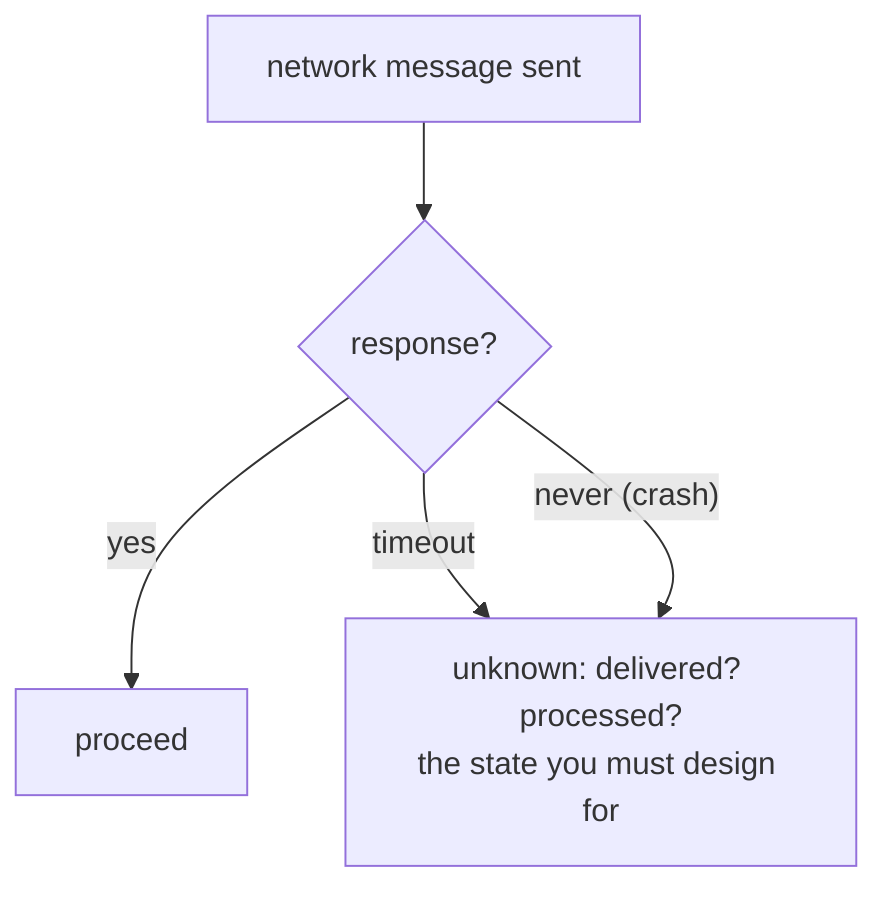

# The failure model: CAP, PACELC & partial failure

## Why Does This Matter?

Distributed programming is a different discipline because of one fact
the single-machine mental model hides: **partial failure**. In one
process, a crash fails everything (you know, and you restart). Across
a network, one component can fail while others keep running, and you
cannot always tell "down" from "slow". CAP, PACELC, and the failure
taxonomy are not interview trivia; they are the vocabulary for every
design tradeoff in this section and the reason patterns like leases
and quorums exist.

## Mental Model



The unknown-response state generates the whole discipline:

- **You cannot distinguish slow from dead** without a timeout, and a
  timeout is itself a guess that can be wrong both ways.
- **The operation may have happened** even though you saw a failure:
  the money moved; the answer was lost. This is why idempotency
  exists (chapters 4 and [25 §1](../25-fintech-with-go/01-money-and-payments.md)).
- **Two honest observers can disagree** about who is alive: the
  classic split-brain. Consensus, leases, and fencing (chapter 3)
  exist because time and information are local.

The failure taxonomy, in increasing awfulness:

| Failure | Meaning | Typical handling |
|---|---|---|
| Crash | clean stop | restart, recovery from durable state |
| Omission | message lost | retry with idempotency |
| Timing | response too late | budget expiry (ch. 3 of [15](../15-microservices/03-resilience-patterns.md)) |
| Byzantine | arbitrary/lying behavior | consensus beyond this handbook; mostly out of scope for internal services |

Internal services assume crash + omission + timing; byzantine
tolerance is for blockchains and adversarial federations, and saying
so precisely in a design review is a senior signal.

## CAP: what the theorem actually says

CAP says: when a **network partition (P)** occurs, a distributed
store must choose between answering **consistently (C)** or
**available (A)**. Three corrections to how it gets misquoted:

1. **P is not optional.** Partitions happen (GC pauses, network
   blips, deployments). "CA" systems do not exist in distributed
   reality; the choice is only *during* a partition.
2. **The choice is per-operation, not per-system.** A database can
   answer consistently for writes and serve stale reads under
   partition; a service can fail fast for money operations and serve
   cached reads for profiles. Design the matrix, not the label.
3. **CAP says nothing about latency.** That is PACELC's job.

## PACELC: the tradeoff that runs every day

```text
If Partitioned: choose A (serve stale/refuse) or C (refuse until safe)
Else (normal operation): choose L (latency) or C (consistency)
```

The ELSC half is the one that bites real systems: even without any
partition, *synchronous replication costs latency on every write*.
Postgres with synchronous commit waits for the standby on every
commit; with async commit, a failover may lose the last transactions.
Neither is wrong; they are different points on the PACELC line, and
the fintech ledger's choice ([25 §2](../25-fintech-with-go/02-double-entry-ledger.md):
synchronous, because money) versus a session store's choice (async,
because a lost session re-login is cheap) are both correct answers to
different questions.

## Basic Example: stating the choice per operation

The design-review artifact this chapter teaches you to write:

| Operation | Partition answer | Latency answer | Justification |
|---|---|---|---|
| Debit account | refuse (C) | sync replication (L paid) | money: divergence is fraud-shaped |
| Read product page | serve cached (A) | async, stale OK | staleness invisible |
| Create session | serve from local (A) | async | worst case: re-login |
| Health/readiness | refuse on unknown | fail fast | [14 §5](../14-backend-development/05-observability-health-flags.md)'s liveness rule |

Every row is defensible in one sentence. A system that cannot fill
this table has not made its tradeoffs; it has inherited them from a
default.

## Real-World Example: the fallacies, mapped to incidents

The eight fallacies of distributed computing are a checklist of
things your code silently assumes. The ones with recurring Go
incidents:

| Fallacy | The incident it becomes |
|---|---|
| The network is reliable | "we retried the webhook but never recorded we sent it" (ch. 4's dual-write) |
| Latency is zero | in-process assumptions after a split: N+1 calls across services |
| Bandwidth is infinite | shipping full rows through Kafka where deltas would do |
| The network is secure | plaintext internal traffic that an audit rejects ([18 §1](../18-kafka-with-go/01-kafka-concepts.md)'s TLS rule) |
| Topology doesn't change | hard-coded replica IPs; the pod that never comes back |
| There is one administrator | two teams, one schema (ch. 2 of [15](../15-microservices/02-boundaries-and-contracts.md)'s boundary rule) |
| Transport cost is zero | health checks calling dependency graphs per probe |
| The network is homogeneous | the one Arm node, the one misconfigured MTU |

## Production Example: timeouts as the universal tactic

Every unknown-response incident narrows to the same mitigation:
**bound the wait, decide the timeout policy, make the decision
idempotent**. The budget hierarchy from [15 §3](../15-microservices/03-resilience-patterns.md)
is the Go mechanics; the systems-level addition: the timeout you pick
is a *probability statement* about the dependency's tail, not a
property of the network. Pick it from measured p99s plus margin, and
re-derive it when the dependency changes ([19 §1](../19-performance/01-measure-first.md)).

## Common Mistakes

- **"CAP means I must pick one for the whole system."** The choice is
  per-operation during partitions; write the matrix.
- **Confusing replication lag with CAP.** Lag is the ELSC tradeoff
  (normal operation); CAP is the partition case. Mixed vocabulary
  produces confused requirements ("we need strong consistency" when
  they need read-your-writes, which is ch. 2's cheaper mechanism).
- **Treating timeouts as failures.** The operation may have
  succeeded; the handling must branch on *unknown*, not on *failed*
  ([15 §3](../15-microservices/03-resilience-patterns.md)'s retry
  classification).
- **Byzantine-grade paranoia for internal systems.** mTLS and signed
  messages yes; Merkle-proof-everything no. Match rigor to the
  adversary ([21-security](../21-security/) when it ships).
- **Assuming crash-stop for peers.** A "dead" node comes back with
  its old opinions: leases expire, fencing tokens reject, and stale
  replicas re-join (chapters 2-3's whole subject).

## Idiomatic Go

- Model the unknown explicitly: `(result T, err error)` where err
  wraps `context.DeadlineExceeded` distinguishes *gave up* from *was
  told no*; callers branch differently ([05 §2](../05-errors/02-error-design.md)'s
  classification).
- Never let a goroutine wait forever: every network wait has a
  context ([08 §3](../08-concurrency/03-context.md)); "the network is
  reliable" is often just "nothing had a deadline."

## Performance Considerations

- Consistency costs latency *on the write path* (sync replication,
  quorum waits); reads can stay cheap. The ELSC tuning is per-store
  configuration, reviewed with the 13 §3 pool math.
- The tail matters more than the mean: one slow replica holds quorum
  reads hostage; hedged reads exist because p99 >> p50.

## Concurrency Considerations

- Local time is not global time: two machines' clocks disagree, and
  "at 12:00:01" is untrustworthy across nodes. Order comes from
  logical clocks, sequence numbers, and the storage engine (ch. 4's
  ordering rules), never from `time.Now()` comparisons across
  machines ([08 §4](../08-concurrency/04-sync-primitives.md)'s
  happens-before is the honest local analog).

## Security Considerations

- Partitions are a security event too: fail-open health checks and
  fail-open authz caches under partition are the classic design bug
  ([14 §5](../14-backend-development/05-observability-health-flags.md)'s
  probe discipline; [21-security](../21-security/) when it ships).

## Testing Strategy

- Fault injection is the tier that matters: fail the network between
  A and B, assert A degrades per the design matrix. `toxiproxy` or a
  failing-transport `RoundTripper` ([10 §2](../10-testing/02-doubles-and-httptest.md))
  makes it deterministic.
- The unknown-response test: the dependency *succeeds but the
  response is lost*; assert the caller neither double-executes nor
  reports success.

## Interview Questions

1. State CAP precisely, then correct the two most common misquotes.
2. Why does PACELC matter more day-to-day than CAP?
3. A request to a dependency times out. What are the possible true
   outcomes, and what must your handler do for each?
4. Write the consistency matrix for a payments service: four
   operations, partition answer, latency answer, one-line defense.
5. Which failure modes does an internal service design for, and what
   does byzantine tolerance add that most systems should skip?

## Practice Exercises

1. Write the failing-transport test: response lost after the
   dependency committed; assert your caller's behavior for each of
   the three true outcomes.
2. Fill the consistency matrix for a service you own; find the rows
   where no one ever made the decision.
3. Measure a dependency's p50/p99 and set a timeout from the p99;
   then inject a 2x tail and observe which caller dies first.

## Further Reading

- [Brewer's CAP twelve years later](https://www.infoq.com/articles/cap-twelve-years-later/)
- [PACELC](https://en.wikipedia.org/wiki/PACELC_theorem)
- [The eight fallacies](https://nighthacks.com/jag/res/Fallacies.html)
