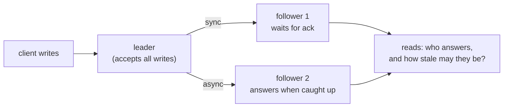

# Replication & consistency models

## Why Does This Matter?

Replication is why your database survives a lost disk; consistency
models are the contract describing *how stale* a replica's answer may
be. Engineers who conflate the two either pay for consistency they do
not need (sync replication everywhere) or discover staleness in
production (the support agent who cannot see the refund the customer
just got). This chapter is the ladder of consistency models, the
replication modes that produce them, and the read-your-writes
mechanism that fixes the most common user-facing bug.

## Mental Model

One leader, many followers, and a question: when may a follower
answer?



| Replication mode | Write latency | Failover data loss | Read staleness |
|---|---|---|---|
| Synchronous (all ack) | high | none | none (all current) |
| Semi-sync (one ack) | medium | bounded | bounded |
| Asynchronous | low | uncommitted tail lost | unbounded lag |

PACELC's ELSC tradeoff in table form (chapter 1): every row is a
point on the latency/staleness line, and the ledger's sync-everything
vs a session store's async-both are both correct.

## How It Works: the consistency ladder

From weakest to strongest; note the cost curve is not linear:

| Model | Guarantees | Cost |
|---|---|---|
| Eventual | replicas converge *eventually*; no order promise | cheapest; the default for async replicas |
| Causal | you see effects of causes you observed | session/context tracking |
| Read-your-writes | *your* writes are visible to *your* next reads | routing discipline (below) |
| Monotonic reads | you never see time go backwards within a session | sticky reads |
| Linearizable | every op appears atomically at some instant, real-time ordered | quorum/leader wait per op |

The engineering translation:

- **"Strong consistency" is almost never the requirement.** Most
  "we need strong consistency" reviews mean read-your-writes (the
  user edited their profile and immediately cannot see the edit) or
  monotonic reads. Both are routing problems, solvable in application
  code at a fraction of linearizability's cost.
- **Linearizability is for invariants across nodes**: locks, leader
  election, sequence allocation ([25 Section 2](../25-fintech-with-go/02-double-entry-ledger.md)'s
  ledger gets it from the single-writer Postgres primary, not from
  application code).

## Syntax / API: read-your-writes in Go

The standard implementation: remember where your write landed, send
your next read there.

```go
// Session pins reads to the replica (or primary) that satisfies
// read-your-writes for this user's recent writes.
type Session struct {
	mu        sync.Mutex
	lastWrite time.Time // when our last write was acked by the primary
	stickiness time.Duration
}

func (s *Session) AfterWrite(t time.Time) {
	s.mu.Lock()
	defer s.mu.Unlock()
	s.lastWrite = t
}

// ReadTarget returns primary until every replica is likely caught up
// (i.e., the configured maximum lag has elapsed); replica after.
func (s *Session) ReadTarget(maxLag time.Duration, now time.Time) Target {
	s.mu.Lock()
	defer s.mu.Unlock()
	if now.Sub(s.lastWrite) < maxLag {
		return TargetPrimary
	}
	return TargetReplica
}
```

The production-grade version tracks the primary's commit position (a
sequence number or LSN, which Postgres exposes) and compares it with
each replica's replayed position: read from a replica only when its
replayed LSN covers your write's LSN. The `time.Duration` version
above is the honest floor; the LSN version is the production ceiling.
The principle: **staleness is a measurement, not a hope.**

## Basic Example: causal consistency without the buzzword

The support-console case: agent views a customer's payments after the
customer just made one. The write happened on the primary; the
console reads a lagging replica. The fix is the same pinning: the
console's read session carries the customer's last-write position
(from the payment service's response), and the console's read waits
or reroutes until the replica covers it. No new database, no new
consensus: one field threaded through a context ([08 Section 3](../08-concurrency/03-context.md)'s
value rules apply: a position token, not a connection).

## Real-World Example: conflict resolution when leaders multiply

Multi-leader and leaderless replication (multi-region deployments,
Dynamo-style stores) allow concurrent writes to the same key; they
must converge somehow:

| Strategy | Behavior | The surprise it hides |
|---|---|---|
| Last-writer-wins (wall clock) | highest timestamp wins | clock skew picks the wrong winner; drops one write silently |
| Deterministic (max value, lexicographic) | same winner on every replica | order of ops may invert semantics |
| CRDTs (counters, sets) | merges converge mathematically | limited shapes; not for invariants |
| Application merge | your code resolves | you own the edge cases forever |

The fintech rule ([25 Section 2](../25-fintech-with-go/02-double-entry-ledger.md)):
financial accounts do not resolve conflicts; they refuse them. A
single-writer primary per account shard makes concurrency impossible
instead of reconcilable. Multi-leader writes to a balance are a
design bug, not a merge problem.

## Production Example: what each store actually gives you

| Store | Default model | The knob |
|---|---|---|
| Postgres primary + replicas | eventual on replicas | read routing (above); `synchronous_commit` for the write side |
| Kafka | per-partition total order | key choice = ordering scope ([18 Section 1](../18-kafka-with-go/01-kafka-concepts.md)) |
| Redis primary/replica | eventual | `WAIT` command for per-write sync acks |
| etcd | linearizable (Raft) | `--consistency` for serializable reads |
| Dynamo-style stores | eventually consistent | quorum reads (`R+W>N`) for stronger reads |

The Go engineer's job is rarely implementing replication; it is
*choosing the read* and *routing the session* correctly, then testing
staleness behavior deliberately (the Testing Strategy below).

## Common Mistakes

- **Round-robin reads after writes** (the default load balancer
  behavior): the user updates their email, refreshes, sees the old
  one, updates again: now two divergent edits. Read-your-writes
  routing is the fix; a sticky session is the quick fix.
- **"Eventual consistency" as a synonym for "whatever happens".**
  Name the model per operation (chapter 1's matrix) or the system's
  behavior is unowned.
- **LWW on money or state machines.** Wall clocks skew; the last
  writer is whoever's clock lied best. Deterministic orderings and
  single-writer designs are the financial-grade answers.
- **Testing only the happy path.** The replica-lag bug appears at
  3 a.m. during a traffic spike, exactly when every test environment
  is boring. Inject lag ([10 Section 2](../10-testing/02-doubles-and-httptest.md)'s
  failing transport pattern).
- **Confusing availability of the cluster with availability of the
  data.** Five replicas, none caught up: the cluster is up, the
  answer is not there.

## Idiomatic Go

- Session/position tracking as a small struct with a mutex (the
  pattern above), injected like any dependency ([14 Section 3](../14-backend-development/03-wiring-and-dependency-injection.md)).
- Staleness tokens travel in contexts: a position value, not a
  replica connection ([08 Section 3](../08-concurrency/03-context.md)).

## Performance Considerations

- Sync replication multiplies write latency by the slowest acker: one
  lagging standby p99s your writes. Semi-sync with a timeout is the
  usual compromise.
- Quorum reads trade latency for freshness; hedged reads (fire a
  second read to the next replica at the p99) cut tails where the
  store supports them.

## Concurrency Considerations

- A read-your-writes session is per logical user, not per request:
  the session state must be shareable across concurrent requests
  from the same session ([08 Section 4](../08-concurrency/04-sync-primitives.md)),
  usually via a request-scoped copy of the last committed position.

## Security Considerations

- Stale reads can leak revoked state: a permission check served from
  a lagging replica may grant access after revocation. Authz reads
  pin to the linearizable source ([21-security](../21-security/)
  when it ships).

## Testing Strategy

- Lag injection: a fake replica that answers stale by N operations;
  the read-routing logic must pin when required and relax after.
- Convergence tests: partition a fake cluster, apply writes on both
  sides, heal, and assert the chosen conflict strategy converges to
  the documented result.

## Interview Questions

1. Rank the consistency models and name the one most "strong
   consistency" requests actually mean.
2. Implement read-your-writes for Postgres primary + replicas: what
   do you track, and when do you route to the replica?
3. Why is LWW wrong for balances, and what replaces it?
4. Semi-sync replication: what does it buy, what does it cost, when
   is it the right row of the table?
5. Your support console cannot see a customer's payment from 30
   seconds ago. Diagnose from the ladder.

## Practice Exercises

1. Implement the `Session` read-target with an LSN-style counter fake:
   writes increment primary and replica counters at different rates;
   assert pinning behavior.
2. Build the lag-injection test: a fake replica that serves reads
   from an older snapshot; verify the console bug, then fix it with
   the session pin and watch the test pass.
3. Write the consistency matrix (chapter 1) for a store you use; map
   each row to the actual knob in that store's config.

## Further Reading

- [Designing Data-Intensive Applications, ch. 5-9 (Kleppmann)](https://dataintensive.net/)
- [PostgreSQL streaming replication](https://www.postgresql.org/docs/current/warm-standby.html)
- [Jepsen: consistency analyses](https://jepsen.io/consistency)
