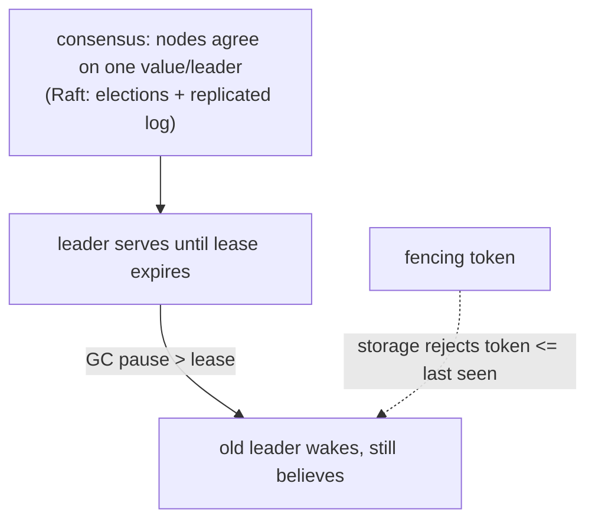

# Consensus, leases & fencing

## Why Does This Matter?

Some invariants need exactly one actor: the cron that charges
customers, the rebalancer, the sequence allocator. "Exactly one" is
the hard part: two nodes can both *believe* they are leader (a GC
pause, a network blip), and both will act unless the system makes the
belief verifiable. This chapter builds the intuition for consensus
(Raft), then the practical Go tools: leases with fencing tokens,
which convert "I think I'm leader" into "the storage agrees I may
act."

## Mental Model



The chain of trust, weakest to strongest:

1. **"I elected myself"**: no coordination; split-brain guaranteed.
2. **"A quorum elected me"**: correct but heavyweight per operation.
3. **"I hold a valid lease"**: a time-bounded grant from a
   coordinating service (etcd/ZooKeeper/Postgres advisory locks);
   correct while clocks and expirations behave.
4. **"I hold a valid lease AND a fencing token"**: the lease plus a
   monotonically increasing number the *storage layer* checks: the
   only version that survives a paused-but-alive ex-leader.

The last row is the senior answer, and the example package implements
it.

## How It Works: Raft intuition (30 seconds of theory)

Raft (the algorithm behind etcd, Consul, and friends) solves
consensus with two mechanisms:

- **Elections**: nodes vote for a candidate with a sufficiently up-
  to-date log; a majority must agree, so at most one leader per term
  exists.
- **Replicated log**: the leader appends entries; followers accept
  them once a majority acks; committed entries are permanent.

The engineering takeaways, without implementing it: consensus needs
a **majority** (so 2N+1 nodes tolerate N failures), and the majority
rule is why quorum reads/writes work (chapter 4). Use etcd; do not
write Raft.

## Syntax / API: leases with a real coordinator

The etcd-shaped lease, in the form you will actually use:

```go
cli, err := clientv3.New(clientv3.Config{Endpoints: []string{"etcd:2379"}})

// Campaign blocks until this node holds the named leadership.
session, err := concurrency.NewSession(cli, concurrency.WithTTL(15))
election := concurrency.NewElection(session, "services/charger/leader")
if err := election.Campaign(ctx, instanceID); err != nil { ... }

// The session's keepalive is the heartbeat: lose the heartbeat
// (process freeze, network loss) and the lease expires, another
// node campaigns successfully. Resume requires re-campaign.
defer session.Close()
```

What the TTL is buying: liveness detection without global clocks. A
lease expires when the *coordinator's* clock says so; the holder
cannot extend it without a round-trip. The dangerous half: between
"lease expired" and "old holder realizes," the old holder still
believes. That gap is why fencing exists.

## Basic Example: the fencing token

A fencing token is a number that only the current leaseholder can
obtain, and that storage compares monotonically:

```go
// The storage side: refuse writes carrying an old token.
CREATE TABLE jobs (
	id          bigint PRIMARY KEY,
	status      text NOT NULL,
	fencing_no  bigint NOT NULL
);
-- The claim, guarded by the token:
UPDATE jobs SET status = 'processing', fencing_no = $1
WHERE id = $2 AND fencing_no < $1;
```

```go
// The holder side: lease + token from the coordinator.
func (w *Worker) claimToken(ctx context.Context) (int64, error) {
	return w.store.NextFencingNumber(ctx, "charger") // monotonic, lease-guarded
}

func (w *Worker) Process(ctx context.Context, job Job) error {
	claim := fmt.Sprintf(
		`UPDATE jobs SET status = 'processing', fencing_no = $1
		 WHERE id = $2 AND fencing_no < $1`, w.token, job.ID)
	res, err := w.db.ExecContext(ctx, claim)
	if err != nil {
		return err
	}
	if n, _ := res.RowsAffected(); n == 0 {
		return ErrFencedOut // a newer leader already took this
	}
	return w.do(ctx, job)
}
```

The GC-pause scenario, end to end: leader A holds lease and token 7;
A pauses for 30s; the lease expires; B campaigns, gets token 8; B
processes jobs; A wakes, still believing, and attempts a write with
token 7. The storage's `fencing_no < 8` guard rejects it: **A cannot
corrupt B's work even though A never learned it lost.** Without
fencing, A's stale write lands and the invariant breaks.

## Real-World Example: locks vs leases, and where each fails

| Primitive | Guarantee | Failure mode |
|---|---|---|
| Advisory lock (Postgres) | held while a session lives | session's TCP dies silently; lock lingers until the server notices |
| etcd lease | expires on TTL | holder paused past TTL keeps acting (fix: fencing) |
| Redis `SET NX EX` | expires on TTL | same, plus single-node replication loss; Redlock's caveats are documented |
| Storage CAS/token | the storage itself enforces | none of the above: the check is atomic with the write |

The pattern that survives review: **the lease tells you who *may*
try; the fencing token (or conditional write) decides who actually
wins.** Kleppmann's critique of Redis locks and the fencing-token
design are the canonical references; the example package encodes both
sides of the discipline.

What you do *not* need a distributed lock for: anything a database
transaction already serializes ([13 Section 2](../13-databases/02-transactions-and-isolation.md)'s
`FOR UPDATE`). Locks are for coordinating actors *outside* one
database: two services, a cron fleet, a rebalancer.

## Production Example: the leader election checklist

A production leader election, reviewed:

1. **TTL vs worst-case pause**: the lease TTL must exceed the
   holder's worst GC pause / disk stall / process freeze. Measure the
   pause distribution ([19 Section 1](../19-performance/01-measure-first.md));
   set TTL to its p99.9 with margin.
2. **Re-campaign on resume**: the waking holder must re-campaign, not
   resume; implement it as "lease check before every batch," not
   once at startup.
3. **Fencing at every durable write**: the token guards every state
   change the leader makes outside its own process.
4. **Observability**: leadership transitions are events
   ([20-observability](../20-observability/) when it ships); flapping
   leaders (multiple transitions per minute) mean the TTL is wrong.
5. **Clock discipline on the coordinator**: etcd's server clocks
   matter; NTP skew on the coordinator widens every ambiguity window.

## Common Mistakes

- **"Elected at startup" leadership**: no expiry, no re-check. The
  zombie-leader generator.
- **TTL shorter than the holder's worst pause**: guaranteed flapping;
  two leaders repeatedly. TTL comes from measured pauses.
- **Fencing tokens without monotonic source**: tokens from
  `time.Now()` (clock skew) or from each node's local counter (not
  comparable). The coordinator allocates them.
- **Checking the lease once, then working forever**: the lease can
  expire mid-batch; re-validate per unit of work, and let the fencing
  guard catch what the re-validation misses.
- **A distributed lock around an in-database operation**: the
  transaction already serializes; the lock adds a second failure
  domain to a solved problem.

## Idiomatic Go

- `concurrency.Session`/`Election` from `clientv3` for real fleets;
  the example's `Lease` type for teaching and testing the semantics.
- `ErrFencedOut` as a domain sentinel: the fenced worker logs, drops
  its claim, and re-acquires ([05 Section 2](../05-errors/02-error-design.md)'s
  classification).
- Leadership state behind a tiny interface (`IsLeader() bool` with a
  static fake for tests that do not need the real election).

## Performance Considerations

- Lease renewal is a heartbeat: tune interval to TTL/3 so one missed
  renewal does not flap leadership.
- Fencing adds one monotonic comparison per guarded write:
  negligible. Never omit it to "save the query."

## Concurrency Considerations

- The fencing number is the distributed analog of the version column
  ([13 Section 2](../13-databases/02-transactions-and-isolation.md)'s
  optimistic pattern): same CAS semantics, coordinator-allocated.
- A fenced-out worker must stop immediately: continuing "to finish
  the batch" is exactly the corruption fencing prevents.

## Security Considerations

- The coordinator (etcd) is now a crown jewel: TLS, authn, and RBAC
  on lease/election paths; a compromised coordinator appoints itself
  leader of everything ([21-security](../21-security/) when it ships).

## Testing Strategy

- Deterministic lease tests via the injected clock (the example):
  expiry, renewal, the fencing rejection, the pause-and-return
  scenario as an explicit test case.
- The zombie-leader test: hold a lease, advance the clock past TTL
  without renewing, attempt a fenced write, assert
  `ErrFencedOut`. This single test is the chapter in miniature.

## Interview Questions

1. Why can two nodes believe they are leader, and what stops each
   from corrupting state?
2. Explain fencing tokens to a database engineer using a version
   column as the bridge.
3. Raft: what do the majority rule and the replicated log buy, and
   why 2N+1 nodes?
4. Where does a Postgres advisory lock beat an etcd lease, and vice
   versa?
5. Your leader flaps every 90 seconds. Walk the diagnosis.

## Practice Exercises

1. Build the example's `Lease` with the injected clock; write the
   zombie-leader test (pause past TTL, attempt write, get fenced).
2. Add fencing to the [25 Section 2](../25-fintech-with-go/02-double-entry-ledger.md)
   ledger's posting path in a scratch branch; articulate which
   concurrent hazard it closes that the DB transaction alone does not.
3. Measure your service's worst GC pause (GODEBUG=gctrace=1 under
   load) and derive the correct lease TTL; write the number down next
   to the election config.

## Further Reading

- [How to do distributed locking (Kleppmann)](https://martin.kleppmann.com/2016/02/08/how-to-do-distributed-locking.html)
- [etcd concurrency package](https://pkg.go.dev/go.etcd.io/etcd/client/v3/concurrency)
- [The Raft paper](https://raft.github.io/raft.pdf)
