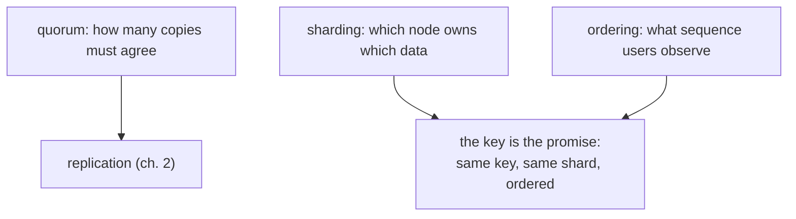

# Quorums, sharding & ordering

## Why Does This Matter?

Quorum arithmetic is the most quoted formula in distributed systems
and the most misapplied: `W + R > N` looks like a guarantee, and it
is not. Sharding is how systems scale past one machine, and hot keys
are how sharding quietly fails. Ordering is the property users assume
and distributed systems only partially provide. This chapter is the
math, the mechanics, and the caveats, tied to the Go-facing knobs.

## Mental Model



Three decisions, each with a formula and a failure mode:

1. **Quorum** (replica count vs agreement): reads, writes, or both
   wait for multiple copies.
2. **Sharding** (data placement): the key determines placement;
   placement determines parallelism and hot spots.
3. **Ordering** (sequence): global order does not exist cheaply;
   per-key order does ([18 Section 1](../18-kafka-with-go/01-kafka-concepts.md)'s
   partitions are this same truth wearing Kafka).

## How It Works: quorums, honestly

The setup: N replicas, W required for a write ack, R required for a
read. The claim: if `W + R > N`, every read overlaps at least one
node that saw the latest write, so reads never miss the last write.

| Config | N=3 semantics | Cost |
|---|---|---|
| W=1, R=1 | fast, no durability | lost writes on failover |
| W=2, R=2 (quorum) | overlap guaranteed | 2 round-trips per op |
| W=3, R=1 | durable writes, fast reads | reads may serve stale |
| W=2, R=1 | **not quorum**: R can miss W | the misconfiguration this chapter exists for |

The caveats that make the formula not-a-guarantee:

1. **Overlap is not freshness.** The overlapping replica *has* the
   data; the read may still be answered by a stale copy unless the
   store compares versions and returns the newest (Dynamo-style
   read-repair). `W+R>N` creates the *opportunity* for consistency;
   the store's version handling realizes it.
2. **Sloppy quorums** (allowing W from *any* N available nodes during
   failures) keep availability but can break the overlap promise;
   know whether your store does this (Dynamo: yes; Cassandra: `QUORUM`
   is strict, `LOCAL_ONE` is not).
3. **Concurrent conflicting writes still conflict.** Quorum serializes
   *a* value, not *your* order: two clients writing simultaneously
   both "succeed" and a winner emerges by the store's conflict rule
   (LWW by default: chapter 2's warning applies).

The practical reading: quorum config tunes the durability/latency
dial; correctness against concurrency comes from conflict handling
and single-writer design, not from the formula.

## Sharding: the key is the contract

Placement is `shard = hash(key) mod shards` (or a lookup table); the
key choice therefore decides:

- **Ordering scope**: all operations for one key land on one shard,
  in order (the single-writer rule from chapter 2; [25 Section 2](../25-fintech-with-go/02-double-entry-ledger.md)'s
  per-account serialization is a shard key).
- **Parallelism**: distinct keys proceed concurrently.
- **Failure blast radius**: one shard down affects only its keys.

The tradeoff is total: maximum order (shard = global) is one node;
maximum spread (shard = request) has no order. Every real key sits
between, and the hot-key problem is the spread's failure:

**Hot keys.** One tenant with 40% of traffic pins one shard. The
mitigations, in escalation order:

1. **Sub-keying**: shard on `account:txn-id` instead of `account`:
   breaks per-account ordering, fine when per-item order suffices.
2. **Split hot entities**: an account exceeding a shard's capacity
   becomes two accounts (a real schema change, planned per entity).
3. **Dedicated shard/pool** for the whale: isolate it, admit it, and
   stop pretending it is average ([18 Section 1](../18-kafka-with-go/01-kafka-concepts.md)'s
   hot-partition discussion is the same problem in Kafka).

## Basic Example: key design in Go

```go
// ShardKey is the placement promise. The type prevents accidental
// re-keying: changing it is a reshard, not a refactor.
type ShardKey string

// ForAccount orders all of one account's operations together.
func ForAccount(id string) ShardKey { return ShardKey("acct:" + id) }

// ForItem spreads per-item operations for parallelism while keeping
// per-item order (the sub-keying mitigation).
func ForItem(accountID, itemID string) ShardKey {
	return ShardKey("acct:" + accountID + ":item:" + itemID)
}

func ShardOf(k ShardKey, shards int) int {
	h := sha256.Sum256([]byte(k))
	return int(binary.BigEndian.Uint32(h[:4]) % uint32(shards))
}
```

The comment on the type is the design rule: a shard key change moves
data. In stores you configure (Kafka topics, Dynamo tables, Postgres
partitions), the key is chosen once and reviewed like a schema.

## Real-World Example: resharding, the pain you plan for

Increasing shard count re-maps most keys (`hash mod n` changes for
almost everyone): in-flight ordering breaks retroactively. The
migration disciplines:

- **Consistent hashing** (hash ring): remaps only ~K/N keys when K
  changes; the reason Ketama/jump-hash exist. Still a data movement,
  just a smaller one.
- **Dual-write migration**: write to old and new placements, backfill,
  verify, cut reads, stop old writes: the expand/contract pattern
  from [13 Section 3](../13-databases/03-pooling-drivers-migrations.md)
  applied to placement.
- **Fixed key-to-shard mapping tables** (1000 logical shards mapped
  onto N physical nodes): resharding moves logical shards, and keys
  never re-map. The scheme most large fleets converge on.

Postgres native partitioning and Kafka partition counts make the
same tradeoff: partition counts at Kafka are "effectively forever"
([18 Section 1](../18-kafka-with-go/01-kafka-concepts.md)) for exactly this
reason; size for three years of growth on day one.

## Ordering: what you can promise

| Scope | Achievable? | Mechanism |
|---|---|---|
| Per key/aggregate | yes | single shard, sequence numbers |
| Per producer | yes | producer sequence + dedup (Kafka idempotency) |
| Global | yes, at one writer | single leader: the bottleneck |
| Global, multi-writer | no (without expensive consensus per op) | do not design for it |

The design translation: state the ordering you promise *per stream*
and derive keys from it. "We need ordering" always means "we need
ordering of X with respect to Y"; the answer is a key, not a
stronger database ([25 Section 3](../25-fintech-with-go/03-integrity-and-exactly-once.md)'s
one-key-namespace rule threads the ordering from HTTP to broker to
consumer).

## Production Example: the knobs, store by store

| Store | Shard/partition knob | Quorum-ish knob |
|---|---|---|
| Postgres (declarative partitioning) | partition key per table | `synchronous_standby_names` (sync replicas) |
| Kafka | partition count + key | `min.insync.replicas` + `acks=all` |
| Cassandra/Dynamo | partition key | `QUORUM`/`LOCAL_QUORUM` per query |
| Redis Cluster | hash slots (16384) | `WAIT` for per-write acks |

The Go engineer touches these through configuration and key design,
not through implementing them; the engineering is in *predicting*
behavior: which key hot-spots, which config breaks overlap, which
ordering promise the design actually makes.

## Common Mistakes

- **`W+R>N` treated as strong consistency**: it makes stale reads
  *unlikely*, not impossible (sloppy quorums, conflict resolution,
  and version handling all modify the promise). Chapter 2's ladder is
  the honest vocabulary.
- **Shard key chosen for even load today**, ignoring the ordering
  requirement discovered next quarter. Keys encode promises; changes
  are migrations.
- **Random keys "to spread load"**: destroys every ordering and
  locality property; fine for keyless logs, wrong for entities.
- **Resharding without dual-write**: the unmigrated keys are either
  lost or duplicated mid-migration; expand/contract exists for this.
- **Global ordering as a requirement**: the design that follows is
  one giant writer; reframe the requirement per-stream before
  accepting it.

## Idiomatic Go

- `ShardKey` as a distinct type with constructors per promise (the
  pattern above): accidental re-keying becomes a type error.
- Hash functions: `hash/fnv` or `sha256` truncated; never
  `len(key) % n` (skews with naming patterns).

## Performance Considerations

- Hot shards are latency and capacity ceilings: the queueing at one
  shard dominates fleet p99 ([19 Section 1](../19-performance/01-measure-first.md)'s
  universal read: measure per-shard, not per-fleet).
- Quorum waits put the *slowest* acker in the critical path: replica
  health is a latency SLA, and one bad disk p99s every write.

## Concurrency Considerations

- Per-key single-writer is the concurrency model: everything for one
  key serializes *by design*. Keys too coarse = artificial
  serialization (the whale's whole fleet queueing behind one shard).
- Cross-key invariants (two accounts in one transfer) break shard
  locality: [25 Section 2](../25-fintech-with-go/02-double-entry-ledger.md)
  keeps the ledger's invariant under single-writer per account by
  construction; transfers across shards need care (ordered
  acquisition: 13 Section 2's deadlock rule).

## Security Considerations

- Shard keys appear in metrics, logs, and admin surfaces: PII in keys
  leaks ([18 Section 1](../18-kafka-with-go/01-kafka-concepts.md)'s Kafka key
  rule; hash or use stable IDs).
- Shard isolation is a blast-radius control: a compromised shard's
  credentials should not read its neighbors (per-shard least
  privilege; [21-security](../21-security/) when it ships).

## Testing Strategy

- Distribution tests: hash a representative key corpus and assert
  shard balance (catches skew in the hash or the key scheme).
- The reshard simulation: dual-write to two mappings, verify
  convergence, then cut: rehearse migrations in CI with fakes before
  running them on data.

## Interview Questions

1. Explain `W+R>N` and then name three ways a read can still be
   stale under it.
2. Design the shard key for a payments system: per-account order,
   whale accounts, and cross-account transfers. What do you
   sacrifice?
3. Why is increasing Kafka partitions a retroactive ordering break?
4. Consistent hashing vs mapping tables for resharding: compare.
5. "We need global ordering." Reframe the requirement.

## Practice Exercises

1. Implement `ShardOf` and the distribution test with a realistic key
   corpus; introduce a deliberately skewed key pattern and measure
   the imbalance.
2. Write the dual-write reshard simulation with two fake shard maps;
   assert zero loss and zero duplication for a keyed workload.
3. Take a Kafka topic you own (or the 18 examples): list every
   ordering promise the current key scheme makes, and which ones
   nothing actually relies on.

## Further Reading

- [DDIA ch. 6: partitioning](https://dataintensive.net/)
- [Consistent hashing (Karger et al.)](https://www.cs.princeton.edu/courses/archive/fall16/courses/cs591B/papers/16.consistent.pdf)
- [Kafka partitioning internals](../18-kafka-with-go/01-kafka-concepts.md)
