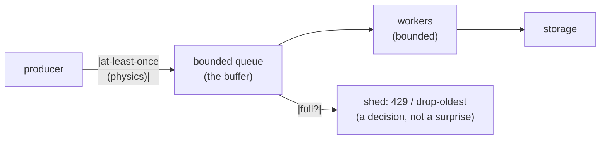

# Delivery, backpressure & load shedding

## Why Does This Matter?

Every distributed system distributes *work*, and the failure modes
are always about flow: messages arrive twice (duplicates), arrive
faster than you can process (overload), or keep arriving after you
degrade (shedding is not optional). Chapter 15's quartet protected
one caller; this chapter protects the *system*: the delivery
semantics generalized, the dedup machinery that makes at-least-once
safe, and the end-to-end backpressure that turns overload into
controlled degradation instead of collapse.

## Mental Model



Three truths compose into the design:

1. **Delivery is at-least-once**: any ack-then-crash window
   duplicates; any crash-before-ack loses. Choose where the window
   sits ([18 Section 1](../18-kafka-with-go/01-kafka-concepts.md)'s commit
   strategies), then dedup.
2. **Queues absorb bursts, not sustained overload.** A queue that
   stays full is not helping; it is hiding the saturation until the
   memory or the SLA dies. Queues buy *time*, and the design must
   spend it deliberately.
3. **Every system has a shedding policy.** The only question is
   whether it is chosen (reject newest, serve degraded) or emergent
   (OOM-kill whatever the kernel picks).

## Delivery semantics: generalized from 18 Section 1

| Semantics | Where the ack sits | You get | Requires |
|---|---|---|---|
| At-most-once | ack before work | possible loss | nothing; rarely acceptable |
| At-least-once | ack after work | possible duplicates | **idempotent effects** |
| Effectively-once | at-least-once + dedup | one *effect* per logical message | the dedup machinery below |

"Exactly-once" does not exist as a transport property; the honest
architecture is row two plus row three's machinery, stated exactly
that way ([25 Section 3](../25-fintech-with-go/03-integrity-and-exactly-once.md)'s
teardown is the canonical version; the Kafka EOS specifics are
[18 Section 1](../18-kafka-with-go/01-kafka-concepts.md)).

## Deduplication: the two-tier implementation

Where dedup lives depends on what promises the key:

**Tier 1: storage-enforced (the strong tier).** The idempotency-claim
table from [15 Section 4](../15-microservices/04-idempotency-sagas-outbox.md):
uniqueness constraint, `ON CONFLICT`, the database refuses the second
effect even under concurrency. For money and state transitions, this
is the tier; nothing application-side is as trustworthy.

**Tier 2: in-flight cache (the fast tier).** For streams at volume
where a storage round-trip per message is too expensive: an LRU of
recently seen keys, with the storage constraint still as the backstop
for the window the LRU evicts:

```go
// Dedupe is the in-flight tier: fast membership over the recent
// window. Not a guarantee by itself: the storage constraint (or
// idempotent effect) is the backstop for anything evicted.
type Dedupe struct {
	mu   sync.Mutex
	seen map[string]struct{}
	ring []string // eviction order
	max  int
}

func NewDedupe(max int) *Dedupe {
	return &Dedupe{seen: make(map[string]struct{}, max), ring: make([]string, 0, max), max: max}
}

// Acquire claims the key: true on first sight, false on replay.
func (d *Dedupe) Acquire(key string) bool {
	d.mu.Lock()
	defer d.mu.Unlock()
	if _, ok := d.seen[key]; ok {
		return false
	}
	if len(d.ring) >= d.max { // evict oldest
		delete(d.seen, d.ring[0])
		d.ring = d.ring[1:]
	}
	d.seen[key] = struct{}{}
	d.ring = append(d.ring, key)
	return true
}
```

The two-tier contract: the LRU makes replays cheap and fast; the
storage constraint makes them *impossible*. One without the other is
either slow or unsafe. (This is also exactly the `RecentKeys` shape
from [03 Section 8](../03-data-structures/08-ring-buffers.md), promoted to a
distributed-systems duty.)

## Backpressure: end to end

Backpressure is the system's ability to slow its intake when its
output slows. The Go toolkit ([08 Section 5](../08-concurrency/05-patterns.md))
composed into a policy:

```go
// A bounded intake: the producer blocks (or is rejected) when the
// buffer is full; workers drain at their own pace.
type Processor struct {
	jobs chan Job
	wg   sync.WaitGroup
}

func NewProcessor(workers, buffer int, fn func(context.Context, Job) error) *Processor {
	p := &Processor{jobs: make(chan Job, buffer)}
	for i := 0; i < workers; i++ {
		p.wg.Add(1)
		go func() {
			defer p.wg.Done()
			for job := range p.jobs {
				_ = fn(context.Background(), job)
			}
		}()
	}
	return p
}

// Submit is where backpressure becomes visible: the caller waits
// (bounded) or rejects. Never an unbounded send.
func (p *Processor) Submit(ctx context.Context, j Job) error {
	select {
	case p.jobs <- j:
		return nil
	case <-ctx.Done():
		return ctx.Err()
	}
}
```

The knobs and what each decides:

| Knob | Decision |
|---|---|
| Buffer size | burst absorption vs latency: full buffer = 1 buffer's worth of added latency |
| Worker count | throughput per queue; too many = context-switch and lock thrash |
| Block vs reject on full | backpressure upstream (caller slows) vs shedding (caller told no) |

**Block or shed is *the* policy choice**, and it differs by caller:
block HTTP requests up to their (short) timeout, shed lower-priority
async work immediately, always shed for health-check-critical paths.
What is never acceptable: unbounded queues (memory death) or silent
drops (data loss disguised as success).

## Load shedding: degradation as a feature

When intake exceeds capacity durably, shedding decides *what* the
system stops doing. Priorities make it defensible:

| Priority | Traffic | Shed policy |
|---|---|---|
| Critical | payments, authz checks | never shed; block briefly, then shed callers *upstream* |
| Standard | ordinary API traffic | 429 with `Retry-After` when saturated |
| Bulk | analytics, recomputation | shed first, always |

The mechanism is a semaphore at the door ([08 Section 5](../08-concurrency/05-patterns.md))
plus the priority table: `TryAcquire` for standard/bulk (fail fast
when full), `Acquire` for critical (block on a short budget). The
classifier is usually "who is calling and why," available at the edge
(chapter 4's identity), and the policy is configuration, reviewed
like code.

Circuit breakers ([15 Section 3](../15-microservices/03-resilience-patterns.md))
are shedding's outbound sibling: inbound shedding protects *you*
from callers; breakers protect you from *dependencies*. A system
that sheds and breaks cleanly turns overload into elevated error
rates on low-priority traffic: an incident, but an owned one.

## Production Example: the runnable example

`examples/` in this section carries the `Dedupe` type with its
eviction and concurrency tests, and a `Processor` with the
shed-or-block policy switch: tests prove the exact behaviors this
chapter promises (replay claims false; eviction admits the key again
with the storage tier noted as backstop; the (capacity+1)th submit
sheds with a distinguishable error; drain waits for in-flight work
before shutdown, the 12 Section 5 lifecycle at queue scale).

## Common Mistakes

- **Unbounded queues as "buffering"**: `make(chan Job)` with no
  capacity under a producer faster than consumers is a memory leak
  with a schedule.
- **Dedup LRU trusted as a guarantee**: eviction window > retry
  window and the duplicate sails through. The storage tier is not
  optional for invariants.
- **Shedding without `Retry-After`**: clients retry immediately at
  full rate; the shed becomes the storm ([15 Section 3](../15-microservices/03-resilience-patterns.md)'s
  jitter rule applies to clients honoring your signal).
- **Shedding the wrong traffic**: bulk analytics starving the payment
  path, or a health probe 429'd into a restart loop. The priority
  table is the whole design; write it down.
- **Auto-commit-style at-most-once by accident**: ack-before-process
  sneaks in via framework defaults; [18 Section 1](../18-kafka-with-go/01-kafka-concepts.md)'s
  commit-strategy table is the checklist.

## Idiomatic Go

- Bounded channels everywhere; the capacity is a documented decision.
- Shed errors as typed sentinels (`ErrShedded`) with their own
  mapping ([05 Section 2](../05-errors/02-error-design.md) → 429 + Retry-After
  in [12 Section 1](../12-http-networking/01-handlers-and-routing.md)'s
  translation point).
- `Dedupe`/`Processor` small and injectable; the pipeline patterns of
  [08 Section 5](../08-concurrency/05-patterns.md) compose with them.

## Performance Considerations

- Buffer sizing: latency of a full queue is buffer/dequeue-rate;
  compute it, don't guess it. A 10k buffer at 100/s drains in 100
  seconds: that is not buffering, it is a delay line.
- The dedup LRU is O(1) per message at pointer costs; the storage
  claim is one unique index touch ([13 Section 4](../13-databases/04-repositories-and-testing.md)'s
  bounded-query discipline applies to the claim table too).

## Concurrency Considerations

- `Dedupe` and `Processor` are the shared mutable state of this
  section: mutex-guarded and race-tested ([08 Section 4](../08-concurrency/04-sync-primitives.md));
  the example's tests run under `-race` in CI.
- Drain-before-exit: workers finish their current job before the
  process exits ([12 Section 5](../12-http-networking/05-graceful-shutdown.md)'s
  lifecycle, [18 Section 1](../18-kafka-with-go/01-kafka-concepts.md)'s
  rebalance drain).

## Security Considerations

- Shedding is a DoS response surface: attackers probe with cheap
  traffic to evict real work. Priorities keyed on *verified* identity
  (chapter 4's authn), not on source trustworthiness
  ([21-security](../21-security/) when it ships).
- Dedup keys can be attacker-chosen: cap key length and namespace per
  tenant, or one tenant's keys can evict another's ([15 Section 4](../15-microservices/04-idempotency-sagas-outbox.md)'s
  key-hygiene rules).

## Testing Strategy

- Deterministic queue tests: fake clock, scripted producers;
  assert shed-vs-block per policy.
- The dedup window test: replay inside the window (fast tier
  catches), replay after eviction (storage tier catches), and the
  two-tier integration test with a fake claim table.
- Storm tests under `-race`: N producers × M consumers at capacity,
  zero lost, zero duplicated, drained cleanly on shutdown.

## Interview Questions

1. Where does the at-least-once window sit in your pipeline, and
   what dedups it? Name both tiers.
2. Why can a queue not fix sustained overload? What does it fix?
3. Block or shed: decide for three caller classes and defend each.
4. Your service OOM-kills during traffic spikes. Reconstruct the
   missing design from this chapter.
5. Design the priority table for a payments API under 3x overload:
   what sheds first, and what is guaranteed?

## Practice Exercises

1. Implement `Dedupe` with the ring eviction and its tests; then
   build the two-tier version with a fake claim store and prove the
   post-eviction replay is caught.
2. Add the shed-or-block switch to a `Processor` and write the test
   where the (capacity+1)th submit gets `ErrShedded` while the first
   N complete in order.
3. Trigger a real overload against the example (load generator, 5x
   capacity) and watch: with shedding, p99 stays bounded and bulk
   429s; without, latency and memory climb together. Record both.

## Further Reading

- [Backpressure explained (Nathan Marz)](http://www.nathankleppman.com/2015/09/16/backpressure-explained/): the canonical essay
- [SRE book: handling overload](https://sre.google/sre-book/handling-overload/)
- [The bounded-channel patterns](../08-concurrency/05-patterns.md)
