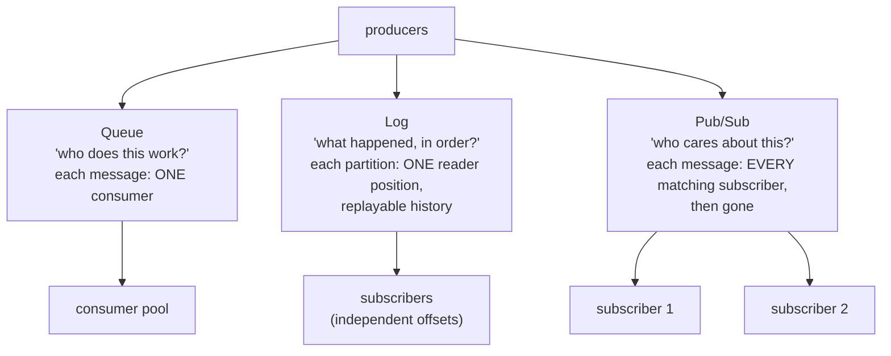

# Queues, logs & pub/sub

## Why Does This Matter?

"Let's use a message queue" conflates three different systems with
different guarantees, and choosing the wrong one is expensive to
reverse: a queue chosen for events cannot replay; a log chosen for
work distribution spreads one task across every consumer; a pub/sub
fanout chosen for durability loses notifications on disconnect. The
broker decision (chapter 2) matters less than the *model* decision:
match the model to the problem and most brokers work; match it wrong
and no broker saves you.

## Mental Model

Three models, three questions they answer:

| | Queue | Log (Kafka) | Pub/Sub |
|---|---|---|---|
| Message to consumers | one of the pool | all groups; one member per partition per group | every current subscriber |
| After delivery | acked, gone | retained by age/size; replayable | gone (unless persistent) |
| Ordering | FIFO-ish per queue | total per partition | best-effort |
| Time-travel (reprocess last week) | no | yes | no |
| The mental error | using it as history | using it as a work queue | expecting durability |

The semantics DNA: **a queue deletes knowledge of delivered work; a
log remembers; pub/sub forgets instantly.** Every downstream
requirement (replay after a consumer bug, audit of what happened,
guaranteed delivery to a subscriber that was down) is decided by this
one property, which is why [18 Section 1](../18-kafka-with-go/01-kafka-concepts.md)
calls the log "not a queue with better marketing."

## How It Works: choosing by the questions you ask

The decision questions, in the order they matter:

1. **Is this work or news?** Work (one processor must handle each
   item exactly-effectively-once: resize an image, charge an order)
   wants a queue or a log with consumer groups. News (something
   happened; whoever cares reacts) wants pub/sub or a log.
2. **Will you ever need to reprocess?** Bug in the consumer published
   last Tuesday; do you replay? Only a log can. This single question
   disqualifies queues for event-driven architectures
   ([15 Section 5](../15-microservices/05-discovery-events-and-when-not.md)'s
   outbox events are news with history requirements).
3. **Do subscribers have independent pace and interest?** Two teams
   consuming the same events at different speeds and with different
   failure domains: log (per-group offsets) or pub/sub with durable
   subscriptions, not a shared queue where consumption is competitive.
4. **Is latency the product?** Sub-millisecond command/control (live
   prices, presence, telemetry): NATS-core pub/sub territory (ch.
   2). Durability trades latency everywhere; know whether you are
   paying for it deliberately.

## Basic Example: the same flow on two models

A payment-succeeded event, consumed by notifications and analytics:

**As pub/sub**: the payment service publishes; whoever is subscribed
now gets it. Analytics down for an hour: those events are gone for
analytics. Acceptable only when analytics can rebuild from elsewhere.

**As a log**: the payment service publishes to a partitioned topic;
notifications and analytics are separate consumer groups with their
own positions. Analytics down for a week: it resumes from its offset
and processes everything. The event is *history*, not a one-shot
notification.

**As a queue**: wrong tool here entirely, unless notifications and
analytics *share* the processing (they do not: each needs every
event). A queue distributes; it does not fan out.

The outbox relay from [25 Section 3](../25-fintech-with-go/03-integrity-and-exactly-once.md)
publishes to a log for exactly this reason: the downstream fan-out is
each consumer's own position, and nothing is lost to a subscriber's
downtime.

## Real-World Example: the hybrid reality

Real fleets mix models, correctly:

| Need | Model | Typical broker |
|---|---|---|
| Job processing (bounded retries, one worker per item) | queue | RabbitMQ, SQS, NATS JetStream |
| Business events with replay and audit | log | Kafka |
| Fan-out to ephemeral subscribers (dashboards, presence) | pub/sub | NATS-core, Redis pub/sub |
| Commands to a service with load balancing | queue | any of them |
| Event sourcing (the log is the database) | log | Kafka + compaction |

The mistake to avoid is not mixing; it is mixing *implicitly*: an
event that starts as a pub/sub notification (lost to the down
subscriber) and later acquires audit requirements (replay needed) is
a migration nobody scheduled. Decide each flow's model deliberately
with chapter 1 of [16](../16-distributed-systems/01-failure-model-cap-pacelc.md)'s
matrix discipline: write the row down.

## Production Example: the flow of this section

This section's example (`examples/`) builds a *minimal in-memory
broker* with the queue model's exact semantics (ack, redeliver on
nack, bounded retries, DLQ, idempotent consumption). It exists to
make the vocabulary executable: by the end, `Handler`, `redelivery`,
`dead-letter`, and `ack` are things you have tested, not just read.
The same handler interface plugs into RabbitMQ, SQS, or Kafka (18 Section 3
does the Kafka wiring), which is the portability payoff of the
transport-free pattern.

## Common Mistakes

- **Pub/sub as the default "event" choice**: subscribers down at
  publish time never see the event; durability is a subscription
  property, not a message property. Ephemeral subscribers only.
- **A queue for multi-team fan-out**: consumption is competitive;
  team B's lag steals team A's messages. Logs or durable pub/sub.
- **Kafka as a job queue**: keyless topics, message-level acks, no
  replay designed in ([18 Section 1](../18-kafka-with-go/01-kafka-concepts.md)'s
  "#1 design error" warning). Jobs want per-item ack semantics.
- **Assuming FIFO everywhere**: queues deliver in order *until*
  retries, redelivery, or concurrent consumers intervene; the
  ordering promise needs the per-key discipline of
  [16 Section 4](../16-distributed-systems/04-quorums-sharding.md).
- **Model chosen by broker familiarity**: "we have Kafka, so jobs
  flow through Kafka" couples two unrelated requirements. The models
  are the design; brokers implement them.

## Idiomatic Go

- Name the model in the type or package: `jobs.Queue`,
  `events.Log`, `notifications.Fanout`; future readers inherit the
  decision, not a guess.
- Publish behind an interface ([04 Section 3](../04-functions-methods-interfaces/03-interfaces-philosophy.md)):
  the outbox relay is an implementation detail ([15 Section 4](../15-microservices/04-idempotency-sagas-outbox.md)).

## Performance Considerations

- Latency ladder: ephemeral pub/sub (µs) → queue (ms) → durable log
  (ms + fsync-configurable). Pay for durability where the data's
  worth it ([16 Section 1](../16-distributed-systems/01-failure-model-cap-pacelc.md)'s
  matrix).
- Throughput lives in batching at every layer (broker, client, your
  consumer); [18 Section 4](../18-kafka-with-go/04-observability-tuning.md)'s
  tuning section generalizes.

## Concurrency Considerations

- Queue consumers race for messages by design: the worker-pool
  patterns of [08 Section 5](../08-concurrency/05-patterns.md) are the
  consumer shape.
- Log consumers serialize per partition: one worker per partition
  preserves order with bounded parallelism ([18 Section 1](../18-kafka-with-go/01-kafka-concepts.md)'s
  partition ceiling).

## Security Considerations

- Queues and topics carry business data: ACLs per topic/queue, PII
  out of keys and headers, TLS from day one
  ([18 Section 1](../18-kafka-with-go/01-kafka-concepts.md)'s Kafka rules
  generalize to every broker here).

## Testing Strategy

- The model's semantics are testable without a broker: the example's
  in-memory broker pins ack/nack/redeliver/DLQ exactly; the same
  tests run against the real broker in the integration tier
  ([18](../18-kafka-with-go/)'s two-tier pattern).

## Interview Questions

1. Queue vs log vs pub/sub: the one property that decides each, and
   a requirement that disqualifies each.
2. Your analytics consumer was down for a week. Which models lose
   data, which replay? What decides it?
3. Why is Kafka a poor job queue, concretely?
4. A flow starts as notifications and acquires audit requirements.
   What was skipped, and what does the migration look like?
5. Name the latency/durability trade across the three models and
   where each is worth paying.

## Practice Exercises

1. Take three flows in a system you know and classify each: work,
   news-with-history, or ephemeral news. Find the one running on the
   wrong model.
2. Build the decision from this chapter for an order-processing
   system: which flows queue, which log, which fan out? Write the
   table.
3. Reproduce the lost-subscriber bug: pub/sub broker (or the
   in-memory example), subscriber down at publish, enumerate what it
   missed; then re-run on a log model.

## Further Reading

- [Kafka: the log abstraction](https://www.linkedin.com/pulse/apache-kafka-kafkas-design-overview-jay-kreps)
- [Enterprise Integration Patterns (Hohpe & Woolf)](https://www.enterpriseintegrationpatterns.com/): the vocabulary's origin
- [RabbitMQ tutorials](https://www.rabbitmq.com/tutorials)
