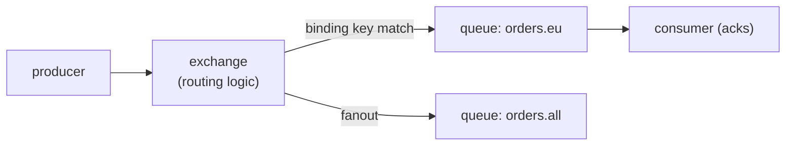

# The brokers, honestly

## Why Does This Matter?

Broker selection debates are usually preference arguments because the
comparisons skip the models. Grounded in chapter 1's three models,
the comparison becomes mechanical: each broker implements a model
with a particular set of knobs, and the honest question is which
knobs your requirements actually pull. This chapter covers the four
you will realistically choose between, with the native concepts
(AMQP's exchanges, NATS's subjects) explained rather than name-dropped.

## Mental Model

| | Kafka | RabbitMQ | NATS | SQS |
|---|---|---|---|---|
| Model (ch. 1) | log | queue + routing | pub/sub (+ JetStream: log/queue) | managed queue |
| Throughput profile | very high (batched) | moderate | very high (low latency) | moderate, managed |
| Retention/replay | first-class (days+) | until acked | none (core); log (JetStream) | until deleted (14 days max) |
| Routing | by partition key | rich: exchanges, bindings, headers | subjects with wildcards | none (attributes only) |
| Operational weight | heavy (JVM cluster, zk/KRaft) | moderate | tiny (single Go binary) | none (AWS-managed) |
| Delivery | at-least-once | at-least-once (acks) | at-most-once (core); Acks (JS) | at-least-once (visibility timeout) |
| Ordering | per partition | per queue (weak under retries) | per subject (core: no) | per FIFO queue (opt-in) |

No row wins; each column is a different contract. The rest of this
chapter is reading the rows that matter for your flow.

## How It Works: the two models you have not met

**RabbitMQ's AMQP model** routes messages through *exchanges* before
they reach queues:

Exchange types are the routing vocabulary: *direct* (exact binding
key), *topic* (wildcards: `orders.*.created`), *fanout* (broadcast),
*headers*. Queues acknowledge per message; unacked messages
redeliver. This is the model's superpower (routing decisions live in
the broker, configured, not in producer code) and its scaling ceiling
(Erlang cluster, per-queue resource costs: millions of queues is a
different conversation than millions of messages).

**NATS** is subjects and speed: a hierarchical topic space
(`payments.us.captured`) with wildcard subscriptions (`payments.*.captured`,
`payments.>`). Core NATS is fire-and-forget pub/sub: no persistence,
no acks, at-most-once, microsecond latency. **JetStream** adds the
durable layer: streams (retention, replay) and consumers (explicit or
ephemeral, ack policies), turning NATS into a log/queue broker that
fits in one binary. The decision inside NATS: if your flow tolerates
loss (telemetry, presence), core NATS's simplicity is the whole
point; if not, JetStream or another broker.

## Syntax / API: the same flow on each broker

The transport-free handler from [18 §3](../18-kafka-with-go/03-producer-consumer.md)
(`Process(ctx, Message) error` + terminal/retryable classification)
is the constant; only the adapter changes:

| Aspect | Kafka (18 §3's wiring) | RabbitMQ | NATS JetStream |
|---|---|---|---|
| Receive | poll per partition, commit offsets | push via channel, ack/nack per message | fetch batch, Ack()/Nak() per message |
| Redelivery | rebalance/commit position | unacked messages requeued | Nak or ack-wait expiry |
| Retry count | consumer-side loop | TTL + dead-letter exchange | `Deliver` header count + max-deliver |
| DLQ | retry topic → DLQ topic (18 §3) | dead-letter exchange (config) | advisory/advisory subject or DLQ stream |
| Ordering promise | per key→partition | per queue, until retry | per JetStream stream/partition |

The RabbitMQ DLQ is worth seeing because it is *configured*, not
coded: a queue policy that, on rejection or TTL expiry, routes the
message to a dead-letter exchange. The semantics match
[18 §3](../18-kafka-with-go/03-producer-consumer.md)'s DLQ contract
(terminal errors only, with failure metadata); the mechanism is
declarative.

## Basic Example: choosing per flow

Given an order system's three flows, the broker decision writes
itself from the models:

| Flow | Model | Broker | Why |
|---|---|---|---|
| Charge the card (per-item ack, retries, DLQ) | queue | RabbitMQ or SQS | per-message ack semantics; no replay needed: the DB is the record |
| `payment.captured` business event (multi-team, replay) | log | Kafka (or JetStream) | fan-out with independent positions; audit/replay |
| Live dashboard updates | ephemeral pub/sub | NATS core | down-subscriber events are worthless; latency is the product |

One service can run all three. What it cannot do honestly is run
them on one broker *because* one broker is already deployed: the
requirement rows above are the input, not the incumbent.

## Real-World Example: the managed-vs-self-hosted axis

SQS (and Google Pub/Sub, Azure Service Bus) change the operational
row entirely:

- **You get**: no cluster to run, patch, or scale; IAM-integrated
  authn; nine-nines durability of the queue itself.
- **You give**: no replay (SQS deletes on receive), weaker ordering
  (FIFO queues are opt-in and capped), per-message pricing that
  punishes chatty designs, and vendor coupling (the API shape leaks
  into your adapters; the transport-free handler is the antidote).

The honest framing: managed queues trade control for operations. A
small team with AWS-native infrastructure usually wins; a fleet with
existing Kafka expertise and replay requirements usually does not.
This is a hiring-and-operations decision as much as a technical one
([22-production-go](../22-production-go/) territory).

## Production Example: migration paths between brokers

The handler seam makes the adapter the only rewrite ([18 §2](../18-kafka-with-go/02-go-clients.md)'s
"wrap the same handler" exercise generalized):

1. Run the new broker's adapter behind the same `Handler`, shadowed
   ([15 §1](../15-microservices/01-monolith-to-microservices.md)'s
   dual-run discipline): consume from old and new, compare outputs.
2. Cut over producers first (dual-publish), then consumers, then
   retire the old transport.
3. The in-memory broker of this section's example is the test double
   for both directions: the handler's tests never knew which broker
   was real.

## Common Mistakes

- **Choosing Kafka for routing complexity**: partition keys are not
  a routing engine; if the requirement is "this message goes to these
  queues by content," that is AMQP's model (or a router in front).
- **Choosing RabbitMQ for event history**: messages vanish after
  ack; replay requirements arrive later and find nothing to replay.
- **Core NATS for anything durable**: at-most-once is a contract,
  not a bug; teams discover it during the first consumer restart.
- **Ignoring the operational row**: the throughput number on the
  marketing page presumes a cluster you now own: JVM versions, disk
  latency, partition balancing. Budget the row or choose managed.
- **FIFO opt-ins assumed universal**: SQS FIFO caps throughput and
  requires dedup keys; RabbitMQ ordering breaks under requeue. The
  ordering promise is per-model ([16 §4](../16-distributed-systems/04-quorums-sharding.md)),
  rarely per-broker-marketing.

## Idiomatic Go

- One adapter package per broker, each translating to the shared
  `Message`/`Handler` contract ([18 §3](../18-kafka-with-go/03-producer-consumer.md));
  domain code imports none of them.
- Connection lifecycle in the adapter's constructor, closed in
  shutdown order ([12 §5](../12-http-networking/05-graceful-shutdown.md)):
  brokers are dependencies with the same drain discipline as the
  database.

## Performance Considerations

- The throughput ladder is batch-driven: Kafka and JetStream win
  large-batch throughput; core NATS wins single-message latency;
  RabbitMQ wins routing, not speed. Benchmark your shapes
  ([19 §1](../19-performance/01-measure-first.md)) before believing
  any table, including this one.
- Managed queue pricing is a performance constraint: chatty
  request/reply over SQS is a bill, not just a latency.

## Concurrency Considerations

- Prefetch/ack windows are the concurrency knob everywhere: unbounded
  prefetch re-introduces unbounded buffering ([16 §5](../16-distributed-systems/05-delivery-backpressure-shedding.md)'s
  queue rules) inside the client library.
- Consumer concurrency vs ordering: per-queue/ordering-key workers
  ([18 §1](../18-kafka-with-go/01-kafka-concepts.md)'s one-worker-per-partition
  rule generalizes).

## Security Considerations

- Every broker here speaks TLS and some authn (SASL/OAuth/mTLS,
  IAM, NKeys): plaintext-internal is the audit finding, whichever
  broker ([18 §1](../18-kafka-with-go/01-kafka-concepts.md)'s rule).
- Wildcard subscriptions (`payments.>`) are convenient and broad:
  scope credentials to the narrowest subject set that works
  ([21-security](../21-security/) when it ships).

## Testing Strategy

- The in-memory broker (this section's example) pins the *model*:
  handler tests run against it in CI.
- Broker adapters get integration-tier tests (build-tagged, the
  18 §13 pattern) asserting the model's semantics survive the
  adapter: redelivery happens, DLQ receives terminal failures,
  ordering holds per key.

## Interview Questions

1. RabbitMQ exchanges: what do they buy, and when is that worth the
   operational weight?
2. Core NATS vs JetStream: what changes with durability, precisely?
3. Walk through choosing a broker for three flows (jobs, events,
   dashboards) and defend each row.
4. What does managed (SQS) trade away, and when is the trade right?
5. How does the transport-free handler make brokers swappable? What
   leaks anyway?

## Practice Exercises

1. Implement the chapter-1 table for your current system's flows;
   find the flow running on a broker chosen by incumbency.
2. Wire the section example's handler to RabbitMQ (amqp091-go) with a
   dead-letter exchange; port the DLQ tests from the in-memory
   broker and note what the configuration buys you.
3. Do the same for NATS JetStream with `max-deliver` and an advisory
   DLQ subject; compare the two DLQ mechanisms in a table.

## Further Reading

- [RabbitMQ AMQP concepts](https://www.rabbitmq.com/tutorials/amqp-concepts)
- [NATS JetStream documentation](https://docs.nats.io/nats-concepts/jetstream)
- [SQS developer guide](https://docs.aws.amazon.com/AWSSimpleQueueService/latest/SQSDeveloperGuide/welcome.html)
- [This handbook's Kafka depth](../18-kafka-with-go/02-go-clients.md)
