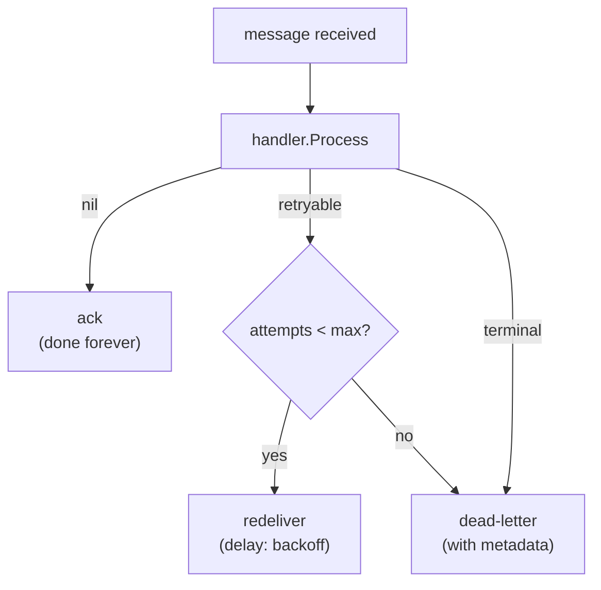

# Patterns that survive every broker

## Why Does This Matter?

Retries, dead letters, idempotency, and ordering are properties of
your *design*, and the broker either supports them or forces you to
reimplement them. Teams that learn these patterns on one broker tend
to reimplement them badly on the next because the vocabulary changed
("dead-letter exchange" vs "DLQ topic" vs "advisory"). This chapter
names the patterns once, broker-agnostically, and the example package
implements them in ~150 lines of in-memory broker that behave like
all of them.

## Mental Model

The consumer loop, whatever the transport:



The contract the loop enforces, and the four decisions inside it:

1. **Classification drives the path**: terminal errors skip retries
   (a malformed message will fail forever; retrying is a bug),
   retryable errors go around ([05 Section 2](../05-errors/02-error-design.md)'s
   classification, [18 Section 3](../18-kafka-with-go/03-producer-consumer.md)'s
   `Terminal()` marker).
2. **Redelivery carries attempt count**: without it, "retryable"
   means infinite; the count is a header/attribute in every real
   broker (`x-death` in RabbitMQ, `Deliver` in JetStream, your own
   header on Kafka).
3. **The DLQ is a promise about metadata**: it must carry the
   original message, the error, the attempt count, and the first-
   failure timestamp. A DLQ you cannot triage is a trash can.
4. **Ack is the only "done"**: until ack, redelivery is allowed; the
   consumer's idempotency is what makes that safe (below).

## Syntax / API: the minimal broker's consumer loop

The example package's loop, which is the portable shape:

```go
// Consume drains the queue through the handler with the full
// retry/DLQ policy. It IS the redeliver semantics of every broker.
func (b *Broker) Consume(ctx context.Context, queue string, h Handler) error {
	for {
		select {
		case <-ctx.Done():
			return ctx.Err()
		default:
		}
		msg, ok := b.next(queue) // oldest visible message, if any
		if !ok {
			return nil
		}
		err := b.handle(ctx, h, msg) // recovers handler panics
		switch {
		case err == nil:
			// ack: done forever; the queue model keeps no record
		case IsTerminal(err):
			b.dead(queue, msg, err) // no retry: it will fail forever
		default:
			// retryable: park for backoff, or DLQ at max attempts
			if msg.Attempts >= b.maxAttempts {
				b.dead(queue, msg, fmt.Errorf("max attempts (%d) reached: %w", b.maxAttempts, err))
				continue
			}
			b.redeliver(queue, msg, err) // attempts+1, backoff doubles
		}
	}
}
```

Note what the loop does *not* do: it does not sleep-retry inline
(the redelivery goes back through the queue, so concurrent consumers
share the load and the backoff is scheduling, not blocking), and it
does not log-and-continue silently (every dead-lettered message has
a reason attached).

## Idempotency: the claim, once more, in context

At-least-once delivery (chapter 1's DNA table) means the handler
runs more than once per logical message; the claim-store pattern
from [15 Section 4](../15-microservices/04-idempotency-sagas-outbox.md) and
[18 Section 3](../18-kafka-with-go/03-producer-consumer.md) is the shared
answer. The broker-agnostic rules:

- **The key namespace travels in the message** (header/attribute):
  `idempotency_key` produced by the sender, claimed by the consumer.
  One key from HTTP through broker to effect
  ([25 Section 3](../25-fintech-with-go/03-integrity-and-exactly-once.md)'s
  threading rule).
- **Missing key = terminal**: an unkeyed message cannot be made
  idempotent after the fact; reject it at the door ([18 Section 3](../18-kafka-with-go/03-producer-consumer.md)'s
  `ErrMalformed` decision, worth restating because every team rediscovers it).
- **The claim store is the storage tier** ([16 Section 5](../16-distributed-systems/05-delivery-backpressure-shedding.md)'s
  two tiers): an in-memory dedupe accelerates; the constraint
  guarantees.

## Ordering: the promise you can keep

Per-key ordering survives exactly one concurrent consumer per key
([16 Section 4](../16-distributed-systems/04-quorums-sharding.md)'s shard-key
rules). The broker mappings:

| Broker | The per-key mechanism |
|---|---|
| Kafka | key → partition; one consumer per partition ([18 Section 1](../18-kafka-with-go/01-kafka-concepts.md)) |
| RabbitMQ | single active consumer per queue, or Consistent Hash exchange per key |
| JetStream | partitioned stream, ordered consumer per partition |
| SQS | FIFO queue with message-group ID |

The pattern that survives: **partition/ordering-key by aggregate ID
(order, account, user)**, sized to avoid hot keys, and the consumer
that processes one key's messages serially. Retries interact badly
with ordering everywhere: a redelivered message arriving while its
successor is processing inverts the order. The mitigations, in cost
order: per-key processing locks in the consumer; in-order retry
queues (park the retry *behind* the successor); or accept and
document that retries may reorder (fine when the effect is
idempotent and order-insensitive: most effects are).

## Basic Example: what the in-memory broker pins

The example package's `Broker` implements the queue model's
semantics with the portable vocabulary:

```go
broker := messaging.NewBroker()
broker.Publish("orders", messaging.Message{
	ID:              "m1",
	IdempotencyKey:  "order:48123:charge",
	Attempts:        0,
	Value:           payload,
})

broker.Consume(ctx, "orders", handler)
// handler returns nil      -> acked, gone
// returns retryable err    -> redelivered after backoff, Attempts+1
// returns Terminal(err)    -> broker.Dead(queue) with failure metadata
```

Its tests pin the contract: redelivery with incremented attempts,
DLQ exactly at `MaxAttempts` with the error and timestamp attached,
panicking handlers dead-lettered immediately (recovered, marked
terminal), duplicate deliveries collapsed by the idempotent handler
(the claim-store fake), and ordering per key preserved. Those five
assertions are the transport-independent surface that the
RabbitMQ/JetStream adapters in chapter 2 must also pass (their
integration tiers do exactly that).

## Real-World Example: reading a broker's docs through these patterns

Any new broker (Redis Streams, Pulsar, Kinesis) decomposes into the
same four questions, and the docs answer them directly:

1. **Redelivery**: what happens to an unacked message? (visibility
   timeout, requeue, consumer restart)
2. **Attempt visibility**: can the consumer see how many times this
   message has been delivered? (headers, delivery count API)
3. **DLQ mechanics**: is there a first-class DLQ, or do you build it
   from max-attempts + publish?
4. **Per-key ordering**: what is the partitioning/sharding key, and
   what serializes per key?

If the docs cannot answer all four, the gaps are your design work,
and knowing that *before* adopting beats discovering it in an
incident.

## Production Example: the operations these patterns enable

- **Replay from DLQ**: triage the metadata (error class, attempt
  count, timestamp), fix the cause, republish through the same
  producer path with the *same idempotency keys*: the claims make
  reprocessing safe even if some originals succeeded
  ([18 Section 3](../18-kafka-with-go/03-producer-consumer.md)'s replay
  discipline).
- **Backpressure through prefetch**: bound in-flight per consumer
  ([16 Section 5](../16-distributed-systems/05-delivery-backpressure-shedding.md));
  the redelivery mechanism is the safety net for the work you shed.
- **Alerting on the DLQ's shape**: a sudden DLQ rate change is the
  schema/dependency alarm ([20-observability](../20-observability/)
  when it ships); a DLQ nobody charts is a graveyard.

## Common Mistakes

- **Inline sleep-retries in the handler**: blocks the consumer,
  serializes the queue, and turns backoff into dead time. Redeliver
  through the broker; the queue is the scheduler.
- **DLQ without metadata**: the message arrived broken and you kept
  only the body. Attach error, attempts, timestamps, and the
  original destination.
- **Retrying terminal failures**: every malformed message retried
  `max` times is 5x the load for zero effect; classification is the
  cheap fix ([05 Section 2](../05-errors/02-error-design.md)'s table).
- **Idempotency key generated by the consumer**: two consumers of
  the same message generate different keys; the key belongs to the
  *logical operation* and travels with the message.
- **Ordering asserted across concurrent consumers without per-key
  discipline**: "it usually works" is the test suite passing by
  timing.

## Idiomatic Go

- The `Handler`/`Terminal()` contract shared with
  [18 Section 3](../18-kafka-with-go/03-producer-consumer.md): one
  classification vocabulary across brokers.
- Broker internals (ack/redeliver/DLQ) unexported; the queue's
  semantics visible through the constructor options
  (`WithMaxAttempts`, `WithBackoff`).

## Performance Considerations

- Backoff during redelivery consumes queue capacity: a poison
  message cycling at max attempts is throughput noise; the DLQ ends
  it ([16 Section 5](../16-distributed-systems/05-delivery-backpressure-shedding.md)'s
  shedding logic in miniature).
- Batch fetch/ack where the broker offers it ([18 Section 4](../18-kafka-with-go/04-observability-tuning.md)'s
  tuning generalizes), but never batch the *claim* store write per
  message away: dedup correctness first, throughput second.

## Concurrency Considerations

- The redelivery race: two consumers, one message's original and
  redelivery in flight: the idempotency claim decides, which is its
  real job ([08 Section 4](../08-concurrency/04-sync-primitives.md)'s
  single-winner principle at the storage layer).
- Graceful drain: stop fetching, finish in-flight handlers, ack,
  then exit ([12 Section 5](../12-http-networking/05-graceful-shutdown.md)'s
  lifecycle; [18 Section 1](../18-kafka-with-go/01-kafka-concepts.md)'s
  rebalance drain in queue form).

## Security Considerations

- DLQs contain the failed message *plus* context: they inherit every
  sensitivity of the original payload, live longer, and are read by
  humans. Access controls and retention on DLQs match (or exceed)
  the source queue's ([21-security](../21-security/) when it ships).

## Testing Strategy

- The example's five assertions (ack, redeliver+attempts, DLQ at
  max, dedup collapse, per-key order) are the portability suite:
  run them against every adapter in the integration tier.
- Fault tiers: handler panics (recovered, dead-lettered), storage
  down (retryable storm, then breaker [15 Section 3](../15-microservices/03-resilience-patterns.md)),
  poison messages (terminal, isolated in the DLQ).

## Interview Questions

1. Name the four decisions inside the consumer loop and what each
   decides.
2. Why must the idempotency key be produced by the sender? What
   breaks when the consumer generates it?
3. How do retries interact with ordering, and what are the three
   mitigations in cost order?
4. What metadata makes a DLQ triageable, and where does each item
   come from?
5. Evaluate an unfamiliar broker in five minutes: which four
   questions do you ask the docs?

## Practice Exercises

1. Extend the example broker with an in-order retry queue: a failed
   message parks behind its key's successor; write the test that
   fails with plain redelivery and passes with the park.
2. Port the five-assertion suite to RabbitMQ or JetStream; list
   which assertions needed broker config vs consumer code.
3. Break the poison-message path deliberately (terminal error
   retried) and measure the throughput cost; then fix with
   classification and re-measure.

## Further Reading

- [RabbitMQ reliability + dead-letter](https://www.rabbitmq.com/docs/dlx)
- [JetStream delivery semantics](https://docs.nats.io/nats-concepts/jetstream/terminology)
- [The claim-store pattern](../15-microservices/04-idempotency-sagas-outbox.md)
