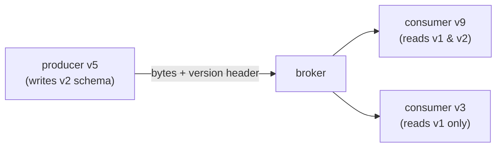

# Schemas, evolution & choosing well

## Why Does This Matter?

Messages outlive the code that produced them: today's events sit in
Kafka's retention (or yesterday's archive) waiting to be read by
next year's consumer. Without a schema discipline, every consumer
re-derives meaning from bytes, and every producer change risks
silent corruption. This chapter closes the section with the schema
rules (the envelope pattern and registries), the final
choosing-a-messaging-system framework, and the testing strategy that
holds the whole thing together.

## Mental Model

Schema evolution is versioned compatibility between two programs
that deploy independently:



The compatibility directions, named precisely because docs misuse
them:

| Direction | Meaning | Example |
|---|---|---|
| Backward | new consumers read old data | v2 consumer reads v1 events |
| Forward | old consumers read new data | v1 consumer tolerates v2 events |
| Full | both | the safe default for fan-out |

Add-with-default is backward-compatible; tolerate-unknown-fields is
forward-compatible; together they are full, and they are what lets
producers and consumers deploy in any order (the whole reason
messaging decouples teams).

## How It Works: the envelope pattern, without a registry

The envelope from [18 Section 3](../18-kafka-with-go/03-producer-consumer.md),
stated as the portable rule:

```json
{
  "version": 2,
  "type": "payment.captured",
  "payload": { "order_id": "48123", "amount_minor": 4200 }
}
```

- **`version` on every message**, checked at decode: unsupported
  version = terminal error (the DLQ), never a silent misread.
- **`type` names the schema**: one topic can carry several event
  types; the consumer dispatches on type, not on topic gymnastics.
- **Payload evolves additively**: new fields get zero-value
  tolerances on the consumer side; renames are add-then-remove with
  a window ([13 Section 3](../13-databases/03-pooling-drivers-migrations.md)'s
  expand/contract applied to wire formats).
- **Units and types in field names** (`amount_minor`): the mistake
  the compiler cannot catch ([25 Section 1](../25-fintech-with-go/01-money-and-payments.md)'s
  money rules).

The envelope is the manual discipline; a **schema registry**
(Confluent's for Avro/Protobuf, or Buf's schema registry) is the
enforced version: producers register and the broker/registry rejects
incompatible writes, consumers fetch by ID. The decision: a fleet
with many producers/consumers per topic earns a registry; a service
with a handful of typed envelopes can carry the discipline in code
and CI (the compat tests of [15 Section 2](../15-microservices/02-boundaries-and-contracts.md)'s
contract checking).

## Basic Example: the evolution test

The test that makes evolution real instead of aspirational:

```go
// TestConsumer_ReadsOlderVersion pins backward compatibility: a v1
// payload must process through the current handler.
func TestConsumer_ReadsOlderVersion(t *testing.T) {
	v1Payload := []byte(`{"version":1,"type":"payment.captured",
		"payload":{"order_id":"48123"}}`)

	err := handler.Process(t.Context(), Message{
		Headers:        map[string]string{"idempotency_key": "order:48123:cap"},
		Value:          v1Payload,
	})
	if err != nil {
		t.Fatalf("v1 payload rejected by current consumer: %v", err)
	}
}
```

Every schema change ships with one new row in this table (v1 ok, v2
ok, v3-unknown → terminal): the compatibility promise becomes CI, and
the promise survives team memory. The same table pattern drives the
broker adapters' integration tiers (ch. 2's portability suite).

## Real-World Example: the final choosing framework

The section's accumulated questions, as one page:

1. **Model per flow** (ch. 1): work, news-with-history, ephemeral news?
2. **Ordering scope** (ch. 3 + [16 Section 4](../16-distributed-systems/04-quorums-sharding.md)):
   per aggregate key; hot keys sized for?
3. **Delivery honesty** (ch. 3): at-least-once accepted, dedup
   tiered, DLQ triageable?
4. **Schema governance** (this chapter): envelope in code or registry
   enforced; who owns compatibility CI?
5. **Operations** (ch. 2): self-hosted expertise vs managed budget;
   the cluster is a product you operate.
6. **Failure containment** ([16 Section 1](../16-distributed-systems/01-failure-model-cap-pacelc.md)'s
   matrix): what happens to each flow when the broker is down? (The
   outbox answers for publishing; shedding answers for consuming.)

A team that writes these six answers per flow has made the decisions
that outlive broker fashion; the broker choice becomes the
implementation detail it always should have been.

## Production Example: the section's example in context

`examples/` (the in-memory broker with retries, DLQ, and idempotent
consumption) is the executable version of this whole section: the
portable patterns from ch. 3, the envelope versioning from this
chapter (its handler rejects unknown versions as terminal), and the
two-tier testing story (model tests in CI; broker adapters verified
in integration tiers, [18](../18-kafka-with-go/)'s pattern). When a
real broker is added, the handler and its tests move unchanged: that
is the portability claim, demonstrated rather than asserted.

## Common Mistakes

- **No version field**: the first schema change is an incident, and
  the rollback is impossible because you cannot tell which schema a
  message carries.
- **Unknown-version tolerance**: silently decoding an unknown
  version with defaults fabricates data. Unknown = terminal, loudly.
- **Renaming fields**: rename is remove + add; consumers between the
  deploys read neither. Alias (dual-write both names) for a window
  instead.
- **A registry nobody gates**: the registry's value is enforcement;
  a registry with `compatibility: NONE` is a museum.
- **Schema governance by team folklore**: "just add fields with
  omitempty" omits the zero-value contract; the meaning of absent is
  part of the schema ([12 Section 3](../12-http-networking/03-json-and-rest-apis.md)'s
  omitempty warning, at wire-protocol stakes).

## Idiomatic Go

- One `Envelope` type per section of the system, versioned
  constants, a `decode()` that switches on version: the dispatch is
  boring and complete.
- Compat tables in `_test.go` files next to the handler: the
  promise's home is the test.

## Performance Considerations

- Schema registries add a fetch per decode (cached): negligible next
  to the network hop; batch fetch where offered.
- Binary schemas (protobuf/Avro) halve payload sizes at fleet scale
  ([15 Section 2](../15-microservices/02-boundaries-and-contracts.md)'s
  comparison); JSON envelopes are fine until bytes are the bill.

## Concurrency Considerations

- Producers of different schema versions write concurrently during
  any transition: consumers must handle *mixed-version batches*, not
  per-version streams ([18 Section 1](../18-kafka-with-go/01-kafka-concepts.md)'s
  partition realities).

## Security Considerations

- Payloads are PII carriers with long retention: schema review is
  privacy review ([25 Section 4](../25-fintech-with-go/04-risk-and-compliance.md));
  DLQ retention multiplies exposure (ch. 3's DLQ security note).

## Testing Strategy

- The evolution table (v1/v2/unknown) per message type, in CI.
- Round-trip tests: encode with the current producer, decode with
  every supported consumer version ([10 Section 1](../10-testing/01-fundamentals.md)'s
  table-driven shape).
- The two-tier broker strategy (ch. 2): model tests against the
  in-memory broker; adapter semantics tests build-tagged against
  real brokers.

## Interview Questions

1. Backward vs forward compatibility, precisely, with the deploy
   order each enables.
2. Walk through adding a field to a heavily consumed event: every
   step, including the consumer-side tolerance.
3. Why is an unknown schema version a terminal error, not a skip?
4. Registry vs envelope-in-code: the decision inputs and the failure
   mode of each.
5. Present the six-question framework for a new flow and defend one
   controversial row.

## Practice Exercises

1. Add v2 to the example's envelope (new field, new meaning) and
   write the three-row evolution table test; then attempt the rename
   version and document what breaks.
2. Stand up Buf (or a Confluent registry) over one topic and wire
   the CI compatibility check; list what the enforcement caught that
   review would not have.
3. Write the six-question framework for your current project's
   messaging; mark the rows that are currently "we'll figure it out."

## Further Reading

- [Confluent Schema Registry concepts](https://docs.confluent.io/platform/current/schema-registry/index.html)
- [Buf schema management](https://buf.build/docs/breaking/overview/)
- [The envelope implementation](../18-kafka-with-go/03-producer-consumer.md)
