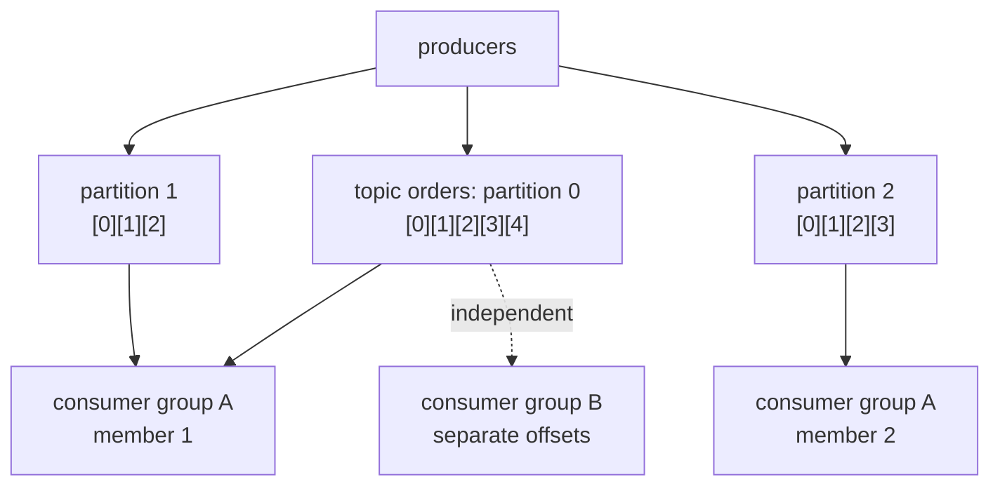

# Kafka concepts

## Why Does This Matter?

Kafka is not "a queue with better marketing." Its log-based model gives
properties no queue can: replayability, ordering *within* partitions,
and multi-consumer fan-out without consuming messages. Using it like a
queue is the #1 design error; understanding the log is the antidote.

## Mental Model

A **log** is an append-only, ordered sequence. A **topic** is a log
split into **partitions**: each an independent, totally-ordered log
with its own offsets:

Four facts generate almost every design decision:

1. **Ordering exists only within a partition.** Across partitions,
   nothing. (More precisely, within a *key→partition* stream.)
2. **One partition is consumed by one member of a group**: parallelism
   ceiling = partition count.
3. **Consumers track offsets**: positions, stored in Kafka. Committing
   advances the position; that's how "where was I" survives restarts.
4. **Messages are not deleted on consumption**: the log retains by age/
   size; other groups can read independently.

## How it works: brokers, replication, ISR

- **Brokers** store partitions. A partition has one **leader** broker
  (serves reads/writes) and replicas on other brokers.
- **ISR (in-sync replicas)**: replicas caught up to the leader. Writes
  are durable when they reach the ISR count you configured
  (`min.insync.replicas`) with the producer's `acks=all`.
- **Failover**: a leader dies → a replica promotes; producers/consumers
  re-discover (metadata refresh). Your code must tolerate
  `NotLeaderForPartition`-style transient errors: clients do this for
  you, but *retryability is why idempotency exists*.

## Offsets and consumer groups: the operational heart

A group is a set of members sharing the partitions among them:

- **Rebalance**: membership changes (join/leave/crash/heartbeat timeout)
  → partitions are reassigned. During rebalances, consumers pause; a
  rebalance storm (members churning) is a classic production outage.
- **Offset commit**: consumers commit position per partition. Two
  strategies, with different failure semantics:

| Strategy | On crash you... | Cost |
|---|---|---|
| Commit after each message | may reprocess *one* message | commit per message: slow, more broker load |
| Commit processed batches (auto-commit off) | may reprocess the whole uncommitted batch | fast; **consumers must be idempotent** |

The second strategy + idempotent consumers is the production default.
It is exactly at-least-once delivery, embraced deliberately.

## Delivery semantics: the honest table

| Semantics | Reality |
|---|---|
| At-most-once | commit-before-process; you may *lose* messages on crash. Rarely acceptable. |
| At-least-once | process-then-commit; you may *duplicate* on crash. The default; requires idempotent consumers. |
| Exactly-once | **Not a transport property alone.** Achievable end-to-end: idempotent consumers, or Kafka transactions (consume-transform-produce within one transaction, EOS mode) with consumers reading committed-only. Costly; most systems choose at-least-once + idempotency keys. |

The fintech section ([25-fintech-with-go](../25-fintech-with-go/))
builds the idempotency machinery; chapter 3 wires it into consumers.

## Keys and partitioning

Producers choose partitions: explicitly, by key hash (default:
murmur2(key) % partitions), or round-robin/sticky for keyless.

- **Key = the ordering you promise.** `user:{id}` keys order that
  user's events. Random keys spread load but destroy per-entity
  ordering.
- **Hot keys** (one tenant dominating) skew partitions: the same
  cross-tenant problem as rate limiting ([21-security](../21-security/)).
- **Partition count is effectively forever**: changing it breaks
  key→partition mapping (old keys re-map to different partitions,
  breaking ordering retroactively). Choose from throughput math: needed
  rate ÷ per-partition rate, with headroom.

## Retention and compaction

- **Time/size retention**: delete old segments (default 7 days). Logs
  are replay windows, not archives.
- **Compaction**: keep the *latest* value per key: the mode for
  changelog topics ("current state of entity X"). The two coexist per
  topic.

## Schema and evolution

Kafka moves bytes; meaning lives in your schema. The production
standard is **Schema Registry** (Avro/Protobuf/JSON Schema) with
compatibility rules enforced server-side. The evolution rules that
matter to Go engineers:

- Add fields with defaults; never remove/rename without a compatibility
  plan (aliases, dual-read).
- Consumers must tolerate unknown fields (forward compatibility): this
  is why protobuf/Avro beat JSON struct-mapping for wire contracts.

Chapter 3 shows the envelope pattern that keeps schema evolution
survivable even without a registry.

## Common Mistakes

- **Using Kafka as a work queue**: unbounded keyless topics, message-
  level acks, no replay. Works until you need ordering or reprocessing.
- **Partition count chosen for today's throughput**: see the "forever"
  note; start with more than you need (e.g., 12-24 for a real service).
- **Auto-commit enabled with slow processing**: offsets advance past
  processing; a crash loses work. Auto-commit is for at-most-once
  (rarely what you want).
- **Assuming ordering across partitions**: the classic bug: two events
  for one user land on different partitions; the consumer processes
  them reversed.
- **Treating rebalances as free**: they pause consumers; long
  processing times beyond `max.poll.interval` cause rebalance loops.

## Idiomatic Go (Kafka-shaped)

- Design consumers around the [stage-5 job processor](../08-concurrency/examples/05-jobprocessor/)
  shape: bounded intake, worker pool per partition, retries with
  backoff, graceful drain on rebalance/shutdown.
- Keep transport (Kafka client) out of domain logic: the handler
  interface takes messages, not client types. This section's examples
  demonstrate the split.

## Performance Considerations

- Throughput lives in batching: producer linger/batch-size trade latency
  for throughput; consumers scale with partitions × fetch size.
- Compression (`zstd`/`lz4`) is nearly free CPU-wise for JSON-ish
  payloads: turn it on before scaling brokers.
- Per-partition processing in Go: one worker per partition preserves
  ordering with parallelism; the fan-out patterns in
  [08-concurrency](../08-concurrency/) apply directly.

## Concurrency Considerations

Rebalances are the concurrency event: on revoke, in-flight work must
finish (or be deliberately abandoned) *before* offsets commit. The
consumer chapter shows the drain-before-commit sequence: it is the
stage-5 Stop() pattern wearing Kafka clothes.

## Security Considerations

- Kafka supports TLS + SASL (SCRAM, mTLS, OAuth). Default-plaintext
  clusters are an internal-network habit that dies on the first audit,
  configure TLS from the start.
- Topics carry business data: apply per-topic ACLs, and keep PII out of
  keys (keys are visible in many admin/monitoring surfaces).

## Testing Strategy

Broker-dependent tests belong behind tags/env-gated skips: this
section's examples show the pattern. Unit-test the *logic* (handlers,
retry policy, idempotency) without Kafka; integration-test the wiring
against a real broker (testcontainers or docker compose). Both tiers
appear in `examples/`.

## Interview Questions

1. *How does Kafka guarantee ordering, and where does it not?*: Within
   a partition only; key-to-partition mapping; partition count changes
   break it.
2. *Walk me through what happens when a consumer in a group of 4
   crashes.*: Rebalance: partition reassignment, offsets resume from
   last commit, reprocessing window = uncommitted work; idempotency
   absorbs it.
3. *Exactly-once: yes or no?*: The honest answer: not as a transport
   property; end-to-end via transactions or idempotent consumers; state
   the cost and the default choice.
4. *You need per-customer ordering but one customer is 60% of
   traffic.*: Hot key discussion: sub-keying, isolation topics, or
   dedicated partitions; the grade is admitting the tradeoff exists.

## Practice Exercises

1. Run Kafka locally (docker compose in this section's examples), create
   a 3-partition topic, produce with keys `a..z`, and observe which
   partition each lands on. Now increase partitions to 6 and re-produce:
   watch keys re-map.
2. Kill a consumer mid-batch (SIGKILL); restart and enumerate exactly
   which messages were reprocessed. Explain the boundary from your
   commit strategy.
3. Design the partition scheme for a payments topic with per-account
   ordering and 10:1 traffic skew; write down the failure mode of your
   choice.

## Further Reading

- [Kafka: the design](https://www.linkedin.com/pulse/apache-kafka-kafkas-design-overview-jay-kreps): Jay Kreps' original rationale
- [Kafka documentation: the semantics](https://kafka.apache.org/documentation/#semantics): delivery guarantees, official
- [Kafka: The Definitive Guide, 2nd ed.](https://www.confluent.io/resources/kafka-the-definitive-guide/): free with registration
