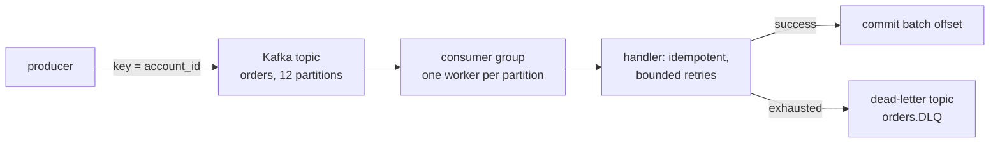

# Producers & consumers in Go

## Why Does This Matter?

The difference between a toy and a production Kafka service is the
envelope around the handler: retries, dead-letter queues, idempotency,
offset discipline on rebalance, and graceful shutdown. This chapter
builds that envelope on the transport-free core from the examples: the
same structure as [08-concurrency's stage 5](../08-concurrency/examples/05-jobprocessor/),
with Kafka-specific semantics layered on.

## Mental Model



The contracts that make this survivable:

- **Producers** key by ordering entity (`account_id`), produce
  idempotently (client-level de-dup on retries), and never block
  forever on a full buffer.
- **Consumers** process-then-commit (at-least-once), so handlers are
  idempotent by construction.
- **Failures after bounded retries** go to a DLQ: with the *original*
  message plus failure metadata, and never block the partition.

## The transport-free core

The handler contract (in `examples/service.go`) knows nothing about
Kafka:

```go
// Message is the transport-neutral envelope.
type Message struct {
	Key     string
	Value   []byte
	Headers map[string]string
}

// Handler processes one message. Returning nil commits progress past
// it; returning a TerminalError skips retries; anything else retries.
type Handler interface {
	Process(ctx context.Context, msg Message) error
}
```

Unit tests exercise this against fake messages; the Kafka wiring (below)
adapts `franz-go` records to `Message` and commits per its policies.
The seam costs two adapter functions and buys client swap-ability
(ch. 02's conclusion).

## Producer: batching, idempotence, backpressure

```go
// examples/producer.go (adapter excerpt)
func NewProducer(brokers []string) *kgo.Client {
	cl, err := kgo.NewClient(
		kgo.SeedBrokers(brokers...),
		kgo.RequiredAcks(kgo.AllISRAcks()),   // durability: wait for all in-sync replicas
		kgo.ProducerBatchCompression(kgo.ZstdCompression()),
		kgo.ProducerBatchMaxBytes(1 << 20),   // 1 MiB batches
		kgo.MaxBufferedRecords(10_000),       // bounded buffer: backpressure surface
		kgo.RecordDeliveryTimeout(15*time.Second),
	)
	if err != nil {
		panic(err) // config errors are programmer errors: fail at startup
	}
	return cl
}

// ProduceWithResult sends and reports the delivery outcome. The callback
// runs on the client's goroutine: park the ctx-aware wait here.
func ProduceWithResult(ctx context.Context, cl *kgo.Client, topic, key string, value []byte) error {
	ch := make(chan error, 1)
	cl.Produce(ctx, &kgo.Record{Topic: topic, Key: []byte(key), Value: value},
		func(r *kgo.Record, err error) { ch <- err })
	select {
	case err := <-ch:
		return err
	case <-ctx.Done():
		return ctx.Err() // caller's budget expired; record stays buffered/aborted per client policy
	}
}
```

Producer semantics worth knowing cold:

- **Idempotent produce** (client default) gives per-partition exactly-
  once *within client retries*: broker de-dups on sequence numbers.
  It does not make *your* flow exactly-once end to end.
- **acks=all + min.insync.replicas=2** is the durability default for
  money-adjacent data; anything weaker trades availability for silent
  loss risk.
- **Buffered-record limits** are your backpressure: when full, produce
  calls block or fail: surface that as a metric and a shed decision
  (stage 4 pattern), never as an unbounded wait.

## Consumer: groups, offsets, the drain-before-commit sequence

```go
// examples/consumer.go (adapter excerpt)
func NewConsumer(brokers, group, topic string, h Handler, logger *slog.Logger) *Consumer {
	return &Consumer{
		client: mustClient(brokers, group, topic),
		group:  group,
		topic:  topic,
		h:      h,
		logger: logger,
	}
}

// Run consumes until ctx is cancelled, then drains cleanly. The
// PollRecords loop is franz-go's; the discipline is the chapter's.
func (c *Consumer) Run(ctx context.Context) error {
	for {
		// Fetch a bounded batch: processing time stays predictable,
		// max.poll budgets stay satisfied.
		fetches := c.client.PollRecords(ctx, 64)
		if fetches.IsClientClosed() || ctx.Err() != nil {
			return ctx.Err()
		}
		fetches.EachError(func(t string, p int32, err error) {
			c.logger.ErrorContext(ctx, "fetch error", "topic", t, "partition", p, "err", err)
		})

		fetches.EachPartition(func(p kgo.FetchTopicPartition) {
			c.processPartition(ctx, p) // per-partition: preserves order within it
		})

		// Commit AFTER the batch processes: at-least-once. On rebalance
		// or shutdown, uncommitted work reprocesses: handlers are
		// idempotent by contract (below).
		c.client.CommitRecords(ctx, recordsOf(fetches)...)
	}
}
```

### Idempotent consumers: the load-bearing piece

At-least-once means duplicates are normal. The handler de-dups with the
envelope's identity:

```go
// examples/service.go: the idempotency gate
func (s *OrderService) Process(ctx context.Context, msg Message) error {
	id := msg.Headers["idempotency_key"]
	if id == "" {
		return fmt.Errorf("missing idempotency_key: %w", ErrMalformed)
	}

	// Claim idempotently: INSERT ... ON CONFLICT DO NOTHING in the real
	// implementation; the map+mutex here mirrors the contract for tests.
	inserted, err := s.claims.Claim(ctx, id)
	if err != nil {
		return fmt.Errorf("claim %s: %w", id, err) // retryable: store issue
	}
	if !inserted {
		return nil // duplicate delivery: already handled; success is the correct answer
	}

	if err := s.apply(ctx, msg); err != nil {
		s.claims.Release(ctx, id) // unclaim so a retry can re-apply
		return err
	}
	return nil
}
```

The claim-apply-release sequence is the whole trick: claim before
applying (so concurrent duplicates collapse), release on failure (so
retries can run), and *never* release after success (duplicates then
no-op correctly). The fintech section builds the durable version of
this with the same interface.

### Retries and the DLQ

```go
func (c *Consumer) processPartition(ctx context.Context, p kgo.FetchTopicPartition) {
	for _, rec := range p.Records {
		msg := adapt(rec)
		var lastErr error
		for attempt := 0; attempt < c.maxAttempts; attempt++ {
			err := c.h.Process(ctx, msg)
			if err == nil {
				lastErr = nil
				break
			}
			var term *TerminalError
			if errors.As(err, &term) { // never will succeed: skip retries
				lastErr = err
				break
			}
			lastErr = err
			select {
			case <-time.After(backoff(attempt)):
			case <-ctx.Done():
				return // cancel beats retry; uncommitted → reprocessed later
			}
		}
		if lastErr != nil {
			c.toDeadLetter(ctx, msg, lastErr) // publish + log; partition keeps flowing
		}
	}
}
```

The DLQ record carries the original message *and* failure metadata
(error, attempts, first-seen timestamp) in headers: the DLQ is an
operations surface, not a landfill: alert on its rate
([04-observability-tuning](04-observability-tuning.md)).

### Rebalances and shutdown: the drain

When the group rebalances (or ctx cancels), franz-go revokes
partitions. Your contract: stop accepting, finish in-flight handler
work, *then* commit. The consumer above does this implicitly (commit
after EachPartition completes); explicit version: hook
`kgo.BlockRebalanceOnPoll` and call `client.CommitMarkedRecords` after
drain: is documented in the example file. The invariant matches the
stage-5 processor: **no commit while work is in flight.**

## Serialization & schema evolution: the envelope pattern

```go
// Wire envelope: version first, always.
type Envelope struct {
	Version   int             `json:"v"`
	Type      string          `json:"type"`
	Timestamp time.Time       `json:"ts"`
	Payload   json.RawMessage `json:"payload"`
}
```

- `Version` lets consumers route old/new payloads side by side during
  migrations.
- `json.RawMessage` decodes lazily: consumers parse only the payload
  versions they support; unknown versions go to the DLQ with a clear
  reason.
- Production-grade setups add Schema Registry + Avro/protobuf on top of
  the same envelope logic; the compatibility rules from ch. 01 govern.

## Common Mistakes

- **Committing before processing** (or auto-commit with slow handlers),
  crash loses the in-flight batch: silent at-most-once. The tests in
  `examples/service_test.go` pin the process-then-commit order.
- **Blocking the poll loop on long handlers**: exceed
  `max.poll.interval` and the group kicks you out into rebalance hell.
  Bound batch size; hand long work to a per-partition worker pool only
  if you preserve per-partition ordering.
- **DLQ without metadata**: an error message and the original bytes
  are the minimum; without attempts/timestamps, triage is archaeology.
- **Releasing idempotency claims after success**: then duplicates
  re-apply; the claim table becomes the source of truth for "done."
- **Non-idempotent handlers "because we commit carefully"**: rebalances
  and crashes will duplicate; the design assumption fails at 3 a.m.

## Idiomatic Go

- Client config errors `panic` at startup (programmer error, fail
  fast); runtime delivery errors return/log (operational, recoverable).
- Context flows from the run loop into handlers: cancellation reaches
  the middle of processing.
- The adapter layer stays thin: `adapt(record) Message`,
  `recordsOf(fetches)`: no business logic in transport files.

## Performance Considerations

- Fetch `N` records per poll sized so a batch processes well inside
  poll budgets (the default 64 here is a starting point, not gospel).
- Producer batches (linger ~5-10ms) + zstd give order-of-magnitude
  throughput wins over per-record eager sends; latency-sensitive topics
  tune linger down ([04-observability-tuning](04-observability-tuning.md)).
- Per-partition processing preserves ordering at parallelism =
  partition count; adding more Go workers *within* a partition
  serializes on the offset commit and breaks ordering: don't.

## Concurrency Considerations

Everything from [08-concurrency](../08-concurrency/) applies: the
consumer is a worker pool with a Kafka-shaped queue; cancellation
propagation, bounded buffers, and leak-free drains are the same
contracts. The Kafka-specific addition: partition-ordered processing
with commit barriers: treat the commit as the happens-before edge for
"this work is done."

## Security Considerations

- TLS + SASL (SCRAM-SHA-256 minimum, mTLS where policy allows) from day
  one; clients configure it differently: audit each (ch. 02's parity
  note).
- DLQ and topics replicate data retention rules; PII in payloads needs
  the same lifecycle as your databases (retention, encryption, access
  lists).

## Testing Strategy

The three tiers, all in `examples/`:

1. **Unit** (`service_test.go`): handler contract, idempotency claim/
   release, duplicate collapse: no Kafka, runs everywhere.
2. **Contract** (adapter tests with a fake client): poll→process→commit
   ordering, DLQ on exhausted retries, drain-on-cancel.
3. **Broker** (`broker_test.go`, `-tags=broker`): real group rebalances,
   offset resume after SIGKILL, delivery under partition leadership
   changes. Skips without `KAFKA_BROKERS`.

## Interview Questions

1. *Design a consumer that must never process the same payment
   twice.*: Idempotency claims keyed by idempotency_key, claim-before-
   apply, release-on-failure; the grade is the release-after-success
   trap.
2. *A poison message blocks a partition. Options?*: Bounded retries →
   DLQ; the subtlety: DLQ preserves partition flow, and the alert on
   DLQ rate turns it into signal.
3. *Why commit after the batch instead of per message?*: Throughput vs
   reprocessing window; idempotency covers the window; the interview
   continuation is "when would per-message commit be right?"
4. *How do you survive a rebalance mid-batch?*: Block-on-poll, drain,
   commit-marked-records; map it to the stage-5 Stop() contract.

## Practice Exercises

1. Add schema-version routing to the envelope: v1 consumers process v1
   and DLQ v2 with a clear reason; prove with a test.
2. Implement the explicit BlockRebalanceOnPoll drain in the consumer
   adapter; test it by triggering a rebalance (scale the group) while a
   slow handler runs.
3. Add DLQ replay tooling (read DLQ, re-publish to source with
   original headers preserved): the boring tool that saves your next
   incident.

## Further Reading

- [franz-go docs](https://github.com/twmb/franz-go/tree/master/docs): client semantics, incl. rebalances
- [Kafka: delivery semantics](https://kafka.apache.org/documentation/#semantics): the official contracts
- [Kafka: idempotent producer](https://kafka.apache.org/documentation/#producer_impls): sequence-number dedup
