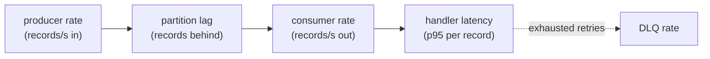
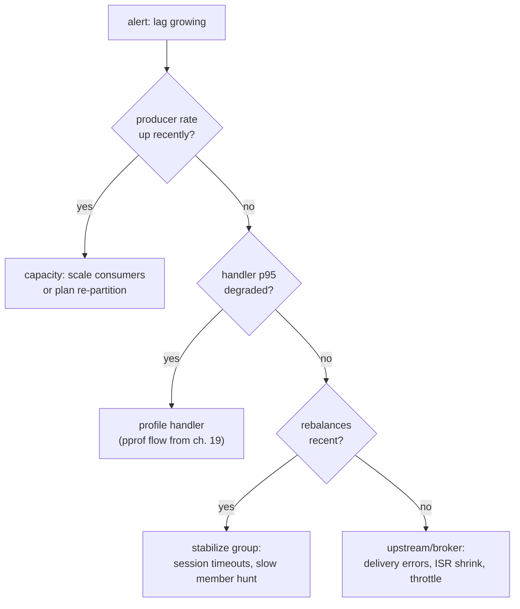

# Observability & tuning

## Why Does This Matter?

A Kafka service fails differently from an HTTP service: the failure is
often *lag*: silently growing distance between producers and
consumers: while every process looks healthy. This chapter defines
what to watch, what to alert on, and which knobs actually move
throughput.

## Mental Model

The consumer group is a pipeline; its health is a queue-depth question:

Two relationships decide everything: consumer rate must meet producer
rate (or lag grows forever), and DLQ rate must be ~0 (or something is
broken upstream or in the handler).

## The metrics that matter

| Metric | Source | Alert shape |
|---|---|---|
| Consumer lag per partition | broker (`kafka.server:type=...`) or client metrics | sustained growth over N minutes |
| Records consumed / produced per second | client instrumentation | sudden drop (silent stall is a failure) |
| Handler latency p95 | in-process (see [20-observability](../20-observability/)) | exceeds a fraction of poll budget |
| DLQ publish rate | your DLQ path | any sustained non-zero |
| Rebalance count / duration | client hooks or broker | more than a few per hour |
| Produce error rate, delivery timeouts | client | any sustained non-zero |

Client-side, franz-go exposes most of this via hooks
(`OnPartitionsAssigned`, `OnPartitionsRevoked`, prometheus-style
`kadm`/metrics integrations). The rule from
[20-observability](../20-observability/) applies: emit the metrics your
runbook answers from; a lag dashboard without a DLQ panel answers half
the incident.

### Lag arithmetic

Lag (records behind) needs interpretation, not just thresholds:

- `lag / consume rate` = **time-to-drain**: the number to alert on
  ("this partition is 40 minutes behind"), not raw counts.
- Steady-state lag ≈ 0; bounded lag after a burst is healthy
  backpressure doing its job; *monotonic growth* is the incident.

## Throughput tuning: the knobs in order

### Producer

1. **Batching**: `linger` (5-10ms) + `batch.max.bytes`: the dominant
   lever; per-record sends leave 10x throughput on the table.
2. **Compression**: `zstd` (best ratio/CPU balance) or `lz4` (fastest);
   broker-side replication then moves fewer bytes.
3. **Buffer bounds**: `max.buffered.records` sized from burst math, not
   vibes; expose buffered-count as a metric: it's your backpressure
   gauge.
4. **Ack level**: `acks=all` for durability-critical; the cost is
   latency, not throughput (pipelining hides it at batch sizes).

### Consumer

1. **Fetch size and partition count**: parallelism ceiling = partitions;
   more Go workers inside a partition don't help (ordering + commit
   serialization).
2. **Handler efficiency**: profile the handler like any hot path
   ([19-performance](../19-performance/)); the consumer loop itself is
   rarely the bottleneck.
3. **Batch size per poll**: enough to amortize commits, small enough
   to stay inside poll budgets (ch. 03's 64 is a starting point).
4. **Compression** on the read side is automatic (broker sends
   compressed); CPU on consumers pays for decompression: budget for it.

### The anti-knobs

- **Increasing partitions to fix consumer throughput**: works only if
  consumers are the ceiling and re-partitioning cost is acceptable;
  usually the handler is the ceiling. Profile first.
- **Turning off compression "to save CPU"**: network and broker
  latency grow; measure the whole pipeline.
- **Bigger fetch sizes to "go faster"**: poll-budget timeouts and
  rebalances follow; ch. 03's bounded-batch rule exists because someone
  learned it the hard way.

## Capacity planning: the back-of-envelope that works

For a topic with producer rate R records/s and handler latency L:

- Required consumer throughput = R × safety factor (1.5-2 for spikes)
- Parallelism needed = throughput ÷ per-worker rate
- Partitions = parallelism (rounded up, with headroom: partitions are
  forever, ch. 01)

Example: R = 5k/s, L = 2ms → one worker does ~500/s → need ~10-15
workers → 15-24 partitions. Write this math down per topic; revisit on
traffic changes.

## Debugging playbook: the incident shapes

Each branch names its evidence source: that's what makes it a playbook
instead of a hunch list.

## Common Mistakes

- **Alerting on raw lag counts**: a partition with 10k messages and
  50k/s drain is fine; one with 10k and 5/s is a fire. Time-to-drain,
  always.
- **No DLQ panel**: the first sign of a schema bug is a DLQ spiking;
  teams without the panel find out from customers.
- **Tuning during an incident**: knobs change behavior gradually;
  stabilize (scale consumers, shed load) first, tune after.
- **Ignoring rebalance storms**: members dying repeatedly (often
  OOM-killed slow handlers) look like "flaky consumers"; the fix is the
  handler, not the client config.

## Idiomatic Go

- Instrument at the seams you own: the handler (latency), the DLQ path
  (rate), the commit (batch size): client-internal metrics complement,
  never replace, these.
- Keep the metrics interface in `service.go` transport-free (counters
  passed in), so unit tests assert metric behavior without Kafka: the
  same seam discipline as everything else in this section.

## Performance Considerations

This chapter *is* the performance tuning one for Kafka; the general
performance section's methodology (measure, change one thing, benchstat)
applies to consumers verbatim: the load is the broker, the benchmark
is the lag graph.

## Concurrency Considerations

Rebalance events are concurrency events: metrics on their frequency
and duration belong next to your GC pause metrics: both are "stolen
time" the pipeline pays. The concurrency section's
scheduler-latency framing maps directly.

## Security Considerations

- Metrics endpoints and admin surfaces (kafka-ui, kcat) expose topic
  names and payloads; protect them like pprof
  ([21-security](../21-security/)).
- ACL review is part of capacity review: consumer groups, read/write
  per topic: the least-privilege check belongs in the same doc as the
  lag math.

## Testing Strategy

- Load-test with production-shaped keys (hot-key tests reveal
  partitioning skew before production does).
- Chaos tier: SIGKILL consumers mid-batch (contract tests in ch. 03),
  broker leader rotation, network partitions: assert lag drains and no
  double-apply (idempotency holds).
- The broker-tagged tests in `examples/` are the seed of this tier;
  CI wiring comes with [22-production-go](../22-production-go/).

## Interview Questions

1. *Consumer lag is growing; walk me through it.*: The playbook tree;
   grade on asking for producer-rate history before touching configs.
2. *You need to double throughput on a topic. Options?*: Handler
   profile → consumer scale → batching knobs → partitions, in cost
   order; the partition answer comes with its "forever" caveat.
3. *What would you put on the Kafka service dashboard?*: Lag/time-to-
   drain, consume/produce rates, handler p95, DLQ rate, rebalance
   count; the candidate who adds produce-error rate shows the scar.

## Practice Exercises

1. Compute time-to-drain in a small consumer and export it; run a
   2-minute stall and verify the alert math fires on time-to-drain, not
   raw lag.
2. Load-test a producer at linger 0/5/25ms and measure throughput +
   p99 produce latency; plot the tradeoff your numbers show.
3. Kill a consumer during load; measure rebalance pause and lag
   recovery time with and without the drain-before-commit ordering.

## Further Reading

- [Kafka monitoring docs](https://kafka.apache.org/documentation/#monitoring): the broker metric list
- [franz-go client metrics](https://github.com/twmb/franz-go): hooks and stats surfaces
- [RED method](https://grafana.com/blog/2018/08/02/the-red-method-how-to-instrument-your-services/): the rate/errors/duration framing this chapter extends
