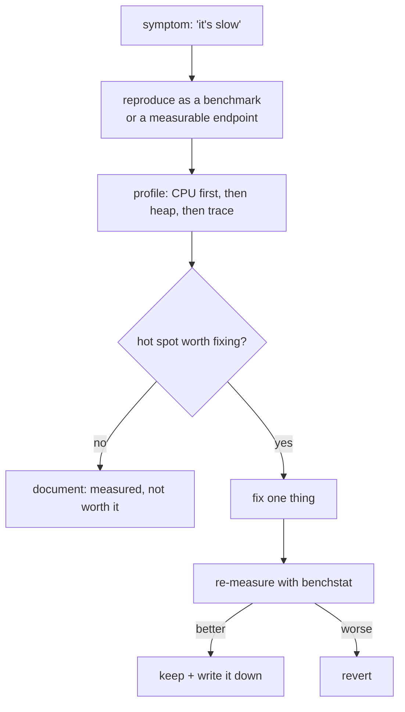

# Measure first

## Why Does This Matter?

Every experienced engineer has a story of a "certain" optimization that
did nothing, or worse, regressed the system. Go makes measurement cheap
enough that guessing is inexcusable: benchmarks are one flag away,
profiles are one endpoint away. The discipline in this chapter converts
"it feels slow" into a ranked list of costs, and a decision about which
are worth fixing.

## Mental Model

Performance work is a loop, and every exit is data:



Two ground truths shape the loop:

1. **The 90/10 rule is real**: profiles routinely show one or two
   functions holding the majority of time. Intuition finds the other 90
   locations.
2. **In Go, allocation rate beats algorithm cost** for typical service
   workloads: GC pressure shows up as p99 latency long before CPU pins.

## Benchmarks that survive scrutiny

```go
var sink Result // defeats dead-code elimination

func BenchmarkProcess(b *testing.B) {
	input := buildInput()      // fixed, realistic input
	b.ReportAllocs()
	b.ResetTimer()
	for b.Loop() {             // Go 1.24+; use `for i := 0; i < b.N; i++` before
		sink = Process(input)
	}
}
```

The four honesty rules:

1. **Fixed, realistic input.** Benchmarks on `[]string{"a"}` measure
   nothing.
2. **Report allocations** (`b.ReportAllocs` or `-benchmem`): the
   allocation column is the first place Go perf problems live.
3. **Use benchstat for comparisons**, never eyeball two runs:
   ```bash
   go test -bench=. -count=10 > old.txt
   # ... change one thing ...
   go test -bench=. -count=10 > new.txt
   benchstat old.txt new.txt
   ```
   benchstat reports the delta with statistical significance; ±2% noise
   is normal on shared machines.
4. **One variable at a time.** If you changed the algorithm AND the
   buffer size, you learned nothing transferable.

## pprof: the primary instrument

Add the import, get the endpoint (dev/staging only unless protected):

```go
import _ "net/http/pprof"

go http.ListenAndServe("localhost:6060", nil) // profile endpoints
```

### CPU profile: where do the cycles go?

```bash
go tool pprof http://localhost:6060/debug/pprof/profile?seconds=30
# or from a saved file: go tool pprof cpu.out
(pprof) top10          # hottest functions
(pprof) list Process   # line-level costs in one function
(pprof) web            # flame graph in browser (needs graphviz)
```

Read `top` bottom-up: the `flat` column is time in the function itself;
`cum` includes callees. A function with low flat but huge cum is a
dispatcher: its *children* are the problem.

### Heap profile: who allocates, who holds?

```bash
go tool pprof http://localhost:6060/debug/pprof/heap
(pprof) top                     # allocation sites (inuse = live memory)
(pprof) sample_index=alloc_objects   # allocation *count* instead of bytes
```

`inuse_space` answers "what is holding memory" (leaks, caches);
`alloc_space` answers "what churns memory" (GC pressure). Both matter,
for different symptoms.

### Goroutine profile: leak triage

```bash
curl localhost:6060/debug/pprof/goroutine?debug=1
```

Hundreds of identical stacks = goroutines parked at the same line: the
leak or the contention. The concurrency chapter's pitfall runbook uses
this as step one.

### Execution trace: the time dimension

```bash
curl localhost:6060/debug/pprof/trace?seconds=5 > trace.out
go tool trace trace.out
```

pprof shows *where*; the trace shows *when*: scheduling delays, GC
pauses inline with work, syscall stalls. Use it when pprof says "nothing
is hot" but latency is still bad: the answer is usually waiting, not
computing.

## Load measurement: the other half

A fast handler under 10 RPS proves nothing about the p99 that pages you.
Measure under realistic concurrency:

- `hey`, `wrk`, or `vegeta` for HTTP: watch p50/p95/p99, not the mean.
- In-code: `b.RunParallel` benchmarks model concurrent access.
- Correlate load-test periods with profile windows: profile *during*
  the load, not after.

## Basic Example: a real measurement from this repo

The [10-testing benchmark clinic](../10-testing/04-benchmarks-coverage-fuzzing.md)
contains the string-join comparison. Real output from this machine:

```text
BenchmarkStringJoin/bad-8      5194359    212.5 ns/op      64 B/op    9 allocs/op
BenchmarkStringJoin/good-8    14935488     80.18 ns/op     24 B/op    2 allocs/op
BenchmarkStringJoin/bad-8@100  205551   5819 ns/op       9744 B/op   99 allocs/op
BenchmarkStringJoin/good@100  1796380    671.1 ns/op      504 B/op    6 allocs/op
```

At size 10 the "fix" buys 2.6x; at size 100 it buys 8.7x; at size 1000,
92x. The lesson cuts both ways: the cost of the *bad* pattern is
input-dependent, and the value of the *fix* is too. Benchmarks without
size/context are half-truths.

## Common Mistakes

- **Optimizing without a reproducible benchmark**: you cannot re-measure
  a vibe; if the next contributor can't run it, it isn't evidence.
- **Profiling dev laptops and shipping conclusions**: CI runners,
  containers (CPU quotas), and production hardware differ; measure on
  the target class.
- **Reading only `top`**: the interesting story is usually in `list`/
  flame views: one hot line, not one hot function.
- **Optimizing the mean**: users and SLOs live in the tail; a change
  that helps p50 and wrecks p99 is a regression (measure percentiles
  under load).
- **Forgetting the benchmark suite in CI**: benchmarks that aren't run
  rot; a nightly job with benchstat diffs catches regressions
  statistically.

## Idiomatic Go

- Keep a `BENCH.md` (or benchmark file per package) with the current
  numbers of hot paths: history is context for the next decision.
- Names like `BenchmarkProcess10k` encode scale; scales belong in names
  when cost is input-dependent.
- Prefer `-count=10` short runs over one long run for benchstat.

## Performance Considerations

Yes, this chapter is about performance, but the *meta* point stands:
measurement itself has cost. Profile endpoints are internal-only; the
pprof HTTP listener in production must be auth-protected (see
[21-security](../21-security/)), and profiling samples add overhead,
profile on demand, not forever.

## Concurrency Considerations

Contention shows as time *waiting*, invisible to CPU profiles (the CPU
is idle). The instruments: `go test -blockprofile` / `-mutexprofile`
(see the concurrency section), the execution trace's scheduling view,
and runtime/metrics scheduler latency. Chapter 3 covers the patterns.

## Security Considerations

- pprof endpoints leak function names, memory layout hints, and
  goroutine stacks (which may contain secrets in arguments); never
  expose them publicly.
- Load tests against production are a self-DoS; load-test staging with
  production-shaped data volumes.

## Testing Strategy

Benchmarks are tests that assert on distributions: run the suite in CI
nightly, diff with benchstat, and fail the job on statistically
significant regressions in named hot paths. Unit tests stay for
correctness; benchmarks own the cost contract.

## Interview Questions

1. *An endpoint's p99 doubled after a release. Walk me through your
   investigation.*: Grade on: reproduce under load, diff vs previous
   release (profiles + trace), correlation with GC/allocation changes,
   one-variable-at-a-time fixes.
2. *CPU profile is flat: nothing is hot, but latency is terrible.
   What now?*: Waiting time: execution trace, block/mutex profiles,
   upstream latency, scheduling delays.
3. *When is optimization premature?*: When no SLO is threatened, no
   measurement exists, or the code's clarity is the feature being
   traded. Expect the candidate to ask "what's the target and what's
   the current number?"

## Practice Exercises

1. Add pprof to one of your services, capture 30s of CPU under load,
   and write three sentences on the top cost: before changing
   anything.
2. Build a benchmark for a function you believe is slow; run
   `-count=10` and benchstat two implementations. Report the p-value.
3. Capture an execution trace during a latency spike and identify one
   scheduling or GC stall; map it to a mitigation (GOMEMLIMIT, batch
   size, pool).

## Further Reading

- [Profiling Go Programs](https://go.dev/blog/pprof): the canonical pprof walkthrough
- [Diagnosing performance problems](https://go.dev/blog/perf-related-talks): talk collection
- [benchstat](https://pkg.go.dev/golang.org/x/perf/cmd/benchstat): the comparison tool
