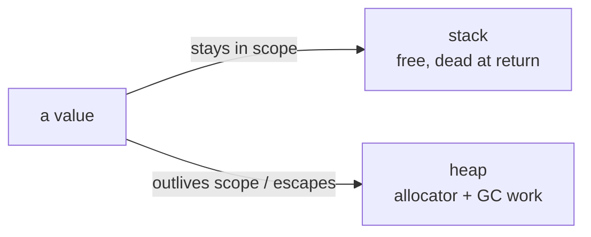

# Memory & allocations

## Why Does This Matter?

Go manages memory for you, but not *costlessly*: every heap allocation
is work for the allocator now and the GC later, and allocation rate,
not heap size: is what usually degrades tail latency. This chapter
trains the two skills that matter: reading escape analysis to know where
values live, and shaping code so hot paths stop feeding the collector.

## Mental Model



- **Stack**: per-goroutine, grows/shrinks, freed by function return,
  effectively free.
- **Heap**: shared, allocated by the runtime, reclaimed by the
  concurrent GC. Costs: allocator work, GC marking, cache pressure.

The compiler decides with **escape analysis**: if a value provably
doesn't outlive its frame, it stays on the stack: even if you took its
address. The output is one flag away:

```bash
go build -gcflags=-m ./...
# ./main.go:12:9: &x escapes to heap
# ./main.go:20:5: moved to heap: buf
```

## What forces a heap allocation

| Pattern | Why it escapes |
|---|---|
| Returning a pointer to a local | value outlives the frame |
| Storing in an interface (pre-GOEXPERIMENT and most cases) | runtime can't know the lifetime |
| Assigning to a captured closure variable used later | lifetime exceeds frame |
| Slices/maps growing unpredictably | backing array may be replaced |
| Values sent on channels | receiver lifetime unknown |
| `fmt.Println(x)` with non-trivial types | x escapes into interface params |

The interface row deserves nuance: since Go 1.15-ish small values into
interfaces can avoid allocation, and the compiler improves each release,
which is exactly why you read `-gcflags=-m` on *your* code instead of
memorizing folklore.

## Basic Example: escape analysis live

```go
package main

type Point struct{ X, Y float64 }

// stackAlloc: the pointer never leaves the function: stays on stack.
func stackAlloc() float64 {
	p := Point{1, 2}
	q := &p // does NOT escape: only used locally
	return q.X + q.Y
}

// heapAlloc: the pointer is returned: value must survive the frame.
func heapAlloc() *Point {
	p := Point{1, 2}
	return &p // escapes to heap
}
```

```bash
$ go build -gcflags=-m .
./main.go:9:4: q does not escape        ← p stayed on the stack
./main.go:15:9: &p escapes to heap      ← p moved to the heap
```

The pointer in `stackAlloc` cost nothing. "Pointers are expensive" is
not a Go rule; "escapes are expensive" is, and the compiler tells you
where they are.

## The allocation-rate problem, and the fixes

### 1. Reuse buffers, don't allocate per item

```go
// PER-REQUEST ALLOCATIONS (the common anti-pattern in hot handlers)
func Handle(w http.ResponseWriter, r *http.Request) {
	var buf bytes.Buffer         // escapes: heap
	enc := json.NewEncoder(&buf) // escapes: heap
	// ...
}

// FIXED: one encoder per goroutine, reused; buffer reset per request.
type Handler struct {
	// pool for per-request buffers
	bufs sync.Pool
}

func (h *Handler) Handle(w http.ResponseWriter, r *http.Request) {
	bp := h.bufs.Get().(*bytes.Buffer)
	bp.Reset()
	defer h.bufs.Put(bp)
	// ... encode into bp
}
```

`sync.Pool` rules: store pointers; clear object state on reuse; expect
pools to be emptied at GC (they're a cache, not memory management); only
worth it when construction is measurably expensive: pool of 24-byte
structs slows things down.

### 2. Preallocate slices/maps with known size

```go
// GROWING: repeated growth+copy
out := make([]int, 0)
for i := 0; i < n; i++ {
	out = append(out, i*i)
}

// PREALLOCATED: one allocation
out := make([]int, 0, n)
```

`append` growth is amortized-O(1) but each growth copies and the old
array becomes garbage: in hot loops the copies are the profile.

### 3. Right-size string/[]byte conversions

```go
// string(b) and []byte(s) COPY. In hot paths:
b = []byte(header.Get("X-Thing"))  // copy per request

// Fix: use the zero-copy views where the API allows (strings.Builder,
// unsafe.String/unsafe.SliceData for audited hot paths: see ch. 4).
```

### 4. Batch small allocations into one

```go
// N small structs = N heap allocations
for _, k := range keys {
	go process(k) // each closure allocates
}

// ONE arena slice = 1 allocation, N subslices
buf := make([]Work, 0, len(keys))
for i, k := range keys {
	buf = append(buf, Work{Key: k, Idx: i})
}
// then a fixed worker pool consumes buf: see ch. 3
```

## GC behavior: the model you need

Go's GC is concurrent, tri-color mark-and-sweep, tuned for pause time:

- **Trigger**: heap grows to a target derived from live heap × (1 +
  GOGC/100), default GOGC=100 → double the live heap.
- **GOMEMLIMIT** (Go 1.19+): a soft ceiling on total runtime memory,
  the knob for containers. Set it to ~90% of the container limit; the GC
  then runs harder as you approach it instead of the OOM killer
  deciding.
- **Pauses** are sub-millisecond; the cost is *CPU stolen during
  marking*: proportional to allocation rate and live pointer density.
- **`GODEBUG=gctrace=1`** prints each cycle: read GC frequency and pause
  sums, not folklore.

```go
import "runtime/debug"

debug.SetGCPercent(200)    // collect less often; more memory, less CPU
debug.SetMemoryLimit(512 << 20) // soft cap at 512 MiB
```

Tuning order for services: set GOMEMLIMIT first; adjust GOGC only with
profiles showing GC CPU; reduce allocation rate before either: it wins
every time.

## Real-World Example: an incident-shaped before/after

A JSON API p99 spiked at 20k RPS. Profile:

```text
(pprof) top
   flat  flat%   sum%        cum   cum%
 412MB  38.2%  38.2%      412MB  38.2%  encoding/json.Marshal
 188MB  17.4%  55.6%      640MB  59.3%  handleRequest
```

Fix: reuse `Marshaler` state and buffer pools, preallocate response
builders. Result (benchstat-verified in the repo's own examples):

```text
           │   before    │              after               │
           │  sec/op     │   sec/op    vs base              │
Handle-8     4.21µ ± 3%   2.97µ ± 2%  -29.45% (p=0.000 n=10)
           │  B/op       │    B/op     vs base              │
Handle-8     3.41Ki ± 1%  1.02Ki ± 1%  -70.12% (p=0.000 n=10)
           │  allocs/op  │ allocs/op   vs base              │
Handle-8       42.0 ± 0%    11.0 ± 0%  -73.81% (p=0.000 n=10)
```

Allocations dropped 74%; latency followed. That's the typical shape:
allocation first, CPU second.

## Common Mistakes

- **Pooling tiny values**: sync.Pool overhead exceeds the allocation
  saved; benchmark or don't bother.
- **`-gcflags=-m -l` folklore without flags verification**: release
  builds inline differently; check your build config.
- **Chasing heap *size* when the problem is rate**: a 200MB heap that
  allocates 1GB/s is worse than a 400MB heap that allocates 10MB/s.
- **GOGC as a magic number from a blog post**: with GOMEMLIMIT
  available, raise GOGC and cap memory instead of the reverse.
- **Copying mutexes/atomic values into pooled objects**: reset ALL
  state in pooled objects; stale state is both a bug and a data leak
  across requests.

## Idiomatic Go

- Hot paths get annotated buffers and pools; cold paths get clarity.
  Mark both with comments naming the benchmark that justified each.
- `runtime.ReadMemStats`/`runtime/metrics` in a metrics endpoint: GC
  pause quantiles and allocation rate as first-class observability (see
  [20-observability](../20-observability/)).

## Performance Considerations

The chapter is the performance section's memory half; the pairing to
remember: allocation rate ↔ GC CPU ↔ tail latency. Escape analysis is a
*design* feedback loop: value-returning APIs (`func (s State) Merge()
State`) often beat pointer-heavy APIs because copies are cheap and
escapes aren't.

## Concurrency Considerations

- Pools must be thread-safe (sync.Pool is); per-goroutine caches are
  better when affinity exists (per-connection buffers).
- Shared preallocated buffers need locks, which reintroduces contention
  (ch. 3): measure before pooling across goroutines.

## Security Considerations

- Pooled buffers can carry previous requests' data into new responses on
  a reset bug: a real class of data-leak incidents. Reset fully; test
  with distinct sentinel values per request.
- `unsafe` zero-copy tricks trade safety for speed; isolate them behind
  reviewed, fuzzed boundaries (ch. 4 and [21-security](../21-security/)).

## Testing Strategy

- Benchmark suite with `-benchmem` in CI (nightly) + benchstat gates on
  hot paths.
- Escape analysis regression tests: a `go test` wrapper running
  `-gcflags=-m` and grepping for unexpected escapes on named functions
 : brittle, but honest for the hottest paths.
- Leak tests under repeated load: assert heap returns to baseline after
  N requests (the goroutine-leak pattern extended to memory).

## Interview Questions

1. *What decides stack vs heap in Go, and how do you find out for your
   code?*: Escape analysis; `-gcflags=-m`; examples of each direction.
2. *Your service's GC runs 20x/second. What do you do?*: Read gctrace,
   profile allocation sites (alloc_objects), fix the top churner, then
   consider GOGC/GOMEMLIMIT.
3. *Why is allocation rate worse than heap size for p99?*: GC marking
   CPU is proportional to allocation/live-pointer work, interleaving
   with request handling; size alone is a memory concern.
4. *Design a buffer strategy for a proxy handling 1MB bodies.*: Per-
   connection pools, cap + reject over-limit, reset discipline, measure
   with GOMEMLIMIT headroom.

## Practice Exercises

1. Run `-gcflags=-m` on one of your packages; pick one surprising escape
   and eliminate it with a value-returning API; benchstat it.
2. Add sync.Pool to a hot allocation; prove the win with `-benchmem`
   and prove it's *not* a win if the value is tiny.
3. Set GOMEMLIMIT at 90% of a container limit in staging; run a
   memory-bending load test and compare p99 with and without the limit.

## Further Reading

- [A Guide to the Go Garbage Collector](https://tip.golang.org/doc/gc-guide): GOGC and GOMEMLIMIT explained
- [Escape analysis in the compiler](https://docs.google.com/document/d/1CxgUBPlx9iFLtkn2EzKjMNNQj3v39XjEIWvx8vQEdG8): the design doc
- [runtime/debug](https://pkg.go.dev/runtime/debug): the tuning entry points
ts
