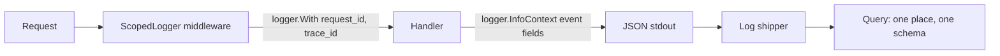

# Structured logging

## Why Does This Matter?

When something breaks at 3 a.m., logs are the first and often only
witness. Unstructured logs make that witness useless: grep over free
text cannot answer "show me every charge that failed for customer X in
the last hour with its latency." Structured logs are events with
typed fields, and Go ships the answer in the standard library:
`log/slog`. The discipline in this chapter is small: log events, not
sentences; attach identity once per request; and never let logging
become the thing that breaks the request.

## Mental Model

A log line is a **database row you write once and query under
duress**. Every decision follows from that:

| Log line as prose | Log line as event |
|---|---|
| "user 42 could not pay invoice 7" | `{"event":"payment.refused","customer":"42","invoice":"7","reason":"card_declined"}` |
| Grep-able by humans, today | Query-able by humans and machines, forever |
| Format drifts per author | One schema per service |



The pipeline matters because stdout is where logging ends and
**shipping** begins. A Go service writes JSON lines to stdout; the
platform (Kubernetes, a sidecar, a vector agent) owns storage,
retention, and indexing. Your code should contain zero log-rotation,
zero file management, zero shipping logic.

## How It Works

`slog` has two halves:

- **A logger**: `slog.New(handler)` carries level, attributes, and
  output. Create one per process, pass it explicitly or via context.
- **A handler**: `slog.NewJSONHandler(w, opts)` formats records;
  `slog.NewTextHandler` is the human variant for local dev.

Attributes attach with `logger.With(...)` for the scope of a request,
and per-event fields go in the call: `logger.InfoContext(ctx, "charge
failed", "reason", err)`. The `Context` variants matter: they let
handlers pull `trace_id` from the context and let tests capture
records.

Levels are a budget, not a mood:

| Level | Contract | Examples |
|---|---|---|
| Debug | Omit in prod by default; needed to reconstruct a specific failure | decoded payload shapes, cache hit/miss |
| Info | One line per state change an operator would chart | started, listening, shutdown complete |
| Warn | Off-nominal but self-recovered; page nobody | retry succeeded, fallback used |
| Error | Failed outcome a human should see soon | dependency down, config rejected |

## Syntax / API

The full production pattern, from the handbook's service
(`14-backend-development/examples/service/main.go`):

```go
logger := slog.New(slog.NewJSONHandler(os.Stdout,
    &slog.HandlerOptions{Level: levelFromConfig(cfg.LogLevel)}))
logger.Info("starting", "config", cfg.Summary())
```

Request scoping, `internal/platform/httpmw/httpmw.go`:

```go
func ScopedLogger(base *slog.Logger) middleware {
    return func(next http.Handler) http.Handler {
        return http.HandlerFunc(func(w http.ResponseWriter, r *http.Request) {
            id := xid() // request ID: generated if absent, honored if upstream sent one
            logger := base.With("request_id", id)
            if sc := trace.SpanContextFromContext(r.Context()); sc.IsValid() {
                logger = logger.With("trace_id", sc.TraceID().String(),
                    "span_id", sc.SpanID().String())
            }
            next.ServeHTTP(w, r.WithContext(WithLogger(r.Context(), logger)))
        })
    }
}
```

Handlers then pull the request's logger:

```go
logger := httpmw.FromContext(r.Context())
logger.InfoContext(r.Context(), "payment charged", "id", p.ID)
```

## Basic Example

```go
logger := slog.New(slog.NewJSONHandler(os.Stdout, nil))
logger.Info("checkout", "customer", "cus_42", "amount_minor", 1999, "currency", "USD")
```

Output:

```json
{"time":"2026-09-13T10:00:00Z","level":"INFO","msg":"checkout","customer":"cus_42","amount_minor":1999,"currency":"USD"}
```

## Real-World Example

The same event, searched three ways in a log platform:

- `"customer":"cus_42"` finds the customer's timeline.
- `"event":"payment.refused" AND "reason":"card_declined"` tracks a
  decline spike by cause.
- `trace_id` from any log line jumps to the distributed trace with
  the same ID (chapter 3).

This is why field names are an API. Renaming `customer` to
`customer_id` silently breaks every saved query and alert; treat the
field set as versioned surface (the same discipline as
[15 Section 2](../15-microservices/02-boundaries-and-contracts.md) contract
versioning).

## Production Example

Three rules the handbook's service follows, each earned:

**1. Redaction lives in the type, not in discipline.** Secrets and
PII leak because remembering not to log them does not scale. The
service's config package has a `Secret` type whose `LogValue`
renders as `"REDACTED"`, so `logger.Info("config", "cfg", cfg)`
cannot leak tokens even in a typo. Put the guard in the type:

```go
type Secret string

func (s Secret) LogValue() slog.Value { return slog.StringValue("REDACTED") }
func (s Secret) String() string       { return "REDACTED" }
```

**2. Log at the layer that owns the outcome, once.**
[05 Section 2](../05-errors/02-error-design.md)'s log-once rule: the
service logs the refusal with its business reason; the transport
logs the HTTP result. The error itself travels unwrapped up the
stack; each layer logs its own verdict, not the same error three
times.

**3. The access log is the sampling seam.** Every request emits one
`"http"` event (method, route, status, duration_ms, request_id).
High-volume Debug events behind feature flags can be enabled per
request: if the access log says request `req_9f` failed, a follow-up
query can pull that request's Debug detail because it shares the ID.

## Common Mistakes

| Mistake | Why it hurts | Do instead |
|---|---|---|
| `fmt.Println`/`log.Printf` in libraries | Unstructured, unlevel, no context | Accept `*slog.Logger` or return errors; library code rarely logs |
| Logging then returning the error | Duplicate, confusing chains | Log at the layer that handles it ([05 Section 2](../05-errors/02-error-design.md)) |
| `%+v` on structs with PII | Dumps every field including secrets | Log the fields you chose, by name |
| String building: `logger.Info("user " + id + " failed")` | Unqueryable | `logger.Info("user failed", "id", id)` |
| Rotation/compression in the app | Rebuilt per service, breaks containers | stdout only; the platform rotates |
| Debug logs always on | Cost and PII exposure at scale | Level per environment; per-request detail behind IDs |

## Idiomatic Go

- `log/slog` since Go 1.21; there is no reason a new service uses
  anything else. Third-party loggers existed to fill this hole.
- Use the `Context` variants (`InfoContext`, `ErrorContext`) in
  request paths; plain `Info` in main and tests.
- Accept loggers as parameters in domain code
  (`NewService(store, logger)`); reach for context-extracted
  loggers only at the transport edge.
- Attribute keys are lowercase snake_case strings; constants for the
  hot ones (`request_id`, `trace_id`).

## Performance Considerations

`slog`'s default JSON handler allocates per record; that is fine for
per-request events, wrong for per-item loops at a million per
second. The escape hatches, in order of increasing commitment:

- Level gates: `logger.Debug` skips formatting when Debug is off,
  but arguments are still evaluated. For expensive arguments, guard
  with `if logger.Enabled(ctx, slog.LevelDebug)`.
- `slog.LogValuer` for lazy fields (the `Secret` type is also this).
- Preallocate `slog.Attr` slices on hot paths; avoid `With` in loops
  (each call allocates a new logger).

Measure before caring ([19 Section 1](../19-performance/01-measure-first.md)):
logging shows up in profiles only when volume is high or formatting
is pathological.

## Concurrency Considerations

Handlers must be safe for concurrent use; the stdlib handlers are.
`logger.With` returns a new logger; never mutate a shared one. When
logging inside a worker pool, pass the request-scoped logger into
the closure: pulling `FromContext(ctx)` after a channel hop still
works because the context travels with the work item ([08
Section 5](../08-concurrency/05-patterns.md)).

## Security Considerations

- The `Secret`/`LogValue` redaction pattern is the only scalable
  defense; grep-and-pray code review is not.
- Authorization failures deserve Warn with actor and resource, but
  never the token or password material that failed.
- Log injection: untrusted strings in fields are safe (they are
  JSON-encoded); untrusted strings in the message become search
  noise. Keep free text out of `msg`.

## Testing Strategy

- Assert the contract: capture records via a handler writing to a
  `bytes.Buffer`, decode, check fields. The service's config tests
  assert that `Secret` fields render as `"REDACTED"`.
- Assert correlation: one request through the middleware produces
  log lines that all carry the same `request_id` (the service's
  full-chain test).
- Do not snapshot whole log lines; assert the fields that matter.

## Interview Questions

1. Why structured logging over `fmt.Println`? Answer in terms of
   queryability and the ship-to-platform contract, not preference.
2. Where do request IDs come from and where do they die? (Honored
   if upstream sent one, generated if not, echoed in the response
   header, attached to every log and span.)
3. How do you keep secrets out of logs without reviewing every log
   call? (Types with `LogValue`, config summary allowlists.)
4. What belongs at Warn versus Error in a service you operate?

## Practice Exercises

1. Add a `logSummary` middleware that emits exactly one event per
   request with method, route, status, duration_ms. Verify it is
   one line even for panicked requests.
2. Give a domain struct a `LogValue` that hides a field, and write
   the test proving it.
3. Wire level switching: `LOG_LEVEL=debug` flips the handler's
   level at boot; explain why live level changes need an atomic
   swap of handler options.

## Further Reading

- [log/slog package documentation](https://pkg.go.dev/log/slog)
- [Go blog: Structured Logging with slog](https://go.dev/blog/slog)
- [12-factor app: logs](https://12factor.net/logs)
