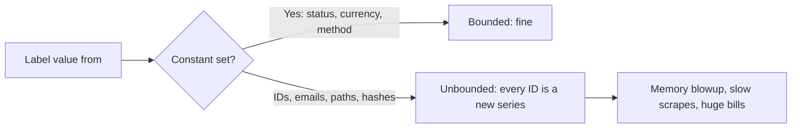

# Metrics

## Why Does This Matter?

Logs answer "what happened to this one request." Metrics answer
"how is the system behaving right now and over time": the numbers
that drive dashboards, autoscaling, SLOs (chapter 4), and 3 a.m.
page/no-page decisions. Go's ecosystem standard is the Prometheus
model: counters, gauges, and histograms exposed on an HTTP endpoint,
scraped and stored by the platform. The engineering skill is not
calling `.Inc()`; it is choosing **what** to measure, **with which
labels**, and keeping cardinality bounded.

## Mental Model

Three shapes cover almost everything:

| Shape | Semantics | Go type | Answers |
|---|---|---|---|
| Counter | Only goes up | `Counter` / `CounterVec` | How many ever? |
| Gauge | Goes up and down | `Gauge` | What is the current value? |
| Histogram | Distribution in fixed buckets | `Histogram` / `HistogramVec` | How long, how big, at what percentile? |

(Summaries exist but are unusable across instances: their
quantiles cannot be averaged. Prefer histograms.)

Every metric has **labels**, and labels are a promise: each unique
label-value combination is a distinct time series the platform
stores forever. The cardinality question is the one that kills
production systems:



## How It Works

The RED method for request-serving services, the USE method for
resources, and business metrics for the product:

| Family | Metrics | Source | Example from the handbook's service |
|---|---|---|---|
| RED (service) | Rate, Errors, Duration per route | middleware | `http_requests_total`, `http_errors_total`, `http_request_duration_seconds` |
| USE (resource) | Utilization, Saturation, Errors per resource | runtime/exporter | goroutines, GC pause, file descriptors |
| Business (domain) | What the product team charts | domain code | `payments_charged_total{currency}`, `payments_failed_total{reason}` |

Instrumentation lives in layers: the platform middleware emits RED
for every route without knowing the domain; the domain emits the
business signals the platform cannot know.

## Syntax / API

The handbook's RED bundle
(`14-backend-development/examples/service/internal/platform/obshttp/obshttp.go`):

```go
m := &Metrics{
    requests: prometheus.NewCounterVec(prometheus.CounterOpts{
        Namespace: "http", Name: "requests_total",
        Help: "Requests received.",
    }, []string{"method", "route", "status"}),
    errors: prometheus.NewCounterVec(prometheus.CounterOpts{
        Namespace: "http", Name: "errors_total",
    }, []string{"method", "route"}),
    durations: prometheus.NewHistogramVec(prometheus.HistogramOpts{
        Namespace: "http", Name: "request_duration_seconds",
        // Buckets are a contract: changing them silently breaks
        // every dashboard and SLO built on them.
        Buckets: []float64{.005, .01, .025, .05, .1, .25, .5, 1, 2.5},
    }, []string{"method", "route"}),
}
reg.MustRegister(m.requests, m.errors, m.durations)
```

Middleware emits exactly one Rate increment, one Errors increment
(5xx only), and one Duration observation per request, with the
**route pattern** (`/payments/{id}`), never the raw path:

```go
route := RoutePattern(r) // r.Pattern, else bounded fallback "unmatched"
m.requests.WithLabelValues(r.Method, route, status).Inc()
```

Exposition is one endpoint, wired in main:

```go
mux.Handle("GET /metrics", promhttp.HandlerFor(reg, promhttp.HandlerOpts{}))
```

## Basic Example

```go
var jobsQueued = prometheus.NewGauge(prometheus.GaugeOpts{
    Name: "jobs_queued",
    Help: "Jobs waiting to run.",
})
jobsQueued.Set(float64(len(queue)))
```

## Real-World Example

The service's **business metrics**
(`internal/payments/metrics.go`), the counterpoint to RED:

- `payments_charged_total{currency}`: successes, by what finance
  charts. Emits one increment per successful charge.
- `payments_failed_total{reason}`: business refusals (declines,
  validation, limits), with `reason` from a small fixed set. This
  is deliberately **not** derivable from HTTP status codes: a 422
  for "limit exceeded" and a 422 for "malformed body" are the same
  status and completely different product problems.

Domain metrics are nil-safe (`if m == nil { return }`):
instrumentation is a wrapper around the business path and must
never be the thing that breaks it. Tests without metrics keep
working.

## Production Example

**Registry hygiene** (main.go): the service registers on
`prometheus.NewRegistry()`, not the default. The default registry
collects Go runtime and process metrics plus anything any
dependency registered. A private registry exports exactly this
service's metrics, and runtime collectors are registered
deliberately when wanted:

```go
reg := prometheus.NewRegistry()
reg.MustRegister(collectors.NewGoCollector())     // when runtime signals wanted
```

**Cardinality defense in code** (`RoutePattern`): the mux records
the matched pattern; unmatched requests fall back to the literal
path only when it is shallow and contains no digits, else the
bounded constant `"unmatched"`. The test pins the failure mode:
`/payments/pay_0192837` must never become a label value.

**The one-emitter rule:** the same charged event increments the
Prometheus counter and the OTel counter (`payments.charged`) so
metrics and trace exemplars can link (chapter 3). Two emitters for
one event is how counts drift; emit once, in one place
(`emitCharged`).

## Common Mistakes

| Mistake | Symptom | Fix |
|---|---|---|
| Raw path or ID as label | Series count explodes; scrape slows; costs rise | Route patterns; bounded fallbacks |
| `WithLabelValues` on a value from user input | Same as above, discovered in an incident | Allowlist before emitting |
| High-cardinality `errors_total` missing status | Cannot tell 500 rate from 503 rate | Include the labels you will filter by |
| Bucket changes in a minor release | Every latency dashboard and SLO breaks silently | Treat buckets as a versioned contract |
| Counting in the domain *and* middleware | Numbers disagree between dashboards | One emitter per event |
| `prometheus.DefaultRegisterer` in libraries | Duplicate registration panics; dependency metrics leak | Registries are constructed and injected |
| Gauge for something that restarts mid-scrape | Reset-to-zero artifacts | Counters + `rate()`; know the counter-resets rule |

## Idiomatic Go

- `client_golang` is the de facto standard; the OTel metrics API
  (`otel.Meter`) is the portable layer, and the two interoperate
  (the service uses both: Prometheus for dashboards, OTel for
  exemplar linkage). Choose per org, never both for the same signal
  without the one-emitter rule.
- Metric names: `<namespace>_<name>_<unit>` (`http_requests_total`,
  `request_duration_seconds`). Units in names, always seconds.
- `MustRegister` in main (fail fast at boot), `NewRegistry` +
  explicit `Register` in testable code.
- Constructor returns a struct pointer; handlers take it by
  parameter. No package-level metric variables in services.

## Performance Considerations

- Metrics are cheap per call (atomic increments); the costs are
  series count and scrape frequency, not instrumentation.
- Pre-register `WithLabelValues` pairs on hot paths; the lookup is
  map-based and worth hoisting out of tight loops.
- Histogram buckets: ~10-15 well-placed buckets cover an SLO; each
  extra bucket is a series per label combination.
- Exposition endpoint: use `promhttp.HandlerFor(reg, ...)` on your
  private registry; add `promhttp.HandlerOpts{}` timeouts if scrape
  payload size becomes an issue.

## Concurrency Considerations

All client_golang primitives are concurrency-safe (atomics under
the hood). `WithLabelValues` returns the same collector for the
same labels, safe to share. The one shared-state hazard is
registration: `MustRegister` panics on duplicate registration, which
is why libraries accept a `Registerer` and services own one
registry.

## Security Considerations

- `/metrics` is metadata disclosure: mount it and decide reachability
  deliberately (cluster-internal only, or behind authn). The
  handbook's service mounts it on its own route so policy can
  differ from the API's.
- Never place secrets, tokens, or PII in label values (they land in
  a long-lived database with broad read access).
- Business counters can leak volume information (a fraud spike is
  visible); that is the point. Know who can see your metrics.

## Testing Strategy

The service's tests pin the metric contract with
`prometheus/testutil` on a fresh registry:

- RED counts: one increment per request with the right labels; a
  201 does not increment `errors_total`.
- Rejected traffic counted: instrumentation wraps **outside**
  authn, so 401s are traffic (they are: they hit your service).
- Cardinality: `RoutePattern` on ID-bearing paths returns
  `"unmatched"`, never the path.
- A metric registry per test: no cross-test bleed, no
  duplicate-registration panics.

## Interview Questions

1. Why did your p99 latency dashboard lie? (Bucket boundaries;
   quantiles from histograms are bucket-interpolated.)
2. A new release triples your time series count. What happened and
   what breaks? (Unbounded label; scrape cost, memory, alert fatigue.)
3. RED vs USE: which for your HTTP service, which for the node?
4. Why a private Prometheus registry instead of the default one?
5. How would you expose a "payments charged per minute by currency"
   signal, and where in the code does the increment live?

## Practice Exercises

1. Add `payments_failed_total` assertions to a transport test that
   fires a decline and a validation failure; verify reason labels.
2. Prove the cardinality fix: temporarily change `RoutePattern` to
   return `r.URL.Path`, run the test, read the failure.
3. Add a GC-pause histogram from `runtime/metrics` and register it
   on the private registry.

## Further Reading

- [client_golang documentation](https://pkg.go.dev/github.com/prometheus/client_golang/prometheus)
- [Prometheus: naming and labels best practices](https://prometheus.io/docs/practices/naming/)
- [The RED method (Tom Wilkie)](https://www.weave.works/blog/ravelry-monitoring-microservices/)
- [Google SRE: Monitoring Distributed Systems](https://sre.google/sre-book/monitoring-distributed-systems/)
