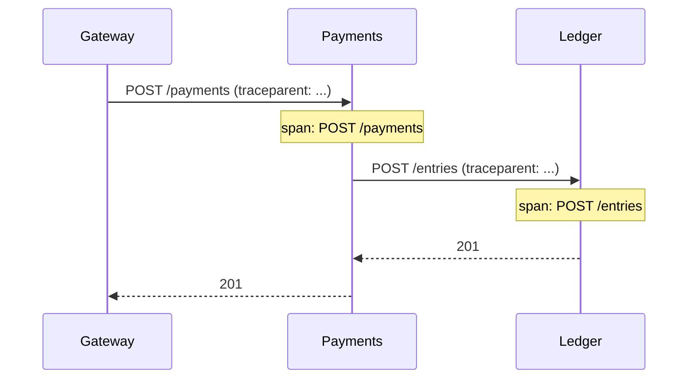

# Tracing & OpenTelemetry

## Why Does This Matter?

One request, five services: which one was slow? Logs and metrics are
per-service; a distributed trace is the request's story across all of
them: every hop, every wait, one shared ID. Go's standard is
OpenTelemetry (OTel), and the stdlib's `context` is the mechanism
traces ride on ([08 Section 3](../08-concurrency/03-context.md)): a span is
just another value carried by the context.

## Mental Model



- A **trace** is the whole tree; a **span** is one timed operation
  with attributes and a status.
- The **traceparent** HTTP header carries the IDs across services
  (W3C Trace Context). The inbound middleware reads it; outbound
  clients write it. That is the entire "correlation" machinery.
- Spans link to metrics via shared attributes; logs carry
  `trace_id` (chapter 1's `ScopedLogger`), which is how you jump
  from a log line to the full story.

## How It Works

Three moving parts, wired once in `main`:

1. **Provider**: creates spans, exports them in the background.
2. **Propagator**: extracts/injects `traceparent` (W3C default).
3. **Middleware or explicit spans**: start a span per request;
   business operations may start nested spans.

The service's wiring (`internal/platform/otelwiring/otelwiring.go`)
encodes the two rules that matter:

- **Zero branches in the business code.** With no
  `OTEL_EXPORTER_OTLP_ENDPOINT`, a no-op provider is installed: the
  service runs with zero infrastructure and zero `if tracingEnabled`
  checks anywhere.
- **Init first, flush last.** The provider is initialized before any
  request can start a span, and its shutdown runs *after* the HTTP
  server drains, so the final requests' spans reach the collector.

## Syntax / API

The request span lives in the observability middleware
(`internal/platform/obshttp/obshttp.go`):

```go
ctx, span := tracer.Start(r.Context(), r.Method+" "+route,
    trace.WithAttributes(
        attribute.String("http.request.method", r.Method),
        attribute.String("http.route", route),
    ))
defer span.End()

next.ServeHTTP(w, r.WithContext(ctx)) // handler sees the span via ctx

if sw.code() >= 500 {
    span.SetStatus(codes.Error, http.StatusText(sw.code()))
}
```

A business span, started by the domain
(`internal/payments/metrics.go`):

```go
ctx, span := m.tracer.Start(ctx, "payments.charge",
    trace.WithAttributes(
        attribute.String("payment.currency", in.Currency),
        attribute.Int64("payment.amount_minor", in.AmountMinor),
    ))
defer span.End()
```

Propagation is explicit but one line:

```go
otel.SetTextMapPropagator(propagation.NewCompositeTextMapPropagator(
    propagation.TraceContext{}, propagation.Baggage{}))
```

## Basic Example

```go
ctx, span := tracer.Start(ctx, "db.query")
defer span.End()
rows, err := db.QueryContext(ctx, q)
if err != nil {
    span.RecordError(err)
    span.SetStatus(codes.Error, "query failed")
}
```

## Real-World Example

Sampling: 100% in dev, head-sampled in prod by env:

```go
sampler := sdktrace.ParentBased(sdktrace.TraceIDRatioBased(ratio()))
```

Sampling is a correctness tradeoff: a sampled-out request leaves no
trace, including its error. Errors worth tracing may be unsampled;
the fixes are tail-sampling at the collector (keep all error traces)
or a higher ratio for narrow routes. The service also honors
upstream decisions: `ParentBased` means if the gateway sampled the
trace, every downstream service does too, and one trace is complete.

## Production Example

Shutdown ordering in `main.go`, the part teams get wrong:

```go
shutdownTracing, err := otelwiring.Init(ctx, "payments-service", "dev")
defer func() {
    // AFTER the server drains: final requests' spans must export.
    _ = shutdownTracing(context.Background())
}()
```

Plus a bounded flush inside `otelwiring` (5s): a hung collector must
not hang shutdown, the same grace-period discipline as the HTTP
server ([12 Section 5](../12-http-networking/05-graceful-shutdown.md)).

## Common Mistakes

| Mistake | Consequence | Do instead |
|---|---|---|
| A span per function | Noise; 90% of spans add nothing | Span per meaningful operation (request, RPC, query, business op) |
| Span created but not ended | Trace hangs, memory grows | `defer span.End()` at creation |
| Forwarding `traceparent` manually per hop | Broken or partial traces | Propagator + a client wrapper that injects |
| High-cardinality span attributes (user IDs) | Backend cost explosion | Bounded attributes; IDs belong in logs linked by trace_id |
| Exporting synchronously in the request path | Latency couples to the collector | `WithBatcher` (async export) |
| `otel.SetTracerProvider` after requests start | First spans lost; races | Init before serving; tests install providers too |
| Assuming sampling keeps errors | Blind spots exactly when debugging | Tail-sampling or per-route ratios |

## Idiomatic Go

- Spans travel in `context.Context`; pass `ctx` first parameter as
  everywhere else ([08 Section 3](../08-concurrency/03-context.md)).
- `otel.Tracer("pkgname")` per package, like `log` package names.
- No-op by default: code compiles and runs with zero OTel
  configuration; instrumentation never blocks boot.

## Performance Considerations

Span creation is nanoseconds and one allocation tier; export is the
cost, and batching moves it off the request path. Attribute values
are the real allocation source: reuse constants, avoid
`fmt.Sprintf` in hot attributes. When in doubt, measure
([19 Section 1](../19-performance/01-measure-first.md)).

## Concurrency Considerations

Spans are safe for concurrent use, but a span should represent one
operation: fan-out work belongs in child spans, one per unit, not
attributes written from several goroutines onto the parent.

## Security Considerations

Span attributes land in tracing backends with broad access: no
tokens, no PII, no full request bodies. Trace IDs themselves are
safe and are the intended correlation key. Exposing `traceparent`
in responses helps debugging and tells an attacker your tracing
vendor: decide deliberately.

## Testing Strategy

- Install a real provider with a discard exporter in tests (as the
  service's `obshttp` tests do) and assert the handler saw a valid
  span context.
- Assert the correlation contract: one request produces a log line
  whose `trace_id` matches the span the middleware created.
- Use `sdktrace.NewSimpleSpanProcessor(inMemoryExporter)` when a
  test must inspect span names and attributes.

## Interview Questions

1. Walk a request through three services: what carries the trace
   between them? (W3C `traceparent`; propagator extract/inject.)
2. Head vs tail sampling: what do you lose with each?
3. Why must the tracer provider shut down after the HTTP server?
4. Where do spans come from in a codebase with zero tracing setup?
   (No-op global provider; the code has no branches.)

## Practice Exercises

1. Add a span to the store layer measuring query duration with a
   `db.operation` attribute; verify it nests under the request span.
2. Break propagation: remove the inbound `Extract` call and observe
   the trace fork into two traces in the exporter output.
3. Add a test that fires a 500 and asserts the span status is Error.

## Further Reading

- [OpenTelemetry Go documentation](https://opentelemetry.io/docs/languages/go/)
- [W3C Trace Context](https://www.w3.org/TR/trace-context/)
- [Go blog: context and cancellation](https://go.dev/blog/context)
