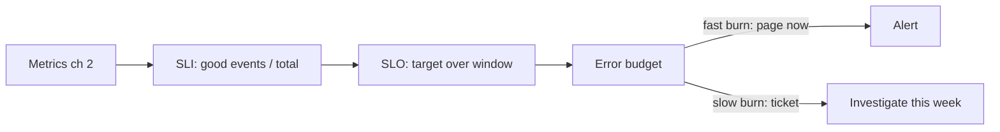

# SLOs, burn rates & alerting

## Why Does This Matter?

Metrics without thresholds produce dashboards nobody watches and
alerts that page on symptoms of nothing. The SLO stack (SLI, SLO,
error budget) turns the metrics from chapter 2 into a small number
of alerts that fire only when users are actually suffering. For a
service you operate, this is the difference between paging on every
latency wiggle and paging on real budget burn.

## Mental Model

Three terms, in order of who owns them:

| Term | Definition | Owner | Example |
|---|---|---|---|
| SLI | The measured signal | engineering | fraction of requests with status < 500 and latency < 300ms |
| SLO | The target for the SLI | product + engineering | 99.9% of requests over 28 days |
| SLA | The contract with consequences | business | credits if the SLO is missed |

The working unit is the **error budget**: 100% minus the SLO. At
99.9%, you may fail 0.1% of requests: 43 minutes per month. The
budget converts reliability from a vibe into money you can spend
(deploys, experiments, riskier changes) and lose (incidents).



## How It Works

**Choose SLIs from the user's seat:** availability (did it answer
without a 5xx) and latency (did it answer fast enough). Not CPU, not
goroutine counts: those are causes, page on symptoms
([19 §1](../19-performance/01-measure-first.md) measures causes;
here we page on effects).

**Burn-rate alerting** is the mechanism that keeps alerts few:
compare the budget's *consumption rate* against the rate that would
exhaust it exactly in the window. Two tiers do the work:

| Tier | Window math | Meaning | Response |
|---|---|---|---|
| Fast | 14.4x over 1h (and 6x over 5m, to kill flapping) | 2% of the 28d budget burning in 1h | Page now |
| Slow | 6x over 6h | 5% of budget in 6h | Ticket, look tomorrow |

(14.4x and 6x come from the standard Google SRE formulation; the
exact multipliers matter less than the shape: fast tier pages, slow
tier tickets, and everything else is a dashboard.)

## Syntax / API

The SLIs come straight from the chapter 2 metrics; in PromQL:

```text
# Availability SLI (28d)
sum(rate(http_requests_total{status!~"5.."}[28d]))
/
sum(rate(http_requests_total[28d]))

# Latency SLI: p99 under 300ms, via the histogram buckets
sum(rate(http_request_duration_seconds_bucket{le="0.3"}[28d]))
/
sum(rate(http_request_duration_seconds_count[28d]))
```

The fast-burn page:

```text
(
  1 - sum(rate(http_requests_total{status!~"5.."}[1h]))
    / sum(rate(http_requests_total[1h]))
) > (14.4 * 0.001)
and
(
  1 - sum(rate(http_requests_total{status!~"5.."}[5m]))
    / sum(rate(http_requests_total[5m]))
) > (14.4 * 0.001)
```

## Basic Example

One service, two SLOs, expressed for humans:

- 99.9% of requests succeed (not 5xx).
- 99% of requests complete in under 300 ms.

Both are computable from the RED bundle alone. That is the point:
instrumentation chosen in chapter 2 was already SLO-shaped.

## Real-World Example

The payments service: a **decline is not an availability failure**.
`payments_failed_total` counts business refusals; the availability
SLI counts 5xx. Charging someone a decline is the system working.
Conflating them is the classic error: the alert fires during a
legitimate spike of declined cards, everyone ignores the channel,
and the real outage page goes unseen. Symptom alerts page on what
*users* experience; business metrics drive dashboards and product
alerts, not 3 a.m. pages.

## Production Example

**Buckets are a contract, again.** The latency SLI reads the
`le="0.3"` bucket from chapter 2's histogram. Change the buckets and
every SLO silently recomputes against different data. The histogram
comment in `obshttp.go` says exactly this; here is why it matters.

**Route-level budgets:** one global SLO hides a failing route
behind a passing aggregate. Keep the global for paging; chart the
per-route SLI (`by (route)`) for triage. The bounded `route` label
is what makes that chart trustworthy.

## Common Mistakes

| Mistake | Consequence | Do instead |
|---|---|---|
| SLO of 100% | Impossible; budget gone on day one | 99.9 and mean it |
| Alerting on CPU/memory | Noise; users unaffected | Symptom-based: SLIs only |
| One alert per metric | Alert flood, page blindness | Two burn-rate tiers per SLI |
| Business failures in availability SLIs | Pages on correct behavior | 5xx is availability; declines are business |
| SLO with no consequences | Theater | Budget burn triggers the deploy/risk policy the team agreed on |
| Window mismatch between SLI and alert | Slow detection or flapping | Match the alert window math to the tier |

## Idiomatic Go

There is no library for this in Go: SLOs live in your metrics
backend and your team's policy. The Go work is emitting the SLI
inputs correctly: status codes as labels (chapter 2), route patterns
bounded, histogram buckets chosen to include your target. If the
alert needs a metric that does not exist, the fix is in
instrumentation, not in the alert.

## Performance Considerations

28-day `rate()` windows over high-cardinality series are expensive
for the metrics store, not for your service. Keep page alerts on
short windows (1h/5m), reserve the 28d math for the weekly report.
Cardinality discipline from chapter 2 is what keeps these queries
tractable.

## Concurrency Considerations

None directly; the "concurrency" of alerting is deduplication:
route fast-burn pages through your on-call tooling's grouping (by
service, then SLI), or one bad dependency pages every team
simultaneously.

## Security Considerations

Alert payloads flow to pagers and chat: they carry labels, not
payloads. Keep tokens and PII out of alert annotations just as out
of logs (chapter 1).

## Testing Strategy

You cannot unit-test an SLO; you can test its inputs:

- The metric contract tests from chapter 2 (labels, counts) are the
  SLI's unit tests.
- Test the alert rules themselves where your tooling allows
  (Prometheus `promtool test rules` covers burn-rate expressions).
- Rehearse: fire a synthetic 5xx storm at staging and confirm the
  fast tier pages and the slow tier does not.

## Interview Questions

1. What is an error budget and what is it for? (Spendable
   unreliability: it prices change vs risk.)
2. Why symptom-based alerting? (Pages when users hurt; nothing else.)
3. Design an alerting scheme for a payment API with one page-tier
   rule. (Availability + latency SLIs, fast/slow burn, dedup.)
4. Your SLO shows green but customers complain. What is wrong?
   (SLI not measuring the actual user journey: per-route budgets,
   client-side symptoms.)

## Practice Exercises

1. Write the two burn-rate expressions for the service's latency
   SLO and test them with `promtool test rules`.
2. Add a route-dimension SLI chart and find the route with the
   worst budget consumption.
3. Draft the one-paragraph SLO policy: who may spend the budget,
   what happens when it is gone.

## Further Reading

- [Google SRE Workbook: Alerting on SLOs](https://sre.google/workbook/alerting-on-slos/)
- [Google SRE: Service Level Objectives](https://sre.google/sre-book/service-level-objectives/)
- [promtool rule testing](https://prometheus.io/docs/prometheus/latest/configuration/unit_testing_rules/)
