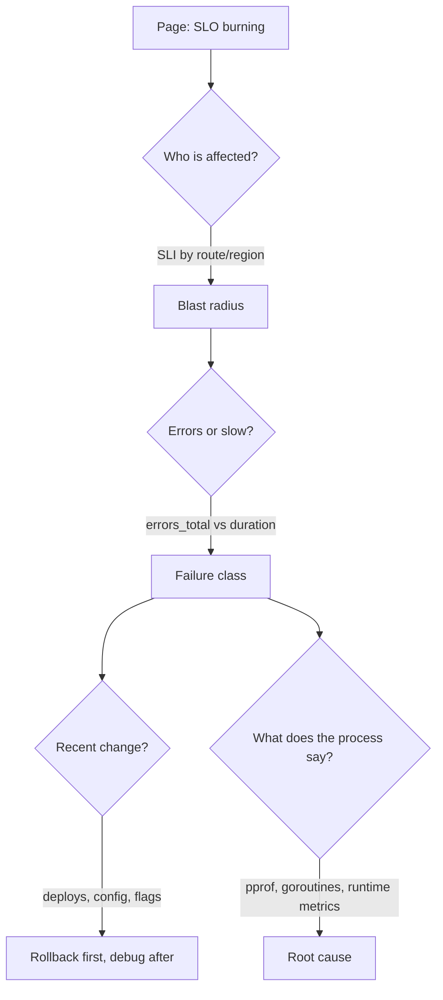

# Debugging production incidents

## Why Does This Matter?

Observability earns its cost in the incident: the 15 minutes where
someone must answer "what is wrong, and what do I turn off?" This
chapter is the Go-specific playbook: which signals answer which
question, and the commands that produce evidence instead of
guesses. It pairs with
[19 Section 1](../19-performance/01-measure-first.md), which covers the
same tools in peacetime; here they run under fire.

## Mental Model

An incident is a search over a decision tree. Each question has a
signal that answers it in seconds:



The first three steps use dashboards and logs (chapters 1-4); the
last uses the runtime tools below.

## How It Works

The Go runtime exposes its own state; the incident checklist:

| Symptom | First signal | Deep dive |
|---|---|---|
| Latency spike, CPU flat | `http_request_duration_seconds` p99 | goroutine profile: are workers blocked? |
| Latency spike, CPU high | RED + CPU profile | CPU flamegraph: new code path? |
| Memory climbing | `go_memstats_alloc_bytes` | heap profile: who allocates? |
| Thrashing, OOM kills | GC pause metrics | `GODEBUG=gctrace=1` on a replica |
| Requests hang entirely | goroutine count flat/pegged | goroutine dump: deadlocks, leaked blockers |
| Connections exhausted | accept errors, FD gauge | goroutine dump + conntrack |

## Syntax / API

**The evidence endpoints** (mount on an internal route; exposure
rules are [21 Security](../21-security/)'s territory, summarized
below):

```go
import _ "net/http/pprof" // registers /debug/pprof/* on DefaultServeMux

runtime.MetricOf("...", out)  // or runtime/metrics for precise gauges
runtime.NumGoroutine()        // cheap trend signal, chart it
```

**The commands** (from a pod, not from your laptop):

```bash
# What holds the memory?
curl -s localhost:6060/debug/pprof/heap > heap.pb.gz
go tool pprof -top heap.pb.gz

# Who is on CPU?
go tool pprof -top http://localhost:6060/debug/pprof/profile?seconds=30

# What is everyone waiting on? (the incident workhorse)
curl -s localhost:6060/debug/pprof/goroutine > goroutines.txt
go tool pprof -top goroutines.txt

# Serialization: per-request flow with scheduler detail
curl -s localhost:6060/debug/pprof/trace?seconds=5 > trace.out
go tool trace trace.out
```

## Basic Example

A goroutine dump that reads in one glance:

```text
goroutine 8123 [chan receive, 14 minutes]:
    main.worker(0xc0001a2000)
    /app/worker.go:42 +0x9c
```

Eight thousand goroutines stuck in `chan receive` for 14 minutes at
`worker.go:42`: the producer died and nobody closed the channel.
That line is the incident's root cause, found in seconds ([08
Section 7](../08-concurrency/07-pitfalls.md) catalogs this leak shape).

## Real-World Example

Rollback as the first debugging act. The evidence hierarchy when a
change is suspect: deploys, config, flags, then code. The service's
feature flags ([14 Section 5](../14-backend-development/05-observability-health-flags.md))
exist exactly so a bad rollout is a config flip, not a rollback of
five services. In the incident, the order of operations is:

1. Stop the bleeding: flip the flag, roll back, shed load
   ([16 Section 5](../16-distributed-systems/05-delivery-backpressure-shedding.md)).
2. Capture evidence **before** the rollback reverts the state:
   profiles and goroutine dumps are cheap; take them first.
3. Then debug with the evidence, calmly.

## Production Example

**GC pressure under load**: p99 latency creeps at peak; CPU
profile shows 30% in `runtime.mallocgc`. Heap profile shows a hot
path allocating response buffers per request. The fix is
`sync.Pool` or right-sizing ([19 Section 2](../19-performance/02-memory-and-allocations.md)),
validated by the same profiles. The observability work is having
the GC and heap signals charted *before* the incident, so "GC got
worse" is visible in one glance rather than a new investigation.

**The dashboard that matches the runbook**: each row of the
checklist table above should be one panel, and the alert that
paged you should link to the dashboard and its runbook
(chapter 4). Debugging speed is a graph-layout problem as much as a
Go problem.

## Common Mistakes

| Mistake | Consequence | Do instead |
|---|---|---|
| Restart first, evidence never | The same incident returns weekly | Capture profiles, then restart |
| pprof on the public mux | The internet can profile you | Internal-only route or port |
| Debugging without the timeline | Wrong correlation, wrong fix | Pull deploys/config/flag changes into the incident doc |
| Reading CPU profile for a hang | Nothing useful; it is not on CPU | Goroutine dump is the hang tool |
| No logs for the request class | Reconstructing behavior from code | Correlated request logs (chapter 1) |
| Heroic single-threaded debugging | Ignore the distributed dimension | Check upstream/downstream SLIs before diving into your own code |

## Idiomatic Go

- `net/http/pprof` imported for side effects; guard by mounting it
  on an internal listener, never disabling it entirely (the
  incident cost of no profiles exceeds the exposure with sane
  network policy).
- Chart `runtime.NumGoroutine`, GC pauses, and heap as first-class
  panels: they are Go's vitals and cost nothing.
- Keep a `Makefile`/`scripts` target for "profile from pod X" so
  the 3 a.m. commands are copy-paste, not memory.

## Performance Considerations

Profiling itself costs: 30s CPU profiles at 100Hz are fine in
prod; heap profiles are point-in-time and cheap; execution traces
are the expensive one (use short windows). Continuous profiling
(Parca, Pyroscope, or the `runtime/pprof` push models) trades a
small overhead for always-on evidence: decide deliberately, measure
the overhead ([19 Section 1](../19-performance/01-measure-first.md)).

## Concurrency Considerations

Most Go incidents are concurrency-shaped: leaked goroutines
(count trends up forever), deadlocked mutex ordering (dump shows
everyone in `semacquire`), unbounded fan-out (goroutine count
mirrors traffic). The dump's *state lines* (`chan receive`,
`semacquire`, `select`, `IO wait`) are the diagnostic payload;
[08 Section 7](../08-concurrency/07-pitfalls.md) maps each state to its
usual cause.

## Security Considerations

Profiles are code layout plus data shapes: useful to attackers. The
exposure rules: separate internal port, network policy, no public
mux (detailed in [21 Security](../21-security/)). Incident
docs and dashboards also leak: keep secrets and customer data out
of annotations, screenshots, and channel pins.

## Testing Strategy

- Load-test with profiles on ([19 Section 1](../19-performance/01-measure-first.md)'s
  harness): an incident rehearsed in staging is half an incident.
- Chaos drills: kill the dependency, confirm the breaker + shedding
  behavior ([15 Section 3](../15-microservices/03-resilience-patterns.md)),
  and confirm the dashboards show what you expect.
- Test that `/debug/pprof` is NOT reachable from the public
  ingress (a security test, like the service's authz matrix tests).

## Interview Questions

1. p99 tripled, CPU flat, deploys frozen for a week. Walk me
   through your next 10 minutes. (Goroutine dump; blocked states;
   dependency timing; then evidence-led fixes.)
2. What lives on `net/http/pprof`'s default mux and how do you
   expose it safely?
3. You suspect a goroutine leak. Which signal confirms it and what
   does the dump show? ([08 Section 7](../08-concurrency/07-pitfalls.md))
4. When do you roll back versus debug in place, and why does the
   order of capture-versus-rollback matter?

## Practice Exercises

1. Mount pprof on an internal port in the service and write the
   test that proves the public handler cannot reach it.
2. Introduce a silent goroutine leak in a branch, chart
   `runtime.NumGoroutine` under load, and find the leak from the
   dump alone.
3. Write the service's incident runbook: checklist table, dashboard
   links, capture commands.

## Further Reading

- [net/http/pprof documentation](https://pkg.go.dev/net/http/pprof)
- [Diagnostics with pprof (go.dev)](https://go.dev/doc/diagnostics)
- [Google SRE: Managing Incidents](https://sre.google/sre-book/managing-incidents/)
