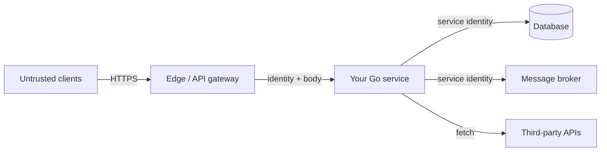
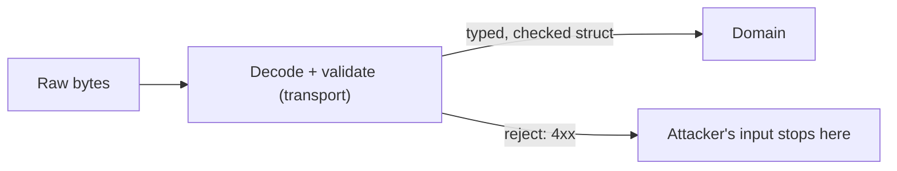

# Threat modeling & validation

## Why Does This Matter?

Security work without a threat model is a checklist with no order:
you harden random things and miss the actual entry points. A threat
model is one page: what are the entry points, what crosses each
trust boundary, and what does an attacker gain by abusing it? Every
control in this section (validation, authn, TLS, limits, secrets)
earns its place by answering one boundary question.

## Mental Model



Each arrow is a **trust boundary**: the left side is not under your
control. For each boundary, four questions (a one-page STRIDE):

| Question | Threat | Control (chapter) |
|---|---|---|
| Who is on the other side? | Spoofing | Authentication (ch 2) |
| What are they allowed to do? | Elevation | Authorization (ch 2) |
| What are they sending me? | Tampering, injection | Validation (this chapter) |
| Can they send it forever, free? | Denial of service | Limits (ch 4) |
| Can I prove what happened? | Repudiation | Audit logs ([25 §3](../25-fintech-with-go/03-integrity-and-exactly-once.md)) |
| Is the channel private? | Disclosure | TLS (ch 3) |

## How It Works

**Validation lives at the boundary, in the type.** The rule that
makes Go services safe: untrusted bytes become typed values in
exactly one place, and everything downstream can trust the type.



The three classes of boundary input and their Go answers:

| Input | Attack | Go control |
|---|---|---|
| SQL strings | Injection | Parameterized queries only ([13 §1](../13-databases/01-database-sql.md)) |
| Command arguments | Injection (`; rm -rf`) | `exec.Command(name, args...)`: never a shell string |
| File paths | Traversal (`../../etc/passwd`) | `filepath.Base`/`Clean` + root prefix check |
| HTML output | XSS | `html/template` auto-escaping; never string-built HTML |
| URLs you fetch | SSRF | Allowlist scheme+host, block link-local (ch 5) |
| Numbers | Overflows, negative amounts | Domain types that refuse invalid values |

## Syntax / API

Path traversal, the Go-safe pattern:

```go
func resolveUnder(root, name string) (string, error) {
    clean := filepath.Clean("/" + name) // forces absolute, kills ..
    full := filepath.Join(root, clean)
    if !strings.HasPrefix(full, root+string(os.PathSeparator)) {
        return "", fmt.Errorf("%w: escapes root", ErrInvalid)
    }
    return full, nil
}
```

Command execution without a shell:

```go
// Good: arguments never re-parsed by a shell.
cmd := exec.CommandContext(ctx, "pdftotext", tmpPath, "-")

// Dangerous: string interpolated into a shell.
// exec.Command("sh", "-c", "pdftotext "+userFile) // injection
```

Decoding that refuses ambiguity:

```go
dec := json.NewDecoder(r.Body)
dec.DisallowUnknownFields()
if err := dec.Decode(&req); err != nil { return httpjson.Error(w, 400, ...) }
```

## Basic Example

A domain type that makes invalid states unrepresentable:

```go
type AmountMinor struct{ v int64 }

func NewAmountMinor(v int64) (AmountMinor, error) {
    if v <= 0 || v > 10_000_000_00 { // $10M sanity bound
        return AmountMinor{}, ErrInvalidAmount
    }
    return AmountMinor{v}, nil
}
```

Every downstream function takes `AmountMinor`, not `int64`: no
call site can pass a negative or absurd amount, and no validation
can be forgotten.

## Real-World Example

The Section 14 service validates in the transport (`payments/http.go`)
before the service sees the request: currency checked against a
fixed set, amounts positive and bounded, batch items each validated
with the offending index reported. The service layer re-checks only
what needs state (idempotency, ownership). Result: an attacker's
malformed body never reaches the domain, and every rejection is a
4xx, not a 500.

## Production Example

**Unknown fields** (`DisallowUnknownFields`) are a compatibility
seam: reject them and a client sending a typo gets a 400 instead of
silently ignored data ([15 §2](../15-microservices/02-boundaries-and-contracts.md)
covers the versioning contract). **Fuzz the decoders** that face the
internet: the parsers behind your API are the first thing an
attacker probes, and fuzzing finds the input that splits your
assumptions ([10 §4](../10-testing/04-benchmarks-coverage-fuzzing.md)'s
fuzz chapter applies directly).

## Common Mistakes

| Mistake | Consequence | Do instead |
|---|---|---|
| Validating in the UI/client only | API bypasses it trivially | Validate at every boundary you own |
| String-building SQL | Injection | Parameters, always ([13 §1](../13-databases/01-database-sql.md)) |
| `sh -c` with interpolated input | Command injection | `exec.Command` with argv |
| Serving user paths with `http.ServeFile` unchecked | Reads /etc/passwd | Contained `resolveUnder` above |
| Regex HTML sanitizing | Bypassed constantly | `html/template` contexts |
| Trusting `Content-Length`-sized reads | Memory exhaustion | `http.MaxBytesReader` (ch 4) |

## Idiomatic Go

- Parse, don't validate: convert strings into domain types at the
  edge and pass types, not flags, inward.
- `filepath` + `strings.HasPrefix` over manual ".." checks.
- Errors from validation are value errors: `ErrInvalid` sentinels
  ([05 §2](../05-errors/02-error-design.md)), mapped to 4xx by the
  transport's table.

## Performance Considerations

Validation is O(input); the costs that matter are regex backtracking
(worst case exponential; prefer stdlib parsers) and decode
allocations. Bounding input size first (`MaxBytesReader`) makes the
rest cheap by construction.

## Concurrency Considerations

Validators and compiled templates are safe for concurrent use;
share one compiled `template.Template` or regexp, never compile per
request (also faster).

## Security Considerations

This chapter is the security chapter for injection. The
defense-in-depth stack: parameterized SQL, type-safe domains,
bounded input, and least-privilege DB accounts (an app account that
cannot `DROP` turns an injection into a nuisance).

## Testing Strategy

- Table-driven boundary tests: each traversal/overflow/unicode
  input asserts the rejection ([10 §1](../10-testing/01-fundamentals.md)).
- Fuzz `resolveUnder` and the JSON decoders; the property is
  "result is always under root, or error."
- The service's transport tests double as security regression
  tests: malformed bodies get 4xx, never 5xx.

## Interview Questions

1. Where does validation belong in a layered Go service, and why?
2. Walk me through preventing path traversal in a file-download
   endpoint.
3. Why is string-concatenated SQL unsafe even with input filtering?
4. What does "parse, don't validate" buy you in Go specifically?

## Practice Exercises

1. Fuzz `resolveUnder` with inputs containing `..`, unicode, and
   NUL bytes; fix any escape it finds.
2. Add a bounded-amount domain type to the payments service and
   delete the now-redundant transport checks.
3. Write the injection checklist for a service that shells out to
   two external binaries.

## Further Reading

- [OWASP Cheat Sheet Series](https://cheatsheetseries.owasp.org/)
- [Go security best practices (golang.org)](https://go.dev/doc/security/)
- [OWASP SSRF prevention](https://cheatsheetseries.owasp.org/cheatsheets/Server_Side_Request_Forgery_Prevention_Cheat_Sheet.html)
