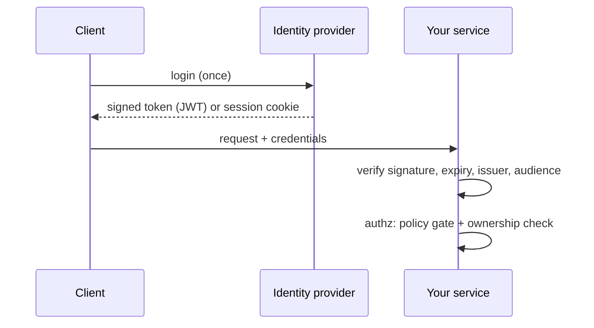

# Authentication & authorization

## Why Does This Matter?

Section 14 used a pluggable verifier and deferred the mechanics.
Here they are: what a token actually is, what verification means,
and where the standard bugs live (algorithm confusion, kid abuse,
missing expiry). Authn answers "who is calling"; authz answers "may
they do this." Go gives you the crypto primitives; the discipline
is refusing to hand-roll anything beyond assembly.

## Mental Model



- **Stateless tokens (JWT)**: the service verifies a signature
  locally, no IdP round-trip. Fast, but revocation is hard.
- **Server sessions**: lookup per request; instant revocation, one
  shared store. Default to sessions when you own both ends; use
  JWTs across trust boundaries you don't.

A JWT is three base64 parts; the middle one, the header, names the
algorithm. **The header is attacker-controlled input**: "verify
what was signed, not what the header claims" is the rule behind
the classic `alg: none` and RS-to-HS confusion bugs.

## How It Works

**Verification, in order, every time:**

1. Parse with the expected algorithm **pinned** (`EdDSA`/`ES256`/`RS256`).
   Never accept the header's suggestion.
2. Check `exp` (and `nbf`); reject stale tokens with real leeway
   (seconds, not minutes).
3. Check `iss` and `aud` against your configured values.
4. Extract the subject; that is the identity for authz.

**Authorization is two gates** ([14 Section 4](../14-backend-development/04-authn-authz-and-validation.md)
established them):

| Gate | Question | Lives in | Example |
|---|---|---|---|
| Policy (coarse) | May this caller class call this route? | middleware / route table | machine tokens cannot hit admin routes |
| Ownership (fine) | May this caller touch this resource? | service layer | `payment.CustomerID == caller.CustomerID` |

## Syntax / API

A pinned, minimal verifier (the service's `payments.AuthVerifier`,
now with the mechanics spelled out):

```go
// Verify checks a Bearer token with Ed25519. The algorithm is
// pinned by the key type itself: crypto/ed25519.Verify cannot be
// tricked into HMAC mode, and there is no "none" path.
func (v Ed25519Verifier) Verify(auth string) (Caller, error) {
    tok, ok := strings.CutPrefix(auth, "Bearer ")
    if !ok {
        return Caller{}, ErrUnauthorized
    }
    parts := strings.Split(tok, ".")
    if len(parts) != 3 {
        return Caller{}, ErrUnauthorized
    }
    payload, err := decodeJWTPart(parts[1]) // {"sub","exp","iss","aud"}
    if err != nil {
        return Caller{}, ErrUnauthorized
    }
    if !v.now().Before(payload.ExpiresAt) {
        return Caller{}, ErrUnauthorized
    }
    if payload.Issuer != v.issuer || payload.Audience != v.audience {
        return Caller{}, ErrUnauthorized
    }
    sig, err := base64.RawURLEncoding.DecodeString(parts[2])
    if err != nil || !ed25519.Verify(v.key, []byte(tok[:len(tok)-len(parts[2])-1]), sig) {
        return Caller{}, ErrUnauthorized
    }
    return Caller{Subject: payload.Subject}, nil
}
```

For production JWT parsing, `github.com/golang-jwt/jwt/v5` with
`jwt.WithValidMethods([]string{"EdDSA"})` enforces the same pin
explicitly. The principle matters more than the library.

Sessions with the stdlib:

```go
http.SetCookie(w, &http.Cookie{
    Name: "session", Value: id, Path: "/",
    HttpOnly: true, Secure: true,
    SameSite: http.SameSiteLaxMode, MaxAge: 3600,
})
```

Machine-to-machine identity: mTLS. Both sides present certificates
from a private CA; `http.Server.TLSConfig.ClientAuth =
tls.RequireAndVerifyClientCert` makes the client's identity a
cryptographic fact instead of a shared secret (server config is
chapter 3).

## Basic Example

The ownership gate that turns identity into permission:

```go
func (s *Service) Cancel(ctx context.Context, caller Caller, id string) error {
    p, err := s.store.Get(ctx, id)
    if errors.Is(err, ErrNotFound) {
        return ErrNotFound // existence never disclosed (14 Section 4)
    }
    if err != nil {
        return err
    }
    if p.CustomerID != caller.Subject {
        return ErrNotFound // not 403: same nondisclosure
    }
    return s.store.Cancel(ctx, id)
}
```

## Real-World Example

The service's policy table (`payments/http.go`): the route table
maps method+pattern to the minimum caller kind; unknown kinds get
401 with `WWW-Authenticate`, wrong kinds get 403, and ownership
failures collapse to 404. Three distinct failure reasons, three
status codes, decided in one table: the tests pin the whole matrix.

## Production Example

**Revocation.** Stateless JWTs live until `exp`. If access windows
must be short, issue short-lived access tokens plus server-side
refresh sessions: revocation removes the session, the access token
dies within its minutes-long `exp`. **Key rotation.** Verify
against a key set fetched from the IdP's JWKS endpoint with cache
and rotation (`kid` selects the key; a `kid` that matches nothing
is a reject, never a fallback to another algorithm).

**The audience check is not bureaucracy.** A token minted for the
reporting API is valid currency inside the payments API unless
`aud` says otherwise: one compromised service should not be able
to spend another's tokens.

## Common Mistakes

| Mistake | Attack it enables | Do instead |
|---|---|---|
| Accepting the header's algorithm | `alg: none`, RS-to-HS confusion | Pin algorithms at verification |
| No `exp`/`aud`/`iss` checks | Stale and cross-service token reuse | Check all, with small leeway |
| Long-lived JWTs with no revocation path | Stolen token is forever | Short access + refresh sessions |
| 403 on missing resources | Existence disclosure to strangers | 404 ([14 Section 4](../14-backend-development/04-authn-authz-and-validation.md)) |
| Authz by path prefix (`/admin/`) | Bypass via case/encoding/double slash | Policy on matched route patterns ([12 Section 1](../12-http-networking/01-handlers-and-routing.md)) |
| Permissions in the token only | Stale claims after role change | Token = identity; roles live server-side |
| Rolling your own JWT signing/alg negotiation | Subtle crypto bugs | Pinned verifier or golang-jwt with `WithValidMethods` |

## Idiomatic Go

- `context.Context` carries the `Caller` value extracted once by
  middleware; services take `Caller` as an explicit parameter (the
  service example's signature: `Cancel(ctx, caller, id)`).
- Errors: `ErrUnauthorized` (401) versus `ErrForbidden` (403)
  versus `ErrNotFound` (404) are distinct domain sentinels
  ([05 Section 2](../05-errors/02-error-design.md)); the transport maps
  them, once.
- Small interfaces: define `Verifier` where consumed; fakes in
  tests, Ed25519 in prod.

## Performance Considerations

JWT verification is two hashes: microseconds. Sessions cost a
lookup: budget for it in the cache ([13 Section 5](../13-databases/05-caching-with-redis.md)).
JWKS fetch and key caching belong off the request path; refresh the
set on schedule and on unknown-`kid` (the rotation trigger).

## Concurrency Considerations

Verifier state (key sets, config) is read-heavy: guard swaps with
`atomic.Pointer` or build immutable and replace. Never mutate a
shared key slice in place; rotate by publishing a new snapshot.

## Security Considerations

- Log actor and outcome of authz failures (Warn), never the token.
- Tokens in URLs end up in logs and Referer headers: body or header
  only.
- Rate-limit the auth endpoints specifically (chapter 4): they are
  the oracle attackers probe.
- mTLS between internal services removes the shared-secret problem
  entirely; SPIFFE/SPIRE automates cert issuance if you outgrow
  manual CA plumbing.

## Testing Strategy

- Table-driven verifier tests: expired, wrong issuer, wrong
  audience, tampered payload, signature from a different key,
  `alg`-mismatched token, garbage: all reject.
- The authz matrix test from [14 Section 4](../14-backend-development/04-authn-authz-and-validation.md)
  is the permanent regression suite: caller kind x route x
  ownership, full status-code table.
- Property: no unauthenticated caller reaches a handler that reads
  state.

## Interview Questions

1. What exactly does JWT verification check, in order, and why
   does order matter?
2. Why is "verify with the algorithm the token names" a
   vulnerability? Describe the RS256-to-HS256 confusion end to end.
3. Sessions versus JWTs for a single-tenant web app you fully
   control? (Sessions; revocation and simplicity.)
4. Where does authorization live in a layered Go service, and what
   is each layer's question?

## Practice Exercises

1. Write the tamper test: flip one byte of a JWT payload; assert
   rejection with `ErrUnauthorized`.
2. Add `aud` checking to the example verifier and the test row
   proving cross-service tokens are rejected.
3. Convert one 403-on-foreign-resource to 404 and write the test
   that pins the nondisclosure.

## Further Reading

- [RFC 8725: JWT Best Current Practices](https://www.rfc-editor.org/rfc/rfc8725)
- [OAuth 2.0 for Browser-Based Apps](https://datatracker.ietf.org/doc/html/draft-ietf-oauth-browser-based-apps)
- [OWASP Authentication Cheat Sheet](https://cheatsheetseries.owasp.org/cheatsheets/Authentication_Cheat_Sheet.html)
- [golang-jwt/jwt security notes](https://github.com/golang-jwt/jwt/blob/main/SECURITY.md)
