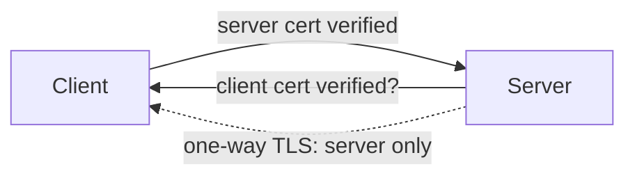

# TLS & certificates

## Why Does This Matter?

TLS is the control that makes every other chapter's assumptions
true: tokens are secret, requests are unmodified, clients are who
mTLS certificates say they are. Go's `crypto/tls` has the unusual
property that its defaults have been *modernized in place*: since
Go 1.17 the defaults enforce TLS 1.2+, and since Go 1.22 cipher
suites follow the same trend, so a plain `tls.Server(conn, nil)` is
already stricter than most hand-tuned configs. The work is knowing
the handful of knobs that remain yours: certificates, client auth,
and rotation.

## Mental Model

TLS gives you three properties per connection: **encryption**
(nobody on the wire reads it), **integrity** (nobody modifies it
undetected), and **authentication** (the peer is the certificate's
subject). Which peers authenticate is your choice:



- **One-way TLS** (public APIs): clients verify the server; the
  client is anonymous or authenticates with a token (chapter 2).
- **Mutual TLS** (internal service mesh): both sides verify with
  certificates from a private CA; identity is cryptographic.

## How It Works

The Go certificate model:

- A `*x509.Certificate` is verified against a pool of trusted roots
  (`RootCAs` for servers you call; `ClientCAs` for clients that
  call you).
- Verification checks the chain, the hostname (server) or EKU
  (client), and expiry. Go does not trust the system store for
  custom pools you build.
- `autocert` is the stdlib-adjacent (golang.org/x/crypto) answer
  for public endpoints: ACME (Let's Encrypt) issuance and renewal
  with zero cron jobs.

## Syntax / API

**A public HTTPS server** (often simpler at the platform layer:
your ingress terminates TLS and Go serves plain HTTP inside the
cluster; terminate in Go when compliance or multi-cloud requires):

```go
srv := &http.Server{
    Addr:    ":443",
    Handler: mux,
    TLSConfig: &tls.Config{
        MinVersion: tls.VersionTLS12, // explicit: audit tools look for it
    },
}
srv.ListenAndServeTLS("cert.pem", "key.pem")
```

**Automatic certificates for a public domain:**

```go
m := &autocert.Manager{
    Cache:      autocert.DirCache("/var/lib/acme"),
    Prompt:     autocert.AcceptTOS,
    HostPolicy: autocert.HostWhitelist("api.example.com"),
}
srv.TLSConfig = m.TLSConfig()
```

**Internal mTLS server:**

```go
clientCA := poolFromFiles(t, "internal-ca.pem")
srv := &http.Server{
    Addr:    ":8443",
    Handler: mux,
    TLSConfig: &tls.Config{
        MinVersion:   tls.VersionTLS13,
        ClientAuth:   tls.RequireAndVerifyClientCert,
        ClientCAs:    clientCA,
        VerifyPeerCertificate: authorizeCN, // map cert to Caller
    },
}
```

**An internal client:**

```go
cert, _ := tls.LoadX509KeyPair("svc.pem", "svc-key.pem")
t := &http.Transport{
    TLSClientConfig: &tls.Config{
        MinVersion: tls.VersionTLS13,
        Certificates: []tls.Certificate{cert},
        RootCAs:    internalCA,
        ServerName: "ledger.internal", // pin the expected service
    },
}
client := &http.Client{Transport: t, Timeout: 5 * time.Second}
```

## Basic Example

Verify that identity-from-certificate feeds the authz chapter's
`Caller`:

```go
func authorizeCN(rawCerts [][]byte, _ [][]*x509.Certificate) error {
    cert, err := x509.ParseCertificate(rawCerts[0])
    if err != nil {
        return err
    }
    if !allowedServices[cert.Subject.CommonName] {
        return errors.New("service not authorized")
    }
    return nil
}
```

## Real-World Example

Certificate expiry is a self-inflicted outage category. The
defense is boring and layered:

1. **Short-lived certs** (90d public via ACME; 24h internal via a
   mesh or SPIFFE): rotation becomes routine, leak windows shrink.
2. **Automated renewal**: `autocert` for public, cert-rotator
   sidecars for mounted secrets.
3. **Monitoring on expiry**, not on renewal job success: alert at
   14 days before any served certificate expires. Renewal failing
   silently is the actual failure mode.

## Production Example

TLS termination placement, decided once per platform:

| Placement | When it is right | Go consequence |
|---|---|---|
| Ingress/LB terminates | Most cloud deployments | Go serves HTTP; protect the pod network |
| Go terminates (public) | Compliance needs end-to-end | `ListenAndServeTLS` + `autocert` |
| mTLS everywhere | Zero-trust internal network | Certificates are the Caller; chapter 2 shrinks to authz |

Load the private key from a file or a secrets manager (chapter 5),
never embed in the binary, never in a gitignored file checked in
"temporarily."

## Common Mistakes

| Mistake | Consequence | Do instead |
|---|---|---|
| `InsecureSkipVerify: true` | TLS becomes expensive plaintext | Fix the CA/`ServerName` instead ([12 Section 4](../12-http-networking/04-clients-and-timeouts.md)) |
| Custom cipher suite lists | Disable-list drift per release | Leave suites at defaults; set only `MinVersion` |
| Expiry monitoring on renewal success | Renewal breaks silently | Monitor served cert expiry directly |
| Long-lived internal certs (years) | Big leak window, painful rotation | 24h-ish internal certs, automated |
| One shared client cert for all services | No per-service identity, no revocation | One cert per service, short-lived |
| Copying TLS configs from blog posts | Pre-1.17 assumptions, weak suites | Start from Go defaults; add `MinVersion` |

## Idiomatic Go

- Set `MinVersion` explicitly for auditability even though defaults
  are already modern.
- Never disable hostname verification; pin `ServerName` for
  non-DNS names.
- `tls.X509KeyPair` in memory, `LoadX509KeyPair` from disk; both
  are pure functions, safe to reload on rotation.

## Performance Considerations

Handshakes are the cost; connections are not. Reuse
`http.Transport` connection pools ([12 Section 4](../12-http-networking/04-clients-and-timeouts.md))
and TLS 1.3's 1-RTT handshake makes new connections cheap. TLS
1.3 also makes session resumption automatic. CPU cost of TLS at
modern hardware is negligible for most services: measure before
adding a termination layer "for performance."

## Concurrency Considerations

`tls.Config` is safe for concurrent use but should be treated as
immutable after serving starts. Rotation replaces the whole config
(or uses `GetCertificate`/`GetClientCertificate` callbacks, which
are consulted per handshake and are the supported hot-reload path).

## Security Considerations

- Key files: `0600`, owned by the service user, from a secret
  manager or mounted secret volume (chapter 5).
- SNI: when one IP serves many names, `GetCertificate` routes by
  SNI; mismatched SNI is a reject.
- Certificate transparency exists for public CAs; your internal CA
  has no such safety net, so protect its root offline and log every
  issuance you do.

## Testing Strategy

- `httptest.NewTLSServer` for handler tests; the client must trust
  the test cert (`tls.Config{InsecureSkipVerify: true}` is
  acceptable *only* against the test server's own cert).
- Integration: start the real server on a loopback port with
  generated certs; assert a handshake succeeds and a wrong-CA
  client fails.
- Expired-cert test: build a cert with a past NotAfter; assert the
  client rejects it (and that your expiry monitor would have
  alerted).

## Interview Questions

1. What does mTLS add over TLS, and where does the identity live
   afterward? (Client cert -> Caller -> authz gates.)
2. Walk through certificate rotation without downtime. (Callback
   or reload; dual-cert windows; expiry monitoring.)
3. Why leave cipher suites at defaults? (Upstream security fixes
   flow automatically; your list rots.)
4. Where should TLS terminate in a Kubernetes deployment, and what
   changes in Go?

## Practice Exercises

1. Generate an internal CA and two service certs; write the mTLS
   server/client pair and prove a third cert is rejected.
2. Add a cert-expiry check command (`go run ./cmd/certcheck`) and
   an alert threshold constant.
3. Rewrite one `InsecureSkipVerify` call with a pinned custom CA
   and `ServerName`.

## Further Reading

- [crypto/tls documentation](https://pkg.go.dev/crypto/tls)
- [autocert package](https://pkg.go.dev/golang.org/x/crypto/acme/autocert)
- [Go 1.22 cryptography notes](https://go.dev/doc/go1.22)
- [SPIFFE: secure production identity](https://spiffe.io/)
