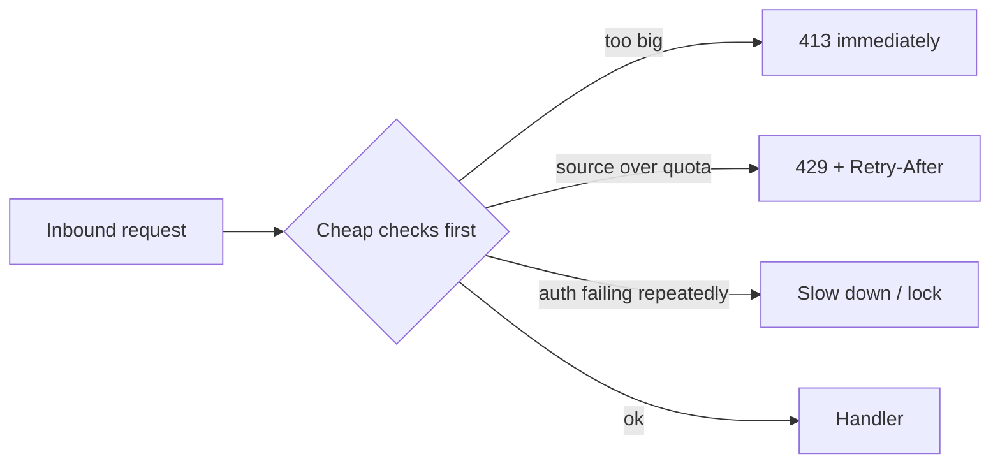

# Limits & hardening

## Why Does This Matter?

Every resource your service exposes can be consumed on purpose.
Rate limiting is the security control that bounds it: per-source
request caps, authentication attempt caps, body-size caps. Go ships
the rate limiter primitives in `golang.org/x/time/rate` and, since
Go 1.25, a concurrent-safe hash map that makes per-key tracking
cheap. The mindset shift: limits are not a feature you add when
abuse happens; they are the boundary definition of what "normal
traffic" means, written down in code.

## Mental Model



Order matters: reject the cheapest failure first. A 100MB body
should die at `MaxBytesReader` before it costs parse time, and an
over-quota source should die at the limiter before it costs a DB
query. Every check you place early is capacity returned to
legitimate traffic under attack.

## How It Works

**Token bucket** (`x/time/rate`): a bucket holds `b` tokens and
refills at `r` per second. A request takes one token; empty bucket
means wait or reject. Burst (`b`) absorbs spikes; rate (`r`) is the
sustained ceiling. This one primitive is every limit below.

Per-identity limits need a limiter per key plus eviction (limiters
for sources that never return leak memory). Since Go 1.25,
`sync.Map` replacement in the stdlib makes per-key state cheap
([08 §4](../08-concurrency/04-sync-primitives.md)); with a small
TTL sweep it is the whole implementation.

## Syntax / API

**Global + per-identity limiters** (the two layers a public API
needs):

```go
type Limiter struct {
    global *rate.Limiter                       // whole-service cap
    keys   sync.Map                            // identity -> *rate.Limiter
    limit  rate.Limit
    burst  int
}

func (l *Limiter) Allow(id string) bool {
    if !l.global.Allow() { return false }
    v, _ := l.keys.LoadOrStore(id, rate.NewLimiter(l.limit, l.burst))
    return v.(*rate.Limiter).Allow()
}
```

**The middleware** ([12 §2](../12-http-networking/02-middleware.md)'s
placement rules: after authn, so identity exists; before handlers):

```go
func RateLimit(l *Limiter, identity func(*http.Request) string) func(http.Handler) http.Handler {
    return func(next http.Handler) http.Handler {
        return http.HandlerFunc(func(w http.ResponseWriter, r *http.Request) {
            if !l.Allow(identity(r)) {
                w.Header().Set("Retry-After", "1")
                http.Error(w, "rate exceeded", http.StatusTooManyRequests)
                return
            }
            next.ServeHTTP(w, r)
        })
    }
}
```

**Body caps and read deadlines** (per-request, no limiter needed):

```go
r.Body = http.MaxBytesReader(w, r.Body, 1<<20) // 1 MiB
```

## Basic Example

Authentication-specific limiting: the login endpoint gets its own
limiter keyed by source IP *and* attempted account, because those
are the two dimensions credential stuffing varies along. A failed
attempt costs more than a successful one (progressive delay), and
the endpoint is the one place a WAF-style "same IP + many accounts"
detection is worth the state.

## Real-World Example

The Section 14 service's chain, with this chapter added:

```text
obshttp.Instrument (metrics outside everything: 429s are traffic)
  -> Recover
  -> ScopedLogger
  -> Authenticate (ch 2: token verification)
  -> RateLimit (identity from the verified Caller, not raw IP)
  -> handler -> service (ownership authz)
```

Keying on the verified identity (not IP) is the difference between
limiting one NAT-stuck customer and limiting everyone behind that
NAT. Anonymous endpoints (health, metrics) get IP-keyed limits and
much smaller quotas: they are infrastructure-facing.

## Production Example

**The 429 contract:** return `Retry-After`, make the body a stable
machine-readable error, and make clients honor it with jittered
backoff ([15 §3](../15-microservices/03-resilience-patterns.md)'s
retry discipline applies on both sides of the wire). A client that
does not honor 429 becomes your problem twice: once as load, once
as the incident report.

**Downstream limits are limits too:** the number of in-flight
requests to a dependency is a resource whose exhaustion is an
outage; the bulkhead ([15 §3](../15-microservices/03-resilience-patterns.md))
is a rate limiter for concurrency. Bound goroutine fan-out with a
semaphore ([08 §5](../08-concurrency/05-patterns.md)).

## Common Mistakes

| Mistake | Consequence | Do instead |
|---|---|---|
| Per-IP limits only | NAT/proxy collateral damage | Identity-keyed where authn exists; IP as fallback |
| Unbounded per-key map | Memory leak as an attack surface | Evict stale limiters (TTL sweep) |
| `time.Sleep` in the hot path to "throttle" | Goroutine pile-up, memory blowout | Reject (429) or reserve tokens, never block workers |
| No limit on auth endpoints | Credential stuffing at line rate | Aggressive, layered auth limits |
| Forgetting body-size caps | 100MB JSON = OOM | `MaxBytesReader` on every untrusted body |
| Limiting after expensive work | Attacker spends your DB to get 429s | Cheap checks first, in order |
| Fixed windows (`per calendar minute`) | 2x burst at window edges | Token bucket or sliding window |

## Idiomatic Go

- `x/time/rate` is the ecosystem's token bucket; wrap it, do not
  rewrite it.
- Rejection paths return structured errors through the same
  mapping as the rest of the API (one 429 shape, one place).
- `http.MaxBytesReader` is stdlib and wires the error into the
  server: use it instead of manual counters.

## Performance Considerations

A token-bucket check is an atomic add: nanoseconds. The costs are
per-key state (bounded by eviction) and the map lookup (a
`sync.Map` read is ~tens of ns). Do not shard or optimize before
profiling ([19 §1](../19-performance/01-measure-first.md)); the
limiter is never the bottleneck unless it blocks, which is the
mistake above.

## Concurrency Considerations

`rate.Limiter` is safe for concurrent use; per-key limiters are
separate instances, so contention lives in the key map.
`LoadOrStore` keeps creation race-free. Eviction sweeps must not
remove a limiter between its check and use: remove only entries
idle beyond the TTL (a stale-entry regeneration is harmless and
self-correcting).

## Security Considerations

This chapter *is* the DoS chapter: cheap-first ordering, bounded
bodies, per-identity caps, and bulkheads compose into the
availability story. Also: 429s are a signal to monitor (chapter 2's
metrics, add a reason label); a sudden per-identity 429 spike is an
attack in progress, visible before it hurts.

## Testing Strategy

- Deterministic tests with an injected clock or `rate.Limiter`
  injected rates: N allowed, N+1 rejected, `Retry-After` present.
- Burst-then-sustained pattern test: b absorbs the burst, r caps
  the sustained rate.
- Load test in staging with the limiter configured 10x tighter
  than prod; confirm 429s and dashboards, not 5xx.

## Interview Questions

1. Design rate limiting for a public API with authenticated and
   anonymous traffic. (Two layers, key choice, eviction, 429
   contract.)
2. Why is `time.Sleep` throttling dangerous in Go? (Goroutine
   growth; [08 §7](../08-concurrency/07-pitfalls.md) leak shapes.)
3. Where do rate limits sit relative to authn in the middleware
   chain, and why does the order differ for identity vs IP keys?
4. A customer behind a big NAT complains of 429s. What do you
   change?

## Practice Exercises

1. Add the `Limiter` above to the service with a TTL eviction
   sweep; write the test that a stale key's limiter is recreated
   fresh.
2. Add `MaxBytesReader` to the service's decode path and the test
   that a 2MB body yields 413, never 500.
3. Chart 429s by identity-prefix from the metrics; write the alert
   you would set on it.

## Further Reading

- [x/time/rate documentation](https://pkg.go.dev/golang.org/x/time/rate)
- [Go 1.25 release notes: sync.Map improvements](https://go.dev/doc/go1.25)
- [OWASP: Denial of Service cheat sheet](https://cheatsheetseries.owasp.org/cheatsheets/Denial_of_Service_Cheat_Sheet.html)
- [Stripe rate limiting article](https://stripe.com/blog/rate-limiters)
