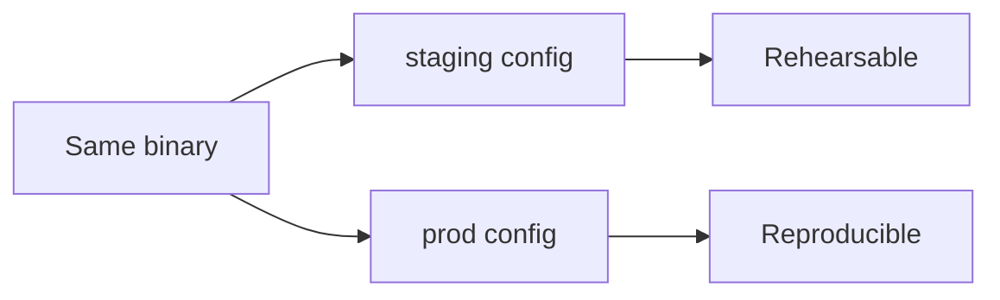

# Configuration & secrets in production

## Why Does This Matter?

Most 3 a.m. incidents include a configuration element: the value
that was right in staging and wrong in prod, the flag nobody
remembered setting, the secret that expired silently.
[14 §2](../14-backend-development/02-configuration-and-secrets.md)
built the loader and the redaction type; this chapter is the
operational layer: what a production fleet needs from configuration
that a single dev process does not.

## Mental Model

Configuration is the API between your code and the operator who
runs it. It has three tiers, and the discipline is keeping each in
its lane:

| Tier | Examples | Changes | Owner |
|---|---|---|---|
| Build-time | version string, build flags | per release | CI |
| Boot-time | DSN, listen address, log level | per process start | platform |
| Runtime | feature flags, throttle rates | continuously, atomically | service/product |

Everything here follows from one rule: **the binary is identical in
every environment; only configuration differs.** When behavior
diverges per environment because of code, you have lost the ability
to reproduce prod in staging.



## How It Works

**Precedence, written down once:** defaults in code < config file <
environment variables. The environment wins because platforms
(Kubernetes, ECS, systemd) inject environment variables natively;
that is the seam between your service and its platform.

**Fail at boot, loudly, completely.** The batched-error loader from
[14 §2](../14-backend-development/02-configuration-and-secrets.md)
is the pattern: collect every invalid value, report all of them,
exit non-zero. A service that boots half-configured and discovers
the missing DSN at first request converts a deploy-time failure
into an incident at an arbitrary later time.

**Secrets** ([21 §5](../21-security/05-secrets-and-supply-chain.md)
covers the redaction types; here is the delivery): the two viable
patterns are

1. **Platform-injected env vars** from a secret store (K8s
   `secretKeyRef`, ECS secrets): the secret store handles audit,
   rotation is a restart.
2. **Mounted secret files** projected by the platform (CSI driver,
   Docker secret): rotation can be file-watch-based without a
   restart.

Choose one per fleet. A service that checks three fallbacks for
secrets is three services to reason about during rotation.

## Syntax / API

The runtime tier: atomic config swap. This is the whole mechanism:

```go
type atomicConfig struct {
    v atomic.Pointer[Config]
}

func (a *atomicConfig) Load() *Config { return a.v.Load() }

func (a *atomicConfig) Store(next Config) error {
    if err := next.Validate(); err != nil {
        return fmt.Errorf("config rejected: %w", err)
    }
    a.v.Store(&next)
    return nil
}
```

Every request reads `cfg := a.Load()` once at the top and uses that
snapshot for the request: one view per request, no torn reads,
no mid-request flag flips ([14 §5](../14-backend-development/05-observability-health-flags.md)).

## Basic Example

A config struct that validates itself, so boot and hot-reload
share one code path:

```go
type Config struct {
    Addr           string
    ShutdownGrace  time.Duration
    MaxConcurrency int
}

func (c Config) Validate() error {
    var errs []error
    if c.Addr == "" {
        errs = append(errs, errors.New("ADDR required"))
    }
    if c.ShutdownGrace <= 0 {
        errs = append(errs, errors.New("SHUTDOWN_GRACE must be positive"))
    }
    if c.MaxConcurrency < 1 || c.MaxConcurrency > 10_000 {
        errs = append(errs, errors.New("MAX_CONCURRENCY out of range"))
    }
    return errors.Join(errs...)
}
```

`errors.Join` keeps all violations visible; the boot path and the
reload path call the same `Validate`, so a value hot-reload accepts
is a value boot accepts.

## Real-World Example

The Section 14 service's `config.LoadOS` follows this exactly:
batched boot errors, `Secret` values that render as `"REDACTED"` in
any log, and a `Summary()` that prints shapes not values. The
remaining production gap is tier 3: the service's feature flags
([14 §5](../14-backend-development/05-observability-health-flags.md))
are the runtime tier; their reload is an atomic swap with a health
endpoint showing the active generation.

## Production Example

**The rotation clock.** Every secret has an expiry; every expiry
needs an owner. The operational pattern:

- Database credentials: platform-injected, rotated by the store,
  restart-or-reconnect handled by the pool
  ([13 §3](../13-databases/03-pooling-drivers-migrations.md)).
- Signing keys: two-key overlap window during rotation
  ([21 §2](../21-security/02-authentication-and-authorization.md)'s
  rotation design).
- Third-party API keys: dual-key window from the provider; the
  config hot-swap above flips them without a deploy.

**Config diffs are deploy diffs.** A config change goes through the
same review/staging/canary path as code ([26
§4](../26-go-interview-preparation/04-senior-scenarios.md)'s senior
scenarios include "the config change that took prod down"). The
tooling differs; the discipline does not.

## Common Mistakes

| Mistake | Consequence | Do instead |
|---|---|---|
| Per-environment builds or tags | Unreproducible prod | One binary; config differs |
| Read env vars at point of use | Untestable, order-dependent | Load once at boot; pass the struct |
| First-error exit at boot | Fix one, deploy, hit the next | Batch all validation errors |
| Secrets in config files in git | Permanent leak | Secret store or mounted files |
| Mutable global config read per field | Torn reads under reload | One atomic snapshot per request |
| Config that cannot be rehearsed | Prod-only flags nobody tests | Staging uses the same keys with different values |

## Idiomatic Go

- `os.Getenv` appears exactly once per variable, in the loader.
- Config structs are plain structs with a `Validate` method; no
  registry magic.
- `atomic.Pointer` for hot config; the stdlib needs nothing else.

## Performance Considerations

Loading config at boot costs nothing on the request path. The
atomic pointer load is a single read instruction; the mistake is
re-reading env vars or re-parsing files per request, which shows up
in profiles as `os.Getenv` in hot stacks
([19 §1](../19-performance/01-measure-first.md)).

## Concurrency Considerations

Config swap races are the design center: readers never block,
writers publish complete snapshots, and requests pin one snapshot
for their whole lifetime. Never mutate a `Config` struct in place
under a mutex while readers hold copies: publish new, immutable
snapshots.

## Security Considerations

Redaction belongs in types (`Secret.LogValue`), config summaries
must be allowlists of shapes, and error messages from validation
never echo values, only names. Audit: config dumps at boot go to
stdout logs that ship to your log platform; treat that output as
published.

## Testing Strategy

- Table-driven `Validate` tests: each invalid value asserts its
  message; all-errors-at-once asserted too.
- Hot-swap test: reload with a valid config succeeds mid-request;
  the in-flight request still sees the old snapshot.
- Boot test in CI: the service starts with staging-shaped config
  and serves a health check, proving the loader end to end.

## Interview Questions

1. Walk through your precedence chain and what happens when two
   layers disagree.
2. A secret expires during a traffic peak. What did your design
   do ahead of time? (Rotation windows, pool reconnect, dual keys.)
3. Why validate configuration at boot when Kubernetes already
   limits what env vars exist?
4. How do you make a config change as reviewable as a code change?

## Practice Exercises

1. Add `Validate` to the Section 14 service's config and a test
   that boots with an empty environment and asserts the batched
   error list.
2. Implement the `atomicConfig` hot-swap with an endpoint that
   reloads, plus the in-flight-request-sees-old-snapshot test.
3. Add a `config summary` log line that a reviewer can diff
   between staging and prod.

## Further Reading

- [12-factor app: config](https://12factor.net/config)
- [errors.Join documentation](https://pkg.go.dev/errors#Join)
- [Kubernetes: secrets best practices](https://kubernetes.io/docs/concepts/security/secrets-good-practices/)
