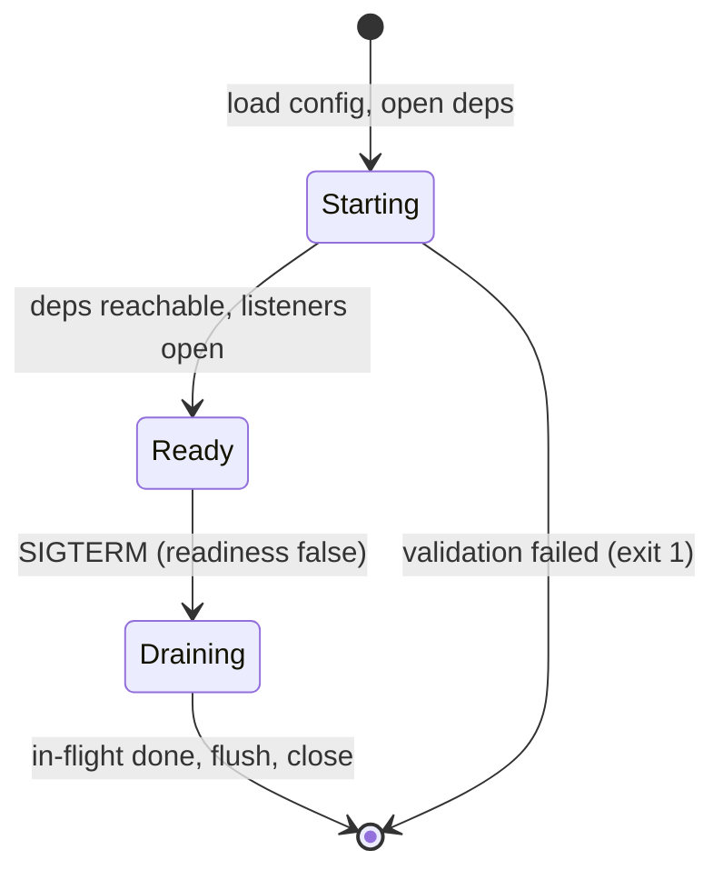

# The server lifecycle

## Why Does This Matter?

A process is born and dies thousands of times during an ordinary
week: deploys, autoscaling, node drains, evictions. Each birth and
death is a chance to drop requests, leak resources, or serve
traffic you cannot handle. [12 Section 5](../12-http-networking/05-graceful-shutdown.md)
built the drain handshake for one HTTP server; this chapter
completes the lifecycle: the boot sequence, readiness gating, the
full component shutdown order, and the container signals that
trigger it all.

## Mental Model

The lifecycle is a state machine with three states, and every
transition has a contract:



- **Starting**: config loaded, dependencies opened, metrics/tracing
  initialized ([20 Section 3](../20-observability/03-tracing-and-otel.md)'s
  init-first rule). Not yet routed traffic.
- **Ready**: readiness endpoint reports true; the platform routes.
- **Draining**: readiness false immediately on SIGTERM; new work
  stops arriving; in-flight work finishes; exporters flush; close
  in reverse-open order.

The one-sentence version: **flip readiness first, drain in-flight
second, flush observability last, close stores last of all.**

## How It Works

**Signals.** In containers you get SIGTERM (the stop signal) and a
grace period (Kubernetes `terminationGracePeriodSeconds`, default
30s). SIGINT is Ctrl-C, same handling locally. SIGKILL ends the
conversation: nothing after it runs, which is why the drain must
fit inside the grace period with margin.

**The boot order** is the reverse of shutdown, and it is worth
writing down as code review checklist:

```text
1. parse + validate config          (fail fast, batched errors)
2. init logger; log boot config summary
3. init metrics + tracer            (before any request span)
4. open stores / pools              (ping, not just construct)
5. start background workers         (consumers, relays, tickers)
6. open listeners; flip ready
7. block on signal
```

**Readiness versus liveness**, the two probes:

| Probe | Answers | Must check | Must NOT check |
|---|---|---|---|
| Liveness | "is the process sane?" | nothing external: its own loop | dependencies (restart loops) |
| Readiness | "should I receive traffic now?" | critical dependencies, capacity | whether a deploy finished |

The liveness-checks-a-dependency bug is the classic: dependency
hiccups restart every pod, the fleet thrashes, and the hiccup
becomes an outage. [14 Section 5](../14-backend-development/05-observability-health-flags.md)
built the tiered readiness; liveness stays trivial forever.

## Syntax / API

The shutdown sequence from `main`, composed from the pieces the
handbook built:

```go
ctx, stop := signal.NotifyContext(context.Background(), os.Interrupt, syscall.SIGTERM)
defer stop()

// ... boot steps 1-6, each with its close function held ...
defer closeStore()      // opened first, closed last
defer shutdownTracing(context.Background()) // flush spans after drain
// readiness flip happens inside run() on ctx.Done

if err := run(ctx, srv, logger, cfg.ShutdownGrace); err != nil { ... }
```

`run` ([12 Section 5](../12-http-networking/05-graceful-shutdown.md)'s
extracted form, testable in-process) does: `srv.Shutdown(graceCtx)`
to drain, then `Close()` if the grace expired. Workers started at
step 5 need the same treatment: a `Worker.Stop(ctx)` that stops
accepting, finishes in-flight items, and joins, called between
`Shutdown` and the flush.

## Basic Example

A background worker that shuts down cleanly:

```go
func (w *Worker) Stop(ctx context.Context) error {
    close(w.quit)                // signal: stop taking work
    done := make(chan struct{})
    go func() { w.wg.Wait(); close(done) }()
    select {                     // bounded join: never hang shutdown
    case <-done:
        return nil
    case <-ctx.Done():
        return fmt.Errorf("worker did not stop in grace: %w", ctx.Err())
    }
}
```

The `WaitGroup` counts in-flight items ([08 Section 4](../08-concurrency/04-sync-primitives.md));
`Add` happens before the work starts, `Done` in a defer: the
goroutine-leak rule ([08 Section 7](../08-concurrency/07-pitfalls.md)).

## Real-World Example

The Section 14 service's `run` function is the reference: signal ->
shutdown with grace -> forced close. The production extension this
chapter adds is component ordering. When it shuts down, the
service: flips ready, drains HTTP, stops the (hypothetical) Kafka
consumer with a bounded join, flushes spans, closes the store.
Each step has a timeout; the sum of step timeouts must be less than
the platform's grace period, with margin: that arithmetic is a
deploy-time check, not a hope.

## Production Example

**Zero-downtime boot** needs the mirror image of graceful death:
the new pod must prove readiness *before* the old one stops
receiving traffic. Kubernetes rolling updates do this if (and only
if) the readiness probe is honest: a probe that returns ready
before dependencies are reachable causes a brief 5xx burst every
deploy. The Section 14 service's tiered readiness exists exactly
for this; the `minReadySeconds` and surge settings turn the
handshake smooth.

**PreStop hooks** are usually unnecessary in Go: the SIGTERM
*is* the notification. Use a `preStop: sleep 5` only when an
upstream (a load balancer without endpoint watch) needs time to
notice endpoint removal; the sleep runs before SIGTERM and eats
grace period.

## Common Mistakes

| Mistake | Consequence | Do instead |
|---|---|---|
| Liveness checks a dependency | Fleet-wide restart loops | Liveness checks only itself |
| Drain exceeds the grace period | SIGKILL mid-request | Measure p100 drain; set grace = drain + margin |
| `ListenAndServe` error ignored | Port conflict crashes silently | Log and exit non-zero; probe catches it |
| Stores closed before HTTP drained | In-flight panics on closed pool | Close stores last (reverse open order) |
| No `ReadHeaderTimeout` | Slowloris exhaustion | Always set it ([12 Section 4](../12-http-networking/04-clients-and-timeouts.md)) |
| Ready=true before deps pinged | 5xx burst on every deploy | Readiness pings critical deps |
| Missing signal handling locally | Ctrl-C leaves orphan goroutines | Same `signal.NotifyContext` path everywhere |

## Idiomatic Go

- `signal.NotifyContext` is the whole signal story; no channels of
  `os.Signal` in new code.
- Extract `run(ctx, deps...)` from `main` so shutdown is testable
  in-process (the Section 14 pattern).
- Every component opened at boot returns a close function; `main`
  composes them in reverse.

## Performance Considerations

Startup time is availability: every second in `Starting` is a
second a replacement pod is not absorbing traffic. Lazy-open the
slow dependencies only when the readiness probe can honestly cover
them, and keep p99 boot under the probe's failure threshold
(`initialDelaySeconds + failureThreshold * periodSeconds`).

## Concurrency Considerations

Shutdown is the concurrency review moment: every goroutine started
at boot must be joined or provably trivial. The audit: search for
`go func` at boot; each one needs an owner, a stop signal, and a
`wg.Wait()` path ([08 Section 7](../08-concurrency/07-pitfalls.md)'s leak
shapes are exactly the ones that survive shutdown).

## Security Considerations

Shutdown ordering is security ordering: flush the audit log
([25 Section 3](../25-fintech-with-go/03-integrity-and-exactly-once.md))
before the process dies, and do not close the secret-mounted files
before the last credential use. On `SIGKILL` none of this runs:
design the durable parts (outbox, audit table) to be
crash-consistent at commit time, not at exit time.

## Testing Strategy

- The in-process shutdown test ([12 Section 5](../12-http-networking/05-graceful-shutdown.md)):
  start the real `run` on a port, fire the context cancel, assert
  in-flight requests completed and the port freed.
- Probe contract tests: readiness true with deps up, false with a
  dependency refused; liveness always true.
- Chaos drill: kill pods under load in staging; assert zero 5xx
  beyond the drain window and no leaked goroutines in the pprof
  endpoint afterward ([20 Section 5](../20-observability/05-incident-debugging.md)).

## Interview Questions

1. Walk the full SIGTERM sequence of a service you designed, with
   timeouts per step.
2. Why must liveness never check dependencies? Describe the
   failure cascade.
3. Your deploys cause a 2-second 5xx burst. Give three candidate
   causes and their tests. (Readiness lying, drain exceeding
   grace, connection reuse without keep-alive drain.)
4. Where do background workers sit in the shutdown order and why?

## Practice Exercises

1. Add a `Worker` with a bounded `Stop` to the Section 14 service
   and the test that SIGTERM joins it before the server closes.
2. Compute your service's grace-period budget: p100 drain time +
   worker join + flush, times safety factor, versus the K8s grace.
3. Break readiness on purpose (point it at a dead dependency) and
   watch a rolling update stall; then fix it.

## Further Reading

- [Kubernetes: container lifecycle](https://kubernetes.io/docs/concepts/containers/container-lifecycle-hooks/)
- [signal.NotifyContext documentation](https://pkg.go.dev/os/signal#NotifyContext)
- [Google SRE: graceful degradation](https://sre.google/sre-book/handling-overload/)
