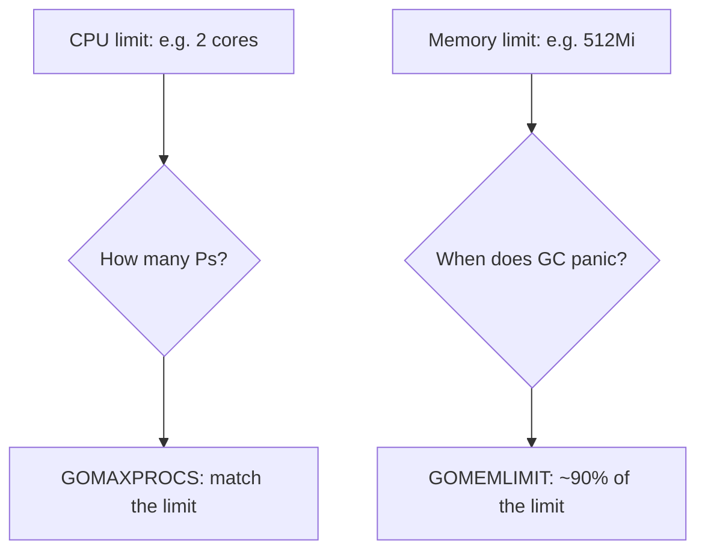

# Resource limits in containers

## Why Does This Matter?

A Go service in a container lives inside three ceilings: the CPU
limit, the memory limit, and the process's view of both. Get these
wrong and the failure is the worst kind: silent, sudden, and at
peak traffic. The Go runtime has first-class knobs for all of it
(`GOMAXPROCS`, `GOMEMLIMIT`), and since Go 1.25 the container-aware
defaults are close to right. This chapter is the mapping between
the platform's limits and the runtime's knobs, plus the bounds for
everything the runtime does not manage.

## Mental Model

Two ceilings, two questions:



- **CPU limit** caps the cores you may use. `GOMAXPROCS` sets how
  many OS threads the scheduler runs code on simultaneously. A
  2-CPU-limit pod with a host-default `GOMAXPROCS=64` oversubscribes
  the scheduler: throttling pauses at arbitrary points, p99 grows
  ([08 §6](../08-concurrency/06-concurrency-vs-parallelism.md)).
- **Memory limit** is a cgroup kill line: cross it and the kernel
  OOM-kills the process, no panic, no traceback, no shutdown hook.
  `GOMEMLIMIT` is the runtime's soft memory target: set it below
  the cgroup limit and the GC works hard as you approach; exceed it
  and the kernel does the talking.

## How It Works

**Go 1.25+ defaults** (introduced Go 1.25, container-aware
runtime): `GOMAXPROCS` respects the cgroup CPU limit, and
`GOMEMLIMIT` defaults to ~90% of the memory limit when a cgroup
limit exists. On Go 1.25+, a plain containerized service needs
neither knob in the common case. On older toolchains, or to
override, set both explicitly; the knobs remain the documented
contract.

**The sizing arithmetic**, worth a table in every service README:

| Platform setting | Runtime knob | Rule |
|---|---|---|
| `limits.cpu: 2` | `GOMAXPROCS` | 2 (or unset on Go 1.25+) |
| `limits.memory: 512Mi` | `GOMEMLIMIT` | ~460Mi (90%) |
| `requests.cpu` | (scheduler only) | set near p95 usage |
| `requests.memory` | (scheduler only) | set near steady-state RSS |

The requests/limits split is its own decision: requests reserve
capacity for scheduling; limits cap usage. CPU limits in
Kubernetes are enforced by throttling, which punishes bursty
latency; a common pattern is `limits.memory` (hard kill line) but
no CPU limit, letting the scheduler absorb bursts while memory
stays strictly bounded.

## Syntax / API

**Reading what the runtime decided** (export it as metrics, [20
§2](../20-observability/02-metrics.md)):

```go
// Chart these four; each answers one incident question.
runtime.GOMAXPROCS(0)        // scheduler width
runtime.NumGoroutine()       // concurrency pressure
runtime/metrics: /gc/heap/allocs:bytes  // heap growth
runtime/metrics: /gc/pauses:seconds     // GC stalls
```

**Bounds the runtime does not manage** (per dependency, per
direction):

```go
db.SetMaxOpenConns(20)   // pool ceiling [13 §3]
sem := make(chan struct{}, 64) // outbound concurrency cap (bulkhead)
r.Body = http.MaxBytesReader(w, r.Body, 1<<20) // request body [21 §4]
```

File descriptors are the invisible ceiling: each open connection
(SQL pool, HTTP client conns, listening sockets) is an FD; the
default soft limit (often 1024) is reachable by a modest service
at peak. Raise it in the container spec and keep connection pools
within it.

## Basic Example

The Dockerfile/K8s pair that matches:

```yaml
# deployment.yaml
resources:
  requests: { cpu: "1", memory: 256Mi }
  limits:   { memory: 512Mi }        # no CPU limit: no throttling
env:
  - name: GOMAXPROCS                  # explicit for pre-1.25 runtimes
    value: "1"
  - name: GOMEMLIMIT
    value: "460MiB"
```

The memory limit and `GOMEMLIMIT` are set together, always: one
without the other is either a kill line with no GC defense or a GC
target with no enforcement.

## Real-World Example

The OOM-kill cascade, and why `GOMEMLIMIT` is the fix: a service
handles a 2x traffic spike; heap doubles; GC (with default GOGC)
lets the heap grow to 2x live size before collecting; the cgroup
limit crosses at the worst moment; the kernel kills the pod; the
remaining pods absorb the spike; they OOM too. With `GOMEMLIMIT`
set at 90%, the same spike makes GC run more frequently instead:
latency rises modestly, availability holds. [19
§2](../19-performance/02-memory-and-allocations.md) covers the GC
mechanics; this is its production framing.

## Production Example

**Throttling disguised as GC**: p99 spikes correlate with CPU
throttling metrics (`container_cpu_cfs_throttled_seconds_total`),
not GC pauses. Cause: `GOMAXPROCS` larger than the CPU limit, so
the kernel slices the quota into gaps the scheduler experiences as
stalls. Fix: match `GOMAXPROCS` to the limit (or drop the CPU
limit). The chart pair (throttling + GC pauses) tells you which
within a minute; [20 §5](../20-observability/05-incident-debugging.md)
has the incident flow.

## Common Mistakes

| Mistake | Consequence | Do instead |
|---|---|---|
| `GOMEMLIMIT` unset with a memory limit | OOM kills at peak | Set to ~90% of limit (auto on Go 1.25+) |
| `GOMAXPROCS` > CPU limit (pre-1.25) | Throttling stalls, p99 spikes | Match the limit |
| CPU limit set low for "safety" | Throttled bursts | Requests near p95, no CPU limit or generous one |
| Memory request = memory limit | No burst headroom; evictions | Request steady-state, limit for burst |
| Unbounded pools/fan-out | FD exhaustion, downstream collapse | Pool ceilings + bulkheads everywhere |
| `GOGC` tweaks before `GOMEMLIMIT` | Cargo-cult tuning | GOMEMLIMIT first; GOGC only with profiler evidence |

## Idiomatic Go

- Set knobs via environment, not code; the runtime reads them
  before `main` runs.
- `runtime/metrics` over `runtime.ReadMemStats` for exported
  signals: cheaper, stable keys.
- A service that knows its limits prints them at boot
  (`GOMAXPROCS`, `GOMEMLIMIT`, pool ceilings): the first line of
  every capacity incident.

## Performance Considerations

GC tuning order for services ([19 §2](../19-performance/02-memory-and-allocations.md)):
1. set `GOMEMLIMIT`; 2. reduce allocations; 3. only then consider
`GOGC`. Over-provisioned `GOMAXPROCS` adds scheduler overhead
without parallelism gains: more Ps than available cores is pure
contention ([08 §6](../08-concurrency/06-concurrency-vs-parallelism.md)).

## Concurrency Considerations

Every unbounded concurrent structure is a resource-limit bug:
unbounded channel fan-out, uncapped worker pools, per-request
goroutines with no semaphore. The container limit converts each
into an OOM kill eventually. The audit: one bulkhead per
dependency, one semaphore per fan-out ([15 §3](../15-microservices/03-resilience-patterns.md)).

## Security Considerations

Limits are availability controls ([21 §4](../21-security/04-limits-and-hardening.md)):
a tenant that can allocate unbounded memory in your process bypasses
every other defense. FD and connection ceilings also cap
connection-exhaustion attacks; the limiter is the front door, the
limits are the walls.

## Testing Strategy

- Load test to the memory limit in staging with `GOMEMLIMIT`
  active: assert GC absorbs, no OOM, and chart the GC frequency
  cost.
- Throttling test: run with `GOMAXPROCS` deliberately mismatched
  and show the p99 regression; the sensitivity is the point.
- Chaos: `kubectl delete pod` under load repeatedly; assert zero
  failed requests after drain ([02's lifecycle test](02-server-lifecycle.md)).

## Interview Questions

1. Your pod gets OOM-killed at peak. Walk the diagnosis. (Heap
   trend, `GOMEMLIMIT` set?, live-size growth, leak vs spike.)
2. Why can a CPU limit make p99 worse without any CPU starvation?
   (Throttling slices; scheduler stalls.)
3. What does Go 1.25 change about container defaults and what
   remains your job?
4. Where do FDs enter capacity planning for a fan-out service?

## Practice Exercises

1. Export the four runtime metrics above from the Section 14
   service and write the Grafana queries.
2. Stage an OOM: set the memory limit to 64Mi on the service,
   watch the kill, then add `GOMEMLIMIT` and watch GC absorb.
3. Write the capacity table (conns, FDs, goroutines, memory) for
   the service from its config alone.

## Further Reading

- [A Guide to the Go Garbage Collector: GOMEMLIMIT](https://go.dev/doc/gc-guide)
- [Kubernetes: resource management](https://kubernetes.io/docs/concepts/configuration/manage-resources-containers/)
- [Go runtime metrics package](https://pkg.go.dev/runtime/metrics)
