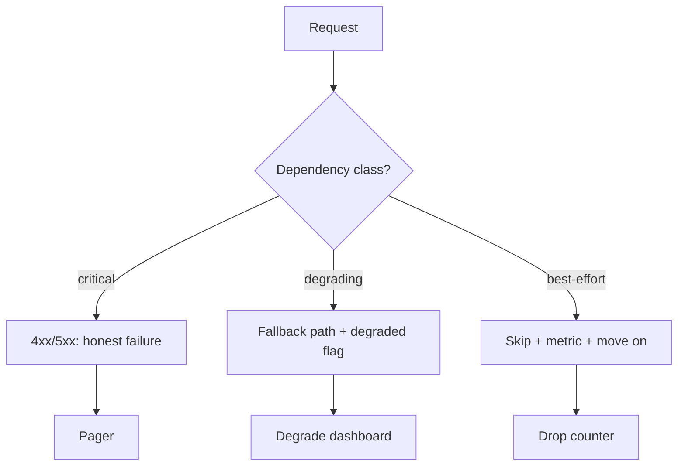

# Dependency failures & degradation

## Why Does This Matter?

Your service's reliability is the composition of its dependencies'
reliabilities, and composition is where the engineering is: ten
dependencies at 99.9% each do not give you 99.9%; without design,
they give you 99%. ([15 §3](../15-microservices/03-resilience-patterns.md)
built the per-call mechanics: timeouts, retries, breakers,
bulkheads. This chapter is the per-system layer: deciding, ahead of
time, what each dependency's failure means for the product, and who
owns that decision.

## Mental Model

Every dependency gets a classification, decided before the
incident:

| Class | Meaning | On failure |
|---|---|---|
| Critical | Feature dies without it | Fail the request honestly; page |
| Degrading | Feature partially works | Fall back; flag the response |
| Best-effort | Only polish dies | Drop silently (with a metric) |



The classification is a product decision with an engineering
signature: can the user complete the task? A payments API can
degrade analytics but cannot degrade the ledger write
([25 §3](../25-fintech-with-go/03-integrity-and-exactly-once.md)):
wrong answers in a ledger are worse than no answers.

## How It Works

**The fallback menu**, in order of honesty:

1. **Cached result** ([13 §5](../13-databases/05-caching-with-redis.md)):
   stale-but-labeled beats error for read-heavy features. The label
   matters: responses carry `degraded: true` so clients (and
   support) know.
2. **Static default**: the safe constant. Fraud thresholds default
   to "review" when the risk engine is down: conservative, not
   clever.
3. **Queue-and-continue**: writes go to durable storage for later
   processing: the outbox ([15 §4](../15-microservices/04-idempotency-sagas-outbox.md))
   is this pattern for events.
4. **Fail the request**: when no fallback is honest, a fast 5xx is
   the correct answer. Masking failure with a wrong 200 is how
   incidents become data-corruption incidents.

**Propagation of degradation**: a degraded response from a
dependency makes your response degraded; the flag travels (header,
field, log attribute) so dashboards show the true blast radius, and
SLOs ([20 §4](../20-observability/04-slos-and-alerting.md)) count
degraded-from-correct separately from failed.

## Syntax / API

The per-dependency wiring in one place, reviewable:

```go
type Deps struct {
    risk   *resilience.Breaker // critical: no fallback
    fxrate *resilience.Breaker // degrading: cached fallback
    spam   *resilience.Breaker // best-effort: skip
}

func (s *Service) Charge(ctx context.Context, in ChargeInput) (Receipt, error) {
    if err := s.deps.risk.Do(ctx, s.checkRisk(in)); err != nil {
        return Receipt{}, fmt.Errorf("risk: %w", err) // honest failure
    }
    rate, ok := s.deps.fxrate.DoCached(ctx, in.Currency) // stale ok
    if !ok {
        log.FromContext(ctx).Warn("fx degraded", "currency", in.Currency)
    }
    _ = s.deps.spam.Do(ctx, s.reportSpam(in)) // best-effort; error ignored
    ...
}
```

The breaker type is [15 §3](../15-microservices/03-resilience-patterns.md)'s
tested implementation; this chapter's addition is the class tag on
each instance, visible in code review and dashboards.

## Basic Example

The cache fallback with honest labeling:

```go
func (s *Service) GetQuote(ctx context.Context, sym string) (Quote, error) {
    q, err := s.live.Quote(ctx, sym)
    if err == nil {
        return q, nil
    }
    if q, ok := s.cache.Get(sym); ok {
        q.StaleFor = time.Since(q.At) // the label
        return q, nil
    }
    return Quote{}, fmt.Errorf("quotes unavailable: %w", err)
}
```

## Real-World Example

Payment provider outage, three services, three designs:

- The **naive** one retries hard and fails open: charges queue in
  memory, memory grows, OOM ([03](03-resource-limits.md)'s
  unbounded-queue row), then total outage.
- The **masked** one returns 200 with "pending" it never
  reconciles: customers see success, money never moves, the
  support channel burns.
- The **designed** one: breaker opens (fast 5xx), the outbox holds
  durable pending charges, the dashboard shows degraded, the
  recovery job replays idempotently ([25 §3](../25-fintech-with-go/03-integrity-and-exactly-once.md)'s
  tested relay). Customers see honest failures and automatic
  completion.

## Production Example

**Degradation dashboards and ownership**: each dependency's class,
fallback, and owner name live in one table (the runbook's first
page, [20 §5](../20-observability/05-incident-debugging.md)). When
the risk engine browns out, the on-call reads: class critical, no
fallback, expected user impact "charges fail," escalation
"payments lead." The decision was made months ago; the incident
executes it.

**Game days** prove the design: kill the risk engine in staging;
assert charges fail fast (not slow), no retries storm, the
dashboard flips, the pager fires. The [15
§3](../15-microservices/03-resilience-patterns.md) storm tests are
this at unit scale; the game day is it at system scale.

## Common Mistakes

| Mistake | Consequence | Do instead |
|---|---|---|
| One retry policy for all deps | Storms against dead deps; nothing for brownouts | Per-dep budget + breaker ([15 §3](../15-microservices/03-resilience-patterns.md)) |
| Fallback without labeling | Clients trust stale data | `degraded` flags everywhere |
| In-memory queues for durability | OOM, silent loss | Durable outbox |
| Failing open on security checks | Degradation becomes a breach | Authz never fails open ([21 §2](../21-security/02-authentication-and-authorization.md)) |
| No owner per dependency | Incident-time improvisation | The class/fallback/owner table |
| Masking with wrong 200s | Data corruption, silent | Honest 5xx beats fake 200 |

## Idiomatic Go

- Errors wrapped with the dependency name (`"risk: ..."`) so the
  mapping ([05 §2](../05-errors/02-error-design.md)'s
  HTTP table) and the dashboard attribute are automatic.
- Fallbacks return values carrying their own staleness; the type
  system keeps honesty cheap.
- `context.Context` cancellation is the universal
  degradation signal: a canceled context unwinds every fallback
  path for free ([08 §3](../08-concurrency/03-context.md)).

## Performance Considerations

Degradation paths must be cheaper than the healthy path (cache
reads, constants, no-ops), or the fallback becomes the new
bottleneck during incidents exactly when you need headroom. Load
test the degraded mode explicitly: it has its own capacity profile.

## Concurrency Considerations

The breaker's half-open probe ([15 §3](../15-microservices/03-resilience-patterns.md))
and the bulkhead's queue bounds are the concurrency controls of
degradation: together they cap how much capacity a failing
dependency consumes. Unbounded retry queues are the leak shape
that survives shutdown ([08 §7](../08-concurrency/07-pitfalls.md)).

## Security Considerations

Fail-open is the vulnerability: a login flow that "degrades" by
accepting everyone, a rate limiter that degrades to unlimited, an
authz check that degrades to allow. The class table must mark
security controls as critical (fail closed), and the game day must
prove it.

## Testing Strategy

- Per-class tests: critical fails fast with 5xx; degrading serves
  cache with the stale label; best-effort drops with a metric.
- Breaker integration: half-open admits one probe; recovery
  restores full rate.
- The game day script (dependency kill) in CI against a staging
  environment; assertions on client-visible status codes.

## Interview Questions

1. Classify the dependencies of a payments API and defend each
   class.
2. Your fallback serves stale data: what must accompany it, and
   how do you prevent silent staleness from becoming accepted
   behavior?
3. Design the recovery path after a dependency outage for a
   write-heavy feature. (Outbox, idempotent replay, reconciliation.)
4. Which controls may never fail open, and how is that enforced?

## Practice Exercises

1. Add the `Deps` classification table to the Section 14 service's
   README and wire one degrading dependency with the stale label.
2. Write the game-day script that kills each dependency in staging
   and asserts the client-visible behavior.
3. Add a `degraded` counter metric by dependency and chart it next
   to the SLO burn ([20 §4](../20-observability/04-slos-and-alerting.md)).

## Further Reading

- [Google SRE: Dependency failures](https://sre.google/workbook/managing-dependencies/)
- [Release It! (Nygard): stability patterns](https://pragprog.com/titles/mnee2/release-it-second-edition/)
- [Mitigating Cascading Failures (Google SRE)](https://sre.google/sre-book/addressing-cascading-failures/)
