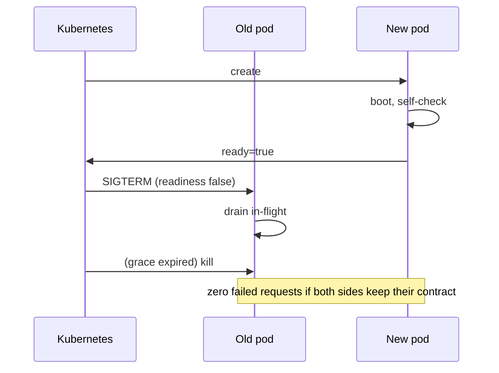

# Deploying: containers & Kubernetes

## Why Does This Matter?

The deliverable is not a binary; it is a running, observable,
upgradeable service. Go makes this unusually clean (static
binaries, tiny containers, fast boots), but the platform wiring
decides whether deploys are boring or terrifying. This chapter is
the minimum Kubernetes setup a Go service needs to be safely
upgradeable, cross-referenced where the handbook already built the
pieces: [06 §5](../06-packages-modules/05-reproducible-builds.md)
built the reproducible image; [02](02-server-lifecycle.md) built
the lifecycle it depends on.

## Mental Model

A deploy is a handoff between old and new processes:



The new pod's contract: prove readiness honestly before claiming
it. The old pod's contract: drain cleanly within grace
([02](02-server-lifecycle.md)). Every failed-request-on-deploy
incident is one of those two contracts broken.

## How It Works

**The image** ([06 §5](../06-packages-modules/05-reproducible-builds.md)
owns the full Dockerfile; the essentials):

```dockerfile
FROM golang:1.27 AS build
WORKDIR /src
COPY go.mod go.sum ./
RUN go mod download
COPY . .
RUN CGO_ENABLED=0 go build -trimpath -ldflags="-s -w -X main.version=${VERSION}" -o /out/svc .

FROM gcr.io/distroless/static-debian12
COPY --from=build /out/svc /svc
USER nonroot:nonroot
ENTRYPOINT ["/svc"]
```

Static binary + distroless = no shell, no package manager, ~10MB,
fast pulls, minimal attack surface ([21 §1](../21-security/01-threat-model-and-validation.md)).
`USER nonroot` because the platform should not grant what the code
does not need.

**The manifest**, the five decisions that matter:

```yaml
spec:
  terminationGracePeriodSeconds: 35      # > measured p100 drain
  containers:
    - name: svc
      image: registry/svc:SHA
      resources:                          # [03](03-resource-limits.md) pairs
        requests: { cpu: "1", memory: 256Mi }
        limits:   { memory: 512Mi }
      readinessProbe:
        httpGet: { path: /readyz, port: 8080 }
        periodSeconds: 2
      livenessProbe:
        httpGet: { path: /livez, port: 8080 }
        periodSeconds: 10
```

- **Image tag is the commit SHA**: `:latest` cannot roll back.
- **Grace period** exceeds measured p100 drain + margin.
- **Probes** point at real endpoints with honest semantics
  ([02](02-server-lifecycle.md)'s table).
- **Resources** pair with runtime knobs ([03](03-resource-limits.md)).
- **Rolling strategy** (`maxSurge`, `maxUnavailable`) trades speed
  against capacity during the update.

## Syntax / API

Version stamping: the build injects it, the code exposes it, the
health endpoint publishes it:

```go
var version = "dev" // -ldflags "-X main.version=..."

mux.HandleFunc("GET /readyz", func(w http.ResponseWriter, _ *http.Request) {
    if !readiness.IsReady() {
        http.Error(w, "not ready", http.StatusServiceUnavailable)
        return
    }
    fmt.Fprintln(w, "ok "+version)
})
```

The startup probe completes the set for slow-booting services:

```yaml
startupProbe:
  httpGet: { path: /livez, port: 8080 }
  failureThreshold: 30
  periodSeconds: 2   # up to 60s to boot before liveness kicks in
```

## Basic Example

The deploy checklist that survives code review:

- [ ] Image built from the commit (SHA tag, reproducible flags)
- [ ] `CGO_ENABLED=0`, distroless, nonroot
- [ ] Probes: liveness trivial, readiness honest, startup for slow boots
- [ ] Grace period > p100 drain
- [ ] Resources paired with `GOMAXPROCS`/`GOMEMLIMIT`
- [ ] Version visible at `/readyz` and in logs at boot
- [ ] Rollback tested: `kubectl rollout undo` to the previous SHA

## Real-World Example

The Section 14 service deploys with exactly this manifest: its
`/livez` returns static ok, its `/readyz` checks the store
([14 §5](../14-backend-development/05-observability-health-flags.md)'s
tiered readiness), its version is stamped by the build. A deploy is
watched by the burn-rate alert ([20 §4](../20-observability/04-slos-and-alerting.md)):
a bad rollout burns the budget visibly within minutes, which is
what makes automatic rollback safe (next chapter).

## Production Example

**PGO in the pipeline** ([19 §4](../19-performance/04-compiler-and-pgo.md)):
production profiles feed the next build (`go build -pgo=auto` picks
up `default.pgo`): the release pipeline collects CPU profiles from
the current fleet, commits the merged profile, and the next build
is profile-guided. The before/after benchmark gate ([19
§1](../19-performance/01-measure-first.md)) prevents a stale
profile from regressing a changed workload.

**HPA on the right signal**: autoscale on the service's own RED
metrics (requests per pod, or p99 latency) via a metrics adapter,
not CPU: Go services often saturate their dependency pools before
CPU. Horizontal scaling must respect the pool arithmetic
([13 §3](../13-databases/03-pooling-drivers-migrations.md)): more
pods, same DB pool ceiling, means `max_connections` math done at
fleet level, not per-pod.

## Common Mistakes

| Mistake | Consequence | Do instead |
|---|---|---|
| `:latest` or `:v1` tags | Untraceable, unrollbackable | SHA tags |
| Root container | Unnecessary privilege | `USER nonroot`, read-only rootfs |
| Readiness that always returns ok | 5xx bursts every deploy | Honest tiered readiness |
| No startup probe on slow boots | Liveness kills healthy boots | Startup probe covers boot window |
| Grace period < drain p100 | SIGKILL mid-request | Measure, then set with margin |
| HPA on CPU alone | Scaling the wrong bottleneck | Scale on RED/business signals |
| Per-pod pool sizing only | Fleet `max_connections` blowout | Fleet-level connection budget |

## Idiomatic Go

- One `Dockerfile` per repo, staged, cached on `go.mod` first:
  layer caching is the build-time win.
- Version as a var, stamped by `ldflags`, defaulted to `"dev"`:
  tests never break on missing injection.
- `ENTRYPOINT` exec form so signals reach the process (PID 1
  handling comes free: Go's runtime forwards SIGTERM to `main`'s
  signal handler).

## Performance Considerations

Boot time is deploy speed and scale-out speed: keep it under a few
seconds (lazy-open slow deps behind honest readiness,
[02](02-server-lifecycle.md)). Image size is pull time, which is
cold-start time on node scale-up: distroless keeps it near the
binary size. PGO gives single-digit-percent wins on hot paths for
free inside the pipeline ([19 §4](../19-performance/04-compiler-and-pgo.md)).

## Concurrency Considerations

The container runs the same binary the tests ran: race-free test
runs ([10 §1](../10-testing/01-fundamentals.md)) are the deploy
gate. PID-1 concerns are minimal for Go (the runtime handles child
reaping for spawned processes), but `exec.Command` users should
still bound and wait children ([21 §1](../21-security/01-threat-model-and-validation.md)).

## Security Considerations

Nonroot, read-only rootfs, `allowPrivilegeEscalation: false`,
dropped capabilities: the four lines that close most container
escalation paths. Image scanning (Trivy/Grype) joins govulncheck
([21 §5](../21-security/05-secrets-and-supply-chain.md)): the
dependency scan and the base-image scan are different surfaces.

## Testing Strategy

- Manifest tests: `kubeconform`/conftest policies (nonroot, probes
  present, SHA tags) as CI gates.
- The deploy rehearsal: a script that applies the manifest to a
  kind/kinD cluster, drives load, and asserts zero failed requests
  during rollout.
- Probe contract tests from [02](02-server-lifecycle.md) run
  against the real binary in the real image: the same artifact all
  the way down.

## Interview Questions

1. Design zero-downtime deploys for a Go HTTP service on
   Kubernetes. Name both sides of the contract.
2. Your service takes 40s to open its cache warm state: which
   probes and settings make that survivable?
3. Why distroless over alpine for pure Go? What breaks?
4. Where does PGO sit in a release pipeline and what gates it?

## Practice Exercises

1. Write the full deployment manifest for the Section 14 service
   (SHA-tagged image, honest probes, grace 35s) and validate it
   with kubeconform.
2. Build the image, run it, and verify the version stamp and
   nonroot user (`docker inspect`, `id` in a debug container).
3. Script a load-driven rollout against a local kind cluster;
   assert zero 5xx; then break readiness and watch it fail.

## Further Reading

- [Kubernetes: probes](https://kubernetes.io/docs/tasks/configure-pod-container/configure-liveness-readiness-startup-probes/)
- [Distroless images](https://github.com/GoogleContainerTools/distroless)
- [Go PGO documentation](https://go.dev/doc/pgo)
