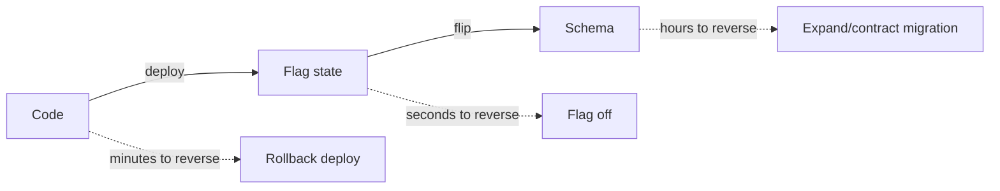

# Releases & rollbacks

## Why Does This Matter?

Everything before this chapter makes deploys *possible*; this
chapter makes them *routine*. The measure of release engineering is
how small the blast radius of a bad change is: a canary pod, a
flagged cohort, a schema column. Rollback is not the emergency
lever; it is the routine completion of every release, exercised so
often that the emergency is boring.

## Mental Model

Risk shrinks by layers, each cheaper to reverse than the last:



The craft: put as much change as possible in the cheap-to-reverse
layers. A feature lives behind a flag long before it lives in a
deploy; a schema change lands expanded and compatible long before
the code using it ships ([13 §3](../13-databases/03-pooling-drivers-migrations.md)'s
expand/contract rules).

## How It Works

**The progression**, from lowest to highest blast radius:

| Stage | Audience | Reversal |
|---|---|---|
| Flag off | nobody | trivial |
| Internal/staff cohort | employees | flag flip |
| Canary (1 pod / 1%) | small live slice | rollback deploy |
| Percentage rollout | growing cohort | flag percentage |
| Full | everyone | the "old normal" |

**Backward compatibility is the rollback prerequisite.** A
rollback only works if the previous version can run against the
current state: current schema, current config, current wire
traffic. That is a property you build *before* the release:
[15 §2](../15-microservices/02-boundaries-and-contracts.md)'s
additive-only contract rules and [13 §3](../13-databases/03-pooling-drivers-migrations.md)'s
expand-first migrations are the same discipline in two media. The
rule that names it: **N and N-1 must always be simultaneously
correct.**

## Syntax / API

The flag gate from [14 §5](../14-backend-development/05-observability-health-flags.md),
with the release semantics added: flags are versioned, owned, and
expired:

```go
type Flag struct {
    Name    string
    Owner   string    // who is paged about this flag
    Expires time.Time // stale flags are deleted, not accumulated
    Eval    func(cfg *Config) bool
}

func (r *Registry) Enabled(name string, req *http.Request) bool {
    f, ok := r.active.Load(name)
    return ok && f.(Flag).Eval(r.snapshot())
}
```

The kill switch is the same mechanism with reversed polarity: new
code ships enabled-by-default-*off* for risky paths, and the flag
that turns it on is the first thing tried during the incident
([20 §5](../20-observability/05-incident-debugging.md)'s
mitigation-first ordering).

## Basic Example

Canary evaluation by SLO, not by vibes: route 1% of traffic to the
new version, watch the *same* SLIs ([20 §4](../20-observability/04-slos-and-alerting.md))
computed for each version's pods separately (the `version` label
from the metrics), promote when the new version's burn rate is not
worse than the old's. The version label in the RED metrics is what
makes this one query instead of an archaeology project.

## Real-World Example

A bad release, contained by layers:

1. Deploy v42; canary serves 1%.
2. Burn-rate alert fires on canary pods only
   ([20 §4](../20-observability/04-slos-and-alerting.md)'s fast
   tier): rollback deploy, total exposure minutes.
3. Had the canary missed it: the kill switch flag turns the new
   path off fleet-wide without a deploy.
4. Had the flag been absent: `kubectl rollout undo` to v41, which
   is safe because the schema v42 added was expanded-only.
5. Postmortem: the gap in the layers that let it reach users
   becomes the new layer.

## Production Example

**Database compatibility rules for rollback** (the concrete N/N-1
contract):

- New columns: nullable or defaulted; old code ignores them.
- New tables: old code never reads them.
- Removed columns: drop only after N+1 ships ([13 §3](../13-databases/03-pooling-drivers-migrations.md)'s
  contract step).
- Index changes: additive; drops gated on query-plan review.

**The rollback decision itself** is pre-delegated: the on-call
rolls back first and debugs second for any user-visible SLO burn;
the decision needs no approval because the criteria are written
(burn rate X, duration Y). [20 §5](../20-observability/05-incident-debugging.md)'s
capture-before-rollback still applies: profiles and dumps are
taken, *then* the rollback executes.

## Common Mistakes

| Mistake | Consequence | Do instead |
|---|---|---|
| Breaking wire/schema changes in the same deploy as code | Rollback impossible | Expand/contract; N/N-1 always valid |
| Flags without owners or expiry | Flag cemetery; untested combinations | Owner + expiry, delete on completion |
| Canary at 50% "to be sure" | Half the fleet exposed | Small cohort + honest SLIs |
| Manual rollback approval chains | Incidents outlast meetings | Pre-delegated criteria |
| Rollback untested in staging | The real rollback fails mid-incident | Rehearse monthly |
| Config not versioned with code | N-1 binary against N config fails | Ship compatible defaults; config diffs reviewed ([01](01-configuration-and-secrets.md)) |

## Idiomatic Go

- Feature flags are code: small registry, typed evaluations, tests
  for both polarities.
- Version stamping (`-X main.version=...`) makes every artifact
  self-identifying; logs and metrics carry it from boot.
- Migration tools (golang-migrate, atlas) run *before* the new
  pods roll: schema first, code second, cleanup third.

## Performance Considerations

Canary analysis needs the version label on metrics; label
cardinality stays tiny (a handful of versions). Flag evaluation on
hot paths should be the atomic snapshot read ([01](01-configuration-and-secrets.md)):
per-request map walks and file reads in flag code are a classic
profile surprise ([19 §1](../19-performance/01-measure-first.md)).

## Concurrency Considerations

Two versions running simultaneously is a concurrency question as
much as a compatibility one: N-1's assumptions about in-flight
requests, lock formats, or message schemas must hold. The outbox
and idempotency designs ([15 §4](../15-microservices/04-idempotency-sagas-outbox.md),
[25 §3](../25-fintech-with-go/03-integrity-and-exactly-once.md))
are what make mixed-version processing safe during rollouts *and*
rollbacks.

## Security Considerations

Flags change security behavior; treat flag changes to
authentication/authorization paths as code changes: review, test
both polarities ([21 §2](../21-security/02-authentication-and-authorization.md)),
and never leave a "temporarily fail open" flag set. Rollback of an
authz change must be proven fail-closed in both versions.

## Testing Strategy

- The N/N-1 test suite: run the previous release's integration
  tests against the new schema and vice versa; CI fails on
  contract breaks ([15 §2](../15-microservices/02-boundaries-and-contracts.md)'s
  automated compatibility gate).
- Rollback rehearsal: deploy, flip, roll back, flip back in
  staging on a schedule.
- Flag polarity tests: every risky path has a test for on and off
  ([10 §1](../10-testing/01-fundamentals.md)'s table shape).

## Interview Questions

1. Design the release process for a payments API where a wrong
   charge is catastrophic. (Flags, canary by SLO, honest 5xx,
   outbox recovery.)
2. Why is "we can roll back" a database schema statement before it
   is a deploy statement?
3. What makes a rollback safe enough to pre-delegate to on-call?
4. How do feature flags interact with the consistency of
   in-flight requests? ([01](01-configuration-and-secrets.md)'s
   one-snapshot-per-request rule.)

## Practice Exercises

1. Add the version label to the Section 14 service's RED metrics
   and write the canary comparison query.
2. Add a flag with owner/expiry to the registry, plus both-polarity
   tests and an expiry-check lint in CI.
3. Stage the failure: deploy a deliberately broken canary, watch
   the burn-rate alert single it out, roll back. Time it.

## Further Reading

- [Google SRE: Release Engineering](https://sre.google/sre-book/release-engineering/)
- [Continuous Delivery (Humble/Farley): deployment pipeline](https://continuousdelivery.com/)
- [Kubernetes: rolling update strategy](https://kubernetes.io/docs/concepts/workloads/controllers/deployment/#rolling-update-deployment)
