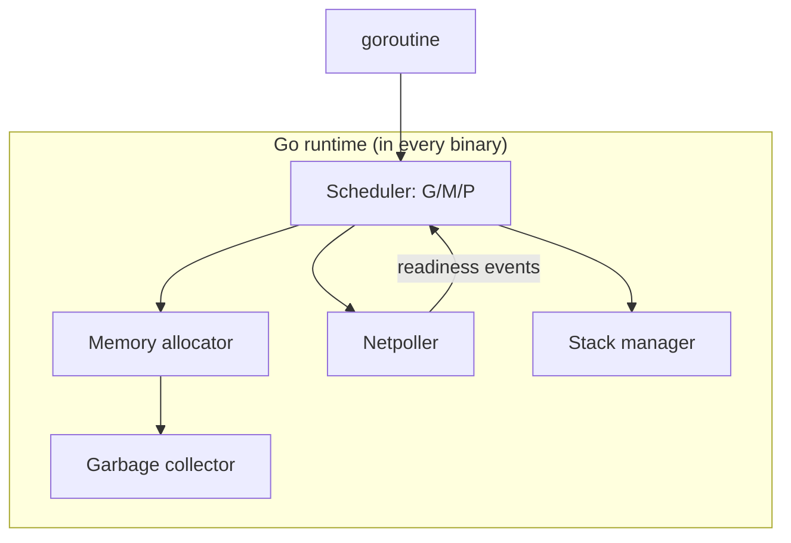

# Runtime architecture

## Why Does This Matter?

Every Go binary embeds a small operating system: the runtime. It
owns scheduling, memory, stacks, and network readiness, and its
design decisions are the reasons goroutines are cheap, GC pauses
are short, and blocking syscalls don't stall the program. The
engineering view of these pieces is spread across the handbook
([09](../09-memory-runtime/): memory; [08
Section 6](../08-concurrency/06-concurrency-vs-parallelism.md):
concurrency; [19 Section 2](../19-performance/02-memory-and-allocations.md):
allocations); this chapter is the one-page architecture: the parts
and how they interlock.

## Mental Model



- **G**: a goroutine: ~2KB initial stack, its own program counter.
- **M**: an OS thread. Runs Gs.
- **P**: a logical processor holding the run queue; `GOMAXPROCS`
  of them. An M must hold a P to execute Go code.

The G/M/P split is the design's core trick: cheap blocking
(goroutine parks, the M picks another G) and expensive blocking
(syscalls, cgo) are handled differently, so thousands of blocked
goroutines cost memory, not threads.

## How It Works

**Scheduler**: each P has a local run queue; stealing rebalances
when queues go uneven ([08
Section 6](../08-concurrency/06-concurrency-vs-parallelism.md) covers the
behavioral rules; the internals):

- **Syscall handling**: when a G makes a blocking syscall, its M
  blocks in the kernel *with* it, but the P is handed off to
  another M first: the P's queue keeps running. Syscalls don't
  reduce parallelism.
- **Preemption**: since Go 1.14, preemption is signal-based
  (async): a G running a tight loop receives a signal at yield
  points and is preempted. Long-tail latency from a CPU-hogging
  goroutine is now bounded, not eliminated
  ([08 Section 7](../08-concurrency/07-pitfalls.md)'s
  "one hot goroutine starves the rest" pre-dates this; the modern
  version is subtler).
- **Netpoller**: network I/O integrates with the OS poller
  (epoll/kqueue/IOCP). A goroutine "blocked" on a socket is parked
  with its fd registered; the netpoller wakes it on readiness.
  This is why Go servers use a goroutine per connection: blocked
  connections are parked goroutines, not threads.

**Memory allocator**: TCMalloc-derived, three tiers: per-P caches
(allocation without locks), central lists, and the page heap.
Size classes (67 of them) round small allocations so per-P caches
stay compact. Large allocations (>32KB) go straight to the page
heap. The design goal: allocation is fast enough that value
semantics are the *fast* default, so the GC sees less garbage
([09](../09-memory-runtime/)'s chapter 1 covers the tiers in
depth).

**Garbage collector**: concurrent tri-color mark-and-sweep ([09
Section 3](../09-memory-runtime/)'s chapter 3 walks it). The parts that
matter architecturally:

- Mark runs *concurrently* with your code: short pauses for
  write-barrier setup (STW, typically <1ms) at mark start/end.
- Write barriers record pointer writes during marking so the
  tri-color invariant holds while mutators run.
- Pacing: the GC decides when to start from `GOGC`/`GOMEMLIMIT`
  ([19 Section 2](../19-performance/02-memory-and-allocations.md)'s
  tuning order).

**Stacks**: contiguous, growable: start ~2KB, double on overflow,
copy to a new allocation. Deep recursion reallocates; the old
`segmented stacks` (hot-split problem) are gone. Goroutine memory
is thus proportional to actual usage, not worst case.

## Syntax / API

The observability surface of the runtime ([20
Section 2](../20-observability/02-metrics.md) exports it):

```go
runtime.GOMAXPROCS(0)         // query/set Ps
runtime.NumGoroutine()        // G count
runtime/metrics: /gc/pauses:seconds, /memory/classes/heap/free:bytes
runtime/debug.SetMemoryLimit(460 << 20) // programmatic GOMEMLIMIT
```

`GOTRACEBACK=system` (env) makes panics print runtime-level
stacks: M and P state, the scheduler's view: the incident-level
detail ([20 Section 5](../20-observability/05-incident-debugging.md)).

## Basic Example

The scheduler's syscall handoff, observable: a program with 10
goroutines in blocking syscalls and 2 CPUs keeps both CPUs busy on
other work. Check with:

```go
runtime.GOMAXPROCS(0) // stays 2; no Ps are lost to blocked Ms
```

Blocked Ms accumulate (they're threads: each costs an OS stack),
which is why a service making many blocking syscalls wants a
worker-pool bound on them ([08
Section 5](../08-concurrency/05-patterns.md)'s stage-5 pattern), not a
goroutine per operation.

## Real-World Example

The goroutine-per-connection server model falls out of this
architecture: a new connection costs one `go func` (a G, ~2KB
stack + bookkeeping), reads park in the netpoller, and writes
block only their G. Compare thread-per-connection: 1MB+ stacks,
kernel scheduler pressure, c10k problems. Go's c10k answer is not
a library; it is the netpoller plus cheap Gs. The cost model
changes again at fan-out: 100k parked goroutines is ~hundreds of
MB ([08 Section 1](../08-concurrency/01-goroutines-and-channels.md)'s
accounting) and a semaphore still beats "unlimited".

## Production Example

The runtime's knobs in a container, the full map ([22
Section 3](../22-production-go/03-resource-limits.md) covers the
production framing):

| Knob | Controls | Set when |
|---|---|---|
| `GOMAXPROCS` | Ps | mismatch with cgroup CPU (auto in Go 1.25+) |
| `GOMEMLIMIT` | GC target | cgroup memory limit exists (auto ~90% in Go 1.25+) |
| `GOGC` | heap growth trigger | rare, after GOMEMLIMIT ([19 Section 2](../19-performance/02-memory-and-allocations.md)) |
| `GOTRACEBACK` | panic verbosity | always `system`/`crash` in prod containers |

The one-liner: the runtime self-tunes remarkably well; the
production failures are misalignment (knobs vs cgroup) and
unbounded user-level resources (goroutines, buffers) the runtime
cannot see.

## Common Mistakes

| Mistake | Reality | Do instead |
|---|---|---|
| "Goroutines are free" | 2KB+ and GC-visible; unbounded fan-out is an OOM | Bound with semaphores ([21 Section 4](../21-security/04-limits-and-hardening.md)) |
| Blocking syscalls in a hot loop | Ms pile up; each is a thread | Worker pools for syscall-heavy paths |
| Assuming GC pauses dominate latency | Mark is concurrent; stalls are usually allocation-driven | Read `/gc/pauses` before blaming GC |
| Tuning GOGC first | GOMEMLIMIT is the modern lever | GOMEMLIMIT, then allocations, then GOGC |
| Expecting preemption to fix everything | Chan-locked loops and cgo calls still block at their own level | Design cancellation with context ([08 Section 3](../08-concurrency/03-context.md)) |

## Idiomatic Go

- Do not manage threads; manage work: the scheduler's job is the
  OS's job elsewhere.
- Let the runtime see your memory: keep pointers to large objects
  short-lived; slices of big backing arrays pinned by small
  windows are a leak class ([09 Section 5](../09-memory-runtime/)'s
  chapter 5 taxonomy).
- Prefer channel/context blocking to spin loops: parked Gs cost
  nothing; spinning Gs steal Ps.

## Performance Considerations

The runtime's fast paths are what benchmarks measure: channel
send/receive (lock + queue op, ~100ns), allocation (per-P cache,
~25ns), defers (open-coded since Go 1.14, near-zero). These
numbers are why Go service code usually loses nothing by being
clear: the abstractions are thin at the bottom. When a profile
shows time *in* the runtime (mallocgc, wakeups, GC assist), the
fix is at the workload level: allocations, fan-out shape, object
sizes ([19](../19-performance/)'s chapters map each to its fix).

## Concurrency Considerations

The runtime is the reason the Go memory model (chapter 6) can be
simple-ish: the scheduler provides happens-before edges through
channel ops and mutexes; the compiler and hardware respect them.
Every sync primitive's guarantee is an entry in that model; every
"it broke without the mutex" story is a violation of it.

## Security Considerations

The runtime is attack surface: it parses nothing untrusted, but it
executes your code's mistakes (stack growth on deep recursion =
memory; goroutine leaks = resource exhaustion). Container limits
([22 Section 3](../22-production-go/03-resource-limits.md)) bound what a
compromised or buggy process can take down; `GOMEMLIMIT` bounds
what *GC pressure* can do, not what a raw allocation loop can
(which the cgroup OOM kill handles, harshly).

## Testing Strategy

- `-race` runs the runtime's race detector: a runtime feature, not
  a library ([10 Section 1](../10-testing/01-fundamentals.md)); it
  validates happens-before edges dynamically.
- Stress scheduling: `-cpu=1,2,4` and `GOMAXPROCS=1` runs expose
  ordering assumptions ([10 Section 1](../10-testing/01-fundamentals.md)'s
  shuffled order helps).
- The runtime metrics you export ([20 Section 2](../20-observability/02-metrics.md))
  are the production test: alert on goroutine count trends, GC
  pause regressions, heap growth.

## Interview Questions

1. Explain G/M/P and what each owns. Why not just threads?
2. What happens to the P when a G makes a blocking syscall? To the
   M?
3. How does the netpoller make goroutine-per-connection viable?
4. Where do GC pauses actually come from, and what bounds them?
5. What did async preemption change for tail latency?

## Practice Exercises

1. Chart goroutine count and `/gc/pauses` for the Section 14
   service under load; annotate a GC cycle and a syscall-heavy
   endpoint.
2. Demonstrate syscall handoff: N goroutines in `time.Sleep`-like
   blocking calls vs one worker pool; compare OS thread count via
   `/proc` or a debugger.
3. Set `GOTRACEBACK=system`, force a panic in the example service,
   and read the runtime-level stack: find the M, the P, and the G.

## Further Reading

- [Go runtime source overview](https://github.com/golang/go/tree/master/src/runtime)
- [Scalable Go Scheduler Design (2012, still the mental model)](https://docs.google.com/document/d/1TTj4T2JO42uD5ID9e89oa0sLKhJYD0Y_kqxDv3I3XMw)
- [Preemption Go 1.14 proposal](https://github.com/golang/proposal/blob/master/design/24543-non-cooperative-preemption.md)
