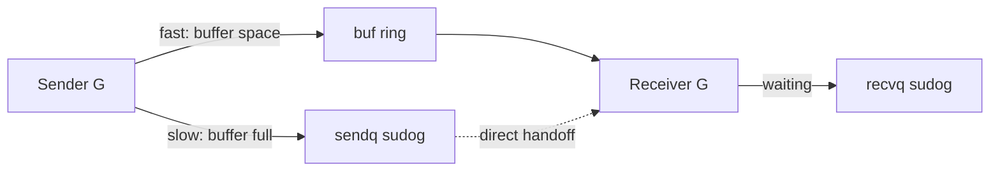

# Channels & maps under the hood

## Why Does This Matter?

Channels and maps are the two runtime data structures engineers use
daily without knowing their internals, and both have behaviors that
surprise: channel handoffs that skip the buffer, map iteration that
shuffles itself on purpose. Knowing the internals turns each
surprise into a design tool: you stop fearing the random order and
start using the direct handoff path. The user-level rules live in
[02 §2](../02-go-language/02-maps.md) and [08
§1](../08-concurrency/01-goroutines-and-channels.md); this is the
machinery beneath them.

## Mental Model

**A channel is a struct (`hchan`), not magic:**

```text
hchan {
  buf      ring buffer (buffered channels)
  qcount   items in buffer
  sendx    next send index
  recvx    next receive index
  recvq    waiting receivers (sudog queue)
  sendq    waiting senders
  lock     one mutex for the whole channel
}
```



**A map is a hash table of buckets:**

```text
hmap {
  buckets  array of bmap
  oldbuckets  during growth: both live
  B        bucket count = 2^B
}
bmap {
  tophash[8]   first byte of each hash
  8 key slots, 8 value slots
  overflow     pointer to next bucket
}
```

## How It Works

**Channel fast paths**, in order:

1. **Direct handoff**: if a receiver is already waiting on `recvq`
   (unbuffered channel, or buffered-but-drained with a waiter), the
   sender copies the value *straight to the receiver's stack* and
   wakes it: the buffer is never touched. This is why unbuffered
   channels are "rendezvous": the fast path is the rendezvous.
2. **Buffer**: space available: copy into the ring at `sendx`,
   advance. No waking, no blocking.
3. **Park**: no space, no waiter: make a `sudog`, enqueue on
   `sendq`, `gopark`. The G costs nothing until woken.

Receive mirrors it: waiting sender -> direct handoff from `sendq`;
items in buffer -> copy out at `recvx`; else park on `recvq`.
`select` compiles to a lock-ordered scan of the channels plus a
park on *all* their queues at once: the shuffle you see in [08
§2](../08-concurrency/02-select-and-timeouts.md) is this scan
randomizing tie-breaks.

**Map operations**:

- Hash the key; the top byte of the hash indexes `tophash[8]` for
  a fast scan; the low bits pick the bucket; the rest finds the
  slot.
- **Load factor 6.5** (avg entries per bucket) triggers growth:
  doubling while small, same-size rehash while growing from lots
  of overflow buckets (the "same-size growth" fixes pathological
  overflow chains after many deletions).
- **Growth is incremental**: puts and deletes evacuate a few old
  buckets each, so no single operation pays for the whole
  rehash. `oldbuckets` + a bit mask route lookups to the right
  half during migration.
- **Randomized iteration**: the runtime picks a random bucket and
  a random offset *per iteration*. This is deliberate: it
  prevents code from accidentally depending on insertion order
  and breaking later when the map grows ([02
  §2](../02-go-language/02-maps.md)'s discipline follows).

## Syntax / API

The internals are invisible by design; the observable consequences
are testable, and this section's example package pins them:

```go
// Chapter 4's test: map order is randomized, so determinism is
// bought explicitly.
func SortedKeys(m map[string]int) []string { /* sort, don't trust */ }
```

The compiler turns channel syntax into runtime calls: `ch <- v`
becomes `runtime.chansend1`, `close(ch)` becomes
`runtime.closechan`: which is why a nil channel send blocks
forever ([08 §7](../08-concurrency/07-pitfalls.md)): `chansend` on
a nil `hchan` parks without a wake path.

## Basic Example

Direct handoff, observable as latency: an unbuffered channel
handoff between two ready goroutines costs ~100-200ns (one lock,
one stack copy, one wakeup), while a buffered channel round-trip
adds queue bookkeeping. The difference rarely matters per-op; it
matters when you choose buffer sizes: a buffer is *latency
smoothing*, not speed ([08 §5](../08-concurrency/05-patterns.md)'s
backpressure math).

## Real-World Example

The "map modified during iteration" panic is the internals
surfacing: iteration holds a snapshot of nothing; it walks
buckets live, and a concurrent write invalidates the walk. That is
also why the runtime's map is not goroutine-safe: the lock is
per-map-operation, not per-lifetime, and adding one would tax
every reader for the sake of rare writers. The ecosystem answer is
`sync.Map` for the two-traffic-pattern case ([08
§4](../08-concurrency/04-sync-primitives.md)'s table) or a mutex
for the general case.

## Production Example

Channel sizing decisions from the internals:

- **Close is a broadcast**: `closechan` wakes *every* waiter on
  the relevant queues. The close-broadcast pattern (one closer,
  many receivers see zero values) is cheap *because* of this
  ([08 §5](../08-concurrency/05-patterns.md)'s cancellation
  broadcast).
- **`len(ch)` is qcount**: a snapshot that may be stale before you
  read it. Metrics built on it measure jitter, not backlog;
  backlog metrics want counters around the queue ([20
  §2](../20-observability/02-metrics.md)).
- Map growth on a huge map (millions of keys) holds no global
  lock but does allocate: the GC-visible spike after a bulk load
  is the evacuated `oldbuckets`. Pre-size with `make(map, n)` and
  the spike disappears.

## Common Mistakes

| Mistake | Internals reality | Do instead |
|---|---|---|
| Relying on map iteration order | Random start bucket + offset, per iteration | Sort keys; pin with tests (the example does) |
| `for k := range m { if ...; delete(m, k) }` | Legal: delete during iteration is safe; *concurrent* writes are not | Still prefer collect-then-mutate for clarity |
| Huge map literal without pre-size | Repeated growth + evacuation | `make(map[K]V, n)` |
| `len(ch)` as a backpressure signal | qcount is a stale snapshot | Token buckets / semaphores ([21 §4](../21-security/04-limits-and-hardening.md)) |
| Sending on a closed channel to "signal" | Panic: sendq entries and closed state are checked first | Close is receive-side only; senders exit via context |
| Nil channel in a select expecting activity | Nil chan blocks forever in that case: useful as a *disable* | Keep the nil-channel-disable idiom, document it |

## Idiomatic Go

- Unbuffered for rendezvous/synchronization; buffered for
  known-bounded smoothing: the sizes now have a mechanical meaning.
- `make(map, n)` when n is knowable; a sorted-keys helper when
  order matters (the example package's `SortedKeys`).
- Never share a channel's ownership: sender closes, receiver
  ranges ([08 §1](../08-concurrency/01-goroutines-and-channels.md)).

## Performance Considerations

- Channel ops take one mutex on the whole `hchan`: hot single-
  channel fan-in can contend ([19
  §3](../19-performance/03-concurrency-performance.md)'s numbers);
  shard channels or batch when contention shows.
- Map access is 2 cache lines on a hit (tophash scan + slot);
  pointer-heavy keys/values add indirection. Struct keys with
  string fields dominate the profile in map-heavy services.
- Growth is amortized O(1) but the evacuation work lands on
  writes during migration: bulk-load then serve beats
  load-while-serving.

## Concurrency Considerations

The single-lock-per-channel design is why channels compose
(reasoning stays simple) and why they are not a shard-everything
primitive. The map's no-lock design is why maps need external
synchronization, and why `sync.Map`'s read-mostly fast path exists
(its internals: two maps, read/write, atomic swap on miss
promotion; [08 §4](../08-concurrency/04-sync-primitives.md)'s
comparison table).

## Security Considerations

Map hashing uses a per-process random seed: hash-flooding DoS
(buckets deliberately colliding) is mitigated by design. Do not
replace stdlib maps with custom hash tables for untrusted keys
without solving seeding yourself ([21 §1](../21-security/01-threat-model-and-validation.md)'s
boundary rules).

## Testing Strategy

- The example package's `TestSortedKeys_Deterministic` runs 100
  iterations against a fixed map: any accidental order dependence
  in downstream code shows up as flaky tests, which is the point.
- `-race` detects the concurrent-map-write panic before it reaches
  production ([10 §1](../10-testing/01-fundamentals.md)).
- Stress channel invariants: close-while-receiving, nil-channel
  disables, select fairness (statistical tests over many runs).

## Interview Questions

1. Walk a send through `hchan` for: buffered with space, full with
   waiter, full without waiter.
2. Why is map iteration randomized? What bug class does it
   prevent?
3. When does a map grow without doubling, and why?
4. Why is `close(ch)` a broadcast, and what pattern depends on it?
5. Why is the runtime map not goroutine-safe, and what would
   adding a lock cost?

## Practice Exercises

1. Measure unbuffered vs buffered (size 1, 64) channel round-trip
   latency with a benchmark; explain the deltas from the internals.
2. Force a map into same-size growth: insert 100k keys, delete
   99k, insert 100k again; watch `/memory/classes` or a pprof
   heap diff.
3. Implement the nil-channel-disable select loop and write the
   test proving the disabled branch never fires.

## Further Reading

- [runtime/chan.go (hchan source)](https://github.com/golang/go/blob/master/src/runtime/chan.go)
- [runtime/map.go (bucket source)](https://github.com/golang/go/blob/master/src/runtime/map.go)
- [Go maps in action (blog)](https://go.dev/blog/maps)
