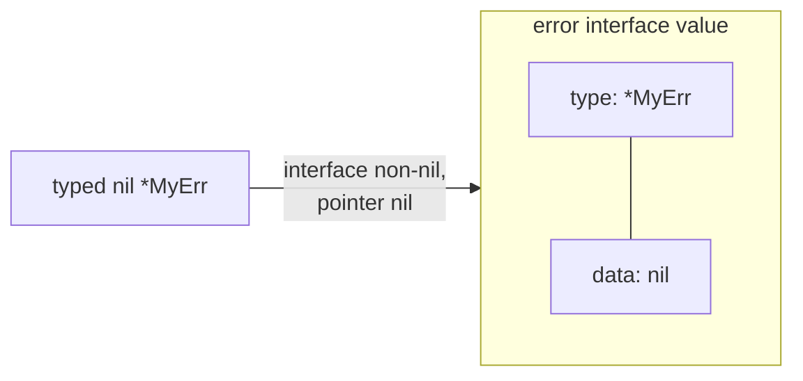

# Interfaces, slices & strings under the hood

## Why Does This Matter?

Three data representations produce most of Go's "wait, why did it
do that?" moments: the two-word interface value (the typed-nil
trap), the three-word slice header (aliasing), and the immutable
string (and its mutable `[]byte` twin). Each is a small, learnable
struct layout; once you can *draw* them, the surprises become
predictable. The user-level semantics live in [02
§1](../02-go-language/01-arrays-and-slices.md), [02
§6](../02-go-language/06-interfaces-and-embedding.md), and [02
§3](../02-go-language/03-strings-runes-bytes.md); this chapter is
the layouts beneath those rules.

## Mental Model

Everything is a fixed-size value:

```text
interface value (2 words)
  (itab or *_type, data pointer)
  the type word is nil only when the whole interface is nil

slice header (3 words)
  (data *T, len int, cap int)
  the header is copied by value; the backing array is shared

string header (2 words)
  (data *byte, len int)
  immutable bytes; sharing is safe and free
```



## How It Works

**Interfaces**: an interface value is two machine words: a type
descriptor (for empty `any`, a `*_type`; for methods, an `itab`:
interface type + concrete type + method table) and a pointer to
the data (or the data inline, for pointer-shaped types).

- **The typed-nil trap** follows mechanically: `var e *MyErr =
  nil; return e` stores type `*MyErr` + nil data. The interface is
  non-nil because the *type word* is non-nil. `err != nil` checks
  the pair, not the pointee.
- **Method dispatch** is a table lookup: the itab caches the
  concrete type's method pointers, so an interface call is an
  indirect call through the table (a few ns; direct calls after
  devirtualization are cheaper, [19
  §4](../19-performance/04-compiler-and-pgo.md)).
- **Boxing**: storing a non-pointer-shaped value (int, small
  struct) in an interface allocates; pointer-shaped values
  (pointers, maps, chans, funcs) store without allocation. This is
  why `fmt.Println(x)` in a hot loop can show up as allocations
  ([02 §2's](02-ssa-and-optimizations.md) escape discussion).

**Slices**: the header is what's copied and passed; the backing
array is wherever `data` points.

- **Aliasing**: two headers pointing at one array is the feature
  (`s[1:3]` is O(1), no copy) and the bug (append to one, surprise
  the other). `copy` and full-slice expressions `s[i:j:k]` bound
  the aliasing deliberately.
- **Growth**: the runtime's growth table: small caps double
  (0→4→8→…→256 on a 64-bit build, as `append` grows an empty
  slice), then grow ~1.25x rounded to size classes. Measured from
  this section's probe: `cap 256 -> 512 -> 848 -> 1280`: above
  256, growth is 1.25x with allocator-class rounding, not clean
  doubling ([02 §1](../02-go-language/01-arrays-and-slices.md)'s
  guidance and [19 §2](../19-performance/02-memory-and-allocations.md)'s
  allocation math both follow from this).

**Strings**: two words, immutable bytes. Concatenation allocates a
new string; conversion to `[]byte` copies (the one true copy in
the trio), back too. `unsafe` zero-copy conversions exist and are
a documented, deliberate hazard ([02
§3](../02-go-language/03-strings-runes-bytes.md)'s warning).

## Syntax / API

The typed-nil trap, from the example package, with the honest fix:

```go
var e *NilError        // nil pointer, concrete type
err := error(e)        // interface: (type=*NilError, data=nil)
err != nil             // TRUE: the type word is set
reflect.ValueOf(err).IsNil() // TRUE: the pointee is nil

// The fix: normalize typed nils at the boundary.
func Normalize(err error) error {
    if err == nil { return nil }
    if reflect.ValueOf(err).IsNil() { return nil }
    return err
}
```

The tests (`TestTypedNil_TrapAndFix`) pin both the trap and the
fix; `errors.Is` behaves correctly in all cases (it inspects the
chain, not the interface word).

## Basic Example

Aliasing, in one picture:

```go
a := []int{1, 2, 3, 4}
b := a[1:3]        // shares the backing array
b[0] = 99          // a is now [1 99 3 4]
b = append(b, 5)   // may or may not share, depending on cap!
```

The last line is the classic: append writes in place while
`cap(b) > len(b)` (surprising `a[3]`), then reallocates when it
hits cap (no longer aliasing). The full-slice expression
`a[1:3:3]` (cap forced to 3) makes the next append definitely
allocate: aliasing controlled by construction.

## Real-World Example

The JSON round-trip and the string/[]byte boundary: decoding
copies (safe), but a hot path that converts `string` to `[]byte`
per request to hash, then converts back, makes two copies per
request. The stdlib's own `strings.Builder` exists because
string concatenation in a loop is O(n^2) allocations; the builder
amortizes to one ([02 §3](../02-go-language/03-strings-runes-bytes.md)'s
benchmarks). At the transport boundary, `encoding/json` accepts
`json.RawMessage` precisely to avoid the double copy.

## Production Example

**The typed-nil in the wild**: a third-party SDK whose `Do()`
returns a typed nil on success. The service wraps it once, at the
SDK boundary, with `Normalize`: one function, one test, the trap
never crosses into the domain ([05
§1](../05-errors/01-errors-are-values.md)'s rule: inspect errors
at boundaries with the pair semantics in mind).

**Slice headers across the API**: a cache that stores
`[]byte` values hands out headers into one backing array; one
caller's append corrupts another's cache entry. The production
rule: either hand out copies (`append([]byte(nil), v...)`), or
document the no-append contract and enforce it in review. The
cost of one copy is almost always cheaper than the incident
([13 §5](../13-databases/05-caching-with-redis.md)'s
cache-aside discipline).

## Common Mistakes

| Mistake | Layout reality | Do instead |
|---|---|---|
| Returning typed nils from constructors | Two-word interface: type set, data nil | Return `nil` explicitly; wrap SDKs with `Normalize` |
| `err != nil` on a struct wrapping a typed-nil field | Same trap, one level deeper | Inspect with `errors.Is`; keep the trap out of the domain |
| Appending into a shared slice | Header copies; array shared | Full-slice expr `a[i:j:k]`, or copy at the boundary |
| String building in loops | New allocation per `+` | `strings.Builder` |
| `string(b)`/`[]byte(s)` per request | Two copies per conversion | Keep one representation; use `json.RawMessage` where it matters |
| Comparing structs with slice fields | Headers compare by data pointer | Compare contents explicitly |

## Idiomatic Go

- Constructors return `error` as literal `nil`, never a typed nil
  pointer: make the trap unwritable.
- Function parameters: slices by header (cheap, aliased:
  document mutation), strings by header (cheap, safe), small
  structs by value.
- `cap`-aware slices in hot paths: pre-size with `make(0, n)` so
  growth never happens ([19 §2](../19-performance/02-memory-and-allocations.md)'s
  numbers).

## Performance Considerations

- Interface boxing allocates for non-pointer-shaped values: the
  generic `[T any]` equivalent usually does not (stenciled code
  keeps concrete types). Hot generic-vs-interface comparisons are
  [07](../07-generics/)'s chapter 5.
- Slice growth is amortized but spike-y: bulk loads pre-size.
  Growth above 256 caps is ~1.25x + size-class rounding, which is
  why "pre-size to the max" and "pre-size to the median" produce
  different GC behavior ([09](../09-memory-runtime/)'s allocation
  chapters).
- The itab is cached per (interface, concrete) pair: interface
  calls are fast, just not free; devirtualization makes them free
  when the concrete type is provable ([19
  §4](../19-performance/04-compiler-and-pgo.md)).

## Concurrency Considerations

Immutability is the concurrency feature: strings and unaliased
slice copies need no synchronization. Shared backing arrays are
the data race the race detector catches most often in service
code (append writing while another goroutine reads). The rule:
ownership transfers with the slice ([08
§5](../08-concurrency/05-patterns.md)'s pipeline stages), or you
copy.

## Security Considerations

Strings are immutable but not secret-shaped: `[]byte` copies of
secrets outlive their strings in GC-visible memory. The
`config.Secret` redaction ([14 §2](../14-backend-development/02-configuration-and-secrets.md))
keeps values out of logs; keeping them out of *memory dumps* is
harder (wipe `[]byte` buffers after use where the threat model
demands it). Also: `unsafe` zero-copy conversions break the
compiler's immutability assumptions for strings; a corrupted
"immutable" string is a subtle memory-safety bug.

## Testing Strategy

- The example package pins the typed-nil trap and the fix with
  unit tests; do the same for any SDK boundary you wrap.
- Allocation-count tests (`AllocsPerRun`) pin "no copies per
  request" contracts on hot converters.
- Table-driven aliasing tests: slice ops against a shared array,
  asserting which views observe which writes.

## Interview Questions

1. Draw the interface value for a typed nil and for a true nil.
   Which checks see which?
2. Why can `append` sometimes share and sometimes not, and how do
   you force each behavior?
3. What exactly copies in `string` ↔ `[]byte` conversion, and
   when does it not?
4. Where does the itab come from and what does devirtualization
   do to it?
5. Why do generics sometimes avoid interface boxing?

## Practice Exercises

1. Write a `CapProbe` test that appends into `a[1:3]` and
   `a[1:3:3]`, asserting exactly when the backing array is shared.
2. Wrap a real SDK error with `Normalize` and prove the trap with
   a fake that reproduces it.
3. Benchmark `strings.Builder` vs `+=` at 1k parts; report the
   allocation counts, not just the time.

## Further Reading

- [runtime/iface.go and runtime/type.go (itab source)](https://github.com/golang/go/blob/master/src/runtime/iface.go)
- [Go Slices: usage and internals (blog)](https://go.dev/blog/slices-intro)
- [Strings, bytes, runes (blog)](https://go.dev/blog/strings)
