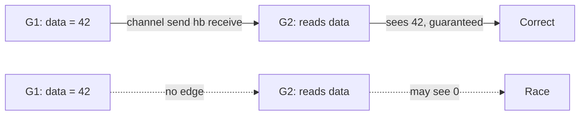

# The Go memory model

## Why Does This Matter?

Compilers reorder, CPUs reorder, caches delay: and your program
still behaves as written, *if* you stay inside the memory model.
The model is the contract that makes reordering invisible to
correctly synchronized code and very visible to racy code. In Go
this is not academic: goroutines share memory by default, the
compiler reorders aggressively ([02 Section 2](02-ssa-and-optimizations.md)),
and the race detector enforces the model dynamically. The
practical rules live in [08 Section 4](../08-concurrency/04-sync-primitives.md)
and [08 Section 8](../08-concurrency/08-faq-notes.md); this chapter is
the contract itself: small enough to memorize once.

## Mental Model

The model is built from **happens-before** edges:

```text
A happens-before B  (written A hb B)
= A's effects are guaranteed visible to B
```

Write the program so every cross-goroutine memory access is
connected to its counterpart by a chain of `hb` edges, and
reordering cannot hurt you. Skip one edge, and the compiler and
CPU are free to reorder in ways that look impossible.



## How It Works

The edges the language guarantees (the complete practical list):

| Construct | Edge |
|---|---|
| `go` statement | the `go` happens-before the goroutine starts |
| Channel send | send happens-before the matching receive completes |
| Channel close | close happens-before a receive that returns zero (because closed) |
| Unbuffered channel | receive happens-before send completes (rendezvous) |
| `sync.Mutex`/`RWMutex` | unlock n happens-before lock n+1 succeeds |
| `sync.WaitGroup` | `Done` happens-before the `Wait` that observes it |
| `sync.Once` | the once's return happens-before any `Do` returning |
| `atomic` ops | the documented sequentially-consistent ordering (Go 1.19+) |
| Program init | package init happens-before everything after it |

What is *not* an edge: goroutine exit (nothing "happens-before"
another goroutine's read at your goroutine's death; you must send
a signal), timers alone, map iteration, function call order
across goroutines.

## Syntax / API

The classic broken pattern and its fix:

```go
// BROKEN: no edge from done=true to the main read.
var done bool
var data string
go func() { data = "hello"; done = true }()
for !done {}          // may spin forever; may read data == ""
_ = data

// FIXED: the channel is the edge.
done := make(chan struct{})
go func() { data = "hello"; close(done) }()
<-done               // close hb receive: both writes visible
_ = data             // guaranteed "hello"
```

`sync/atomic` for flag-shaped state, with its documented
guarantee:

```go
var ready atomic.Bool
go func() { data = "hello"; ready.Store(true) }()
for !ready.Load() {}
_ = data // OK: Load observing Store's write orders everything before it
```

## Basic Example

Double-checked locking, Go-shaped: the mutex is the edge both
times; the atomic fast path is ordered by its own guarantee:

```go
type Cache struct {
    mu   sync.RWMutex
    v    atomic.Pointer[Table]
}

func (c *Cache) Get() *Table {
    if t := c.v.Load(); t != nil { return t }
    c.mu.Lock()
    defer c.mu.Unlock()
    if t := c.v.Load(); t != nil { return t } // re-check under lock
    t := buildTable()
    c.v.Store(t)
    return t
}
```

## Real-World Example

The buffer-flush bug the model explains: a worker accumulates
results in a slice, sets a `flushed = true` flag, and the
scheduler goroutine polls the flag, ships the slice, and
sometimes ships an empty or partial one. The missing edge: the
flag write and the slice writes have no ordering to the reader.
Fixes, all valid: send the slice on a channel (edge), guard both
with the worker's mutex (edge), store via atomic.Pointer after
filling (edge). The pattern to internalize: **the data travels
with the edge, or it doesn't travel safely.**

## Production Example

The race detector is the model, running: `-race` instruments
every access and reports when two accesses to one address are
unordered by any edge (happens-before dynamic checking). In CI
([10 Section 1](../10-testing/01-fundamentals.md)) it turns model
violations into test failures; in staging under load
(`-race` builds with real traffic) it catches the schedules unit
tests never produce. The model's guarantee is what makes the
detector's verdict trustworthy: a clean run means the edges you
built were sufficient for those schedules, which is why race-free
*plus* model-shaped code (channels for handoff, mutexes for
state) is the goal, not merely "the detector stayed quiet once".

## Common Mistakes

| Mistake | Model reality | Do instead |
|---|---|---|
| "It passed with -race" as proof | The detector checks executed schedules only | Race-free *and* obviously-edged code; stress tests vary schedules |
| Busy-wait on a plain bool | No edge; compiler may hoist the read | Channel, `atomic.Bool`, or `sync.Cond` |
| Publishing via two separate atomics in opposite order | Each atomic is an edge; *your* ordering needs both edges read-side | One atomic pointer to a struct (publish the bundle) |
| `time.Sleep` as synchronization | Sleep is not an edge | Any construct from the table |
| Relying on goroutine teardown to flush writes | No hb edge from exit | WaitGroup/channel before reading its results |
| Hand-rolling spinlocks with `atomic` alone | Legal but starvation-prone; ordering subtle | `sync.Mutex`; atomics for flags/counters |

## Idiomatic Go

- Share memory by communicating: the channel edge is the design
  default ([08 Section 1](../08-concurrency/01-goroutines-and-channels.md)).
- Mutexes guard *invariants*, not just fields: everything the
  invariant touches goes inside the same lock.
- `atomic` for single-word flags and counters; bundle publication
  uses `atomic.Pointer` to one struct.
- Do not reach for `unsafe` or `GOMAXPROCS` tricks to "fix" a
  race; add the edge.

## Performance Considerations

Edges are not free: mutex round-trips ~25-50ns uncontended, atomics
~5-20ns, channels ~100ns ([08 Section 6](../08-concurrency/06-concurrency-vs-parallelism.md)'s
numbers). That cost is the price of correctness and it is tiny
next to a syscall; the real perf risk is *contention* (many
goroutines on one lock), which is a design fix (shard, batch,
ownership transfer), not a model violation ([19
Section 3](../19-performance/03-concurrency-performance.md)).

## Concurrency Considerations

This chapter *is* the concurrency consideration. One extra point:
the model is per-address, so an edge that orders access to `x`
does not order unrelated `y`. Bundles (one pointer to one struct)
beat scatter-shot flags precisely because one edge orders the
whole bundle.

## Security Considerations

Racy reads of security state (authz flags, key material) can
observe stale values *legally* under the model: an attacker does
not need to win a race if your check reads yesterday's value.
Publish security-relevant state with explicit edges (atomic
pointer swap on rotation, [21 Section 5](../21-security/05-secrets-and-supply-chain.md)'s
two-key overlap), and treat "occasionally stale authz" as the
correctness bug it is.

## Testing Strategy

- `-race` in every CI run ([10 Section 1](../10-testing/01-fundamentals.md));
  `-race` + load in staging for schedule diversity.
- Stress tests (`-count` with shuffled order, `-cpu=1,2,4`)
  widen executed schedules.
- Design review: every cross-goroutine data path in the design
  doc names its edge. If the review cannot find the edge, the
  code does not have one.

## Interview Questions

1. State the happens-before guarantee for unbuffered channels in
   both directions. Why is the unbuffered case special?
2. Why is `for !done {}` on a plain bool broken even if it
   "works"?
3. Your service rotates signing keys: which mechanism publishes
   the new key set, and what edge does it create?
4. What does `-race` actually check, and what does a clean run
   not prove?

## Practice Exercises

1. Fix the broken `done bool` example three ways (channel,
   atomic, mutex) and write a stress test that fails the broken
   version reliably (tight loop, `-cpu=1`).
2. Publish a config bundle with `atomic.Pointer` and write the
   test proving a reader never sees a half-updated bundle.
3. Audit one codebase slice: find every cross-goroutine data
   access and name its edge; file the ones you cannot.

## Further Reading

- [The Go Memory Model (official)](https://go.dev/ref/mem)
- [Introducing the Go Race Detector (blog)](https://go.dev/blog/race-detector)
- [sync/atomic package docs (Go 1.19 semantics)](https://pkg.go.dev/sync/atomic)
