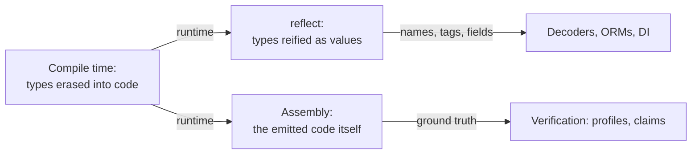

# Reflection & assembly

## Why Does This Matter?

Two tools answer the question "what is the machine *actually*
doing": reflection reads your types at runtime; the disassembler
shows the code the compiler emitted. Both are reading tools first
and writing tools second, and both have a cost profile that makes
them wrong for hot paths and right for boundaries. This chapter
teaches enough of each to (a) refuse reflection where it does not
belong, and (b) verify compiler claims with your own eyes.

## Mental Model



- **Reflection** is the type system turned inside out at runtime:
  `reflect.Type` describes a type, `reflect.Value` wraps a value
  with its type. Every `encoding/json` decode you have written
  walks this machinery: it is why field tags work.
- **Assembly** is the compiler's output, the ground truth under
  every performance claim. You read it to verify, not to write.

## How It Works

**Reflection's cost ladder** (each rung pricier):

1. Type assertions / type switches: interface word compare: ns.
2. `reflect.TypeOf`/`ValueOf`: allocates if the value is
   non-pointer-shaped (boxing into the interface, [05
   §5](../05-interfaces-slices-strings.md)).
3. `Field(i)`/`MapIndex`: each access re-boxes and bounds-checks:
   ~100x a direct field access.
4. `reflect.New`/`Set`: allocation plus kind-checking.

`encoding/json` amortizes this with caching: the first encode of a
type builds a field plan keyed by type; subsequent operations
walk the cached plan, not the reflection API. That is the pattern
to copy if reflection is genuinely needed: **reflect once per
type, cache the plan, execute the plan fast** ([13
§4](../13-databases/04-repositories-and-testing.md)'s ORM
discussion and [02 §4](../02-go-language/04-structs.md)'s tags
both ride this).

**Reading assembly**: `go tool compile -S` or `go build -gcflags=-S`
emits annotated assembly. You are looking for: whether a call was
inlined (no `CALL`), whether the bounds check disappeared (no
`JAE` panic path), whether values stayed in registers, and what
actually allocated (`CALL runtime.newobject`).

## Syntax / API

Reflection's honest minimum:

```go
func FieldNames(v any) []string {
    t := reflect.TypeOf(v)
    if t.Kind() == reflect.Ptr {
        t = t.Elem()
    }
    if t.Kind() != reflect.Struct {
        return nil
    }
    names := make([]string, 0, t.NumField())
    for i := 0; i < t.NumField(); i++ {
        names = append(names, t.Field(i).Name)
    }
    return names
}
```

And the assembly for the question "did my getter inline?" (from
this section's example package):

```bash
$ go build -gcflags="-m" ./examples/internals 2>&1 | grep StackLocal
./internals.go:36:6: can inline StackLocal
```

## Basic Example

The type switch is reflection-free introspection and covers most
"why do I need reflect" cases:

```go
func describe(v any) string {
    switch x := v.(type) {
    case string:
        return "string: " + x
    case int:
        return fmt.Sprintf("int: %d", x)
    case error:
        return "error: " + x.Error()
    default:
        return "other"
    }
}
```

If your code's reflection reduces to a type switch over a closed
set of types, prefer the switch: faster, type-checked, readable.

## Real-World Example

The validation library question: tag-driven validators
(`validate:"required,max=128"`) walk reflection per request or
cache plans per type. The stdlib-first alternative in this
handbook's service is explicit `Validate()` methods ([14
§4](../14-backend-development/04-authn-authz-and-validation.md)):
no reflection, compile-time checked, table-testable. The tradeoff
is one line of wiring per type versus magic for free; the
handbook's rule: explicit at boundaries you own, reflection-based
where the type set is genuinely open (JSON, drivers, plugins).

## Production Example

When reflection is the right answer, the caching pattern from
`encoding/json` applied to a homemade row-mapper:

```go
var planCache sync.Map // reflect.Type -> *plan

func planFor(t reflect.Type) *plan {
    if p, ok := planCache.Load(t); ok {
        return p.(*plan)
    }
    p := buildPlan(t) // walks fields once
    planCache.Store(t, p)
    return p
}
```

The hot loop then executes `plan` (direct field offsets, no
`reflect.Value` per row): reflection costs land once per type,
not once per row. Profile before and after ([19
§1](../19-performance/01-measure-first.md)): the win is usually
10-50x on the mapping step.

**Assembly in production debugging**: a benchmark says function X
got slower after a Go upgrade. `compile -S` diff shows the loop
now calls a helper (an inlining decision changed). That is the
whole debugging session: claim, disassemble, diff, decide (pin
with a benchmark, [10 §4](../10-testing/04-benchmarks-coverage-fuzzing.md)).

## Common Mistakes

| Mistake | Cost reality | Do instead |
|---|---|---|
| Reflection per request on typed data | ~100x field access; boxing everywhere | `Validate()` methods or cached plans |
| `reflect.DeepEqual` for identity | Full structural walk, allocation-heavy | `==` where comparable; bytes.Equal for []byte |
| Building generic frameworks on `reflect.Value.Set` | Type errors move to runtime, the opposite of Go's bet | Generics ([07](../07-generics/)) for closed sets; codegen for open ones |
| Writing assembly by hand to "optimize" | The compiler beats hand asm almost everywhere | Read asm to verify; fix the source |
| Trusting benchmarks without asm | You profiled the compiler's choice, not yours | Confirm inlining/BCE with flags ([02 §2](02-ssa-and-optimizations.md)) |

## Idiomatic Go

- Prefer type switches > generics > cached reflection plans >
  raw reflection, in that order of preference.
- Field tags are the one place reflection is universally accepted;
  keep tag semantics small and documented.
- Never expose `unsafe`/`reflect` in domain types; contain them
  at serialization boundaries.

## Performance Considerations

The numbers to carry: a type assertion is ~1-3ns; `Field(i)`
~50-100ns plus allocations; a cached plan access ~5-10ns. In a
service doing 10k rows per request, raw reflection per row is the
profile; a plan is a footnote. Assembly reading costs minutes and
settles arguments that would otherwise produce cargo-cult code
([19 §1](../19-performance/01-measure-first.md)'s measure-first
rule, applied to beliefs).

## Concurrency Considerations

`reflect.Value` is not safe for concurrent mutation of the same
value; cached *plans* (immutable after build) are the
concurrency-safe shape, shared via `sync.Map` or built under
`sync.Once`. Type descriptors themselves are immutable and shared
freely.

## Security Considerations

Reflection defeats compile-time visibility: vet and dead-code
analysis cannot see what reflect does with your types, which is
why `encoding/json`'s tag handling is documented behavior worth
reading (unknown-field handling, [21
§1](../21-security/01-threat-model-and-validation.md)'s boundary
decisions). Assembly review matters for constant-time claims:
crypto code that must not branch on secrets is verified by
reading the emitted asm, not by hoping ([21
§5](../21-security/05-secrets-and-supply-chain.md)).

## Testing Strategy

- Reflection code paths get table tests over every `Kind` they
  accept, and one rejection test per kind they refuse.
- Cache-correctness tests: two types, interleaved, plans distinct
  and stable; a race detector run over the cache.
- Benchmark any plan-based mapper against the naive version once;
  keep the benchmark so regressions surface
  ([10 §4](../10-testing/04-benchmarks-coverage-fuzzing.md)).

## Interview Questions

1. Rank by cost and explain: type assertion, `Field(i)`, cached
   plan, `reflect.DeepEqual`.
2. How does `encoding/json` stay fast despite reflection?
3. When is a type switch better than reflection, and what makes
   the type set "closed"?
4. Show how you would verify that a function inlined, both by
   flag and by asm.

## Practice Exercises

1. Build `planFor` above for a 3-field struct; benchmark raw
   reflection vs plan at 100k accesses; report ns/op and allocs.
2. Write the type-switch version of a tag validator for three
   known types and compare its test surface to the reflective
   one.
3. Disassemble `Sum` from the example package; find the loop; note
   the absence of a bounds-check branch; then break the proof and
   find the new `JAE`.

## Further Reading

- [reflect package documentation](https://pkg.go.dev/reflect)
- [The Laws of Reflection (blog)](https://go.dev/blog/laws-of-reflection)
- [A Quick Guide to Go's Assembler](https://go.dev/doc/asm)
