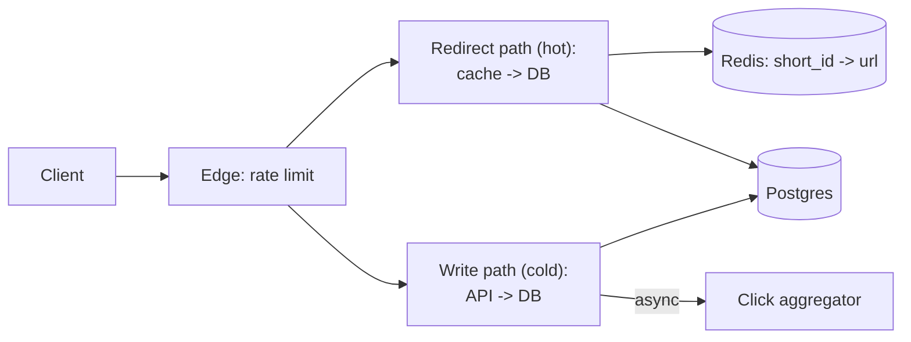

# URL shortener

## Why Does This Matter?

The warm-up design: small enough to hold in your head, rich enough
to exercise the whole template: ID generation (uniqueness under
concurrency), read-heavy scaling (caching), and the redirect that
must not fail. Every later design in this section reuses the
decisions made here.

## Requirements

| Requirement | Decision |
|---|---|
| Create short links (write) | authenticated API; rate-limited ([21 §4](../21-security/04-limits-and-hardening.md)) |
| Redirect (read) | unauthenticated, ~1000x write volume, p99 < 50ms |
| Custom aliases | optional; collision-checked |
| Analytics | click counts, eventually consistent |
| Links live ~forever | durability beats latency on writes |

## APIs

```text
POST /links        {url, custom_alias?}  -> 201 {short_id, url}
GET  /{short_id}                         -> 301/302 Location: <url>
GET  /links/{id}/stats                   -> {clicks, created_at}
```

The redirect must be a real HTTP redirect (not a meta-refresh or
JS hop): crawlers, preview bots, and `curl -L` all count. 301
(cached forever by clients/browsers) is a durability trap: use
302/307 until the link is guaranteed permanent.

## Data model

```sql
CREATE TABLE links (
    short_id   text PRIMARY KEY,        -- base62, 7 chars
    url        text NOT NULL,
    created_at timestamptz NOT NULL DEFAULT now(),
    owner_id   text NOT NULL            -- authz + stats scoping
);
CREATE TABLE clicks (
    short_id   text,
    day        date,
    n          bigint,
    PRIMARY KEY (short_id, day)
);  -- pre-aggregated: no per-click rows at scale
```

## ID generation: the core decision

| Scheme | Properties | Failure mode |
|---|---|---|
| Random base62 (7 chars ≈ 62^7 ≈ 3.5T) | unguessable, no coordination | collision (probabilistic; unique key + retry) |
| Counter + base62 | sequential, compact, zero collisions | guessable, needs a coordinated counter |
| Hash of URL | deterministic | collisions inherent; long URLs |

The Go-native answer: random IDs with a unique constraint and
retry ([13 §2](../13-databases/02-transactions-and-isolation.md)'s
conflict handling). No coordination service at this scale is a
win; the retry path is one `INSERT` conflict.

## Architecture



**Read path**: cache-aside, hot keys cached near-forever (links
are immutable) ([13 §5](../13-databases/05-caching-with-redis.md)).
A missing cache entry is one Postgres lookup; a negative cache
entry (short, jittered TTL) stops probing of deleted/never-existed
IDs. **Write path**: one insert, idempotency on the custom alias
via the primary key. **Analytics**: click events go to a queue
([17](../17-messaging/01-queues-logs-pubsub.md)), aggregated
per-day by a consumer; the redirect path never waits on analytics.

## Scaling & reliability

- Reads scale horizontally: stateless redirectors + cache. The
  database sees mostly misses.
- Cache stampede on a viral link: singleflight ([19
  §3](../19-performance/03-concurrency-performance.md)) so one
  miss = one DB hit.
- Postgres by itself handles this comfortably for years; sharding
  by `short_id` prefix is available but premature ([15
  §1](../15-microservices/01-monolith-to-microservices.md)'s
  split-readiness checklist).

## Failure modes

| Failure | Behavior | Mitigation |
|---|---|---|
| Cache down | DB absorbs; latency up, service up | Client timeout + breaker ([15 §3](../15-microservices/03-resilience-patterns.md)) |
| DB down | Reads from cache until TTL; writes fail honestly | Degrade class: redirect survives ([22 §4](../22-production-go/04-dependency-failures.md)) |
| Viral key | One hot key | Singleflight + replicated cache entries |

## Observability & security

RED metrics per route with the redirect path separate ([20
§2](../20-observability/02-metrics.md)); the SLO is on the
redirect ([20 §4](../20-observability/04-slos-and-alerting.md)).
Security: the *URL is user input*: store it, render it only as a
redirect target, validate scheme (`http/https` only) at creation
([21 §1](../21-security/01-threat-model-and-validation.md)); an
open redirector must not shorten `javascript:` or internal-admin
URLs.

## Go implementation considerations

- **The redirect handler is the hot path**: stdlib `http.ServeMux`
  with `GET /{id}` ([12 §1](../12-http-networking/01-handlers-and-routing.md)),
  `RoutePattern`-style cardinality-safe metrics ([20
  §2](../20-observability/02-metrics.md)), no allocation beyond
  the lookup: `AllocsPerRun`-tested ([09
  §2](../09-memory-runtime/02-escape-analysis.md)).
- **Immutability means cache freely**: the Go service can treat
  cache misses as exceptional (log + metric, not an error path).
- **ID generation**: `crypto/rand` into base62, 7 chars, unique
  violation retry; the collision test is table-driven ([10
  §1](../10-testing/01-fundamentals.md)).
- **This repo's pattern map**: [12](../12-http-networking/)'s API
  example is this service minus analytics; [13](../13-databases/)'s
  bank example shows the two-tier store testing this design's
  write path deserves.
