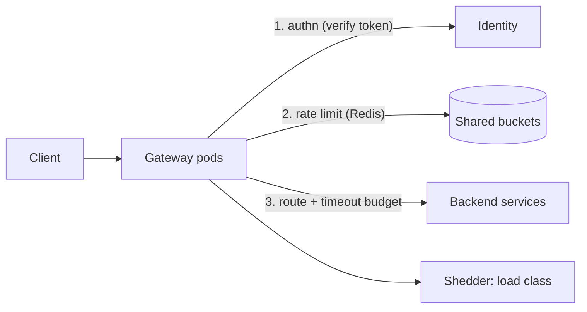

# Rate limiter & API gateway

## Why Does This Matter?

Paired because they are the same job at the same place: the edge
decides, per request, "may you proceed, and at what cost?" A rate
limiter alone is a policy; a gateway alone is a router; together
they are the trust boundary where the handbook's security ([21
§4](../21-security/04-limits-and-hardening.md)) and resilience
([15 §3](../15-microservices/03-resilience-patterns.md)) chapters
meet physical traffic.

## Requirements

| Requirement | Decision |
|---|---|
| Per-identity quotas (authenticated) | token bucket, enforced centrally |
| Per-IP caps (anonymous) | smaller buckets, aggressive eviction |
| Auth at the edge | verify once; propagate identity downstream |
| Routing + backpressure | route to services; shed before collapse |
| p99 edge overhead | < 5ms added |

## APIs

The gateway speaks the backend's contract; the limiter's API is
internal but must exist as an interface:

```text
Gateway:  any backend route, plus:
GET  /livez /readyz            (edge's own health [22 §2])
429 responses: {error: "rate_exceeded"}, Retry-After: N

Limiter (library or service):
Allow(identity string) bool
AllowN(identity string, n int, at time.Time) bool
```

## Data model

Per-identity state is the design's core problem: token buckets
must be shared across gateway instances (a client can hit any
pod).

| Store | Consistency | Latency | Verdict |
|---|---|---|---|
| In-process only | per-pod (wrong for fleets) | ns | only if any-pod-per-client is acceptable |
| Redis (`INCR`+`EXPIRE` or Lua bucket) | shared, near-atomic | ~0.5-1ms | the default choice |
| Dedicated limiter service | shared, tunable | RPC hop | when Redis semantics are not enough |

Atomicity matters at boundaries: two pods deciding simultaneously
on the last token is the check-then-act bug; Redis Lua (or
`WATCH`-free single-script ops) makes check-and-decrement one
operation ([13 §2](../13-databases/02-transactions-and-isolation.md)'s
invariant-in-the-database rule, applied to Redis).

## Architecture



The order is the design: **authenticate, then limit, then route.**
Anonymous traffic limits on IP before authn (cheap, catches
scanners); authenticated limits on identity after (correct
fairness). The shedder ([16
§5](../16-distributed-systems/05-delivery-backpressure-shedding.md))
drops lowest-priority traffic *before* queues grow: 503s with
`Retry-After` from a shedder are healthy; latency deaths are not.

## Scaling & reliability

- Gateways are stateless: scale horizontally; the limiter state
  lives in Redis.
- Redis down: fail open or closed? **Closed for anonymous
  (security boundary), open-with-lower-limits for authenticated**
  (availability), with the degradation flagged ([22
  §4](../22-production-go/04-dependency-failures.md)'s class
  table). A gateway that hard-fails on Redis failure turns a cache
  outage into a full outage.
- Hot identities (one client burning quota): the bucket itself
  absorbs bursts; per-identity hot keys shard by identity hash
  ([16 §4](../16-distributed-systems/04-quorums-sharding.md)).

## Failure modes

| Failure | Behavior | Mitigation |
|---|---|---|
| Redis down | fail closed for anon, open-for-auth with flag | degradation class table |
| Backend brownout | gateway breakers open; 503 fast | breaker per backend ([15 §3](../15-microservices/03-resilience-patterns.md)) |
| Thundering retry after outage | jittered Retry-After; client backoff ([15 §3](../15-microservices/03-resilience-patterns.md)) | no synchronized wakeups |

## Observability & security

429s are traffic ([20 §2](../20-observability/02-metrics.md)):
count by identity class, not raw ID (cardinality). The limiter's
metrics expose attack patterns (one identity's 429 spike = probe
in progress). Security: the gateway terminates TLS ([21
§3](../21-security/03-tls-certificates.md)), verifies tokens once
([21 §2](../21-security/02-authentication-and-authorization.md)),
and must never forward client-supplied identity headers blindly
(`X-User-Id` from the internet is an authz bypass); it sets them
from verified claims.

## Go implementation considerations

- **The two-layer limiter from [21 §4](../21-security/04-limits-and-hardening.md)**
  is this design's in-process tier; the Redis tier wraps the same
  interface so the fleet-shared bucket is a swap, not a rewrite.
- **Identity propagation**: verify at the edge, forward claims as
  a signed internal header or mTLS identity ([21 §2](../21-security/02-authentication-and-authorization.md));
  backends re-verify cheaply (signature check, not token fetch).
- **Timeout budgets at the edge**: the gateway owns the client's
  patience; propagate per-hop budgets downstream ([15
  §3](../15-microservices/03-resilience-patterns.md)'s budget
  hierarchy; [12 §4](../12-http-networking/04-clients-and-timeouts.md)'s
  client construction).
- **Shedding is a Go win**: bounded queues + `select`-with-default
  make "reject now" a one-liner ([08 §5](../08-concurrency/05-patterns.md));
  the storm arithmetic ([15 §3](../15-microservices/03-resilience-patterns.md))
  is the test.
- **This repo's pattern map**: [21 §4](../21-security/04-limits-and-hardening.md)'s
  `Limiter` + `Fetcher`, [15 §3](../15-microservices/03-resilience-patterns.md)'s
  `Breaker`, [14](../14-backend-development/)'s middleware chain
  compose into this gateway in a week; the design work is the
  policy table, not the plumbing.
