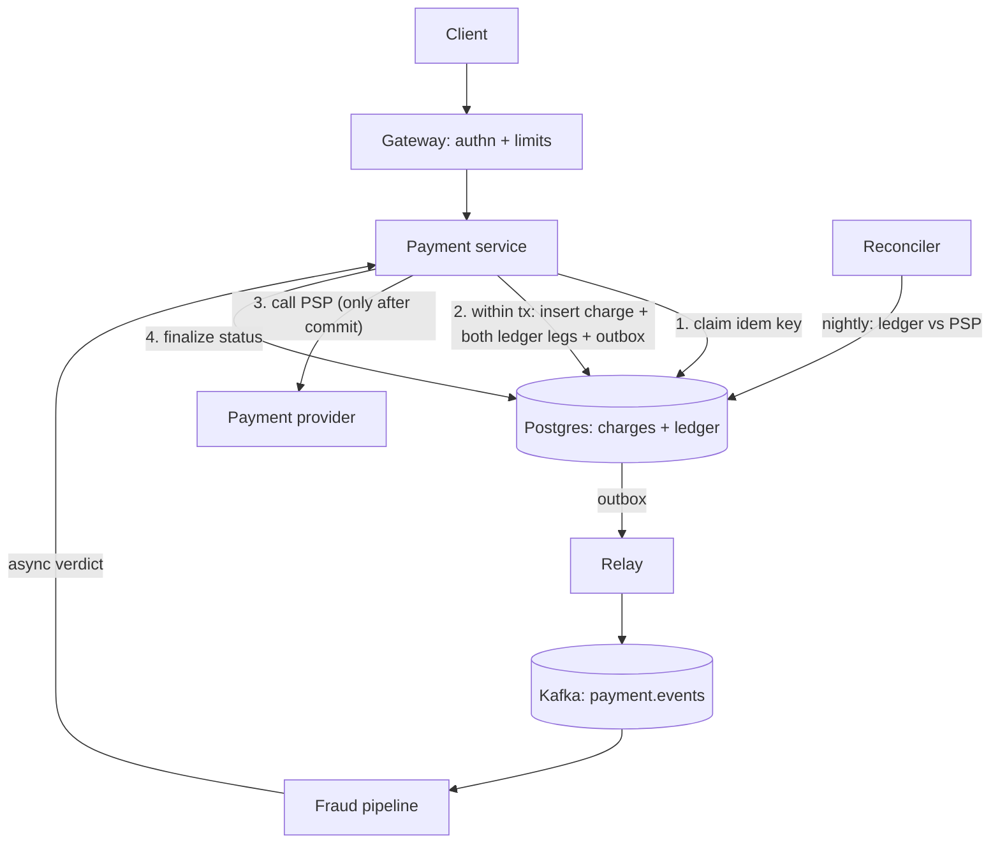

# Payment service & transaction ledger

## Why Does This Matter?

The flagship design: money movement where "eventually correct" is
not good enough and "probably once" is a lie. The mechanics
(idempotency keys, double-entry invariants, outbox relay,
reconciliation) are built and tested in [25 §1-3](../25-fintech-with-go/01-money-and-payments.md);
this design composes them into one coherent system and shows where
every handbook pattern lands when correctness is the product.

## Requirements

| Requirement | Decision |
|---|---|
| Charge a payment method exactly-once | idempotency keys ([25 §3](../25-fintech-with-go/03-integrity-and-exactly-once.md)) |
| Balances never drift | double-entry ledger, invariant in SQL ([25 §2](../25-fintech-with-go/02-double-entry-ledger.md)) |
| Survive any crash between steps | transactional outbox + relay |
| Audit every money movement | append-only entries + audit logs |
| p99 charge latency | < 300ms; correctness beats latency always |

## APIs

```text
POST /charges
  Idempotency-Key: <client key>        # required, 24h window
  {customer_id, amount_minor, currency, source}
  -> 201 {charge_id, status}           # or 409 with the original result

GET /charges/{id}                      # status polling
POST /charges/{id}/refunds             # idempotent by (charge, refund-key)
GET  /accounts/{id}/balance            # derived from entries, never stored alone
```

The idempotency contract ([25 §3](../25-fintech-with-go/03-integrity-and-exactly-once.md)):
same key + same request hash → replay the stored result; same key
+ different hash → 422 (client bug, loud failure).

## Data model

```sql
CREATE TABLE charges (
    id            uuid PRIMARY KEY,
    idem_key      text NOT NULL,
    request_hash  text NOT NULL,
    status        text NOT NULL,       -- pending|succeeded|failed
    customer_id   text NOT NULL,
    amount_minor  bigint NOT NULL CHECK (amount_minor > 0),
    currency      text NOT NULL,
    UNIQUE (idem_key)
);

CREATE TABLE ledger_entries (        -- double-entry: immutable
    id          bigint GENERATED ALWAYS AS IDENTITY PRIMARY KEY,
    tx_id       uuid NOT NULL,        -- groups the balanced pair
    account_id  text NOT NULL,
    amount_minor bigint NOT NULL,     -- signed: debit negative, credit positive
    currency    text NOT NULL,
    created_at  timestamptz NOT NULL DEFAULT now()
);
CREATE INDEX ON ledger_entries (account_id, id);
```

The ledger's invariant lives in the transaction, not the service:
`SUM(amount) = 0` per `tx_id`, enforced by writing both legs in one
transaction ([25 §2](../25-fintech-with-go/02-double-entry-ledger.md)'s
tested pattern; [13 §2](../13-databases/02-transactions-and-isolation.md)'s
`WithinTx`).

## Architecture



The ordering rules that make it correct ([25 §3](../25-fintech-with-go/03-integrity-and-exactly-once.md)'s
tested relay):

1. Claim the idempotency key first (unique insert): replays return
   the original result without re-charging.
2. Persist the charge **and** both ledger legs **and** the outbox
   event in one transaction: any crash leaves a consistent story.
3. Call the PSP only after commit: a crash before commit = no
   money moved; a crash after = the finalize path (or
   reconciliation) completes it. PSP calls carry the charge ID as
   *their* idempotency key: two layers of exactly-once, both
   honest.
4. Events flow from the outbox, never from the handler: downstream
   (fraud, notifications, analytics) sees every state change
   exactly once-per-event with at-least-once delivery + consumer
   idempotency ([18 §1](../18-kafka-with-go/01-kafka-concepts.md)).

## Scaling & reliability

- The ledger is the write bottleneck by design: partition by
  `account_id` hash when a single Postgres is exhausted ([16
  §4](../16-distributed-systems/04-quorums-sharding.md)); per-account
  ordering falls out of the shard key.
- PSP is the dependency to design around: its failure class is
  degrading ([22 §4](../22-production-go/04-dependency-failures.md)):
  charges queue in the outbox as "pending PSP", the breaker opens,
  the recovery job replays. Never fail-open a money path.
- Balances are derived (SUM over entries) and cached with
  invalidation on write ([13 §5](../13-databases/05-caching-with-redis.md)):
  the cache is an optimization; the entries are the truth.

## Failure modes

| Failure | Behavior | Mitigation |
|---|---|---|
| Crash between commit and PSP call | Charge pending; reconciler completes | status machine + nightly reconcile |
| Duplicate event delivery | Consumers idempotent by event ID | dedupe ([18 §3](../18-kafka-with-go/03-producer-consumer.md)) |
| PSP timeout (unknown outcome!) | Reconcile asks the PSP by idempotency key | the unknown-response discipline ([16 §1](../16-distributed-systems/01-failure-model-cap-pacelc.md)) |
| Ledger drift (bug) | Nightly reconcile pages before money is wrong | reconciliation is the SLO ([25 §3](../25-fintech-with-go/03-integrity-and-exactly-once.md)) |

## Observability & security

Business metrics ([20 §2](../20-observability/02-metrics.md)):
`charges_total{status}`, `psp_latency`, `reconcile_diff_count`
(the metric that must always be zero). Spans per charge with
business attributes ([20 §3](../20-observability/03-tracing-and-otel.md)).
Security: amounts are integer minor units ([25 §1](../25-fintech-with-go/01-money-and-payments.md)),
ownership checked in the service ([21 §2](../21-security/02-authentication-and-authorization.md)),
audit logs append-only ([25 §4](../25-fintech-with-go/04-risk-and-compliance.md)'s
regulatory honesty).

## Go implementation considerations

- **The ledger example from [25 §2](../25-fintech-with-go/02-double-entry-ledger.md)**
  is this design's core, productionized: the overdraft invariant
  already lives in SQL; add the outbox legs to its `WithinTx`.
- **The outbox relay from [25 §3](../25-fintech-with-go/03-integrity-and-exactly-once.md)**
  is the event backbone; the Kafka consumer wiring from [18](../18-kafka-with-go/03-producer-consumer.md)
  plugs in beneath it.
- **Status machines as types**: charge status is a Go enum with an
  explicit transition function; illegal transitions are compile-time
  awkward and runtime-tested ([05 §2](../05-errors/02-error-design.md)'s
  domain errors per transition).
- **Latency budget**: idem claim + tx + PSP is the 300ms; the PSP
  call gets the remainder as its timeout ([15 §3](../15-microservices/03-resilience-patterns.md)'s
  budget hierarchy propagated per hop).
- **Testing shape**: the [25 §2](../25-fintech-with-go/02-double-entry-ledger.md)
  two-tier harness (pure-Go fake in CI + Postgres under a build
  tag) extends here: add the duplicate-PSP-call and
  crash-between-steps scenarios as parity tests.
