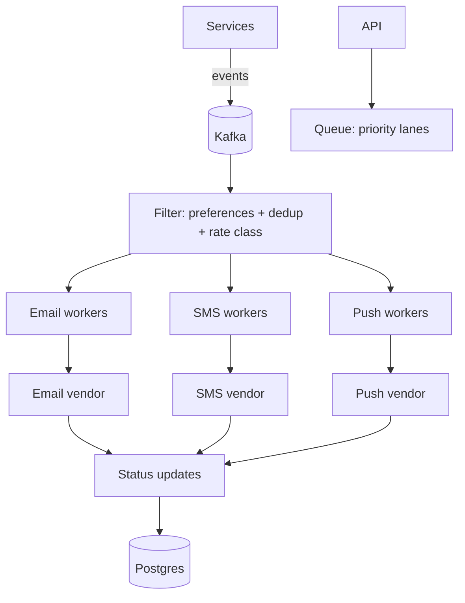

# Notification system

## Why Does This Matter?

Notifications look trivial (send an email) and are secretly a
distributed-systems exam: bursts (fan-out to millions), per-channel
vendor limits (email/SMS/push each throttle differently), delivery
semantics that customers feel (duplicate password-reset emails are
a support incident; missing ones are a security incident), and
compliance (unsubscribe is not optional). The design is the
handbook's messaging ([17](../17-messaging/01-queues-logs-pubsub.md))
and backpressure ([16 §5](../16-distributed-systems/05-delivery-backpressure-shedding.md))
chapters wearing a product face.

## Requirements

| Requirement | Decision |
|---|---|
| Channels: email, SMS, push | one API, per-channel adapters |
| Burst: 1M notifications in 5 min | queue absorbs; workers drain |
| Vendor limits | per-channel token buckets |
| At-least-once, deduped | idempotency per (notification, channel) |
| Priority classes | transactional > operational > marketing |
| p99 enqueue latency | < 50ms (the API only enqueues) |

## APIs

```text
POST /notifications
  {user_id, template, data, priority: transactional|operational|marketing,
   idempotency_key?}
  -> 202 {notification_id}        # 202: accepted, not sent

GET  /notifications/{id}          # status: queued|sent|failed|suppressed
POST /users/{id}/preferences      # channel opt-in/opt-out (compliance)
```

The API contract encodes the honesty rule: 202 means queued.
Returns never claim "sent"; the status endpoint tells the truth.

## Data model

```sql
CREATE TABLE notifications (
    id           uuid PRIMARY KEY,
    user_id      text NOT NULL,
    channel      text NOT NULL,
    template     text NOT NULL,
    priority     text NOT NULL,
    idem_key     text,
    status       text NOT NULL DEFAULT 'queued',
    attempts     int NOT NULL DEFAULT 0,
    visible_after timestamptz NOT NULL DEFAULT now(),
    UNIQUE (idem_key)              -- client dedup, when provided
);
CREATE INDEX ON notifications (channel, priority, visible_after)
    WHERE status = 'queued';
```

Delivery state is durable: a crash loses nothing (the row is the
queue entry's source of truth when using outbox; or the queue holds
the event and the row tracks status).

## Architecture



- **Fan-out**: one event (order shipped) → N notifications. The
  faner reads the event once, multiplies, enqueues with the event
  ID as dedup seed ([17 §3](../17-messaging/03-portable-patterns.md)'s
  idempotent consumer).
- **Per-channel rate limits**: vendor quota → token bucket per
  channel ([21 §4](../21-security/04-limits-and-hardening.md)'s
  two-layer limiter); exhausted bucket = workers park briefly
  (backoff), never drop transactional traffic ([16
  §5](../16-distributed-systems/05-delivery-backpressure-shedding.md)'s
  block-vs-shed table: shed marketing first).
- **Dedup**: two layers ([17 §3](../17-messaging/03-portable-patterns.md)):
  the client key (unique constraint) and the content key
  (same template+user+window suppressed: no triple
  password-reset emails from three retrying services).

## Scaling & reliability

- Workers scale per channel independently (email volume ≠ push
  volume); the queue's priority lanes keep transactional delivery
  fast under marketing bursts ([17 §1](../17-messaging/01-queues-logs-pubsub.md)'s
  queue-vs-log choice: a queue per priority class, not one lane).
- Vendor outages: breaker per vendor ([15 §3](../15-microservices/03-resilience-patterns.md));
  notifications stay queued (durable), drain on recovery. SMS
  delayed 30 minutes is usually acceptable; silently dropped is
  not.
- Suppression (unsubscribe, bounced address) is a read-before-send
  with its own cache; compliance failures here are legal failures.

## Failure modes

| Failure | Behavior | Mitigation |
|---|---|---|
| Vendor rejects at high rate | breaker opens; queue drains slower; page | per-channel breaker + DLQ ([17 §3](../17-messaging/03-portable-patterns.md)) |
| Duplicate delivery | content-key dedup suppresses | windowed content key |
| Template bug (bad payload) | DLQ with triage metadata; no retry storm | DLQ + alert on DLQ depth ([17 §3](../17-messaging/03-portable-patterns.md)) |
| Queue backlog grows unbounded | shed marketing, delay operational | priority shed order ([16 §5](../16-distributed-systems/05-delivery-backpressure-shedding.md)) |

## Observability & security

Metrics: `notifications_sent_total{channel,status}`,
`queue_depth{priority}`, `vendor_429_rate`, DLQ depth ([20
§2](../20-observability/02-metrics.md)). The SLO is per class:
transactional delivery p99 < 1 min end-to-end ([20
§4](../20-observability/04-slos-and-alerting.md)). Security: the
notification body interpolates user data ([21 §1](../21-security/01-threat-model-and-validation.md):
template injection is user input injection); preference changes
are authz-checked (unsubscribing *someone else* is an attack).

## Go implementation considerations

- **The in-memory broker from [17](../17-messaging/README.md)**
  models the queue semantics (retries, DLQ, visibility) and its
  portability suite is the spec; the production transport plugs in
  beneath ([18](../18-kafka-with-go/README.md) for events, a
  queue for per-class lanes).
- **The two-layer limiter from [21 §4](../21-security/04-limits-and-hardening.md)**
  governs vendor rate: global (vendor account) + per-template
  (heat control).
- **Worker shape**: the stage-5 job processor ([08
  §5](../08-concurrency/05-patterns.md)) with the channel's
  visibility-timeout semantics; cancellation via context ([08
  §3](../08-concurrency/03-context.md)).
- **Content-key dedup** is a small TTL map with the memwatch
  discipline ([09 §5](../09-memory-runtime/05-memory-leaks.md)):
  bounded, or it becomes the next incident.
